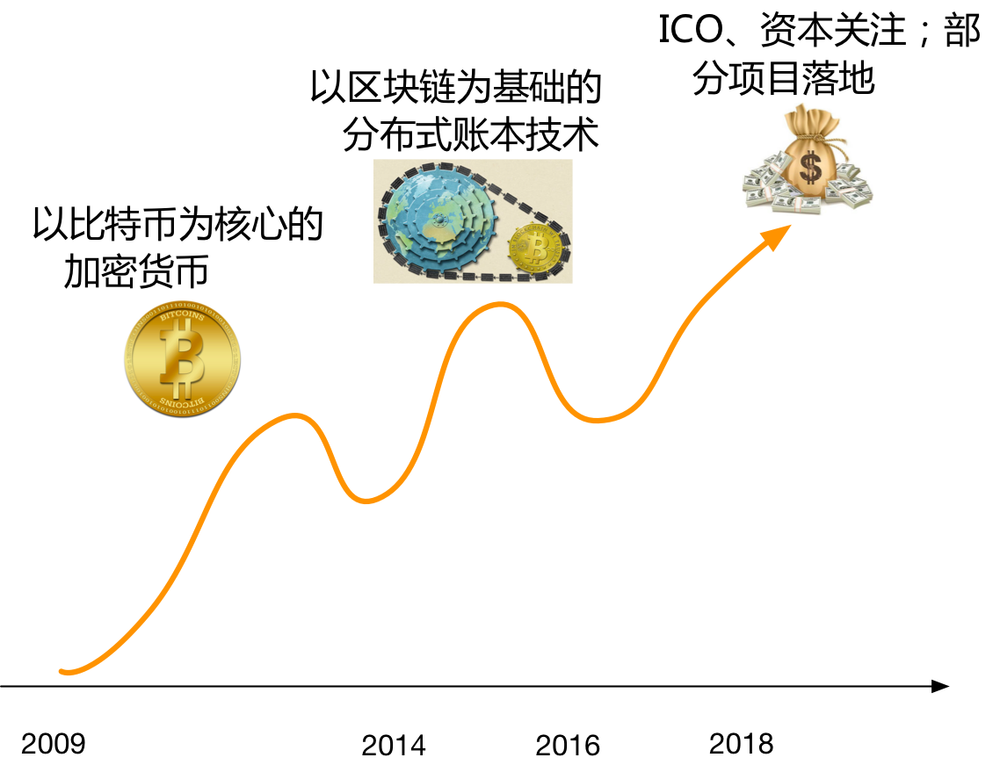

## 分布式记账与区块链

随着最前沿的信息科技成果不断融入金融行业，以区块链（Blockchain）为基础的分布式账本科技（Distributed Ledger Technology，DLT）崭露头角，并在部分场景（如跨境支付）中得到探索和落地。从最早的简单账本到复式账本，再到数字化账本，以及目前正在探索的分布式账本，账本科技的每次突破都会引发金融领域的重要革新，也往往对社会生活的各个方面进一步产生阶段性的影响。

### 从分布式记账问题说起

分布式记账问题由来已久。为了正常进行商业活动，参与者需要找到一个多方均能信任的第三方来负责记账，确保交易记录的准确。然而，随着商业活动的规模越来越大，商业过程愈加动态和复杂，很多场景下难以找到符合要求的第三方记账方（例如供应链领域动辄涉及来自数十个行业的数百家参与企业）。这就需要交易各方探讨在分布式场景下进行协同记账的可能性。

实际上，可以很容易设计出一个简单粗暴的分布式记账结构，如下图所示方案（一）。多方均允许对账本进行任意读写，一旦发生新的交易即追加到账本上。这种情况下，如果参与多方均诚实可靠，则该方案可以正常工作；但是一旦有参与方恶意篡改已发生过的记录，则无法确保账本记录的正确性。

为了防止有参与者对交易记录进行篡改，需要引入一定的验证机制。很自然地，可以借鉴信息安全领域的数字摘要（Digital Digest）技术，从而改进为方案（二）。每次当有新的交易记录被追加到账本上时，参与各方可以使用 Hash 算法对完整的交易历史计算数字摘要，获取当前交易历史的“指纹”。此后任意时刻，每个参与方都可以对交易历史重新计算数字摘要，一旦发现指纹不匹配，则说明交易记录被篡改过。同时，通过追踪指纹改变位置，可以定位到被篡改的交易记录。

方案（二）可以解决账本记录防篡改的问题，然而在实际生产应用时，仍存在较大缺陷。由于每次追加新的交易记录时需要从头对所有的历史数据计算数字摘要，当已存在大量交易历史时，数字摘要计算成本将变得很高。而且，随着新交易的发生，计算耗费将越来越大，系统扩展性很差。

为了解决可扩展性的问题，需要进一步改进为方案（三）。注意到每次摘要已经确保了从头开始到摘要位置的完整历史，当新的交易发生后，实际上需要进行额外验证的只是新的交易，即增量部分。因此，计算摘要的过程可以改进为对旧的摘要值再加上新的交易内容进行验证。这样就既解决了防篡改问题，又解决了可扩展性问题。

实际上，读者可能已经注意到，方案（三）中的账本结构正是一个区块链结构（如下图所示）。可见，从分布式记账的基本问题出发，可以自然推导出区块链结构，这也说明了在分布式场景下的记账问题中，区块链结构是一个简洁有效的天然答案。

*注：当然，区块链结构也并非解决分布式记账问题的唯一答案，实际上，除了简单的线性队列结构，也有人提出采用树或图结构。*

### 区块链的三次热潮

从比特币诞生之日算起，区块链已在全球掀起了三次热潮。

第一波热潮出现在 2013 年左右。比特币项目上线后，很长一段时间里并未获得太多关注。直到比特币价格发生增长，各种加密货币项目纷纷出现，隐藏在其后的区块链结构才首次引发大家的兴趣。2014 年起，区块链这个术语开始频繁出现，但更多集中在加密货币和相关技术领域；

第二波热潮出现在 2016 年前后。以区块链为基础的分布式账本技术被证实在众多商业领域存在应用价值。2015 年 10 月《经济学人》封面文章《信任机器》中，正式指出区块链在构建分布式账本平台中的重要作用，促使更多实验性应用出现。下半年更是出现了“初始代币发行（Initial Coin Offering，ICO）”等新型融资募集形式。这一时期，区块链技术自身也有了发展和突破。2015 年 7 月底，以太坊（Ethereum）开源项目正式上线。该项目面向公有场景针对比特币项目的缺陷进行了改善，重点在于对通用智能合约的支持，同时优化了性能和安全性。

2015 年底，Linux 基金会牵头发起了超级账本（Hyperledger）开源项目，希望联合各行业的力量构造开放、企业级的分布式账本技术生态。与此前的开源项目相比，超级账本项目主要面向联盟链场景，关注企业在权限管理、隐私保护和安全性能等方面的核心诉求，并积极推动技术成果在各行业的落地实践。首批会员企业包括来自科技界和金融界的领军企业，如 IBM、Intel、Cisco、Digital Asset 等。超级账本项目自诞生后发展十分迅速，目前已经包括 10 大顶级项目，超过 240 家企业会员，并在金融、供应链等领域得到实践应用。尤为值得称道的是，超级账本项目采取了商业友好的 Apache 2.0 开源许可，吸引了众多企业的选用。

随着更多商业项目开始落地，从 2017 年开始至今，众多互联网领域的资本开始关注区块链领域，人才缺口持续加大，商业和政策环境开始加强。区块链已经俨然成为继人工智能后的又一资本热点。

分析这三次热潮可以看出，每一次热潮的出现都与金融行业对区块链技术的深化应用密切相关。这也表明金融行业对信息科技始终保持了较高的敏感度。

### 分布式记账的重要性

分布式记账问题为何重要？可以类比互联网出现后给社会带来的重大影响。

互联网是人类历史上最大的分布式互联系统。作为信息社会的基础设施，它很好地解决了传递**信息**的问题。然而，由于早期设计上的缺陷，互联网无法确保所传递信息的可靠性，这大大制约了人们利用互联网进行大规模协作的能力。而以区块链为基础的分布式账本科技则可能解决传递**可信信息**的问题。这意味着基于分布式账本科技的未来商业网络，将成为新一代的文明基础设施——大规模协同网络。

分布式账本科技的核心价值在于为未来多方协同网络提供可信基础。区块链引发的记账科技的演进，将促使商业协作和组织形态发生变革。甚至世界经济论坛执行主席 Klaus Schwab 认为 “区块链是（继蒸汽机、电气化、计算机之后的）第四次工业革命的核心成果（Blockchains are at the heart of the Fourth Industrial Revolution）”。

### 分布式账本的现状与未来

类比互联网，从科技发展的一般规律而言，笔者认为，分布式账本科技仍处于发展早期，而商业应用已经在加速落地中，如下表所示。

阶段 | 互联网 | 区块链 | 阶段
-- | -- | -- | --
1974~1983 | ARPANet 内部试验网络 | 比特币试验网络 | 2009~2014
1984~1993 | TCP/IP 基础协议确立，基础架构完成 | 基础协议和框架探索，出现超级账本、以太坊等开源项目 | 2014~2019?
1990s~2000s | HTTP 应用协议出现；互联网正式进入商用领域 | 商业应用的加速落地，仍未出现杀手级应用 | 2018~？
2000s~？ | 桌面互联网、移动互联网、物联网 | 分布式协同商业网络 | ？

互联网在发展过程中，先后经历了试验网络、基础架构和协议、商业应用、大规模普及等四个阶段，每个阶段都长达 10 年左右。其中第二个阶段尤为关键，TCP/IP 取代了已有的网络控制协议成为核心协议，这奠定了后来全球规模互联网的技术基础。

作为一套前所未有的大规模协同网络，分布式账本网络的发展很大可能也要经历这四个阶段的演化。当然，站在前人肩膀上，无论是演化速度还是决策效率，都会有不小的优势。

客观来看，虽然超级账本、以太坊等开源项目在基础协议和框架方面进行了诸多探索，并取得了重要成果，但在多账本互联、与已有系统的互操作性等方面还存在不足，商业应用的广度和深度仍需实践的考验。

但毫无疑问，分布式账本科技已经成为金融科技领域的重要创新，必将为金融行业创造新的发展机遇。而未来的商业协同网络，也将成为人类文明进步的重要基础。
