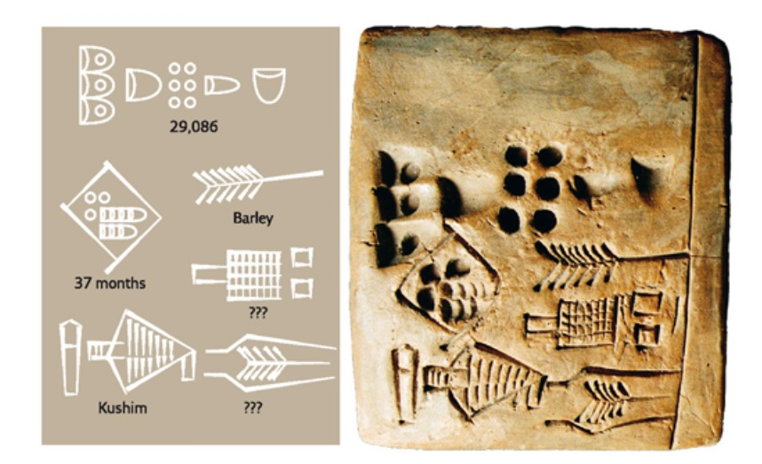

## 记账科技的千年演化

如果说金融科技（Financial Technology，Fintech）是保障社会文明的重要支柱，那么记账科技（Ledger Technology，或账本科技）则是这一支柱最核心的基石。

大到国际贸易，小到个人消费，都离不开记账这一看似普通却不简单的操作。无论是资金的流转，还是资产的交易，都依赖于银行、交易机构正确维护其记账系统。

毫不夸张地说，人类文明的整个发展历程，都伴随着记账科技的持续演化。

目前，很少见到对记账科技演化规律的研究，这导致了人们对其认知的局限。近年来，以区块链为基础的分布式账本技术飞速崛起并得到快速应用。尽管如此，却很少有人能说清楚区块链与记账问题的关系。区块链到底解决了哪些问题？为何能在金融领域产生如此巨大的影响？

按照科技发展的一般规律，可将记账科技从古至今的演化过程大致分为四个阶段：单式账本、复式账本、数字化账本、分布式账本。各个阶段的时期和特点如下表所示。

| 阶段 | 时期 | 主要特点 |
| --- | --- | --- |
| 阶段一：单式账本 | 约公元前 3500 年 ~ 15 世纪 | 使用原始的单式记账法（Single Entry Bookkeeping） |
| 阶段二：复式账本 | 15 世纪 ~ 20 世纪中期 | 现代复式记账法（Double Entry Bookkeeping）出现和应用 |
| 阶段三：数字化账本 | 20 世纪中期 ~ 21 世纪初 | 物理媒介账本演化到数字化账本 |
| 阶段四：分布式账本 | 2009 年至今 | 以区块链为代表的分布式账本相关思想和技术出现 |

科技创新往往不是孤立的。记账科技的发展也与众多科技和商业成果的出现息息相关，特别是商业贸易、计算技术、数据处理等，如下图所示。

下面笔者将具体讲述不同阶段中记账科技的发展状况。

### 阶段一：单式账本

人类文明早期，就已经产生了记账需求和相关活动。

已知最早的账本是“库辛（Kushim）泥板”，于 1929 年发掘于幼发拉底河下游右岸的伊拉克境内。据鉴定，库辛泥板属于公元前 3500 ~ 前 3000 年的乌鲁克城（Uruk，美索不达米亚西南部苏美尔人的古城），其内容据破译为“37 个月收到了 29086 单位的大麦，并由库辛签核”。如下图所示。

库辛泥板同时也是目前已知的最古老的人类文字记录。除了昙花一现的苏美尔文明，在古中国、古埃及、古希腊、古罗马等人类早期文明中，都不乏与记账相关的考古发现。

类似于这样的通过单条记录进行账目记录的方法称为“单式记账法”或“简单记账法”，对应的账本叫“单式账本”。

此后相当长的一段时间里（甚至到今天），人们都在使用单式记账法进行记账，无论是记录在泥板、绳索上，还是记录在后来的纸质账本中，虽然物理媒介不同，但核心方法都是一致的。

简单记账法自然易用，适合小规模的简易账务，但当面对大规模账务，特别是涉及多个实体的复杂记账需求时，就暴露出不少问题。

首先是容易出错。以库辛账本为例，如果大麦入库和出库交易记录很多，很难确认账本记录跟实际情况是否匹配；即便发现不匹配，也很难定位到哪次记录出了问题。

其次是容易篡改。账本只有一个，只能保管在记账者个人手里。假设记账者不那么诚实，那么，他可以轻易地通过修改已有的记录来窃取大麦。并且其他人很难发现账本被篡改过。

随着商业活动的普及、交易规模增大和参与方的增多（特别是所有者和经营者的分离），单式记账法已经难以满足人们日益提高的记账需求。代表现代记账思想的“复式记账法”应运而生。

### 阶段二：复式账本

14 世纪的意大利，是世界贸易的门户，来自各国的商人、学者、艺术家、工匠等齐聚于此，揭开了文艺复兴大时代的序幕。此后长达三个世纪里，整个欧洲在商业、文化、艺术、科技等方面都涌现出大量创新成果，对全世界产生了深远的影响。其中有三项尤为引人注目：

* 宗教改革：马丁·路德批判了当时基督教的诸多弊端，提出宗教不应有等级制度，即宗教面前人人平等，无需任何代理人或中间介绍人；
* 朴素宇宙观：从地心说，到日心说，再到宇宙观形成，人类终于意识到地球并非所处宇宙的“中心”，甚至任何位置都可以被认为是宇宙的“中心”，是否是中心也并不特别或重要；
* 复式记账法：前所未有的繁荣的商业活动催生了更先进的记账方式。复式记账法将单一中心记录分拆为多个科目，极大提高了账目的可靠性，一旦发现问题，方便追查根源，对应的账本叫“复式账本”。

这些成果虽然分属文化、天文和金融等不同领域，但在核心思想上却如此一致和谐，不得不令人惊讶。

关于复式记账法的文字记载最早出现于 1494 年，意大利著名数学家卢卡·帕西奥利（Luca Pacioli）在其著作《Summa de arithmetica, geometria, Proportioni et proportionalita（算术、几何、比及比例概要）》中介绍了算术的原理和应用、意大利各地的度量衡制度、商业记账方法和几何学基础。当然，复式记账法的出现是数百年商业活动和数学发展的结果。早在 1202 年，比萨（意大利北部城市）的数学家斐波那契在《珠算原理》中介绍了东方数学思想，包括十进制阿拉伯数字、分数等，还指出了如何使用这些数学手段来进行记账和计算利息。这些都极大地促进了金融行业的发展。

复式记账法演化到现在包括增减记账法、收付记账法、借贷记账法三种。目前最常用的是借贷记账法，它基于会计恒等式（资产=负债+权益），确保每笔交易都按照该恒等式进行记录。复式记账法很快就得到了广泛应用，并成为现代会计学的重要基础。卢卡·帕西奥利也因此被誉为“会计学之父”。

复式记账法原理并不复杂。由于交易的本质是将某种价值从来源方转移到目标方，因此可将每笔交易分别在贷方（来源方）和借方（目标方）两个科目进行记录，且借贷双方的总额应该时刻保持相等（即守恒）。

如果库辛当年也懂得复式记账法，当大麦入库时，就会分别在“库存大麦科目”和“应收大麦科目”上都进行记录，并且记录数额应该一致。如果要做审核，可以分别对不同科目进行统计，查看其结果是否相同。可见，使用复式记账法能很容易对交易的来龙去脉进行追踪，而且验证账目是否记录正确。实际上，比特币的交易模型中也借鉴了复式记账法的思想。

复式记账法虽然解决了单个记账人所持本地账本的可信度问题，但是仍然无法解决多方之间账本的可信互通问题。例如，投资者如何确保所投资企业的账目没有作假？贸易双方产生交易纠纷时该以谁的账本为准？这些问题的解决要等到数百年以后了。

*注：借（Debit）意味着债务，表示从其他方转移到本科目内；贷（Credit）意味着债权，代表从该科目转移出去。*

### 阶段三：数字化账本

如果要评价 20 世纪最伟大的十大发明，数字计算机一定会入围。它在物理世界之外开创了全新的赛博空间，为人类社会的方方面面都带来了巨大变化。

早期计算机很重要的用途之一便是进行账目相关的统计处理。1951年，全世界首台商用计算机 UNIVAC即为美国人口普查局所用。

使用计算机，不但可以提高大规模记账的效率，还可以避免人工操作的错误。为了更好地管理统计数据，人们发明了专门的数据库技术。从最早的网状数据库（Network Databases）和层次数据库（Hierarchical Databases），到具有开创意义的关系型数据库（Relational Database），再到互联网出现后大量新需求催生的大数据、NoSQL 等技术，根源上都与记账问题息息相关。

在这一阶段，记账方法本身并没有太多创新，但由于数字媒介的出现，使得账本的规模、处理的速度、账本的复杂度，都有了天翻地覆的提升。而这些为后来包括电子商务、互联网金融在内的多种数字化服务奠定了技术基础。

### 阶段四：分布式账本

复式记账法虽然记录了交易的来龙去脉，不易出错，但本质上仍然是中心化模式。

中心化模式的记账系统方便使用，但在很多情况下仍然存在不少问题：账本掌握在个体手中，一旦出现数据丢失则无法找回；在同时涉及到多个交易方的情况下，需要分别维护各自的账本，如果出现不一致，对账较为困难。

因此，人们很自然地想到借助分布式系统的思想来实现分布式账本（Distributed Ledger）：由交易多方共同维护同一个共享的分布式账本；打通交易在不同阶段的来龙去脉；凭借分布式技术，进一步提高记账的规模、效率、可靠性以及合规性。

但在分布式场景下，如何避免某个参与方恶意篡改或破坏记录？该由谁来决定将交易记录写到账本中？这些问题一直没有得到很好的解决。

2009 年 1 月，基于区块链结构的比特币网络悄然问世，它融合了现代密码学和分布式网络技术等重要成果。此后数年里，在纯分布式场景下，比特币网络稳定支持了海量转账交易。这让人们开始认识到，**区块链这一看似极为简洁的数据结构，居然恰好解决了分布式记账的基本需求**，于是基于区块链结构的分布式记账技术开始大量出现。由于这些技术多以区块链结构作为其核心的账本结构，也往往被统称为区块链技术。

2014 年开始，金融、科技领域的专家们开始关注区块链技术，并积极推动分布式账本相关应用落地。在此过程中，对开放、先进分布式账本平台的需求越来越迫切。

2015 年的年底，三十家金融和科技领域的领军企业（包括 IBM、Accenture、Intel、J.P.Morgan、DTCC、SWIFT、Cisco 等）联合发起了超级账本（Hyperledger）开源项目，并由中立的 Linux 基金会进行管理。该项目遵循 Apache v2 许可（商业友好），致力于打造一个开源、满足企业场景的分布式记账科技生态。围绕企业分布式账本的核心诉求，超级账本社区已经发展到涵盖 16 大顶级项目，超过 280 名全球企业会员，支撑了众多的应用案例。

目前，基于分布式账本技术的各种创新方案已经在金融、供应链、医疗等领域得到了不少落地应用。但笔者认为，类比互联网的发展过程，目前分布式账本技术整体还处于发展的初期，还存在不少尚待解决的问题，包括权限管理、隐私保护、性能优化和互操作性等。未来在这些方面的科技突破，将极大拓展分布式账本技术的应用场景和形态，最终实现传递“价值”的商业协同网络。

*注：1371 年，中国明朝开展了首次面向全国的户籍勘查。勘查采用户帖制度，十年清查一次，每次记录各户现有人数，以及距上次的新增、减少情况。将历届信息进行前后对照，有效规避了统计错误。*

### 记账科技的未来

记账科技历千年而弥新，由简单到复杂，由粗糙到精细，由中心化到分布式，这与业务需求的不断变化密不可分。大规模、高安全、易审计等特性将越来越受到关注。

笔者相信，随着社会文明的进步，特别是商业活动的进一步成熟，分布式记账的需求将更加普遍，分布式记账科技也将更加繁荣。
