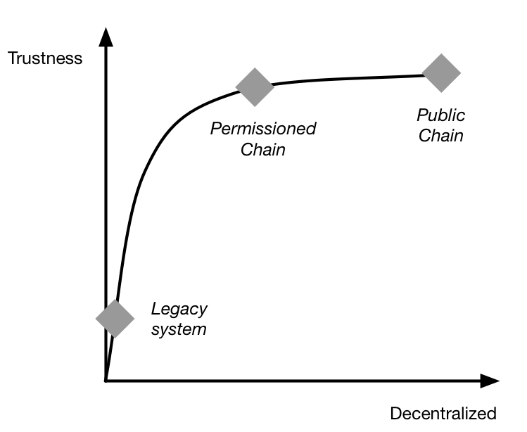

## 技术的演化与分类

区块链技术自比特币网络中首次被大规模应用，到今天应用在越来越多的分布式记账场景中。

### 区块链的演化

比特币区块链面向转账场景，支持简单的脚本计算。比特币脚本被有意设计为非图灵完备，不支持循环语句，以避免无限循环等安全风险。很自然想到如果引入更多复杂的计算逻辑，将能支持更多应用场景，这就是智能合约（Smart Contract）。智能合约可以提供除了货币交易功能外更灵活的功能，执行更为复杂的操作。

引入智能合约后的区块链，已经超越了单纯的数据记录功能，实际上带有点“智能计算”的意味了；更进一步地，还可以为区块链加入权限管理、高级编程语言支持等，实现更强大的、支持更多商用场景的分布式账本系统。

从计算特点上，可以看到现有区块链技术的三种典型演化场景：

| 场景 | 功能 | 智能合约 | 一致性 | 权限 | 类型 | 性能 | 编程语言 | 代表 |
| :--- | :--- | :--- | :--- | :--- | :--- | :--- | :--- | :--- |
| 数字货币 | 记账功能 | 不带有或较弱 | PoW | 无 | 公有链 | 较低 | 简单脚本 | 比特币网络 |
| 分布式应用引擎 | 智能合约 | 图灵完备 | PoW、PoS | 无 | 公有链 | 受限 | 特定语言 | 以太坊网络 |
| 带权限的分布式账本 | 商业处理 | 多种语言，图灵完备 | 包括 CFT、BFT 在内的多种机制，可插拔 | 支持 | 联盟链 | 可扩展 | 高级编程语言 | 超级账本 |

### 区块链与分布式记账

[现代复式记账系统](https://zh.wikipedia.org/wiki/%E5%A4%8D%E5%BC%8F%E7%B0%BF%E8%AE%B0)最早出现在文艺复兴时期的意大利，直到今天仍是会计学科的核心方法。复式记账法对每一笔账目同时记录来源和去向，首次将对账验证功能嵌入记账过程，提升了记账过程的可靠性和可追查性。区块链则实现了完整交易历史的记录和保护。

从这个角度来看，**区块链是首个自带对账功能的数字账本结构**。

更广泛地，区块链实现了非中心化的记录。参与到系统中的节点，并不属于同一组织，彼此可以信任或不信任；链上数据由所有节点共同维护，每个节点都存储一份完整或部分的记录拷贝。

跟传统的记账技术相比，基于区块链的分布式账本包括如下特点：

* 维护一条不断增长的链，只可能添加记录，而且记录一旦确认则不可篡改；
* 非中心化，或者说多中心化的共识，无需集中的控制，实现上尽量分布式；
* 通过密码学的机制来确保交易无法被抵赖和破坏，并尽量保护用户信息和记录的隐私性。

### 技术分类

根据参与者的不同，可以分为公有（Public 或 Permissionless）链、联盟（Consortium 或 Permissioned）链和私有（Private）链。

公有链，顾名思义，任何人都可以参与使用和维护，参与者多为匿名。典型的如比特币和以太坊区块链，信息是完全公开的。

如果进一步引入许可机制，可以实现私有链和联盟链两种类型。此外，还有一种混合模式被称为“许可公链”（Permissioned Public Chain），如 Hedera、Algorand 等，通过特定的节点准入机制来兼顾性能与安全性。

私有链，由集中管理者进行管理限制，只有内部少数人可以使用，信息不公开。一般认为跟传统中心化记账系统的差异不明显。

联盟链则介于两者之间，由若干组织一起合作（如供应链机构或银行联盟等）维护一条区块链，该区块链的使用必须是带有权限的限制访问，相关信息会得到保护，典型如超级账本项目。在架构上，现有大部分区块链在实现都至少包括了网络层、共识层、智能合约和应用层等分层结构，联盟链实现往还会引入额外的权限管理机制。

目前来看，公有链信任度最高，也容易引发探讨，但短期内更多的应用会首先在联盟链上落地。公有链因为要面向匿名公开的场景，面临着更多的安全挑战和风险；同时为了支持互联网尺度的交易规模，需要更高的可扩展性。这些技术问题在短期内很难得到解决。

对于信任度和中心化程度的关系，对于大部分场景都可以绘制如下所示的曲线。一般地，非中心化程度越高，信任度会越好。但两者的关系并非线性那么简单。随着节点数增加，前期的信任度往往会增长较快，到了一定程度后，信任度随节点数增多并不会得到明显改善。这是因为随着成员数的增加，要实现共谋作恶的成本会指数上升。

另外，根据使用目的和场景的不同，又可以分为以数字货币为目的的货币链，以记录产权为目的的产权链，以众筹为目的的众筹链等，也有不局限特定应用场景的所谓通用链。通用链因为要兼顾不同场景下的应用特点，在设计上需要考虑更加全面。
