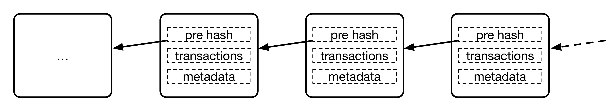

## 定义与原理

### 定义

区块链技术自身仍然在飞速发展中，相关规范和标准还待进一步成熟。

公认的最早关于区块链的描述性文献是中本聪所撰写的 [《比特币：一种点对点的电子现金系统》](https://bitcoin.org/bitcoin.pdf)，但该文献重点在于讨论比特币系统，并没有明确提出区块链的术语。在其中，区块和链被描述为用于记录比特币交易账目历史的数据结构。

另外，也常见将区块链类比为一种共享账本或分布式数据库技术：通过维护数据块的链式结构，维持持续增长、可验证、难以篡改的数据记录。

笔者认为，讨论区块链可以从狭义和广义两个层面来看待。

狭义上，区块链是一种以区块为基本单位的链式数据结构，区块中利用数字摘要对之前的交易历史进行校验，适合分布式记账场景下防篡改和可扩展性的需求。

广义上，区块链还指代基于区块链结构实现的分布式记账技术，包括分布式共识、隐私与安全保护、点对点通信技术、网络协议、智能合约等。

### 早期应用

1990 年 8 月，Bellcore（1984 年由 AT&T 拆分而来的研究机构）的 Stuart Haber 和 W. Scott Stornetta 在论文《How to Time-Stamp a Digital Document》中就提出利用链式结构来解决防篡改问题，其中新生成的时间证明需要包括之前证明的 Hash 值。这可以被认为是区块链结构的最早雏形。

后来，2005 年 7 月，在 Git 等开源软件中，也使用了类似区块链结构的机制来记录提交历史。

区块链结构最早的大规模应用出现在 2009 年初上线的比特币项目中。在无集中式管理的情况下，比特币网络长期维持主链运行，支持了海量的交易记录；同时，早期也经历过 2010 年价值溢出漏洞、2013 年链分叉等严重技术事件。这些经验共同推动了区块链结构校验、共识规则兼容和节点升级治理的演进。

### 基本原理

区块链的基本原理理解起来并不复杂。首先来看三个基本概念：

* 交易（Transaction）：一次对账本的操作，导致账本状态的一次改变，如添加一条转账记录；
* 区块（Block）：记录一段时间内发生的所有交易和状态结果等，是对当前账本状态的一次共识；
* 链（Chain）：由区块按照发生顺序串联而成，是整个账本状态变化的日志记录。

如果把区块链系统作为一个状态机，则每次交易意味着一次状态改变；生成的区块，就是参与者对其中交易导致状态改变结果的共识。

区块链的目标是实现一个分布的数据记录账本，这个账本只允许添加、不允许删除。账本底层的基本结构是一个线性的链表。链表由一个个“区块”串联组成（如下图所示），后继区块中记录前导区块的哈希（Hash）值。某个区块（以及块里的交易）是否合法，可通过计算哈希值的方式进行快速检验。网络中节点可以提议添加一个新的区块，但必须经过共识机制来对区块达成确认。

### 以比特币为例理解区块链工作过程

具体以比特币网络为例，来看其中如何使用了区块链技术。

首先，用户通过比特币客户端发起一项交易，消息广播到比特币网络中等待确认。网络中的节点会将收到的等待确认的交易请求打包在一起，添加上前一个区块头部的哈希值等信息，组成一个区块结构。然后，试图找到一个 nonce 串（随机串）放到区块里，使得区块结构的哈希结果满足一定条件（比如小于某个值）。这个计算 nonce 串的过程，即俗称的“挖矿”。nonce 串的查找需要花费一定的计算力。

一旦矿工找到了满足条件的 nonce 串，这个区块在格式上就“合法”了，成为候选区块。矿工将其在网络中广播出去。其它节点收到候选区块后进行验证，发现确实满足共识规则，就可以添加到自己维护的本地区块链结构上。交易确认并不是简单按“多少个节点接受”计算，而是随着后续区块不断叠加，所在分支累积的工作量证明不断增加。

这里比较关键的步骤有两个，一个是完成对一批交易的共识（创建合法区块结构）；一个是新的区块添加到链结构上，被网络认可，确保未来无法被篡改。当然，在实现上还会有很多额外的细节。

比特币的这种基于算力（寻找 nonce 串）的共识机制被称为工作量证明（Proof of Work，PoW）。这是因为要让哈希结果满足一定条件，并无已知的快速启发式算法，只能对 nonce 值进行逐个尝试的蛮力计算。尝试的次数越多（工作量越大），算出来的概率越大。

通过调节对哈希结果的限制条件，比特币网络控制平均约 10 分钟产生一个合法区块。算出区块的节点将得到区块中所有交易的管理费和协议固定发放的奖励费（2024 年 4 月第四次减半后为 3.125 比特币，每四年减半）。

读者可能会关心，比特币网络是任何人都可以加入的，如果网络中存在恶意节点，能否进行恶意操作来对区块链中记录进行篡改，从而破坏整个比特币网络系统。比如最简单的，故意不承认别人产生的合法候选区块，或者干脆拒绝来自其它节点的交易请求等。

实际上，比特币节点会验证每个区块是否满足共识规则，并在有效分支之间选择最难被重新创造、也就是累计工作量最大的链。攻击者若想改写已确认交易，需要重新完成该区块及其之后区块的工作量证明，并追上诚实矿工继续增长的链。安全分析因此取决于攻击者掌握的哈希算力占比、确认深度、网络传播和经济激励等因素，而不是节点数量，也不能用简单等比公式概括。一般而言，确认深度越大，重组成本越高；若攻击者长期掌握多数算力，则可以更可靠地重写近期交易历史。

当然，即便攻击者没有多数算力，也仍可能通过网络隔离、审查交易、矿池集中等方式造成局部风险。要长期破坏主链共识，通常需要持续投入大量算力并承担币价、区块奖励和基础设施层面的经济损失。
