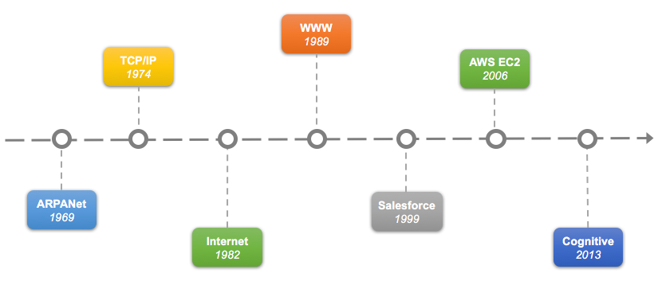

## 趋势与展望

关于区块链技术发展趋势的探讨和争论，自其诞生之日起就从未停息。或许，读者可以从现代计算技术的演变史中得到一些启发。

以云计算为代表的现代计算技术，其发展历史上有若干重要的时间点和事件：

* 1969 - ARPANet（Advanced Research Projects Agency Network）：现代互联网的前身，由美国高级研究计划署（Advanced Research Project Agency）提出，使用的协议是 NCP ，核心缺陷之一是无法做到和个别计算机网络交流；
* 1973 - TCP/IP：Vinton.Cerf（温顿•瑟夫）与 Bob Karn（鲍勃•卡恩）共同开发出 TCP 模型，解决了 NCP 的缺陷；
* 1982 - Internet：TCP/IP 正式成为规范，并被大规模应用，现代互联网诞生；
* 1989 - WWW：早期互联网的应用主要包括 telnet、ftp、email 等，蒂姆·伯纳斯-李（Tim Berners-Lee）设计的 WWW 协议成为互联网的杀手级应用，引爆了现代互联网，从那开始，互联网业务快速扩张；
* 1999 - salesforce：互联网出现后，一度只能进行通信应用，但 salesforce 开始以云的理念提供基于互联网的企业级服务；
* 2006 - aws ec2：AWS EC2 奠定了云计算的业界标杆，直到今天，竞争者们仍然在试图追赶 AWS 的脚步；
* 2013 - cognitive：以 IBM Watson 为代表的认知计算开始进入商业领域，计算开始变得智能，进入“后云计算时代”。

从这个历史中能看出哪些端倪呢？

一个是 **技术领域也存在着周期律。** 这个周期目前看是 7 年左右。或许正如人有“七年之痒”，技术也存在着七年这道坎，到了这道坎，要么自身发生突破迈过去，要么就被新的技术所取代。事实上，从比特币网络上线（2009 年 1 月）算起，区块链技术在七年后出现了不少突破。

*注：为何恰好是七年？7 年按照产品周期来看基本是 2~3 个产品周期，市场或许只能提供不超过三次机会。*

另外，**最早出现的未必是先驱，也可能是先烈。** 创新科技固然先进，但过早播撒种子，缺乏合适环境也难发芽长大。技术创新与科研创新很不同的一点便是，技术创新必须立足于需求，过早过晚都会错失良机；科研创新则要越早越好，比如二十世纪的现代物理学发展，超前的研究成果奠定了后续一百多年内科技革命的基础。

最后，**事物的发展往往是延续的、长期的。** 新生事物大多数不是凭空而生，往往是解决了先贤未能解决的问题，或是出现了之前未曾出现过的场景。很多时候，新生事物的出现需要长期的孵化，坚持还是放弃的故事会不断重复。但只要是朝着提高生产力的正确方向努力，迟早会有出现在舞台上的一天。

目前，区块链在金融相关领域的应用相对成熟，其它方向尚处于初步实践阶段。但毫无疑问的是，区块链技术在已经落地的行业中，确实带来了生产力提升。2018 年 3 月，国际银行间金融电信协会（The Society for Worldwide Interbank Financial Telecommunication，SWIFT）基于超级账本项目经过一年多的成功验证，宣布认可分布式账本技术可满足银行间实时交易，同时遵守监管的报告要求。

此外，相关标准化组织也在积极从标准和规范角度探讨如何使用分布式账本。包括：

* 国际电信联盟电信标准化组织（International Telecommunication Union Telecommunication Standardization Sector，ITU-T）自 2016 年起发起 3 个工作小组（SG16，17，20）来分别进行分布式账本整体需求、分布式账本安全需求和分布式账本在物联网领域应用等方面的研究；
* 国际标准化组织（International Organization for Standardization，ISO）成立 5 个课题组，探讨制定关于分布式账本架构、应用、安全保护、身份管理和智能合约方面的相关规范；
* 电气电子工程师协会（IEEE）成立 P2418.2 项目，探讨区块链系统数据格式标准；
* 国际互联网工程任务组（Internet Engineering Task Force，IETF）成立了 Decentralized Internet Infrastructure Proposed RG (dinrg)。该研究组将集中在非中心化架构服务中的信任管理、身份管理、命名和资源发现等问题；
* 万维网联盟（World Wide Web Consortium，W3C）成立了三个相关的研究小组，分别探讨区块链技术和应用；数字资产管理规范以及跨账本互联协议等。

当然，企业界的进展也不甘落后。不少科技企业已推出了分布式账本相关的产品或方案，并得到了初步的验证。由于分布式账本技术自身的复杂性且尚不成熟，正确使用还需要较高的门槛。目前，这些企业方案多数依托流行的云计算技术，将节约开发成本、方便用户使用账本服务作为主要目标。

随着区块链和分布式账本相关技术的日益成熟，面向企业应用的场景已大规模落地。跨链技术（如 Polkadot, Cosmos）的突破，也正在连接起孤立的价值网络，逐步实现“万链互联”的愿景，为构建下一代价值互联网网络打下坚实基础。
