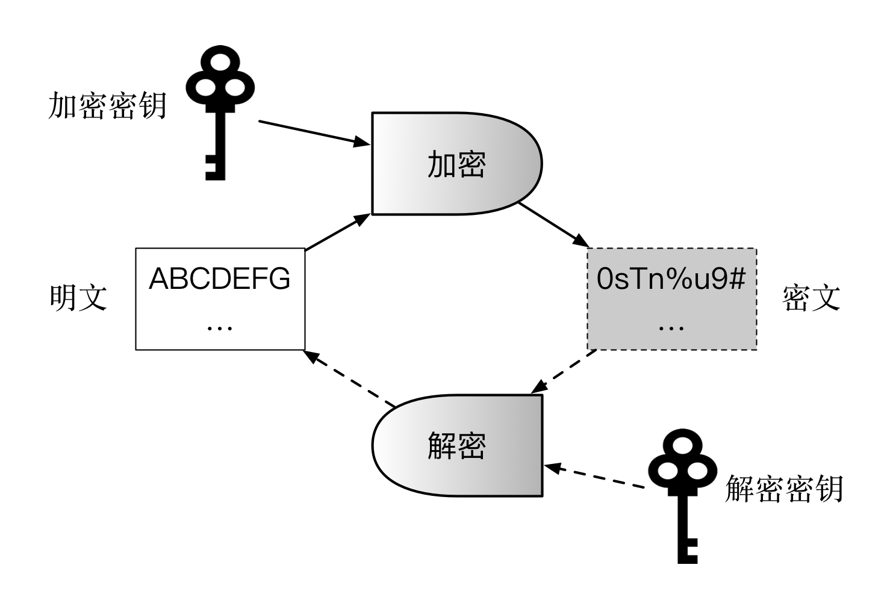

## 加解密算法

加解密算法是现代密码学核心技术，从设计理念和应用场景上可以分为两大基本类型，如下表所示。

算法类型 | 特点 | 优势 | 缺陷 | 代表算法
------  | --- | --- | --- | -------
对称加密 | 加解密的密钥相同 | 计算效率高，加密强度高 | 需提前共享密钥，易泄露 | DES、3DES、AES、IDEA
非对称加密 | 加解密的密钥不相同 | 无需提前共享密钥 | 计算效率低，存在中间人攻击可能 | RSA、ElGamal、椭圆曲线算法

### 加解密系统基本组成

现代加解密系统的典型组件包括算法和密钥（包括加密密钥、解密密钥）。

其中，加解密算法自身是固定不变的，并且一般是公开可见的；密钥则是最关键的信息，需要安全地保存起来，甚至通过特殊硬件进行保护。一般来说，密钥需要在加密前按照特定算法随机生成，长度越长，则加密强度越大。

加解密的典型过程如下图所示。加密过程中，通过加密算法和加密密钥，对明文进行加密，获得密文；解密过程中，通过解密算法和解密密钥，对密文进行解密，获得明文。

根据加解密过程中所使用的密钥是否相同，算法可以分为对称加密（Symmetric Cryptography，又称共有密钥加密，Common-key cryptography）和非对称加密（Asymmetric Cryptography，又称公钥加密，Public-key Cryptography）。两种模式适用于不同的需求，形成互补。某些场景下可以组合使用，形成混合加密机制。

### 对称加密算法
对称加密算法，顾名思义，加密和解密过程的密钥是相同的。

该类算法优点是加解密效率（速度快，空间占用小）和加密强度都很高。

缺点是参与方需要提前持有密钥，一旦有人泄露则系统安全性被破坏；另外如何在不安全通道中提前分发密钥也是个问题，需要借助额外的 Diffie–Hellman 协商协议或非对称加密算法来实现。

对称密码从实现原理上可以分为两种：分组密码和序列密码。前者将明文切分为定长数据块作为基本加密单位，应用最为广泛。后者则每次只对一个字节或字符进行加密处理，且密码不断变化，只用在一些特定领域（如数字媒介的加密）。

**分组对称加密**代表算法包括 DES、3DES、AES、IDEA 等。

* DES（Data Encryption Standard）：经典的分组加密算法，最早是 1977 年美国联邦信息处理标准（FIPS）采用 FIPS-46-3，将 64 位明文加密为 64 位的密文。其密钥长度为 64 位（包括 8 位校验码），现在已经很容易被暴力破解；
* 3DES：三重 DES 操作：加密 --> 解密 --> 加密，处理过程和加密强度优于 DES，但现在也被认为不够安全；
* AES（Advanced Encryption Standard）：由美国国家标准研究所（NIST）采用，取代 DES 成为对称加密实现的标准，1997~2000 年 NIST 从 15 个候选算法中评选 Rijndael 算法（由比利时密码学家 Joan Daemon 和 Vincent Rijmen 发明）作为 AES，标准为 FIPS-197。AES 也是分组算法，分组长度为 128、192、256 位三种。AES 的优势在于处理速度快，整个过程可以数学化描述，目前尚未有有效的破解手段；
* IDEA（International Data Encryption Algorithm）：1991 年由密码学家 James Massey 与来学嘉共同提出。设计类似于 3DES，密钥长度增加到 128 位，具有更好的加密强度。

**序列加密**，又称流加密。1949 年，Claude Elwood Shannon（信息论创始人）首次证明，要实现绝对安全的完善保密性（Perfect Secrecy），可以通过“一次性密码本”的对称加密处理。即通信双方每次使用跟明文等长的随机密钥串对明文进行加密处理。序列密码采用了类似的思想，每次通过伪随机数生成器来生成伪随机密钥串。代表算法包括 RC4 等。

总结下，对称加密算法适用于大量数据的加解密过程；不能用于签名场景；并且需要提前安全地分发密钥。

*注：分组加密每次只能处理固定长度的明文，因此对于过长的内容需要采用一定模式进行分割，《实用密码学》一书中推荐使用密文分组链（Cipher Block Chain，CBC）、计数器（Counter，CTR）等模式。*

### 非对称加密算法
非对称加密是现代密码学的伟大发明，它有效解决了对称加密需要安全分发密钥的问题。

顾名思义，非对称加密中，加密密钥和解密密钥是不同的，分别被称为公钥（Public Key）和私钥（Private Key）。私钥一般通过随机数算法生成，公钥可以根据私钥生成。

其中，公钥一般是公开的，他人可获取的；私钥则是个人持有并且要严密保护，不能被他人获取。

非对称加密算法优点是公私钥分开，无需安全通道来分发密钥。缺点是处理速度（特别是生成密钥和解密过程）往往比较慢，一般比对称加解密算法慢 2~3 个数量级；同时加密强度也往往不如对称加密。

非对称加密算法的安全性往往基于数学问题，包括大数质因子分解、离散对数、椭圆曲线等经典数学难题。

代表算法包括：RSA、ElGamal、椭圆曲线（Elliptic Curve Crytosystems，ECC）、SM2 等系列算法。

* RSA：经典的公钥算法，1978 年由 Ron Rivest、Adi Shamir、Leonard Adleman 共同提出，三人于 2002 年因此获得图灵奖。算法利用了对大数进行质因子分解困难的特性，但目前还没有数学证明两者难度等价，或许存在未知算法可以绕过大数分解而进行解密。
* ElGamal：由 Taher ElGamal 设计，利用了模运算下求离散对数困难的特性，比 RSA 产生密钥更快。被应用在 PGP 等安全工具中。
* 椭圆曲线算法（Elliptic Curve Cryptography，ECC）：应用最广也是强度最高的系列算法，基于对椭圆曲线上特定点进行特殊乘法逆运算（求离散对数）难以计算的特性。最早在 1985 年由 Neal Koblitz 和 Victor Miller 分别独立提出。ECC 系列算法具有多种国际标准（包括 ANSI X9.63、NIST FIPS 186-2、IEEE 1363-2000、ISO/IEC 14888-3 等），一般被认为具备较高的安全性，但加解密过程比较费时。其中，密码学家 Daniel J.Bernstein 于 2006 年提出的 Curve25519/Ed25519/X25519 等算法（分别解决加密、签名和密钥交换），由于其设计完全公开、性能突出等特点，近些年引起了广泛关注和应用。
* SM2（ShangMi 2）：中国国家商用密码系列算法标准，由中国密码管理局于 2010 年 12 月 17 日发布，同样基于椭圆曲线算法，一般认为其安全强度优于 RSA 系列算法。

非对称加密算法适用于签名场景或密钥协商过程，但不适于大量数据的加解密。除了 SM2 之外，大部分算法的签名速度要比验签速度慢（1~2个数量级）。

RSA 类算法被认为已经很难抵御现代计算设备的破解，一般推荐商用场景下密钥至少为 2048 位。如果采用安全强度更高的椭圆曲线算法，256 位密钥即可满足绝大部分安全需求。

#### 选择明文攻击
细心的读者可能会想到，非对称加密中公钥是公开的，因此任何人都可以利用它加密给定明文，获取对应的密文，这就带来选择明文攻击的风险。

为了规避这种风险，现代的非对称加密算法（如 RSA、ECC）都引入了一定的保护机制：对同样的明文使用同样密钥进行多次加密，得到的结果完全不同，这就避免了选择明文攻击的破坏。

在实现上可以有多种思路。一种是对明文先进行变形，添加随机的字符串或标记，再对添加后结果进行处理。另外一种是先用随机生成的临时密钥对明文进行对称加密，然后再将对称密钥进行加密，即利用多层加密机制。

### 混合加密机制

混合加密机制同时结合了对称加密和非对称加密的优点。

该机制的主要过程为：先用非对称加密（计算复杂度较高）协商出一个临时的对称加密密钥（或称会话密钥），然后双方再通过对称加密算法（计算复杂度较低）对所传递的大量数据进行快速的加密处理。

典型的应用案例是网站中使用越来越普遍的通信协议 -- 安全超文本传输协议（Hyper Text Transfer Protocol Secure，HTTPS）。

与以明文方式传输数据的 HTTP 协议不同，HTTPS 在传统的 HTTP 层和 TCP 层之间引入 Transport Layer Security/Secure Socket Layer（TLS/SSL）加密层来实现安全传输。

SSL 协议是HTTPS 初期采用的标准协议，最早由 Netscape 于 1994 年设计实现，其两个主要版本（包括 v2.0 和 v3.0）曾得到大量应用。SSL 存在安全缺陷易受攻击（如 POODLE 和 DROWN 攻击），无法满足现代安全需求，已于 2011 和 2015 年被 IETF 宣布废弃。基于 SSL 协议（v3.1），IETF 提出了改善的安全标准协议 TLS，成为目前广泛采用的方案。2008 年 8 月，TLS 1.2 版本（RFC 5246）发布，修正了之前版本的不少漏洞，极大增强了安全性；2018 年 8 月，TLS 1.3 版本（RFC 8446）发布，提高了握手性能同时增强了安全性。商用场景推荐使用这两个版本。除了 Web 服务外，TLS 协议也被广泛应用到 FTP、Email、实时消息、音视频通话等场景中。

采用 HTTPS 建立安全连接（TLS 握手协商过程）的基本步骤如下：

* 客户端浏览器发送握手信息到服务器，包括随机数 R1、支持的加密算法套件（Cipher Suite）类型、协议版本、压缩算法等。注意该过程传输为明文。
* 服务端返回信息，包括随机数 R2、选定加密算法套件、协议版本，以及服务器证书。注意该过程为明文。
* 浏览器检查带有该网站公钥的证书。该证书需要由第三方 CA 来签发，浏览器和操作系统会预置权威 CA 的根证书。如果证书被篡改作假（中间人攻击），很容易通过 CA 的证书验证出来。
* 如果证书没问题，则客户端用服务端证书中公钥加密随机数 R3（又叫 Pre-MasterSecret），发送给服务器。此时，只有客户端和服务器都拥有 R1、R2 和 R3 信息，基于随机数 R1、R2 和 R3，双方通过伪随机数函数来生成共同的对称会话密钥 MasterSecret。
* 后续客户端和服务端的通信都通过协商后的对称加密（如 AES）进行保护。

可以看出，该过程是实现防止中间人窃听和篡改的前提下完成会话密钥的交换。为了保障前向安全性（Perfect Forward Secrecy），TLS 对每个会话连接都可以生成不同的密钥，避免某个会话密钥泄露后对其它会话连接产生安全威胁。需要注意，选用合适的加密算法套件对于 TLS 的安全性十分重要。要合理选择安全强度高的算法组合，如 ECDHE-RSA 和 ECDHE-ECDSA 等，而不要使用安全性较差的 DES/3DES 等。

示例中对称密钥的协商过程采用了 RSA 非对称加密算法，实践中也可以通过 Diffie–Hellman（DH）协议来完成。

加密算法套件包括一组算法，包括交换、认证、加密、校验等。

* 密钥交换算法：负责协商对称密钥，常见类型包括 RSA、DH、ECDH、ECDHE 等；
* 证书签名算法：负责验证身份，常见类型包括 RSA、DSA、ECDSA 等；
* 加密数据算法：对建立连接的通信内容进行对称加密，常见类型包括 AES 等;
* 消息认证信息码（MAC）算法：创建报文摘要，验证消息的完整性，常见类型包括 SHA 等。

一个典型的 TLS 密码算法套件可能为 “TLS_ECDHE_ECDSA_WITH_AES_256_CBC_SHA384”，意味着：

* 协商过程算法是 ECDHE（Elliptic Curve Diffie–Hellman Ephemeral），基于椭圆曲线的短期 EH 交换，每次交换都用新的密钥，保障前向安全性；
* 证书签名算法是 ECDSA（Elliptic Curve Digital Signature Algorithm），基于椭圆曲线的签名；
* 加密数据算法是 AES，密钥的长度和初始向量的长度都是 256，模式是 CBC；
* 消息认证信息码算法是 SHA，结果是 384 位。

目前，推荐选用如下的加密算法套件：

* TLS_ECDHE_ECDSA_WITH_AES_256_GCM_SHA384
* TLS_ECDHE_RSA_WITH_AES_256_GCM_SHA384
* TLS_RSA_WITH_AES_256_GCM_SHA384
* TLS_ECDH_ECDSA_WITH_AES_256_GCM_SHA384
* TLS_ECDH_RSA_WITH_AES_256_GCM_SHA384
* TLS_DHE_RSA_WITH_AES_256_GCM_SHA384

*注：TLS 1.0 版本已被发现存在安全漏洞，NIST、HIPAA 于 2014 年公开建议停用该版本的 TLS 协议。*

### 离散对数与 Diffie–Hellman 密钥交换协议

Diffie–Hellman（DH）密钥交换协议是一个应用十分广泛的协议，最早由惠特菲尔德·迪菲（Bailey Whitfield Diffie）和马丁·赫尔曼（Martin Edward Hellman）于 1976 年提出。该协议可以实现在不安全信道中协商对称密钥。

DH 协议的设计基于著名的离散对数问题（Discrete Logarithm Problem，DLP）。离散对数问题是指对于一个很大的素数 p，已知 g 为 p 的模循环群的原根，给定任意 x，求解 X=g^x mod p 是可以很快获取的。但在已知 p，g 和 X 的前提下，逆向求解 x 很难（目前没有找到多项式时间实现的算法）。该问题同时也是 ECC 类加密算法的基础。

DH 协议的基本交换过程如下，以 Alice 和 Bob 两人协商为例：

* Alice 和 Bob 两个人协商密钥，先公开商定 p，g；
* Alice 自行选取私密的整数 x，计算 X=g^x mod p，发送 X 给 Bob；
* Bob 自行选取私密的整数 y，计算 Y=g^y mod p，发送 Y 给 A；
* Alice 根据 x 和 Y，求解共同密钥 Z_A=Y^x mod p；
* Bob 根据 X 和 y，求解共同密钥 Z_B=X^y mod p。

实际上，Alice 和 Bob 计算出来的结果将完全相同，因为在 mod p 的前提下，Y^x =(g^y)^x =g^(xy) = (g^x)^y=X^y。而信道监听者在已知 p，g，X，Y 的前提下，无法求得 Z。

### 安全性

虽然很多加密算法的安全性建立在数学难题基础之上，但并非所有算法的安全性都可以从数学上得到证明。

公认高安全的加密算法和实现往往是经过长时间充分实践论证后，才被大家所认可，但不代表其绝对不存在漏洞。使用方式和参数不当，也会造成安全强度的下降。

另一方面，自行设计和发明未经过大规模验证的加密算法是一种不太明智的行为。即便不公开算法加密过程，也很容易被分析和攻击，无法在安全性上得到足够保障。

实际上，现代密码学算法的安全性是通过数学难题来提供的，并非通过对算法自身的实现过程进行保密。
