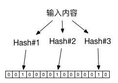

## 布隆过滤器

布隆过滤器（Bloom Filter）是在 1970 年由 Burton Howard Bloom 在论文《Space/Time Trade-offs in Hash Coding with Allowable Errors》提出的。布隆过滤器是一种基于 Hash 的高效查找结构，能够快速（常数时间内）回答“某个元素是否在一个集合内”的问题。

该结构因为具有高效性而广泛应用到网络和安全领域，例如信息检索（BigTable 和 HBase）、垃圾邮件规则、注册管理等。

### 基于 Hash 的快速查找

在介绍布隆过滤器之前，先来看看基于 Hash 的快速查找算法。在前面的讲解中，我们提到，Hash 可以将任意内容映射到一个固定长度的字符串，而且不同内容映射到相同串的概率很低。因此，这就构成了一个很好的“内容 -> 索引”的生成关系。

试想，如果给定一个内容和存储数组，通过构造 Hash 函数，让映射后的 Hash 值总不超过数组的大小，则可以实现快速的基于内容的查找。例如，内容 “hello world” 的 Hash 值如果是 “100”，则存放到数组的第 100 个单元上去。如果需要快速查找任意内容，如 “hello world” 字符串是否在存储系统中，只需要将其在常数时间内计算 Hash 值，并用 Hash 值查看系统中对应元素即可。该系统“完美地”实现了常数时间内的查找。

然而，令人遗憾的是，当映射后的值限制在一定范围（如总数组的大小）内时，会发现 Hash 冲突的概率会变高，而且范围越小，冲突概率越大。很多时候，存储系统的大小又不能无限扩展，这就造成算法效率的下降。为了提高空间利用率，后来人们基于 Hash 算法的思想设计出了布隆过滤器结构。

### 更高效的布隆过滤器

布隆过滤器采用了多个 Hash 函数来提高空间利用率。

对同一个给定输入来说，多个 Hash 函数计算出多个地址，分别在位串的这些地址上标记为 1。在查找时，进行同样的计算过程，并查看对应元素，如果都为 1，则说明较大概率是存在该输入。

布隆过滤器与单个 Hash 算法查找相比，大大提高了空间利用率，可以使用较少的空间来表示较大集合的存在关系。

实际上，无论是 Hash 还是布隆过滤器，基本思想是一致的，都是基于内容的编址。Hash 函数存在冲突，布隆过滤器也存在冲突，即这两种方法都存在着误报（False Positive）的情况，但绝对不会漏报（False Negative）。

布隆过滤器在应用中误报率往往很低，例如，在使用 7 个不同 Hash 函数的情况下，记录 100 万个数据，采用 2 MB 大小的位串，整体的误判率将低于 1%。而传统的 Hash 查找算法的误报率将接近 10%。
