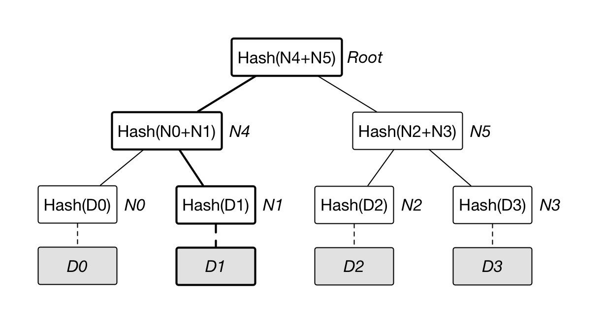

## Merkle 树结构

[默克尔树](https://en.wikipedia.org/wiki/Merkle_tree)（又叫哈希树）是一种典型的二叉树结构，由一个根节点、一组中间节点和一组叶节点组成。默克尔树最早由 Merkle Ralf 在 1980 年提出，曾广泛用于文件系统和 P2P 系统中。

其主要特点为：

* 最下面的叶节点包含存储数据或其哈希值；
* 非叶子节点（包括中间节点和根节点）都是它的两个孩子节点内容的哈希值。

进一步地，默克尔树可以推广到多叉树的情形，此时非叶子节点的内容为它所有的孩子节点的内容的哈希值。

默克尔树逐层记录哈希值的特点，让它具有了一些独特的性质。例如，底层数据的任何变动，都会传递到其父节点，一层层沿着路径一直到树根。这意味树根的值实际上代表了对底层所有数据的“数字摘要”。

目前，默克尔树的典型应用场景包括如下几种。

### 证明某个集合中存在或不存在某个元素

通过构建集合的默克尔树，并提供该元素各级兄弟节点中的 Hash 值，可以不暴露集合完整内容而证明某元素存在。

另外，对于可以进行排序的集合，可以将不存在元素的位置用空值代替，以此构建稀疏默克尔树（Sparse Merkle Tree）。该结构可以证明某个集合中不包括指定元素。

### 快速比较大量数据

对每组数据排序后构建默克尔树结构。当两个默克尔树根相同时，则意味着所代表的两组数据必然相同。否则，必然不同。

由于 Hash 计算的过程可以十分快速，预处理可以在短时间内完成。利用默克尔树结构能带来巨大的比较性能优势。

### 快速定位修改

以下图为例，基于数据 D0……D3 构造默克尔树，如果 D1 中数据被修改，会影响到 N1，N4 和 Root。

因此，一旦发现某个节点如 Root 的数值发生变化，沿着 Root --> N4 --> N1，最多通过 O(lgN) 时间即可快速定位到实际发生改变的数据块 D1。

### 成员证明（不是零知识证明）

仍以上图为例，如果要向他人证明某个数据 D0 已被承诺到 Merkle 根中，证明人可以公开 D0 及其路径上的兄弟节点 Hash（如 N1、N5）和 Root。验证者按路径重新计算 Root，若结果一致，即可确认 D0 属于该 Merkle 根代表的数据集合。

这种 Merkle inclusion proof 可以避免暴露完整集合，但它会暴露被证明的叶子、路径长度、相邻节点 Hash，很多实现还会暴露叶子位置；它证明的是“给定叶子在给定根承诺的集合中”，不是零知识证明。零知识证明要求验证者除了命题真假之外不获得额外信息，Merkle 成员证明通常不满足这个性质。
