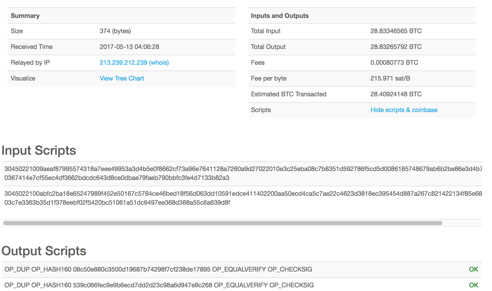
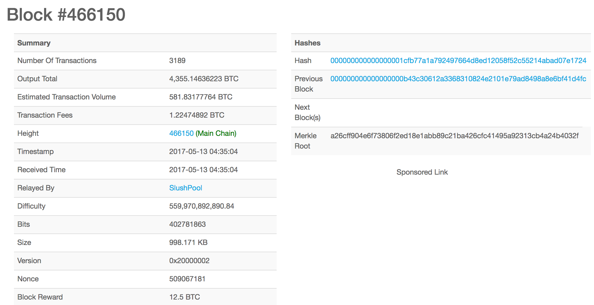

## 基本原理和设计

从分布式系统角度看，比特币网络是一个典型的分布式点对点网络，网络中的矿工通过“挖矿”来完成对交易记录的记账过程，维护网络的正常运行。

区块链网络提供一个公共可见的记账本，该记账本记录网络中所有的交易历史，而并非记录各个账户的余额。该设计可以避免重放攻击，即某个交易被多次重复提交。

### 基本交易过程

比特币中没有账户的概念。因此，每次发生交易，用户需要将交易记录写到比特币网络账本中，等网络确认后即可认为交易完成。

除了挖矿获得奖励的 coinbase 交易只有输出，正常情况下每个交易需要包括若干输入和输出，未经使用（引用）的交易的输出（Unspent Transaction Outputs，UTXO）可以被新的交易引用作为其合法的输入。被使用过的交易的输出（Spent Transaction Outputs，STXO），则无法被引用作为合法输入。

因此，比特币网络中一笔合法的交易，必须是引用某些已存在交易的 UTXO（必须是属于付款方才能合法引用）作为新交易的输入，并生成新的 UTXO（将属于收款方）。

那么，在交易过程中，付款方如何证明自己所引用的 UTXO 合法？比特币中通过“签名脚本”来实现，并且指定“输出脚本”来限制将来能使用新 UTXO 者只能为指定收款方。对每笔交易，付款方需要进行签名确认。并且，对每一笔交易来说，总输入不能小于总输出。总输入相比总输出多余的部分称为交易费用（Transaction Fee），为生成包含该交易区块的矿工所获得。交易费不是协议固定的 0.0001 BTC；节点会按本地中继策略、mempool 状态和费率（通常按 sat/vB 或 BTC/kvB）筛选交易，钱包也会根据期望确认时间估算费率。交易费用在奖励矿工的同时，也避免了网络受到大量低成本交易攻击。

交易中金额的最小单位是“聪”，即一亿分之一（10^-8）比特币。

下图展示了一些简单的示例交易。更一般情况下，交易的输入、输出可以为多方。

| 交易 | 目的 | 输入 | 输出 | 签名 | 差额 |
| --- | --- | --- | --- | --- | --- |
| T0 | A 转给 B | 他人向 A 交易的输出 | B 账户可以使用该交易 | A 签名确认 | 输入减输出，为交易服务费 |
| T1 | B 转给 C | T0 的输出 | C 账户可以使用该交易 | B 签名确认 | 输入减输出，为交易服务费 |
| ... | X 转给 Y | 他人向 X 交易的输出 | Y 账户可以使用该交易 | X 签名确认 | 输入减输出，为交易服务费 |

需要注意，刚放进网络中的交易（深度为 0）并非是实时得到确认的。进入网络中的交易存在被推翻的可能性，一般要再生成几个新的区块后（深度大于 0）才认为该交易被确认。

比特币采用了 UTXO 模型，相对账户模型，UTXO 模型可以更容易实现并行处理和隐私保护，并追踪完整交易路径；但由于需要存储和检索所有交易记录，对节点存储压力较大。

下面分别介绍比特币网络中的重要概念和主要设计思路。

### 重要概念

#### 账户/地址

比特币采用了非对称的加密算法，用户自己保留私钥，对自己发出的交易进行签名确认，并公开公钥。

比特币地址不是账户，也不总是公钥 Hash。地址是钱包给用户展示的、可编码某类输出脚本或见证程序的字符串：传统 P2PKH 地址对应公钥 HASH160，P2SH 地址对应脚本 Hash，原生 SegWit 地址使用 Bech32 编码见证程序，Taproot/P2TR 地址使用 Bech32m 编码 SegWit v1 见证程序。

早期 P2PKH/P2SH 地址使用 Base58Check 编码，并添加前导字节（表明支持哪种脚本）和 4 字节校验字节；现代原生 SegWit/Taproot 地址使用 Bech32/Bech32m，通常以 `bc1q` 或 `bc1p` 开头。

*注：传统 P2PKH 地址并非直接暴露公钥内容，而是公钥 Hash 后的值，避免公钥过早公开后增加被攻击的风险。*

#### 交易

交易是完成比特币功能的核心概念。原始交易的核心字段不是“付款人地址”和“收款人地址”，地址通常是钱包或区块浏览器从脚本中解析出来的展示形式。一条普通原始交易主要包括如下字段：

* 版本号（version）：指定交易版本，版本 2 可启用相对锁定时间相关语义；
* 输入（vin）：引用前序交易输出的 outpoint（txid 和 vout）、解锁脚本 scriptSig、序列号 sequence；SegWit 交易还包含对应输入的 witness 数据；
* 输出（vout）：金额 value 和锁定脚本 scriptPubKey，地址只是某些标准 scriptPubKey 的可读编码；
* 锁定时间（locktime）：交易最早可被纳入区块的区块高度或 Unix 时间。

网络中节点收到交易信息后，将进行如下检查：

* 交易是否已经处理过；
* 交易是否合法。包括输入引用的前序输出是否存在且未花费、解锁数据是否满足对应的锁定脚本、脚本执行是否通过；
* 交易的输入之和是否大于输出之和。

检查都通过，则将交易标记为合法的未确认交易，并在网络内进行广播。

用户可以从 blockchain.info 网站查看实时的交易信息，一个示例交易的内容如下图所示。



#### 交易脚本

[脚本（Script）](https://en.bitcoin.it/wiki/Script) 是保障交易完成（主要用于检验交易是否合法）的核心机制，当所依附的交易发生时被触发。通过脚本机制而非写死交易过程，比特币网络实现了一定的可扩展性。比特币脚本语言是一种非图灵完备的语言，类似 [Forth](https://en.wikipedia.org/wiki/Forth_programming_language) 语言。

传统交易输入通常包含负责解锁的 scriptSig，交易输出包含负责锁定的 scriptPubKey。SegWit 交易把签名等解锁数据放入 witness 字段，scriptSig 可为空或只包含嵌套见证程序。

输出脚本一般由付款方对交易设置锁定，用来对能动用这笔交易的输出（例如，要花费该交易的输出）的对象（收款方）进行权限控制，例如限制必须是某个公钥的拥有者才能花费这笔交易。

认领脚本则用来证明自己可以满足交易输出脚本的锁定条件，即对某个交易的输出（比特币）的拥有权。

常见标准输出脚本包括：

* P2PKH：Pay-To-Public-Key-Hash，允许用户将比特币发送到公钥 Hash 对应的传统地址上（证明拥有该公钥），主网地址通常以 `1` 开头；
* P2SH：Pay-To-Script-Hash，支付者创建一个输出脚本，里边包含另一个脚本（认领脚本）的哈希，常见于多签或嵌套 SegWit，主网地址通常以 `3` 开头；
* P2WPKH/P2WSH：SegWit v0 的原生见证输出，分别对应公钥 Hash 和脚本 Hash，地址使用 Bech32，主网通常以 `bc1q` 开头；
* P2TR：Taproot 的 SegWit v1 输出，地址使用 Bech32m，主网通常以 `bc1p` 开头。

以 P2PKH 为例，输出脚本的格式为

```text
scriptPubKey: OP_DUP OP_HASH160 <pubKeyHash> OP_EQUALVERIFY OP_CHECKSIG
```

其中，OP_DUP 是复制栈顶元素；OP_HASH160 是计算 hash 值；OP_EQUALVERIFY 判断栈顶两元素是否相等；OP_CHECKSIG 判断签名是否合法。这条指令实际上保证了只有 pubKey 的拥有者才能合法引用这个输出。

另外一个交易如果要花费这个输出，在引用这个输出的时候，需要提供认领脚本格式为

```text
scriptSig: <sig> <pubKey>
```

其中，<sig> 是拿 pubKey 对应的私钥对交易（全部交易的输出、输入和脚本）Hash 值进行签名，pubKey 的 Hash 值需要等于 pubKeyHash。

进行交易验证时，会按照先 scriptSig 后 scriptPubKey 的顺序进行依次入栈处理，即完整指令为：

```text
<sig> <pubKey> OP_DUP OP_HASH160 <pubKeyHash> OP_EQUALVERIFY OP_CHECKSIG
```

读者可以按照栈的过程来进行推算，理解整个脚本的验证过程。

引入脚本机制带来了灵活性，但也引入了更多的安全风险。比特币脚本支持的指令集十分简单，基于栈的处理方式，并且非图灵完备，此外还添加了额外的一些限制（大小限制等）。

#### 区块

SegWit 激活后，比特币区块不再只用“1 MB”描述容量上限。共识规则使用区块重量（block weight）限制：区块重量 = 基础大小（不含 witness）× 3 + 总大小（含 witness），上限为 4,000,000 weight units；同时基础大小仍受旧节点可见的约 1 MB 约束。一个区块主要包括如下内容：

* 区块头：80 字节：
* 交易个数计数器：CompactSize 可变长度整数；
* 所有交易的具体内容，可变长，匹配 Merkle 树叶子节点顺序。

其中，区块头信息十分重要，包括：

* 版本号：4 字节；
* 上一个区块头的 Hash 值：链接到上一个合法的块上，对其区块头进行两次 SHA256 操作，32 字节；
* 本区块所包含的所有交易的 Merkle 树根的哈希值：两次 SHA256 操作，32 字节；
* 时间戳：4 字节；
* 难度指标：4 字节；
* Nonce：4 字节，PoW 问题的答案。

可见，要对区块链的完整性进行检查，只需要检验各个区块头部信息即可，无需获取到具体的交易内容，这也是简单交易验证（Simple Payment Verification，SPV）的基本原理。另外，通过头部的链接，提供时序关系的同时加大了对区块中数据进行篡改的难度。

一个示例区块如下图所示。



### 创新设计

比特币在设计上提出了很多创新点，主要考虑了避免作恶、采用负反馈调节和基于概率的共识机制等三个方面。

#### 如何避免作恶

基于经济博弈原理。在一个开放的网络中，无法通过技术手段保证每个人都是合作的。但可以通过经济博弈来让合作者得到利益，让非合作者遭受损失和风险。

实际上，博弈论早已被广泛应用到众多领域。

一个经典的例子是两个人来分一个蛋糕，如果都想拿到较大的一块，在没有第三方的前提下，该怎么制定规则才公平？

最简单的一个方案是任意一个人负责分配蛋糕，并且这个人后挑选。

*注：如果推广到 N 个人呢？*

比特币网络中所有试图参与者（矿工）都首先要付出挖矿的代价，进行算力消耗，越想拿到新区块的决定权，意味着抵押的算力越多。一旦失败，这些算力都会被没收掉，成为沉没成本。当网络中存在众多参与者时，个体试图拿到新区块决定权要付出的算力成本是巨大的，意味着进行一次作恶付出的代价已经超过可能带来的好处。

#### 负反馈调节

比特币网络在设计上，很好的体现了负反馈的控制论基本原理。

比特币网络中矿工越多，系统就越稳定，比特币价值就越高，但挖到矿的概率会降低。

反之，网络中矿工减少，会让系统更容易导致被攻击，比特币价值越低，但挖到矿的概率会提高。

因此，比特币的价格理论上应该稳定在一个合适的值（网络稳定性也会稳定在相应的值），这个价格乘以挖到矿的概率，恰好达到矿工的收益预期。

从长远角度看，硬件成本是下降的，但区块补贴每 210,000 个区块减半一次（约 4 年）。由于最小单位为聪，新增发行会在 2140 年前后趋近并最终停止，总发行量上限约为 2100 万枚；之后矿工收入将主要依靠交易费。

*注：比特币最小单位是“聪”，即 10^(-8) 比特币，总“聪”数为 2.1E15。对于 64 位处理器来说，高精度浮点计数的限制导致单个数值不能超过 2^53 约等于 9E15。*

#### 共识机制

传统共识问题往往是考虑在一个相对封闭的分布式系统中，允许同时存在正常节点、故障节点，如何快速达成一致。

对于比特币网络来说，它是完全开放的，可能面向各种攻击情况，同时基于 Internet 的网络质量只能保证“尽力而为”，导致问题更加复杂，传统的一致性算法在这种场景下难以实用。

因此，比特币网络不得不对共识的目标和过程都进行了一系列限制，提出了基于 Proof of Work（PoW）的共识机制。

首先是不实现面向最终确认的共识，而是基于概率、随时间逐步增强确认的共识。现有达成的结果在理论上都可能被推翻，只是攻击者要付出的代价随时间而指数级上升，被推翻的可能性随之指数级的下降。

此外，考虑到 Internet 的尺度，达成共识的时间相对比较长。按照区块（一组交易）来进行阶段性的确认（快照），提高网络整体的可用性。

最后，限制网络中共识的噪音。通过进行大量的 Hash 计算和少数的合法结果来限制合法提案的个数，进一步提高网络中共识的稳定性。
