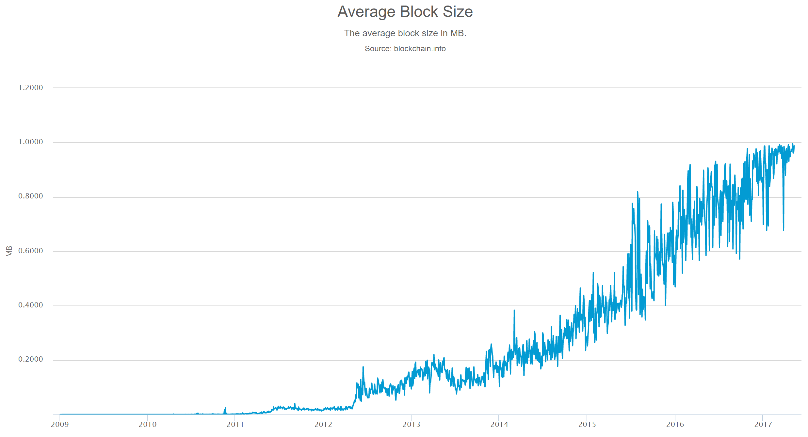

## 热点问题

### 设计中的权衡

比特币的设计目标在于支持一套安全、开放、分布式的数字货币系统。围绕这一目标，比特币协议的设计中很多地方都体现了权衡（trade-off）的思想。

* 区块容量：更大的区块容量可以带来更高的交易吞吐率，但会增加挖矿成本，带来中心化的风险，同时增大存储的代价。兼顾多方面的考虑，当前的区块容量上限设定为 1MB。
* 出块间隔时间：更短的出块间隔可以缩短交易确认的时间，但也可能导致分叉增多，降低网络可用性。
* 脚本支持程度：更强大的脚本指令集可以带来更多灵活性，但也会引入更多安全风险。

### 分叉

比特币协议不会一成不变。当需要修复漏洞、扩展功能或调整结构时，比特币需要在全网的配合下进行升级。升级通常涉及更改交易的数据结构或区块的数据结构。

由于分布在全球的节点不可能同时完成升级来遵循新的协议，因此比特币区块链在升级时可能发生分叉（Fork）。对于一次升级，如果把网络中升级了的节点称为新节点，未升级的节点称为旧节点，根据新旧节点相互兼容性上的区别，可分为软分叉（Soft Fork）和硬分叉（Hard Fork）。

* 如果旧节点仍然能够验证接受新节点产生的交易和区块，则称为软分叉。旧节点可能不理解新节点产生的一部分数据，但不会拒绝。网络既向后和向前兼容，因此这类升级可以平稳进行。
* 如果旧节点不接受新节点产生的交易和区块，则称为硬分叉。网络只向后兼容，不向前兼容。这类升级往往引起一段时间内新旧节点所认可的区块不同，分出两条链，直到旧节点升级完成。

尽管通过硬分叉升级区块链协议的难度大于软分叉，但软分叉能做的事情毕竟有限，一些大胆的改动只能通过硬分叉完成。

### 交易延展性

交易延展性（Transaction Malleablility）是比特币的一个设计缺陷。简单来讲，是指当交易发起者对交易签名（sign）之后，交易 ID 仍然可能被改变。

下面是一个比特币交易的例子。

```json
{
  "txid": "f200c37aa171e9687452a2c78f2537f134c307087001745edacb58304053db20",
  "version": 1,
  "locktime": 0,
  "vin": [
    {
      "txid": "21f10dbfb0ff49e2853629517fa176dc00d943f203aae3511288a7dd89280ac2",
      "vout": 0,
      "scriptSig": {
        "asm": "304402204f7fb0b1e0d154db27dbdeeeb8db7b7d3b887a33e712870503438d8be2d66a0102204782a2714215dc0d581e1d435b41bc6eced2c213c9ba0f993e7fcf468bb5d311[ALL] 025840d511c4bc6690916270a54a6e9290fab687f512c18eb2df0428fa69a26299",
        "hex": "47304402204f7fb0b1e0d154db27dbdeeeb8db7b7d3b887a33e712870503438d8be2d66a0102204782a2714215dc0d581e1d435b41bc6eced2c213c9ba0f993e7fcf468bb5d3110121025840d511c4bc6690916270a54a6e9290fab687f512c18eb2df0428fa69a26299"
      },
      "sequence": 4294967295
    }
  ],
  "vout": [
    {
      "value": 0.00167995,
      "n": 0,
      "scriptPubKey": {
        "asm": "OP_DUP OP_HASH160 7c4338dea7964947b3f0954f61ef40502fe8f791 OP_EQUALVERIFY OP_CHECKSIG",
        "hex": "76a9147c4338dea7964947b3f0954f61ef40502fe8f79188ac",
        "reqSigs": 1,
        "type": "pubkeyhash",
        "addresses": [
          "1CL3KTtkN8KgHAeWMMWfG9CPL3o5FSMU4P"
        ]
      }
    }
  ]
}
```

发起者对交易的签名（scriptSig）位于交易的输入（vin）当中，属于交易内容的一部分。交易 ID（txid）是整个交易内容的 Hash 值。这就造成了一个问题：攻击者（尤其是签名方）可以通过改变 scriptSig 来改变 txid，而交易仍旧保持合法。例如，反转 ECDSA 签名过程中的 S 值，签名仍然合法，交易仍然能够被传播。

这种延展性攻击能改变交易 ID，但交易的输入和输出不会被改变，所以攻击者不会直接盗取比特币。这也是为什么这一问题能在比特币网络中存在如此之久，而仍未被根治。

然而，延展性攻击仍然会带来一些问题。比如，在原始交易未被确认之前广播 ID 改变了的交易可能误导相关方对交易状态的判断，甚至发动拒绝服务攻击；多重签名场景下，一个签名者有能力改变交易 ID，给其他签名者的资产带来潜在风险。同时，延展性问题也会阻碍闪电网络等比特币扩展方案的实施。

### 扩容之争

比特币当前将区块容量限制在 1MB 以下。如图所示，随着用户和交易量的增加，这一限制已逐渐不能满足比特币的交易需求，使得交易日益拥堵、交易手续费不断上涨。



关于比特币扩容的持续争论从 2015 年便已开始，期间有一系列方案被摆上台面，包括各种链上扩容提议、用侧链或闪电网络扩展比特币等。考虑到比特币复杂的社区环境，其扩容方案早已不是一方能说了算；而任何一个方案想让要达成广泛共识都比较困难，不同的方案之间也很难调和。

当前，扩容之争主要集中在两派：代表核心开发者的 Bitcoin Core 团队主推的隔离见证方案，和 Bitcoin Unlimited 团队推出的方案。

#### 隔离见证方案

隔离见证（Segregated Witness，简称 SegWit）是指将交易中的签名部分从交易的输入中隔离出来，放到交易末尾的被称为见证（Witness）的字段当中。

对交易 ID 的计算将不再包含这一签名部分，所以这也是延展性问题的一种解法，给引入闪电网络等第二层协议增强了安全性。

同时，隔离见证会将区块容量上限理论上提高到 4MB。对隔离见证的描述可详见五个比特币改进协议（Bitcoin Improvement Proposal）：BIP 141 ~ BIP 145。

#### Bitcoin Unlimited 方案

Bitcoin Unlimited 方案（简称 BU）是指扩展比特币客户端，使矿工可以自由配置他们想要生成和验证的区块的容量。

根据方案的设想，区块容量的上限会根据众多节点和矿工的配置进行自然收敛。Bitcoin Unlimited Improvement Proposal（BUIP） 001 中表述了这一对比特币客户端的拓展提议，该方案已获得一些大型矿池的支持和部署。

### 比特币的监管和追踪

比特币的匿名特性，使得对其交易进行监管并不容易。

不少非法分子利用这一点，通过比特币转移资金。例如 WannaCry 网络病毒向受害者勒索比特币，短短三天时间里传播并影响到全球 150 多个国家。尽管这些不恰当的行为与比特币项目自身并无直接关系，但都或多或少给比特币社区带来了负面影响。

实际上，认为通过比特币就可以实现完全匿名化并不现实。虽然交易账户自身是匿名的 Hash 地址，但一些研究成果（如《An analysis of anonymity in the bitcoin system》）表明，通过分析大量公开可得的交易记录，有很大概率可以追踪到比特币的实际转移路线，甚至可以追踪到真实用户。

