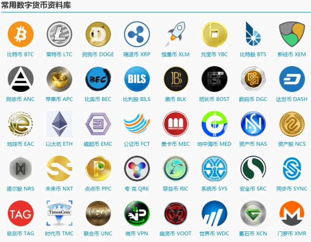

## 比特币项目简介

比特币（BitCoin，BTC）是基于区块链技术的一种加密货币；比特币网络是首个经过大规模、长时间检验的公有区块链系统。

自 2009 年 1 月 3 日正式上线以来，比特币价格经历了数次的震荡，目前每枚比特币市场价格超过 7000 美金。

比特币网络在功能上具有如下特点：

* 非中心化：意味着没有任何独立个体可以对网络造成有效破坏，交易请求需要大多数参与者进行共识才能被接受；
* 隐私性：网络中账户地址是化名的，很难从交易信息直接关联到具体的个体，但交易记录是公开可查的；
* 通胀预防：比特币的发行通过挖矿实现，发行量每四年减半，总量上限为 2100 万枚，不会出现通胀。

下图来自 [blockchain.info](https://blockchain.info/charts/market-price?timespan=all) 网站，可以看到比特币字诞生以来的汇率（以美元为单位）变化历史。

### 比特币大事记

#### 2008 ~ 2013

2008 年 11 月 1 日 19:16:33，中本聪在 metzdowd 的加密技术邮件列表发布比特币白皮书：“比特币：一种点对点的电子现金系统（Bitcoin: A Peer-to-Peer Electronic Cash System）”。

2009 年 1 月 3 日 18:15:05，中本聪在位于芬兰赫尔辛基（Helsinki）的一个小型服务器上挖出了首批 50 个比特币，并在首个区块中记录了当天泰晤士报的头版标题：“The Times 03/Jan/2009 Chancellor on brink of second bailout for banks（财政大臣考虑再次紧急援助银行危机）”。首个区块也被称为创世区块或初始区块（Genesis Block），可以通过 [https://blockchain.info/block-index/14849](https://blockchain.info/block-index/14849) 查看其详细内容。

2009 年 1 月 12 日，中本聪将 10 枚比特币转账给开发者 Hal Finney，这也是首笔比特币转账（位于区块 170）。

2010 年 5 月 21 日，第一次比特币交易：佛罗里达程序员 Laszlo Hanyecz 用 1 万 BTC 购买了价值 25 美元的披萨优惠券。这是比特币的首个兑换汇率：1: 0.0025 美金。这些比特币在今日价值超过 8000 万美金。

2010 年 7 月 17 日，第一个比特币交易平台 Mt.Gox 成立。

2011 年 4 月，首个有官方正式记载的版本 0.3.21 发布，支持普通用户参与到 P2P 网络中，并开始支持最小单位 “聪”。

2011 年 4 月 26 日，比特币宏大网络缺失的最后一块砖被砌好。中本聪发出一封简短的邮件之后，从此不再现身。

2011 年初，开始出现基于显卡的挖矿设备。2011 年年底，比特币价格约为 2 美元。

2012 年 6 月，Coinbase 成立，支持比特币相关交易。公司目前已经发展为全球数字资产交易平台，同时支持包括比特币、以太币等数字货币。

2011 年 6 月 19 日，由于安全事故，Mt.Gox 数据库发生泄漏，其宣称所保管的部分比特币被盗走。

2012 年 9 月 27 日，比特币基金创立，此时比特币价格为 12.46 美元。

2012 年 11 月 28 日，比特币产量第一次减半，单个区块产生的比特币从 50 个减半到 25 个。

2013 年 3 月，三分之一的专业矿工已经开始采用专用 ASIC 矿机进行挖矿。

2013 年 3 月 11 日，比特币发布 0.8.0 版本，大量完善了节点内部管理和网络通信，使得比特币有能力支持后来大规模的 P2P 网络。该版本包含一个严重的 bug，虽然后来被紧急修复，仍造成比特币价格大幅下跌。

2013年 4 月 10 日，BTC 创下历史新高，266 美元。

2013 年 6 月 27 日，德国会议作出决定：持有比特币一年以上将予以免税，被业内认为此举变相认可了比特币的法律地位，此时比特币价格为 102.24 美元。

2013 年 10 月 29 日，世界第一台可以兑换比特币的 ATM 在加拿大上线。

2013 年 11 月 29 日，比特币的交易价格创下 1242 美元的历史新高，而同时黄金价格为一盎司 1241.98 美元，比特币价格首度超过黄金。

#### 2014 ~ 2019

2014 年 2 月 24 日，全球最大比特币交易平台 Mt.Gox 因 85 万个比特币被盗而宣告破产并关闭，造成大量投资者的损失，比特币价格一度暴跌。

2014 年 3 月，中国第一台可以兑换比特币的 ATM 在香港上线。

2014 年 6 月，美国加州通过 AB-129 法案，允许比特币等数字货币在加州进行流通。

2015 年 6 月 3 日，纽约成为美国第一个正式进行数字货币监管的州。

2015 年 10 月 22 日，欧盟司法部宣布比特币和其它加密货币为货币而非商品，欧盟法院裁定比特币交易免征增值税。

2015 年 10 月 31 日，《经济学人》杂志发表封面文章《信任机器》，开始关注比特币网络背后的区块链技术。

2016 年 1 月，中国人民银行在京召开了数字货币研讨会，会后发布公告宣称或推出数字货币。

2016 年 7 月 9 日，比特币产量第二次减半，每个区块产出从 25 枚比特币减少为 12.5 枚。

2016 年 8 月 2 日，知名比特币交易所 Bitfinex 遭遇安全攻击，按照当时市值计算，损失超过 6000 万美金。

2017 年 1 月 24 日，中国部分交易所（Okcoin、火币、BTCC）开始收取比特币交易手续费（为成交金额的 0.2%）。

2017 年 3 月，美国证券交易监督委员会（U.S. Securities and Exchange Commission，SEC）连续否决了比特币 ETF 申请。

2017 年 4 月 1 日，日本通过法案，正式将数字货币交易所纳入监管体系，承认比特币是合法的预付款工具。

2017 年 7 月，比特币网络全网算力首次突破 6 exahash/s（即每秒10的18次方哈希），创下历史新高。

2017 年 9 月 4 日，北京市互联网金融风险专项整治工作领导小组办公室下发通知，停止各类 ICO 和代币发行活动。之后，国内各大交易所和矿池陆续终止境内业务。

2017 年 10 月 13 日，比特币的价格首次突破 5000 美元。

2017 年 12 月 11 日，全球首个比特币期货合约在芝加哥期权交易所（Chicago Board Options Exchange，CBOE）上市。

2017 年 12 月 17 日，比特币期货在芝加哥商品交易所（Chicago Mercantile Exchange，CME）上市，当天单个比特币价格一度冲破 20000 美元（总市值超过 2000 亿美金），创下历史新高。

2018 年 3 月 6 日，韩国政府发布禁令，禁止公职人员持有和交易加密货币。彼时比特币价格已经长期在 5000 美金左右波动。

2018 年 3 月 7 日，美国证券交易监督委员会发布了《关于可能违法的数字资产交易平台的声明》，规定数字货币交易所必须通过注册。

2018 年 6 月 21 日，受美联储降息和 Facebook 发币消息的影响，比特币价格重新攀升超过 10000 美金，并一度接近 13000 美金。

2019 年 6 月，由于交易量不足以及来自芝加哥商品交易所的竞争，芝加哥期权交易所决定暂停比特币期货合约交易。

2018 年 12 月，受到行业周期和社区内部冲突的影响，比特币价格一路下跌，迫近 3000 美金关口。

2019 年 6 月 18 日，Facebook 发布了加密货币项目 Libra 的白皮书，宣布要打造简单的、无国界的为数十亿普通人服务的金融基础设施。

2019 年 9 月 23 日，比特币期货交易平台 Bakkt 上线，支持以比特币实物进行结算。

2019 年 10 月 26 日，受到一系列利好消息影响，比特币价格暴涨，单日从 7600 美元涨到 10800 美元。但随后逐步跌破 7000 美金。

目前，比特币区块链已经生成了超过 60 万个区块，完整存储需要约 250 GB 的空间，每天平均完成 20 万笔交易。

### 其它数字货币

比特币的“成功”，刺激了相关的生态和社区发展，大量类似数字货币（超过 1000 种）纷纷出现，比较出名的包括以太币和瑞波（Ripple）币等。

<!--

-->

这些数字货币大部分复用已有的区块链（例如比特币网络）系统，少数建立在自己独立的区块链网络上。全球活跃的数字货币用户据称在 290 万 ~ 580 万之间（参考剑桥大学 Judge 商学院 2017 年 4 月发表的《全球加密货币基准研究（Global Cryptocurrency Benchmarking Study）》报告）。

*注：通过 [www.blockchain.com](www.blockchain.com) 网站可以实时查询到比特币网络的信息，包括区块、交易、价格等在内的详细数据。*
