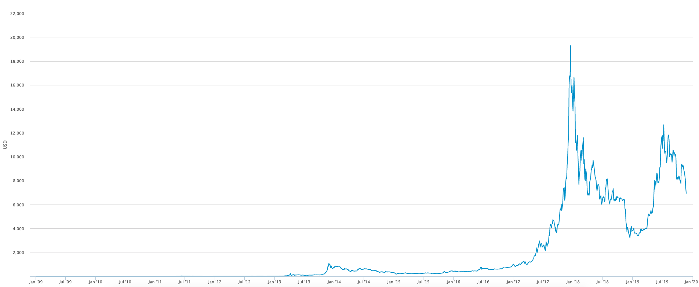
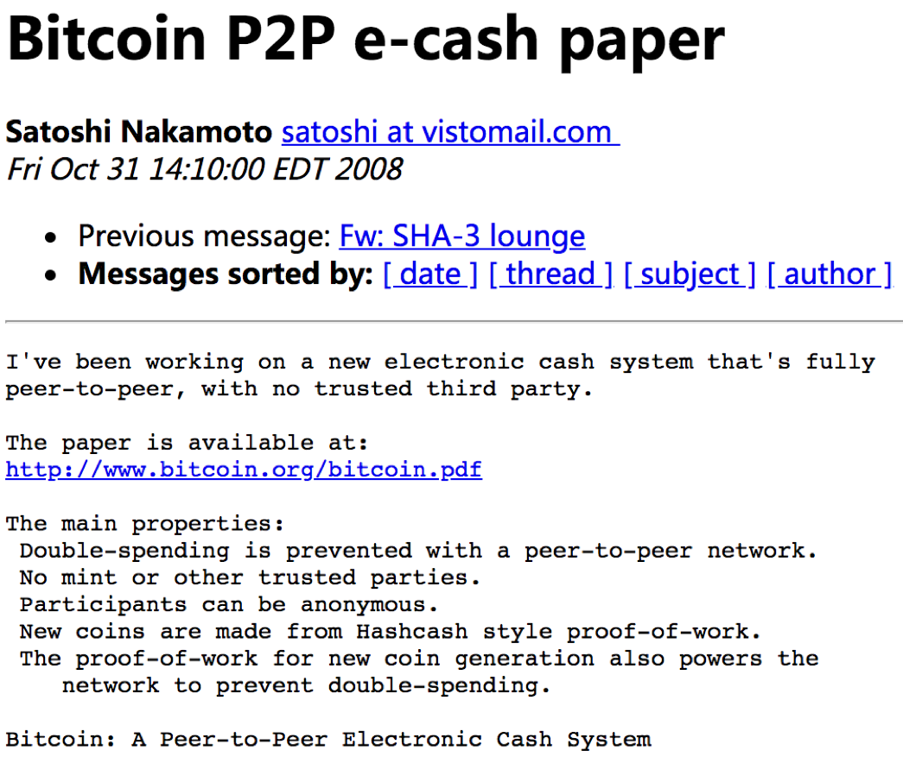

## 比特币项目简介

比特币（BitCoin，BTC）是基于区块链技术的一种加密货币；比特币网络是首个经过大规模、长时间检验的公有区块链系统。

自 2009 年 1 月 3 日正式上线以来，比特币价格经历了多次剧烈震荡。2024 年，受益于现货 ETF 获批和第四次减半事件，比特币价格在年底收于约 93500 美元，2025 年初更是冲高至 12 万美元以上，但在 2026 年初回落至 7 万美元区间，显示出显著的市场波动性。

比特币网络在功能上具有如下特点：

* 去中心化：意味着没有任何独立个体可以对网络造成有效破坏，交易请求需要大多数参与者进行共识才能被接受；
* 隐私性：网络中账户地址是化名的，很难从交易信息直接关联到具体的个体，但交易记录是公开可查的；
* 通胀预防：比特币的发行通过挖矿实现，发行量每四年减半，总量上限为 2100 万枚，不会出现通胀。

下图来自 [blockchain.com](https://www.blockchain.com/charts/market-price?timespan=all) 网站，可以看到比特币自诞生以来的汇率（以美元为单位）变化历史。

### 比特币大事记

#### 2008 ~ 2013

2008 年 11 月 1 日 19:16:33，中本聪在 metzdowd 的加密技术邮件列表发布比特币白皮书：“比特币：一种点对点的电子现金系统（Bitcoin: A Peer-to-Peer Electronic Cash System）”。

2009 年 1 月 3 日 18:15:05，中本聪在位于芬兰赫尔辛基（Helsinki）的一个小型服务器上挖出了首批 50 个比特币，并在首个区块中记录了当天泰晤士报的头版标题：“The Times 03/Jan/2009 Chancellor on brink of second bailout for banks（财政大臣考虑再次紧急援助银行危机）”。首个区块也被称为创世区块或初始区块（Genesis Block），可以通过 [https://blockchain.info/block-index/14849](https://blockchain.info/block-index/14849) 查看其详细内容。

2009 年 1 月 12 日，中本聪将 10 枚比特币转账给开发者 Hal Finney，这也是首笔比特币转账（位于区块 170）。

2010 年 5 月 21 日，第一次比特币交易：佛罗里达程序员 Laszlo Hanyecz 用 1 万 BTC 购买了价值 25 美元的披萨优惠券。这是比特币的首个兑换汇率：1 BTC = 0.0025 美金。以当前价格计算，这些比特币价值已超过 10 亿美金。

2010 年 7 月 17 日，第一个比特币交易平台 Mt.Gox 成立。

2011 年 4 月，首个有官方正式记载的版本 0.3.21 发布，支持普通用户参与到 P2P 网络中，并开始支持最小单位 “聪”。

2011 年 4 月 26 日，比特币宏大网络缺失的最后一块砖被砌好。中本聪发出一封简短的邮件之后，从此不再现身。

2011 年初，开始出现基于显卡的挖矿设备。2011 年年底，比特币价格约为 2 美元。

2012 年 6 月，Coinbase 成立，支持比特币相关交易。公司目前已经发展为全球数字资产交易平台，同时支持包括比特币、以太币等数字货币。

2011 年 6 月 19 日，由于安全事故，Mt.Gox 数据库发生泄漏，其宣称所保管的部分比特币被盗走。

2012 年 9 月 27 日，比特币基金创立，此时比特币价格为 12.46 美元。

2012 年 11 月 28 日，比特币产量第一次减半，单个区块产生的比特币从 50 个减半到 25 个。

2013 年 3 月，三分之一的专业矿工已经开始采用专用 ASIC 矿机进行挖矿。

2013 年 3 月 11 日，比特币发布 0.8.0 版本，大量完善了节点内部管理和网络通信，使得比特币有能力支持后来大规模的 P2P 网络。该版本包含一个严重的 bug，虽然后来被紧急修复，仍造成比特币价格大幅下跌。

2013年 4 月 10 日，BTC 创下历史新高，266 美元。

2013 年 6 月 27 日，德国会议作出决定：持有比特币一年以上将予以免税，被业内认为此举变相认可了比特币的法律地位，此时比特币价格为 102.24 美元。

2013 年 10 月 29 日，世界第一台可以兑换比特币的 ATM 在加拿大上线。

2013 年 11 月 29 日，比特币的交易价格创下 1242 美元的历史新高，而同时黄金价格为一盎司 1241.98 美元，比特币价格首度超过黄金。

#### 2014 ~ 2019

2014 年 2 月 24 日，全球最大比特币交易平台 Mt.Gox 因 85 万个比特币被盗而宣告破产并关闭，造成大量投资者的损失，比特币价格一度暴跌。

2014 年 3 月，中国第一台可以兑换比特币的 ATM 在香港上线。

2014 年 6 月，美国加州通过 AB-129 法案，允许比特币等数字货币在加州进行流通。

2015 年 6 月 3 日，纽约成为美国第一个正式进行数字货币监管的州。

2015 年 10 月 22 日，欧盟司法部宣布比特币和其它加密货币为货币而非商品，欧盟法院裁定比特币交易免征增值税。

2015 年 10 月 31 日，《经济学人》杂志发表封面文章《信任机器》，开始关注比特币网络背后的区块链技术。

2016 年 1 月，中国人民银行在京召开了数字货币研讨会，会后发布公告宣称或推出数字货币。

2016 年 7 月 9 日，比特币产量第二次减半，每个区块产出从 25 枚比特币减少为 12.5 枚。

2016 年 8 月 2 日，知名比特币交易所 Bitfinex 遭遇安全攻击，按照当时市值计算，损失超过 6000 万美金。

2017 年 1 月 24 日，中国部分交易所（Okcoin、火币、BTCC）开始收取比特币交易手续费（为成交金额的 0.2%）。

2017 年 3 月，美国证券交易监督委员会（U.S. Securities and Exchange Commission，SEC）连续否决了比特币 ETF 申请。

2017 年 4 月 1 日，日本通过法案，正式将数字货币交易所纳入监管体系，承认比特币是合法的预付款工具。

2017 年 7 月，比特币网络全网算力首次突破 6 exahash/s（即每秒10的18次方哈希），创下历史新高。

2017 年 9 月 4 日，北京市互联网金融风险专项整治工作领导小组办公室下发通知，停止各类 ICO 和代币发行活动。之后，国内各大交易所和矿池陆续终止境内业务。

2017 年 10 月 13 日，比特币的价格首次突破 5000 美元。

2017 年 12 月 11 日，全球首个比特币期货合约在芝加哥期权交易所（Chicago Board Options Exchange，CBOE）上市。

2017 年 12 月 17 日，比特币期货在芝加哥商品交易所（Chicago Mercantile Exchange，CME）上市，当天单个比特币价格一度冲破 20000 美元（总市值超过 2000 亿美金），创下历史新高。

2018 年 3 月 6 日，韩国政府发布禁令，禁止公职人员持有和交易加密货币。彼时比特币价格已经长期在 5000 美金左右波动。

2018 年 3 月 7 日，美国证券交易监督委员会发布了《关于可能违法的数字资产交易平台的声明》，规定数字货币交易所必须通过注册。

2018 年 6 月 21 日，受美联储降息和 Facebook 发币消息的影响，比特币价格重新攀升超过 10000 美金，并一度接近 13000 美金。

2019 年 6 月，由于交易量不足以及来自芝加哥商品交易所的竞争，芝加哥期权交易所决定暂停比特币期货合约交易。

2018 年 12 月，受到行业周期和社区内部冲突的影响，比特币价格一路下跌，迫近 3000 美金关口。

2019 年 6 月 18 日，Facebook 发布了加密货币项目 Libra 的白皮书，宣布要打造简单的、无国界的为数十亿普通人服务的金融基础设施。

2019 年 9 月 23 日，比特币期货交易平台 Bakkt 上线，支持以比特币实物进行结算。

#### 2020 ~ 2025

2020 年 3 月 12 日，受新冠疫情引发的全球金融市场恐慌影响，比特币价格单日暴跌近 50%，从约 8000 美元跌至 3800 美元左右，被称为"黑色星期四"。

2020 年 5 月 11 日，比特币产量第三次减半，每个区块产出从 12.5 枚比特币减少为 6.25 枚。

2020 年 10 月，PayPal 宣布允许美国用户在其平台上购买、持有和出售比特币等加密货币，标志着主流支付巨头正式进入加密货币领域。

2020 年 12 月 16 日，比特币价格首次突破 20000 美元的历史高点。

2021 年 2 月 8 日，特斯拉（Tesla）宣布购买了价值 15 亿美元的比特币，并计划接受比特币作为支付方式，推动比特币价格快速攀升。

2021 年 4 月 14 日，比特币价格达到约 64000 美元的阶段性高点。同日，加密货币交易所 Coinbase 在纳斯达克成功上市。

2021 年 5 月，中国多地开始加强对加密货币挖矿的监管，大量矿场关闭或外迁。比特币价格随之大幅下跌。

2021 年 6 月 9 日，萨尔瓦多成为全球第一个将比特币作为法定货币的国家。

2021 年 9 月 24 日，中国人民银行等十部门发布通知，明确虚拟货币相关业务活动属于非法金融活动，全面禁止加密货币交易。

2021 年 11 月 10 日，比特币价格创下历史新高，达到约 69000 美元。

2022 年，受全球宏观经济环境恶化和多起加密货币行业爆雷事件（如 Terra/Luna 崩盘、FTX 交易所破产）影响，比特币进入熊市，年底价格跌至约 16000 美元。

2023 年，比特币价格逐步回暖，年底涨至约 42000 美元。市场对现货 ETF 获批的预期成为主要推动力。

2024 年 1 月 10 日，美国证券交易委员会（SEC）正式批准了首批比特币现货 ETF，包括贝莱德（BlackRock）、富达（Fidelity）等机构的产品。这一里程碑事件使更多传统投资者能够便捷地投资比特币，被视为加密货币行业发展的重大突破。

2024 年 3 月，受 ETF 资金持续流入推动，比特币价格突破 73000 美元，创下新的历史高点。

2024 年 4 月 20 日，比特币产量第四次减半，每个区块产出从 6.25 枚比特币减少为 3.125 枚。下一次减半预计将在 2028 年发生。

2024 年 5 月，美国 SEC 批准了以太坊现货 ETF，进一步推动了加密货币的主流化进程。

2024 年底，比特币价格收于 93500 美元附近，全年 ETF 净流入在 350 亿美元（CoinGecko 数据）至 406 亿美元（CoinDesk 数据）之间。

2025 年初，比特币价格继续攀升，一度突破 125000 美元。但随后市场出现回调，2026 年初价格回落至 70000 美元上方。投资者应注意市场风险。

目前，比特币区块链已经生成了超过 87 万个区块，完整存储需要超过 700 GB 的空间。比特币现货 ETF 的推出使得比特币的价格波动性有所降低（例如日波动率从 4.2% 降至 1.8%），但仍需警惕市场风险。

### 其它数字货币

比特币的"成功"，刺激了相关的生态和社区发展，大量类似数字货币纷纷出现。截至 2025 年，全球已有超过 10000 种加密货币，比较出名的包括以太币（Ethereum，ETH）、瑞波币（XRP）、索拉纳（Solana，SOL）、卡尔达诺（Cardano，ADA）等。

这些数字货币大部分建立在自己独立的区块链网络上，也有相当一部分作为代币运行在以太坊等智能合约平台之上。全球加密货币用户数量已从早期的数百万增长到数亿规模。

*注：通过 [blockchain.com](https://www.blockchain.com) 网站可以实时查询到比特币网络的信息，包括区块、交易、价格等在内的详细数据。*
