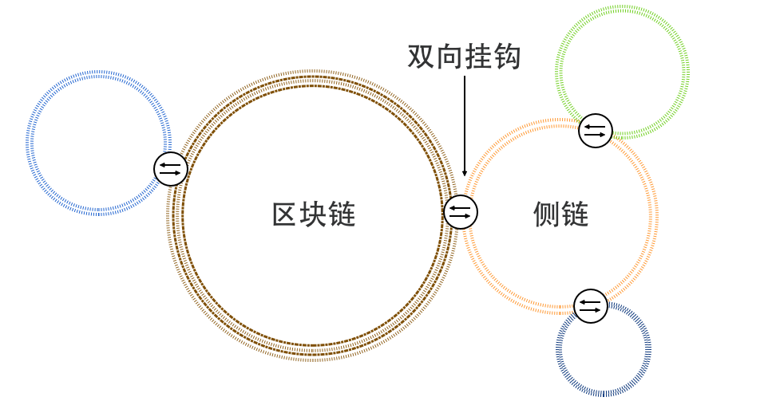
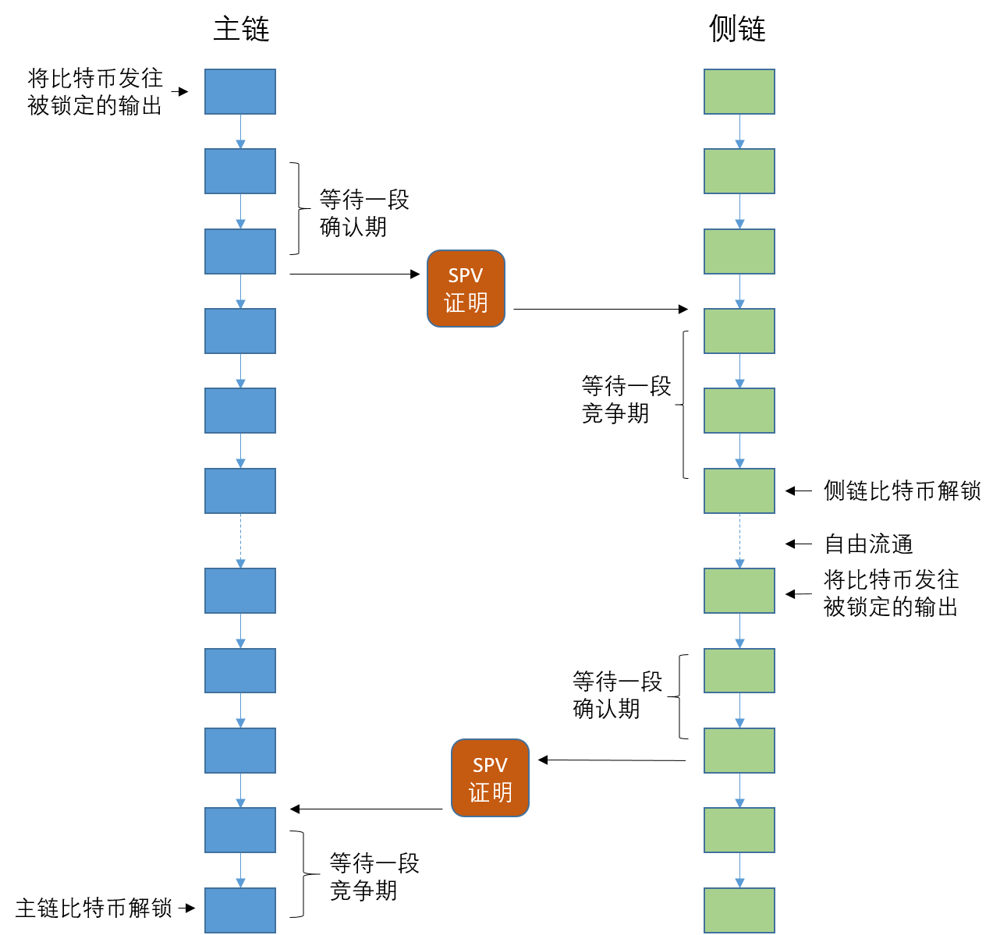

## 侧链

侧链（Sidechain）协议允许资产在比特币区块链和其他区块链之间互转。这一项目也来自比特币社区，最早是在 2013 年 12 月提出，2014 年 4 月立项，由 Blockstream 公司（由比特币核心开发者 Adam Back、Matt Corallo 等共同发起成立）主导研发。侧链协议于 2014 年 10 月在白皮书《Enabling Blockchain Innovations with Pegged Sidechains》中公开。

侧链诞生前，众多“山寨币”的出现正在碎片化整个数字货币市场，再加上以太坊等项目的竞争，一些比特币开发者希望能借助侧链的形式扩展比特币的底层协议。

简单来讲，以比特币区块链作为主链（Parent chain），其他区块链作为侧链，二者通过双向挂钩（Two-way peg），可实现比特币从主链转移到侧链进行流通。

侧链可以是一个独立的区块链，有自己按需定制的账本、共识机制、交易类型、脚本和合约的支持等。侧链不能发行比特币，但可以通过支持与比特币区块链挂钩来引入和流通一定数量的比特币。当比特币在侧链流通时，主链上对应的比特币会被锁定，直到比特币从侧链回到主链。可以看到，侧链机制可将一些定制化或高频的交易放到比特币主链之外进行，实现了比特币区块链的扩展。侧链的核心原理在于能够冻结一条链上的资产，然后在另一条链上产生，可以通过多种方式来实现。这里讲解 Blockstream 提出的基于简单支付验证（Simplified Payment Verification，SPV）证明的方法。

### SPV 证明

如前面章节所述，在比特币系统中验证交易时，涉及到交易合法性检查、双重花费检查、脚本检查等。由于验证过程需要完整的 UTXO 记录，通常要由运行着完整功能节点的矿工来完成。

而很多时候，用户只关心与自己相关的那些交易，比如当用户收到其他人号称发来的比特币时，只希望能够知道交易是否合法、是否已在区块链中存在了足够的时间（即获得足够的确认），而不需要自己成为完整节点做出完整验证。

中本聪设计的简单支付验证（Simplified Payment Verification，SPV）可以实现这一点。SPV 能够以较小的代价判断某个支付交易是否已经被验证过（存在于区块链中），以及得到了多少算力保护（定位包含该交易的区块在区块链中的位置）。SPV 客户端只需要下载所有区块的区块头（Block Header），并进行简单的定位和计算工作就可以给出验证结论。

侧链协议中，用 SPV 来证明一个交易确实已经在区块链中发生过，称为 SPV 证明（SPV Proof）。一个 SPV 证明包括两部分内容：一组区块头的列表，表示工作量证明；一个特定输出（output）确实存在于某个区块中的密码学证明。

### 双向挂钩

侧链协议的设计难点在于如何让资产在主链和侧链之间安全流转。简而言之，接受资产的链必须确保发送资产的链上的币被可靠锁定。

具体，协议采用双向挂钩机制实现比特币向侧链转移和返回。主链和侧链需要对对方的特定交易做 SPV 验证。完整过程如下：

* 当用户要向侧链转移比特币时，首先在主链创建交易，待转移的比特币被发往一个特殊的输出。这些比特币在主链上被锁定。
* 等待一段确认期，使得上述交易获得足够的工作量确认。
* 用户在侧链创建交易提取比特币，需要在这笔交易的输入指明上述主链被锁定的输出，并提供足够的 SPV 证明。
* 等待一段竞争期，防止双重花费攻击。
* 比特币在侧链上自由流通。
* 当用户想让比特币返回主链时，采取类似的反向操作。首先在侧链创建交易，待返回的比特币被发往一个特殊的输出。先等待一段确认期后，在主链用足够的对侧链输出的 SPV 证明来解锁最早被锁定的输出。竞争期过后，主链比特币恢复流通。

### 最新进展

侧链技术最早由 Blockstream 公司进行探索，于 2015 年 10 月联合合作伙伴发布了基于侧链的商业化应用 Liquid。

基于一年多的探索，Blockstream 于 2017 年 1 月发表文章《Strong Federations: An Interoperable Blockchain Solution to Centralized Third Party Risks》，被称为对侧链早期白皮书的补充和改良。白皮书中着重描述了联合挂钩（Federated Pegs）的相关概念和应用。

此外，还有一些其他公司或组织也在探索如何合理地应用侧链技术，包括 ConsenSys、Rootstock、Lisk 等。
