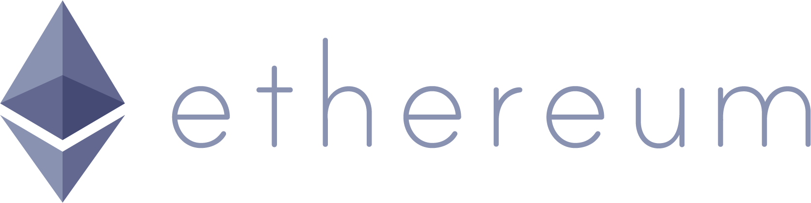

## 以太坊项目简介

以太坊（Ethereum）项目的最初目标，是打造一个运行智能合约的平台（Platform for Smart Contract）。该平台支持图灵完备的应用，按照智能合约的约定逻辑自动执行，理想情况下将不存在故障停机、审查、欺诈，以及第三方干预等问题。

以太坊平台目前支持 Golang、C++、Python 等多种语言实现的客户端。由于核心实现上基于比特币网络的核心思想进行了拓展，因此在很多设计特性上都与比特币网络十分类似。

基于以太坊项目，以太坊团队目前运营了一条公开的区块链平台——以太坊网络。智能合约开发者使用官方提供的工具和以太坊专用应用开发语言 Solidity，可以很容易开发出运行在以太坊网络上的“去中心化”应用（Decentralized Application，DApp）。这些应用将运行在以太坊的虚拟机（Ethereum Virtual Machine，EVM）里。用户通过以太币（Ether）来购买燃料（Gas），维持所部署应用的运行。

以太坊项目的官网网站为 [ethereum.org](https://ethereum.org)，代码托管在 [github.com/ethereum](github.com/ethereum)。

### 以太坊项目简史

相对比特币网络自 2009 年上线的历史，以太坊项目要年轻的多。

2013 年底，比特币开发团队中有一些开发者开始探讨将比特币网络中的核心技术，主要是区块链技术，拓展到更多应用场景的可能性。以太坊的早期发明者 Vitalik Buterin 提出应该能运行任意形式（图灵完备）的应用程序，而不仅仅是比特币中受限制的简单脚本。该设计思想并未得到比特币社区的支持，后来作为以太坊白皮书发布。

2014 年 2 月，更多开发者（包括 Gavin Wood、Jeffrey Wilcke 等）加入以太坊项目，并计划在社区开始以众筹形式募集资金，以开发一个运行智能合约的信任平台。

2014 年 7 月，以太币预售，经过 42 天，总共筹集到价值超过 1800 万美金的比特币。随后在瑞士成立以太坊基金会，负责对募集到的资金进行管理和运营；并组建研发团队以开源社区形式进行平台开发。

2015 年 7 月底，以太坊第一阶段 Frontier 正式发布，标志着以太坊区块链网络的正式上线。这一阶段采用类似比特币网络的 PoW 共识机制，参与节点以矿工挖矿形式维护网络；支持上传智能合约。Frontier 版本实现了计划的基本功能，在运行中测试出了一些安全上的漏洞。这一阶段使用者以开发者居多。

2016 年 3 月，第二阶段 Homestead 开始运行（区块数 1150000），主要改善了安全性，同时开始提供图形界面的客户端，提升了易用性，更多用户加入进来。

2016 年 6 月，DAO 基于以太坊平台进行众筹，受到漏洞攻击，造成价值超过 5000 万美金的以太币被冻结。社区最后通过硬分叉（Hard Fork）进行解决。

2017 年 3 月，以太坊成立以太坊企业级联盟（Enterprise Ethereum Alliance，EEA），联盟成员主要来自摩根大通，微软，芝加哥大学和部分创业企业等。

2017 年 11 月，再次暴露多签名钱包漏洞，造成价值 2.8 亿美元的以太币被冻结。

2020 年 12 月 1 日，以太坊信标链（Beacon Chain）正式上线，为后续向权益证明（PoS）共识机制的过渡奠定基础。用户可以开始质押以太币成为验证者。

2021 年 8 月，伦敦升级（London Upgrade）实施，引入 EIP-1559 提案，改变了以太坊的费用机制，部分交易费被销毁，使以太币具有通缩属性。

2022 年 9 月 15 日，以太坊完成历史性的"合并"（The Merge）升级，正式从工作量证明（PoW）转向权益证明（PoS）共识机制。这一升级使以太坊的能源消耗降低了超过 99%，被认为是区块链历史上最重要的技术里程碑之一。

2023 年 4 月 12 日，上海升级（Shanghai/Shapella）实施，允许质押者提取其质押的以太币。这解决了自信标链上线以来质押资产无法流动的问题，进一步完善了 PoS 机制。

2024 年 3 月 13 日，坎昆升级（Dencun）实施，引入 Proto-Danksharding（EIP-4844），通过"数据块"（Blob）机制大幅降低 Layer 2 网络的交易成本，为以太坊的扩展性提供了重要支持。

2024 年 5 月，美国 SEC 批准了以太坊现货 ETF，使以太坊成为继比特币之后第二个获得此类金融产品的加密货币。

目前，以太坊已成为全球最大的智能合约平台和 DeFi（去中心化金融）生态系统的核心基础设施，承载了数千个去中心化应用和数百亿美元的锁仓资产。

包括 DAO 在内，以太坊网络已经经历了多次重大升级，每次升级都为网络带来了重要的性能和功能改进。

### 主要特点

以太坊区块链底层也是一个类似比特币网络的 P2P 网络平台，智能合约运行在网络中的以太坊虚拟机里。网络自身是公开可接入的，任何人都可以接入并参与网络中数据的维护，提供运行以太坊虚拟机的资源。

跟比特币项目相比，以太坊区块链的技术特点主要包括：

* 支持图灵完备的智能合约，设计了编程语言 Solidity 和虚拟机 EVM；
* 采用账户系统和世界状态，而不是 UTXO，容易支持更复杂的逻辑；
* 通过 Gas 限制代码执行指令数，避免循环执行攻击；
* 采用权益证明（PoS）共识机制，验证者通过质押以太币参与网络共识，相比早期的 PoW 机制能耗降低超过 99%；
* 区块产生间隔约 12 秒，相比比特币的 10 分钟大幅提升了交易确认速度。

此外，以太坊通过 Layer 2 扩展方案（如 Optimistic Rollups 和 ZK Rollups）来解决网络可扩展性问题。2024 年的 Dencun 升级引入了 Proto-Danksharding，大幅降低了 Layer 2 网络的数据存储成本。主流的 Layer 2 项目包括 Arbitrum、Optimism、zkSync、Starknet 等。

这些技术特点，使以太坊成为了 DeFi、NFT 和各类去中心化应用的首选平台，生态系统规模远超其他智能合约平台。
