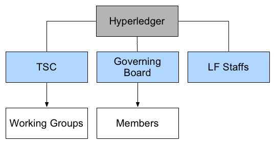

## 社区组织结构

每个成功的开源项目，都离不开一个健康开发、不断繁荣的社区生态。

超级账本社区自成立之日起就借鉴了众多开源社区组织的经验，形成了技术开发为主体、积极结合应用的体系结构。

超级账本社区的项目开发工作由技术委员会（Technical Steering Committee，TSC）指导，首任主席由来自 IBM 开源技术部门的 CTO Chris Ferris 担任；管理委员会主席则由来自 Digital Asset Holdings 的 CEO Blythe Masters 担任。另外，自 2016 年 5 月起，Apache 基金会创始人 Brian Behlendorf 担任超级账本项目的执行总监（Executive Director）。

社区十分重视大中华地区的应用落地和开发情况，2016 年 12 月，[中国技术工作组](ttps://wiki.hyperledger.org/display/TWGC) 正式成立，负责推动社区组织建设和开源技术的发展和应用。

### 基本结构

社区目前主要是三驾马车领导的结构：

* Technical Steering Committee
（技术委员会）：负责领导社区技术，指导各个开源项目的发展方向，下设多个技术工作组（Architecture、Identity、Learning Materials Development、Performance and Scale、Smart Contracts）和兴趣小组（Healthcare、Public Sector、Social Impact、Telecom、Trade Finance）。每年由社区开发者进行换届选举；
* Governing Board
（管理董事会）：负责整体社区的组织决策，从超级账本会员中推选出代表座位成员；
* Linux Foundation（Linux 基金会）：负责基金管理和大型活动组织，协助社区在 Linux 基金会的支持下健康发展。

### 大中华区技术工作组

随着开源精神和开源文化在中国的普及，越来越多的企业和组织开始意识到共建一个健康的生态系统的重要性，也愿意为开源事业做出一定贡献。

Linux 基金会和超级账本社区十分重视项目在大中华区的应用和落地情况，并希望能为开发者们贡献开源社区提供便利。在此背景下，超级账本首任执行董事 Brian Behlendorf 于 2016 年 12 月 1 日 [提议](https://lists.hyperledger.org/pipermail/hyperledger-tsc/2016-December/000504.html) 成立 [大中华区技术工作组（TWG-China）](https://wiki.hyperledger.org/groups/tsc/technical-working-group-china)，并得到了 TSC 成员们的一致支持和通过。笔者也有幸参与了工作组的创建，并担任联席主席。

技术工作组的 [主要职责](https://docs.google.com/document/d/1sXVltDZxnlB5Srd1A-EW0jtTz7P2cDLG8JmgaAYvMzU) 包括：

* 带领和引导大中华区的技术开发相关活动，包括贡献代码、文档、项目提案等。
* 推动技术相关的交流，促进会员企业之间的合作和实践案例的落地；
* 通过邮件列表、RocketChat、论坛等方式促进社区开发者们的技术交流；
* 协助举办社区活动，包括 Meetup、黑客松、Hackfest、技术分享、培训等。

目前，工作组由来自各个成员企业的数十名技术专家组成，并得到了来自社区的众多志愿者的支持。工作组每两周举行在线例会，每个月定期在各大城市举办技术交流沙龙，各项会议和活动内容都是开放的，可以在 Wiki 首页（https://wiki.hyperledger.org/display/TWGC）上找到相关参与方式。
