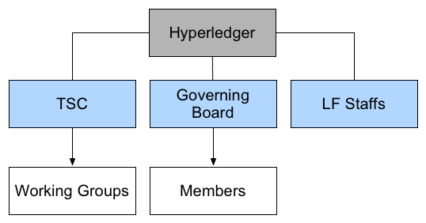

## 社区组织结构

每个成功的开源项目都离不开一个健康开发、不断繁荣的社区生态。

超级账本社区自成立之日起就借鉴了众多开源社区组织的经验，形成了技术开发为主体、积极结合应用的体系结构。2024 年 LF Decentralized Trust（LFDT）启动后，Hyperledger 相关项目纳入 LFDT 的治理框架。

LFDT 的组织治理由 Governing Board、Technical Advisory Council（TAC）、各项目自己的技术监督/维护者机制以及 Linux Foundation 支持团队共同构成。TAC 负责跨项目技术协作、总体技术愿景和项目生命周期评估；各项目的技术委员会或维护者团队负责本项目的日常技术方向和发布；Governing Board 负责 directed fund 的预算、规则和整体社区事务。

社区十分重视大中华地区的应用落地和开发情况，2016 年 12 月，[中国技术工作组](https://wiki.hyperledger.org/display/TWGC) 正式成立，负责推动社区组织建设和开源技术的发展和应用。

### 基本结构

社区目前主要是如下结构：

* Technical Advisory Council（TAC）：负责促进各技术项目之间的沟通协作，形成整体技术愿景，向预算相关委员会建议技术项目资源优先级，并评估项目生命周期状态。TAC 投票成员由项目维护者选举的代表和 Governing Board 选择的代表组成；
* 各项目技术委员会/维护者团队：负责单个项目的日常技术方向、开发流程、发布计划和维护者梯队；
* Governing Board（管理董事会）：负责 directed fund 的整体管理，包括预算、规则程序、社区事务、对外协作和必要的咨询机构设置；
* Linux Foundation（Linux 基金会）和 LFDT 支持团队：负责基金会运营、法律、基础设施、活动和社区支持，协助社区在开放治理框架下发展。

### 大中华区技术工作组

随着开源精神和开源文化在中国的普及，越来越多的企业和组织开始意识到共建一个健康生态系统的重要性，也愿意为开源事业做出一定贡献。

历史上，Hyperledger 社区于 2016 年 12 月成立大中华区技术工作组（TWG-China），负责推动区域社区组织建设、开源技术发展和应用落地。LFDT 启动后，区域参与方式随社区入口逐步迁移，当前参与方式应以 LFDT 的 Regional Chapters、Wiki、邮件列表和 Discord 等官方渠道为准。

技术工作组的 [主要职责](https://docs.google.com/document/d/1sXVltDZxnlB5Srd1A-EW0jtTz7P2cDLG8JmgaAYvMzU) 包括：

* 带领和引导大中华区的技术开发相关活动，包括贡献代码、文档、项目提案等。
* 推动技术相关的交流，促进会员企业之间的合作和实践案例的落地；
* 通过邮件列表、Discord、论坛和 Wiki 等方式促进社区开发者们的技术交流；
* 协助举办社区活动，包括 Meetup、黑客松、Hackfest、技术分享、培训等。

在运行期间，工作组由来自各个成员企业的技术专家组成，并得到了社区志愿者的支持。相关会议和活动内容通常保持开放；当前区域社区和技术交流入口请以 LFDT 官方网站、Wiki、邮件列表和 Discord 为准。
