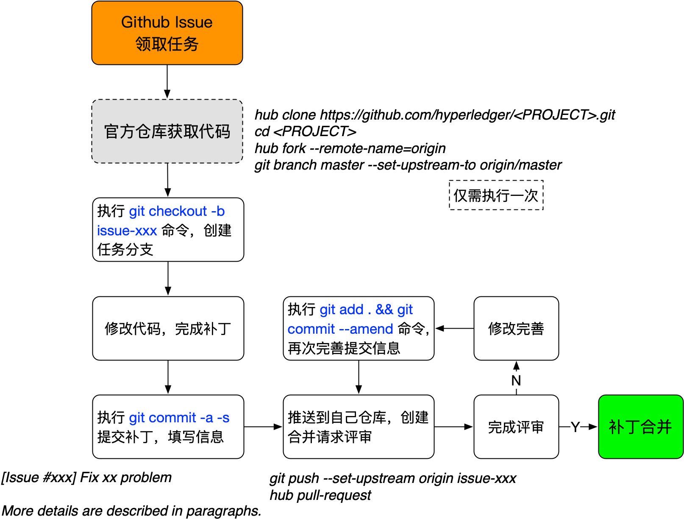

## 贡献代码

超级账本的各个子项目，都提供了十分丰富的开发和提交代码的指南和文档，一般可以在代码的 `docs` 目录下找到。所有项目都使用 Github 来管理代码和进行集成测试。

这里以 Fabric 项目为例讲解代码贡献流程。

### 安装环境

推荐在 Linux（如 Ubuntu 18.04+）或 macOS 环境中开发 Hyperledger 项目代码。

不同项目会依赖不同的环境，可以从项目文档中找到。以 Fabric 项目为例，开发者需要安装如下依赖。

* Git：用来从代码仓库获取代码并进行版本管理；
* Hub：Github 官方开发的基于 Git 命令的工具，可以替代 Git 命令，更方便操作 Github 仓库；
* Golang 1.21+：访问 [go.dev](https://go.dev) 进行安装，现代 Go 使用 Go Modules 管理依赖，无需配置 GOPATH；
* Docker 24+：用来支持容器环境，macOS 下推荐使用 [Docker Desktop](https://www.docker.com/products/docker-desktop)。

如果是首次使用 Git，可能还会提示配置默认的用户名和 Email 地址等信息。通过如下命令进行简单配置即可：

```bash
$ git config user.name "Your name"
$ git config user.email "Your-addr@some-email-server"
```

安装 hub 工具，方便与 Github 的仓库进行交互。

Linux 下可以直接从 https://github.com/github/hub/releases 下载工具使用。

macOS 下可以通过 homebrew 工具来安装：

```bash
$ brew install hub
```

### 获取代码

如果没有 Linux Foundation（LF）ID，可通过 https://identity.linuxfoundation.org 免费注册。

注册并登录 Github 个人账号，添加个人 ssh 公钥，否则每次访问仓库可能需要手动输入用户名和密码。

开启双重验证（Two-factor authentication，2FA）后，在 https://github.com/hyperledger 页面申请加入到社区组织内。

如果是首次下载项目，则需要从官方仓库获取源码，然后 fork 到自己的仓库中：

```sh
$ hub clone https://github.com/hyperledger/<PROJECT>.git
$ cd <PROJECT>
$ hub fork --remote-name=origin
$ git branch master --set-upstream-to origin/master
```

此时，项目下会包括两个仓库：

* `origin` 仓库：会指向用户仓库。master 分支会追踪本仓库；
* `upstream` 仓库：会指向官方仓库，供后续同步更新使用。

### 编译和测试

大部分编译和安装过程都可以利用 Makefile 来执行，具体以项目代码为准。

以 Fabric 项目为例，包括如下常见操作。

#### 生成命令文档

执行如下命令：

```sh
$ make help-docs
```

#### 安装 go tools

执行如下命令：

```sh
$ make gotools
```

#### 语法格式检查

执行如下命令：

```sh
$ make linter
```

#### 编译二进制文件

执行如下命令：

```sh
$ make native
```

会自动生成 orderer、peer、configtxgen、configtxlator、cryptogen、doscover、idemixgen 等可执行文件。

用户也可以使用对应的可执行文件名称来单独编译，例如，执行如下命令会自动编译生成 Docker 镜像，并生成本地 peer 可执行文件：

```sh
$ make peer
```

*注意：有时会因网络不稳定而报错，可以进行 `make clean` 后再次执行。*

#### 生成 Docker 镜像

执行如下命令：

```sh
$ make docker
```

#### 执行所有的检查和测试

执行如下命令：

```sh
$ make checks
```

#### 执行单元测试

执行如下命令： 

```sh
$ make unit-test
```

如果要运行某个特定单元测试，则可以通过类似如下格式：

```sh
$ go test -v -run=TestGetFoo
```

### 提交代码

使用 LF ID 登录 [jira.hyperledger.org](http://jira.hyperledger.org) 或 Github Issue，查看有没有未分配（unassigned）的任务，如果对某个任务感兴趣，可以添加自己为任务的 assignee。任何人都可以自行创建新的任务。如果是较大的特性，还需要先撰写 rfc 来描述设计，可以参考 https://github.com/hyperledger/fabric-rfcs。

初始创建的任务处于 `TODO` 状态；开始工作后可以标记为 `In Progress` 状态；提交对应补丁后需要更新为 `In Review` 状态；任务完成后更新为 `Done` 状态。

如果希望完成某个任务（如 FAB-XXX），则在 Clone 下来的代码上创建新的分支 FAB-XXX：

```sh
$ git checkout -b FAB-XXX
```

实现任务代码，完成后，执行语法格式检查和测试等，确保所有检查和测试都通过。

提交代码到本地仓库：

```sh
$ git commit -a -s
```

会自动打开一个编辑器窗口，需要填写 commit 信息，格式一般要求如下：

```bash
[FAB-XXX] Quick brief on the change

This pathset fixes a duplication msg bug in gossip protocol.

A more detailed description can be here, with several paragraphs and 
sentences, including issue to fix, why to fix, what is done in the 
patchset and potential remaining issues...
```

提交消息中要写清楚所解决的问题、为何进行修改、主要改动内容、遗留问题等，并且首行宽不超过 50 个字符，详情段落行宽不要超过 72 个字符。

将代码所在的分支推送到 Github 上自己的仓库中，例如：

```bash
$ git push --set-upstream origin FAB-XXX
```

创建合并请求（Pull Request），例如：

```bash
$ hub pull-request [-b upstream:master] [-r <REVIEWERS> ]
```

### 评审代码

提交成功后，可以打开项目在 Github 上的页面，查看自己最新提交的合并请求。新提交的请求会自动触发 CI 的测试任务，测试都通过后可邀请项目的维护者（maintainer）进行评审。为了引起关注，可将链接添加到对应的 Jira 任务，并在 RocketChat 上对应项目频道内贴出。

如果评审通过，则会被合并到主分支；否则还需要针对审阅意见进一步的修正。修正过程跟提交代码过程类似，唯一不同是，提交时需要添加 `-a --amend` 参数：

```sh
$ git commit -a --amend
```

表示这个提交是对旧提交的一次修订。

一般情况下，为了方便评审，尽量保证每个 patchset 完成的改动不要太多（最好不要超过 5 个文件，200 行），并且实现功能要明确，集中在对应 Jira 任务定义的范围内。

补丁被接收后可以删除对应的分支：

```bash
$ git fetch upstream master && git rebase FETCH_HEAD && git push -f origin
$ git push -d origin issue-xxx
$ git branch -d issue-xxx
```

### 完整流程



总结一下，完整的流程如上图所示，开发者用 git 进行代码的版本管理，用 gerrit 进行代码的评审合作。

如果需要修复某个提交补丁的问题，则通过 `git commit -a --amend` 进行修复，并作为补丁的新版本再次提交审阅。每次通过 `git review` 提交时，应当通过 `git log` 查看，确保本地只有一条提交记录。
