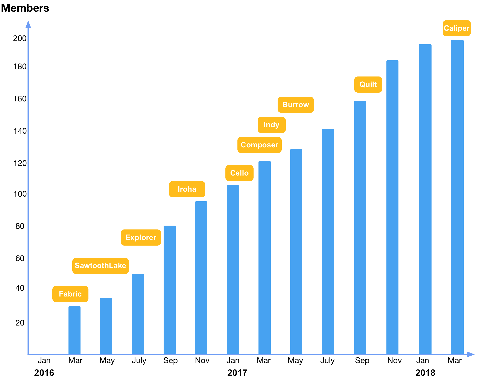

## 超级账本项目简介

2015 年 12 月，开源世界的旗舰组织 —— [Linux 基金会](https://www.linuxfoundation.org) 宣布启动超级账本（Hyperledger）联合项目；2016 年 2 月 9 日，[公布](https://www.hyperledger.org/news/announcement/2016/02/hyperledger-project-announces-30-founding-members) 了 30 家创始企业成员（包括 IBM、Accenture、Intel、J.P.Morgan、R3、DAH、DTCC、FUJITSU、HITACHI、SWIFT、Cisco 等）。2024 年 9 月 16 日，Linux 基金会正式启动 [LF Decentralized Trust](https://www.lfdecentralizedtrust.org/announcements/linux-foundation-decentralized-trust-launches-with-17-projects-100-founding-members)，将 Hyperledger Foundation、Trust Over IP 等社区纳入更大的去中心化信任技术伞形组织；Hyperledger 相关技术成为 LFDT 项目，项目官方网站和目录以 [lfdecentralizedtrust.org](https://www.lfdecentralizedtrust.org/projects) 为准。

成立之初，项目就收到了众多开源技术贡献。IBM 贡献了 4 万多行已有的 [Open Blockchain](https://github.com/openblockchain) 代码，Digital Asset 贡献了企业和开发者相关资源，R3 贡献了新的金融交易架构，Intel 贡献了分布式账本相关的代码。

作为 LFDT 旗下的项目集合，超级账本由面向不同目的和场景的子项目构成。官方项目目录按孵化、毕业、休眠、归档等生命周期维护清单；代表性项目包括 Fabric、Besu、Cacti、FireFly、Indy、Iroha、AnonCreds、Identus、Web3j 等。Sawtooth 和 Aries 不应再作为活跃项目介绍：Sawtooth 已归档，并于 2024 年 2 月应维护者请求停止在 Hyperledger 社区内继续活跃维护，Aries 官方页面已标记为归档。所有项目都遵守 Apache v2 许可，并约定共同遵守如下的 [基本原则](https://github.com/hyperledger/hyperledger)：

* 重视模块化设计：包括交易、合同、一致性、身份、存储等技术场景；
* 重视代码可读性：保障新功能和模块都可以很容易添加和扩展；
* 可持续的演化路线：随着需求的深入和更多的应用场景，不断增加和演化新的项目。

*注：部分早期项目如 Composer、Quilt、Ursa、Avalon 等已归档或停止维护。当前状态请以 LFDT 项目目录、项目页面和治理站点为准，本章不再沿用早期“活跃/退出/终结”标签描述项目生命周期。*

超级账本项目的企业会员和技术项目发展都十分迅速，如下图所示（图示数据仅供参考，最新信息请访问官网）。

社区拥有数百家全球知名企业和机构会员，其中包括大量来自中国本土的企业，如华为、百度、腾讯等行业领军企业。此外，还有大量机构和高校成为超级账本联合会员，如英格兰银行、MIT 连接科学研究院、UCLA 区块链实验室、北京大学、浙江大学等。

如果说比特币为代表的加密货币提供了区块链技术应用的原型，以太坊为代表的智能合约平台延伸了区块链技术的适用场景，那么面向企业场景的超级账本项目则开拓了区块链技术的全新阶段。超级账本首次将区块链技术引入到了联盟账本的应用场景，引入权限控制和安全保障，这就为基于区块链技术的未来全球商业网络打下了坚实的基础。

超级账本项目的出现，实际上证实区块链技术已经不局限在单一应用场景中，也不限于完全开放匿名的公有链模式下，而是有更多的可能性，也说明区块链技术已经被主流企业市场正式认可和实践。同时，超级账本项目中提出和实现了许多创新的设计和理念，包括权限和审查管理、多通道、细粒度隐私保护、背书-共识-提交模型，以及可拔插、可扩展的实现框架，对于区块链相关技术和产业的发展都将产生十分深远的影响。

*注：Apache v2 许可协议是商业友好的知名开源协议，鼓励代码共享，尊重原作者的著作权，允许对代码进行修改和再发布（作为开源或商业软件）。因其便于商业公司使用而得到业界的拥护。*
