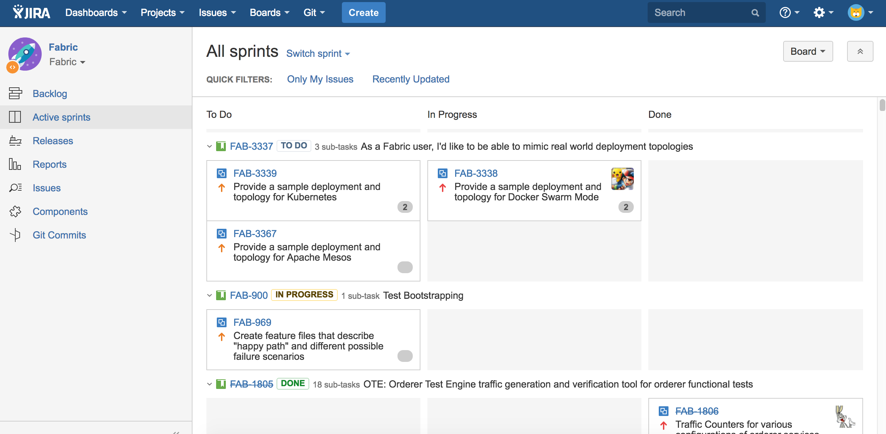
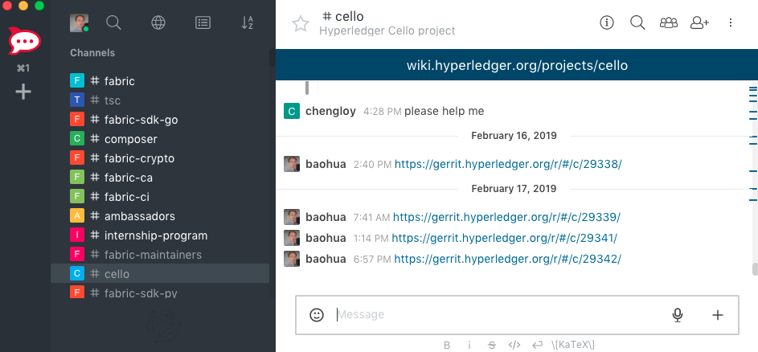

## 开发必备工具

工欲善其事，必先利其器。开源社区提供了大量易用的开发协作工具。掌握好这些工具，对于高效的开发来说十分重要。

### Linux Foundation ID

超级账本项目受到 Linux 基金会的支持，采用 Linux Foundation ID（LF ID）作为社区唯一的 ID。

个人申请 ID 是完全免费的。可以到 https://identity.linuxfoundation.org/ 进行注册。

用户使用该 ID 可访问 Linux Foundation 相关社区资源。Hyperledger 的协作工具已经迁移，当前问题跟踪和代码协作以 GitHub 为主，实时交流入口以 Hyperledger Discord 为主；Jira、RocketChat 仅作为历史工具理解。

### GitHub Issues - 任务和进度管理

Hyperledger 早期使用 Jira 管理任务和事项。当前开发应优先查看对应项目的 GitHub 仓库、Issues 和 Pull Requests。

社区组织入口可从 <https://github.com/hyperledger> 开始，再进入具体项目仓库查看当前事项。

登录 GitHub 后，可以在具体项目的 Issues 页面搜索、认领或创建 bug、task、improvement 等事项。

用户打开事项后可以通过评论、关联 PR 或维护者分配来推进该事项。

一般情况下，事项状态通过 labels、assignees、milestones、project board 或关联 PR 维护，具体约定以项目仓库的贡献说明为准。

### Github - 代码仓库和 Review 管理

Github 是全球最大的开源代码管理仓库服务，微软公司于 2018 年 7 月以 75 亿美金价格纳入旗下。

超级账本社区目前所有项目都通过 Github 进行管理。早期 Fabric、Cello、Explorer 等项目采用了自建的 Gerrit 服务作为官方的代码仓库，2019 年下半年也都陆续迁移到了 Github 服务器上。

用户使用自己的账号登录之后，可以查看所有项目信息，也可以查看自己提交的补丁等信息。每个补丁的页面上会自动追踪修改历史，审阅人可以通过页面进行审阅操作，赞同提交则可以批准，发现问题则可以进行批注。

### Discord - 在线沟通

除了邮件列表外，社区也为开发者们提供在线沟通渠道。Hyperledger 已从 RocketChat 迁移到 Discord。

Discord 支持网页、桌面端和移动端，可用于项目讨论、工作组沟通和新人提问。

当前入口仍可从 <https://chat.hyperledger.org/> 进入，它会指向 Hyperledger Discord。加入后可以选择感兴趣项目的频道。

通常，每个项目或工作组会有对应频道，频道名称和规则以 Discord 服务器当前配置为准。

### 邮件列表 - 常见渠道

各个项目和工作组都建立了专门的邮件列表，作为常见的交流渠道。当发现问题不知道往哪里报告时，可以先发到邮件列表进行询问，一般都能获得及时的回答。

例如，大中华区技术工作组的频道为 `twg-china@lists.hyperledger.org`。

用户在 https://lists.hyperledger.org/g/main/subgroups 看到社区已有的邮件列表并选择加入。

### 提问的智慧

为什么我在社区提出的问题会过了很长时间也无人回应？

开源社区是松散自组织形式，大部分开发者都是利用业余时间进行开发和参与社区工作。因此，在社区提出问题时就必须要注意问题的质量和提问的方式。碰到上述情况，首先要先从自身找原因。

如果能做到下面几点，会使你提出的问题得到更多的关注：

* 正确的渠道：这点十分重要。不同项目和领域有各自的渠道，一定要在相关的渠道进行提问，而不要问跟列表主题不相关的话题，例如，每个项目相关问题应该发送到对应的邮件列表。
* 问题的新颖性：在提问之前，应该利用包括搜索引擎、技术文档、邮件列表等常见方式进行查询，确保提出的问题是新颖的，有价值的，而不是已经被回答过多遍的常识性问题。
* 适当的上下文：不少提问者的问题中只包括一条很简单的错误信息，这样会让社区的开发者有心帮忙也无力回答。良好的上下文包括完整的环境信息、所使用的软件版本、所进行操作的详细步骤、问题相关的日志、自己对问题的思考等。这些都可以帮助他人快速重现问题并帮忙回答。
* 注意礼仪：虽然技术社区里大家沟通方式会更为直接一些，但懂得礼仪毫无疑问是会受到欢迎的。要牢记，别人的帮助并非是义务的，要对任何来自他人的帮助心存感恩。
