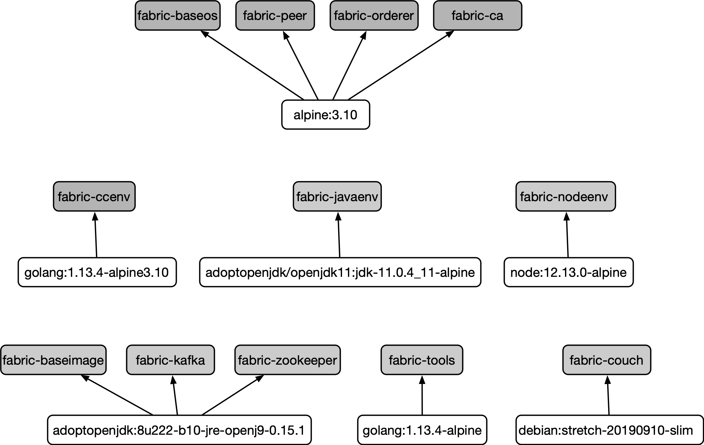

## 容器方式获取

除了手动进行本地编译外，还可以采用容器（Docker）镜像的方式快速获取和运行 Fabric 网络，节约本地编译等待的时间。

### 安装 Docker 服务

Docker 支持 Linux 常见的发行版（如 Redhat/Centos/Ubuntu）和 MacOS 等，推荐使用 1.18 或者更新的版本。

Linux 操作系统下可以通过如下命令来快速安装 Docker：

```sh
$ curl -fsSL https://get.docker.com/ | sh
```

Ubuntu 18.04 中默认采用了 systemd 管理启动服务，配置文件在 `/lib/systemd/system/docker.service`。

对服务配置修改后，需要通过如下命令重启 Docker 服务：

```sh
$ sudo systemctl daemon-reload
$ sudo systemctl restart docker.service
```

对于使用 upstart 管理启动服务的操作系统（如旧版本的 Ubuntu、Debian），则可以采用如下命令重启 Docker 服务：

```sh
$ sudo service docker restart
```

MacOS 下可以通过访问 https://docs.docker.com/docker-for-mac/install 下载 Docker for Mac 安装包进行安装，在此不再赘述。

### 安装 docker-compose
docker-compose 是 Docker 官方推出的服务模板引擎，可以快速管理由多个 Docker 容器组成的服务。

首先，安装 python-pip 软件包：

```sh
$ sudo aptitude install python-pip
```

安装 docker-compose（推荐为 1.10.0 及以上版本）：

```sh
$ sudo pip install docker-compose>=1.10.0
```

### 获取 Docker 镜像

Docker 镜像可以自行从源码编译，或通过从 DockerHub 仓库下载等方式。

目前，Fabric 项目相关的 Docker 镜像有十几个，这些镜像都在 `hyperledger` 仓库中，它们之间的相互依赖关系如下图所示。



从用途上，可以可以大致分为三类：核心镜像、辅助镜像和第三方镜像。

#### 核心镜像

提供 Fabric 网络运行的核心功能，目前包括 fabric-peer、fabric-orderer、fabric-ca、fabric-baseos、fabric-ccenv、fabric-javaenv、fabric-nodeenv 共 7 种镜像。如下表所示。

镜像名称 | 父镜像 | 功能描述
 -- | -- | --
fabric-peer | alpine:3.10 | peer 节点镜像，安装了 peer 相关文件。生成过程使用 golang:1.13.4-alpine3.10 镜像。
fabric-orderer | alpine:3.10 | orderer 节点镜像，安装了 orderer 相关文件。生成过程使用 golang:1.13.4-alpine3.10 镜像。
fabric-ca | alpine:3.10 | fabric-ca 镜像，安装了 fabric-ca 相关文件。生成过程使用 golang:1.13.4-alpine 镜像。
fabric-baseos | alpine:3.10 | 基础镜像，用来生成其它镜像（包括 Peer、Orderer、fabric-ca），并作为 Go 链码的默认运行时镜像。
fabric-ccenv | golang:1.13.4-alpine3.10 | 支持 Go 语言的链码基础镜像，其中安装了 g++、gcc、git、musl-dev 等，并创建 chaincode 存放目录。在链码实例化过程中作为默认编译环境将链码编译为二进制文件。
fabric-javaenv | adoptopenjdk/openjdk11:jdk-11.0.4_11-alpine |支持 Java 语言的链码基础镜像，其中安装了 Gradle、Maven、Java 链码 shim 层等，作为 Java 链码的默认运行时镜像。
fabric-nodeenv | node:12.13.0-alpine | 支持 Node.Js 语言的链码基础镜像，其中安装了 make、python、g++。在链码实例化过程中作为默认编译环境生成 Node.Js 链码镜像，同时作为 Node.Js 链码运行环境。

#### 辅助镜像

提供支持功能，目前包括 fabric-baseimage、fabric-tools 镜像。如下表所示。

镜像名称 | 父镜像 | 功能描述
 -- | -- | --
fabric-baseimage | adoptopenjdk:8u222-b10-jdk-openj9-0.15.1 | 基础镜像，安装了 wget、Golang、Node.JS、Python、Protocol buffer 支持等，用来生成其它镜像。作为运行时可以用来生成 Node.Js 链码镜像。
fabric-tools | golang:1.13.4-alpine |安装了 bash、jq、peer、cryptogen、configtxgen 等常见命令，可以作为测试客户端使用。

#### 第三方镜像

主要是一些第三方开源软件，提供支持功能，目前包括 coudhdb、kafka、zookeeper 共 3 种镜像。如下表所示。

镜像名称 | 父镜像 | 功能描述
 -- | -- | --
fabric-couchdb | debian:stretch-20190910-slim | couchdb 镜像，可以启动 couchdb 服务，供 peer 使用。
fabric-kafka | adoptopenjdk:8u222-b10-jre-openj9-0.15.1 | kafka 镜像，可以启动 kafka 服务，供 orderer 在 kafka 模式下使用。已经不再支持。
fabric-zookeeper | adoptopenjdk:8u222-b10-jre-openj9-0.15.1 | zookeeper 镜像，可以启动 zookeeper 服务，供 orderer 在 kafka 模式下使用。已经不再支持。

#### 从源码生成镜像

可以通过如下命令在本地快速生成包括 fabric-baseos、fabric-peer、fabric-orderer、fabric-ccenv、fabric-tools 等多个 Docker 镜像：

```bash
$ make docker
```

注意，从源码直接生成的镜像，除了版本标签外，还会带有所编译版本快照信息的标签，例如 `amd64-2.0.0-snapshot123456`。

#### 从 Dockerhub 获取镜像

除了从源码编译外，还可以直接从 Dockerhub 来拉取相关的镜像，命令格式为 `docker pull <IMAGE_NAME:TAG>`。

例如，从社区仓库直接获取 fabric-peer、fabric-orderer、fabric-ca、fabric-tools 等镜像的 2.0.0 版本可以使用如下命令：

```bash
$ ARCH=amd64
$ BASEIMAGE_RELEASE=0.4.18
$ PROJECT_VERSION=2.0.0

# 拉取镜像
$ docker pull hyperledger/fabric-peer:$ARCH-$PROJECT_VERSION \
  && docker pull hyperledger/fabric-orderer:$ARCH-$PROJECT_VERSION \
  && docker pull hyperledger/fabric-ca:$ARCH-$PROJECT_VERSION \
  && docker pull hyperledger/fabric-tools:$ARCH-$PROJECT_VERSION \
  && docker pull hyperledger/fabric-ccenv:$ARCH-$PROJECT_VERSION \
  && docker pull hyperledger/fabric-baseimage:$ARCH-$BASEIMAGE_RELEASE \
  && docker pull hyperledger/fabric-baseos:$ARCH-$PROJECT_VERSION
```

此外，还可以从第三方仓库获取镜像，拉取后可以添加默认的镜像标签别名。

例如，笔者仓库中构建了基于 Golang 基础镜像的相关 fabric 镜像，可以通过如下命令获取：

```bash

# 拉取镜像
$ docker pull yeasy/hyperledger-fabric-base:$PROJECT_VERSION \
  && docker pull yeasy/hyperledger-fabric-peer:$PROJECT_VERSION \
  && docker pull yeasy/hyperledger-fabric-orderer:$PROJECT_VERSION \
  && docker pull yeasy/hyperledger-fabric-ca:$PROJECT_VERSION

# 添加标签
$ docker tag yeasy/hyperledger-fabric-peer:$PROJECT_VERSION hyperledger/fabric-peer:$ARCH-$PROJECT_VERSION \
  && docker tag yeasy/hyperledger-fabric-orderer:$PROJECT_VERSION hyperledger/fabric-orderer:$ARCH-$PROJECT_VERSION \
  && docker tag yeasy/hyperledger-fabric-ca:$PROJECT_VERSION hyperledger/fabric-ca:$ARCH-$PROJECT_VERSION \
  && docker tag yeasy/hyperledger-fabric-peer:$PROJECT_VERSION hyperledger/fabric-tools:$ARCH-$PROJECT_VERSION \
  && docker tag yeasy/hyperledger-fabric-base:$PROJECT_VERSION hyperledger/fabric-ccenv:$ARCH-$PROJECT_VERSION \
  && docker tag yeasy/hyperledger-fabric-base:$PROJECT_VERSION hyperledger/fabric-baseimage:$ARCH-$BASEIMAGE_RELEASE \
  && docker tag yeasy/hyperledger-fabric-base:$PROJECT_VERSION hyperledger/fabric-baseos:$ARCH-$PROJECT_VERSION
```

*注：BASEIMAGE_RELEASE 是基础镜像 fabric-baseimage 的版本号；PROJECT_VERSION 是具体版本号。这些版本号需要跟所使用的 Fabric 配置中保持一致。*

### 镜像 Dockerfile

读者也可自行通过编写 Dockerfile 的方式来生成相关镜像。

Dockerfile 中指令跟本地编译过程十分类似，这里给出笔者编写的 fabric-base 镜像、fabric-orderer 镜像和 fabric-peer 镜像等关键镜像的 Dockerfile，供读者参考使用。

#### fabric-base 镜像

笔者提供的 fabric-base 镜像基于 golang:1.13 镜像生成，可以作为 Go 链码容器的基础镜像。该镜像中包含了 Fabric 相关的代码，并安装了一些有用的工具，包括 gotools、 configtxgen、configtxlator、cryptogen、discover、token、idemixgen 等。

该 Dockerfile 内容如下，也可从 https://github.com/yeasy/docker-hyperledger-fabric-base 下载获取：

```yaml
# https://github.com/yeasy/docker-hyperledger-fabric-base
#
# Dockerfile for Hyperledger fabric base image.
# If you only need quickly deploy a fabric network, please see
# * yeasy/hyperledger-fabric-peer
# * yeasy/hyperledger-fabric-orderer
# * yeasy/hyperledger-fabric-ca

# Workdir is set to $GOPATH/src/github.com/hyperledger/fabric
# Data is stored under /var/hyperledger/production

FROM golang:1.13
LABEL maintainer "Baohua Yang <yeasy.github.com>"

ENV DEBIAN_FRONTEND noninteractive

# Only useful for this Dockerfile
ENV FABRIC_ROOT=$GOPATH/src/github.com/hyperledger/fabric
ENV CHAINTOOL_RELEASE=1.1.3

# version for the base images (baseos, baseimage, ccenv, etc.)
ENV BASEIMAGE_RELEASE=0.4.18
# BASE_VERSION is used in metadata.Version as major version
ENV BASE_VERSION=2.0.0
# PROJECT_VERSION is required in core.yaml for fabric-baseos and fabric-ccenv
ENV PROJECT_VERSION=2.0.0
# generic golang cc builder environment (core.yaml): builder: $(DOCKER_NS)/fabric-ccenv:$(ARCH)-$(PROJECT_VERSION)
ENV DOCKER_NS=hyperledger
# for golang or car's baseos for cc runtime: $(BASE_DOCKER_NS)/fabric-baseos:$(ARCH)-$(BASEIMAGE_RELEASE)
ENV BASE_DOCKER_NS=hyperledger
ENV LD_FLAGS="-X github.com/hyperledger/fabric/common/metadata.Version=${PROJECT_VERSION} \
              -X github.com/hyperledger/fabric/common/metadata.BaseDockerLabel=org.hyperledger.fabric \
              -X github.com/hyperledger/fabric/common/metadata.DockerNamespace=hyperledger \
              -X github.com/hyperledger/fabric/common/metadata.BaseDockerNamespace=hyperledger"

# -X github.com/hyperledger/fabric/common/metadata.Experimental=true \
# -linkmode external -extldflags '-static -lpthread'"

# Peer config path
ENV FABRIC_CFG_PATH=/etc/hyperledger/fabric
RUN mkdir -p /var/hyperledger/production \
        $GOPATH/src/github.com/hyperledger \
        $FABRIC_CFG_PATH \
        /chaincode/input \
        /chaincode/output

# Install development dependencies
RUN apt-get update \
        && apt-get install -y apt-utils python-dev \
        && apt-get install -y libsnappy-dev zlib1g-dev libbz2-dev libyaml-dev libltdl-dev libtool \
        && apt-get install -y python-pip \
        && apt-get install -y vim tree jq unzip \
        && rm -rf /var/cache/apt

# Install chaintool
#RUN curl -L https://github.com/hyperledger/fabric-chaintool/releases/download/v0.10.3/chaintool > /usr/local/bin/chaintool \
RUN curl -fL https://nexus.hyperledger.org/content/repositories/releases/org/hyperledger/fabric/hyperledger-fabric/chaintool-${CHAINTOOL_RELEASE}/hyperledger-fabric-chaintool-${CHAINTOOL_RELEASE}.jar > /usr/local/bin/chaintool \
        && chmod a+x /usr/local/bin/chaintool

# install gotools
RUN go get github.com/golang/protobuf/protoc-gen-go \
        && go get github.com/maxbrunsfeld/counterfeiter \
        && go get github.com/axw/gocov/... \
        && go get github.com/AlekSi/gocov-xml \
        && go get golang.org/x/tools/cmd/goimports \
        && go get golang.org/x/lint/golint \
        && go get github.com/estesp/manifest-tool \
        && go get github.com/client9/misspell/cmd/misspell \
        && go get github.com/estesp/manifest-tool \
        && go get github.com/onsi/ginkgo/ginkgo

# Clone the Hyperledger Fabric code and cp sample config files
RUN cd $GOPATH/src/github.com/hyperledger \
        && wget https://github.com/hyperledger/fabric/archive/v${PROJECT_VERSION}-beta.zip \
        && unzip v${PROJECT_VERSION}-beta.zip \
        && rm v${PROJECT_VERSION}-beta.zip \
        && mv fabric-${PROJECT_VERSION}-beta fabric \
        && echo "*                hard    nofile          65536" >> /etc/security/limits.conf \
        && echo "*                soft    nofile          65536" >> /etc/security/limits.conf \
        && cp -r $FABRIC_ROOT/sampleconfig/* $FABRIC_CFG_PATH/

# Add external farbric chaincode dependencies
RUN go get github.com/hyperledger/fabric-chaincode-go/shim \
        && go get github.com/hyperledger/fabric-protos-go/peer

# Install configtxgen, cryptogen, configtxlator, discover and idemixgen
RUN cd $FABRIC_ROOT/ \
        && CGO_CFLAGS=" " go install -tags "" github.com/hyperledger/fabric/cmd/configtxgen \
        && CGO_CFLAGS=" " go install -tags "" github.com/hyperledger/fabric/cmd/cryptogen \
        && CGO_CFLAGS=" " go install -tags "" github.com/hyperledger/fabric/cmd/configtxlator \
        && CGO_CFLAGS=" " go install -tags "" -ldflags "-X github.com/hyperledger/fabric/cmd/discover/metadata.Version=2.0.0" github.com/hyperledger/fabric/cmd/discover \
#&& CGO_CFLAGS=" " go install -tags "" -ldflags "-X github.com/hyperledger/fabric/cmd/token/metadata.Version=2.0.0" github.com/hyperledger/fabric/cmd/token \
        && CGO_CFLAGS=" " go install -tags "" github.com/hyperledger/fabric/cmd/idemixgen

# The data and config dir, can map external one with -v
VOLUME /var/hyperledger

# Temporarily fix the `go list` complain problem, which is required in chaincode packaging, see core/chaincode/platforms/golang/platform.go#GetDepoymentPayload
ENV GOROOT=/usr/local/go

WORKDIR $FABRIC_ROOT

# This is only a workaround for current hard-coded problem when using as the fabric-baseimage.
RUN ln -s $GOPATH /opt/gopath

LABEL org.hyperledger.fabric.version=${PROJECT_VERSION} \
      org.hyperledger.fabric.base.version=${BASEIMAGE_RELEASE}

```

该镜像也可以用作替代 `hyperledger/fabric-baseimage:latest` 镜像。

#### fabric-orderer 镜像

fabric-orderer 镜像基于 fabric-base 生成，编译安装了 orderer 组件。

参考 Dockerfile 内容如下，可从 https://github.com/yeasy/docker-hyperledger-fabric-orderer 下载获取：

```yaml
# https://github.com/yeasy/docker-hyperledger-fabric-orderer
#
# Dockerfile for Hyperledger fabric-orderer image.

FROM yeasy/hyperledger-fabric-base:2.0.0
LABEL maintainer "Baohua Yang <yeasy.github.com>"

EXPOSE 7050

ENV ORDERER_GENERAL_LOCALMSPDIR $FABRIC_CFG_PATH/msp
ENV ORDERER_GENERAL_LISTENADDRESS 0.0.0.0
# ENV CONFIGTX_ORDERER_ORDERERTYPE=etcdraft

RUN mkdir -p $FABRIC_CFG_PATH $ORDERER_GENERAL_LOCALMSPDIR

# Install fabric orderer
RUN CGO_CFLAGS=" " go install -tags "" -ldflags "$LD_FLAGS" github.com/hyperledger/fabric/cmd/orderer \
        && go clean

CMD ["orderer", "start"]
```

#### fabric-peer 镜像

fabric-peer 镜像基于 fabric-base 生成，编译安装了 peer 命令。

Dockerfile 内容如下，可从 https://github.com/yeasy/docker-hyperledger-fabric-peer 下载获取：

```yaml
# https://github.com/yeasy/docker-hyperledger-fabric-peer
#
# Dockerfile for Hyperledger peer image. This actually follow yeasy/hyperledger-fabric
# image and add default start cmd.
# Data is stored under /var/hyperledger/production

FROM yeasy/hyperledger-fabric-base:2.0.0
LABEL maintainer "Baohua Yang <yeasy.github.io>"

# Peer
EXPOSE 7051

# ENV CORE_PEER_MSPCONFIGPATH $FABRIC_CFG_PATH/msp

# Install fabric peer
RUN CGO_CFLAGS=" " go install -tags "" -ldflags "$LD_FLAGS" github.com/hyperledger/fabric/cmd/peer \
        && go clean
 
# First need to manually create a chain with `peer channel create -c test_chain`, then join with `peer channel join -b test_chain.block`.
CMD ["peer","node","start"]
```

#### fabric-ca 镜像

fabric-ca 镜像基于 golang:1.13 镜像生成，提供对证书的签发功能。

Dockerfile 内容如下，可从 https://github.com/yeasy/docker-hyperledger-fabric-ca 下载获取。

```yaml
# https://github.com/yeasy/docker-hyperledger-fabric-ca
#
# Dockerfile for Hyperledger fabric-ca image.
# If you need a peer node to run, please see the yeasy/hyperledger-peer image.
# Workdir is set to $GOPATH/src/github.com/hyperledger/fabric-ca
# More usage information, please see https://github.com/yeasy/docker-hyperledger-fabric-ca.

FROM golang:1.13
LABEL maintainer "Baohua Yang <yeasy.github.com>"

ENV PROJECT_VERSION 2.0.0

# ca-server and ca-client will check the following env in order, to get the home cfg path
ENV FABRIC_CA_HOME /etc/hyperledger/fabric-ca-server
ENV FABRIC_CA_SERVER_HOME /etc/hyperledger/fabric-ca-server
ENV FABRIC_CA_CLIENT_HOME $HOME/.fabric-ca-client
ENV CA_CFG_PATH /etc/hyperledger/fabric-ca

# This is to simplify this Dockerfile
ENV FABRIC_CA_ROOT $GOPATH/src/github.com/hyperledger/fabric-ca

# Usually the binary will be installed into $GOPATH/bin, but we add local build path, too
ENV PATH=$FABRIC_CA_ROOT/bin:$PATH

#ARG FABRIC_CA_DYNAMIC_LINK=false

# fabric-ca-server will open service to '0.0.0.0:7054/api/v1/'
EXPOSE 7054

RUN mkdir -p $GOPATH/src/github.com/hyperledger \
        $FABRIC_CA_SERVER_HOME \
        $FABRIC_CA_CLIENT_HOME \
        $CA_CFG_PATH \
        /var/hyperledger/fabric-ca-server

# Need libtool to provide the header file ltdl.h
RUN apt-get update \
        && apt-get install -y libtool unzip \
        && rm -rf /var/cache/apt

# Install yq to update config for fabric-ca
RUN wget -O /go/bin/yq https://github.com/mikefarah/yq/releases/download/2.4.1/yq_linux_amd64 \
        && chmod a+x /go/bin/yq

# clone and build ca
RUN cd $GOPATH/src/github.com/hyperledger \
        && wget https://github.com/hyperledger/fabric-ca/archive/v${PROJECT_VERSION}.zip \
        && unzip v${PROJECT_VERSION}.zip \
        && rm v${PROJECT_VERSION}.zip \
        && mv fabric-ca-${PROJECT_VERSION} fabric-ca \
# This will install fabric-ca-server and fabric-ca-client into $GOPATH/bin/
        && go install -ldflags "-X github.com/hyperledger/fabric-ca/lib/metadata.Version=$PROJECT_VERSION -linkmode external -extldflags '-static -lpthread'" github.com/hyperledger/fabric-ca/cmd/... \
# Copy example ca and key files
#&& cp $FABRIC_CA_ROOT/images/fabric-ca/payload/*.pem $FABRIC_CA_HOME/ \
        && go clean

VOLUME $FABRIC_CA_SERVER_HOME
VOLUME $FABRIC_CA_CLIENT_HOME

WORKDIR $FABRIC_CA_ROOT

# if no config exists under $FABRIC_CA_HOME, will init fabric-ca-server-config.yaml and fabric-ca-server.db
CMD ["bash", "-c", "fabric-ca-server start -b admin:adminpw"]
#CMD ["bash", "-c", "fabric-ca-server start --ca.certfile $FABRIC_CA_HOME/ca-cert.pem --ca.keyfile $FABRIC_CA_HOME/ca-key.pem -b admin:adminpw -n test_ca"]
```
