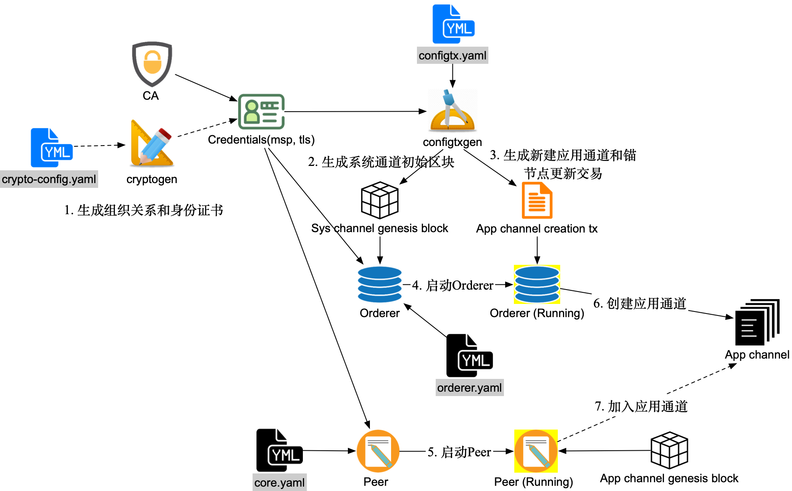
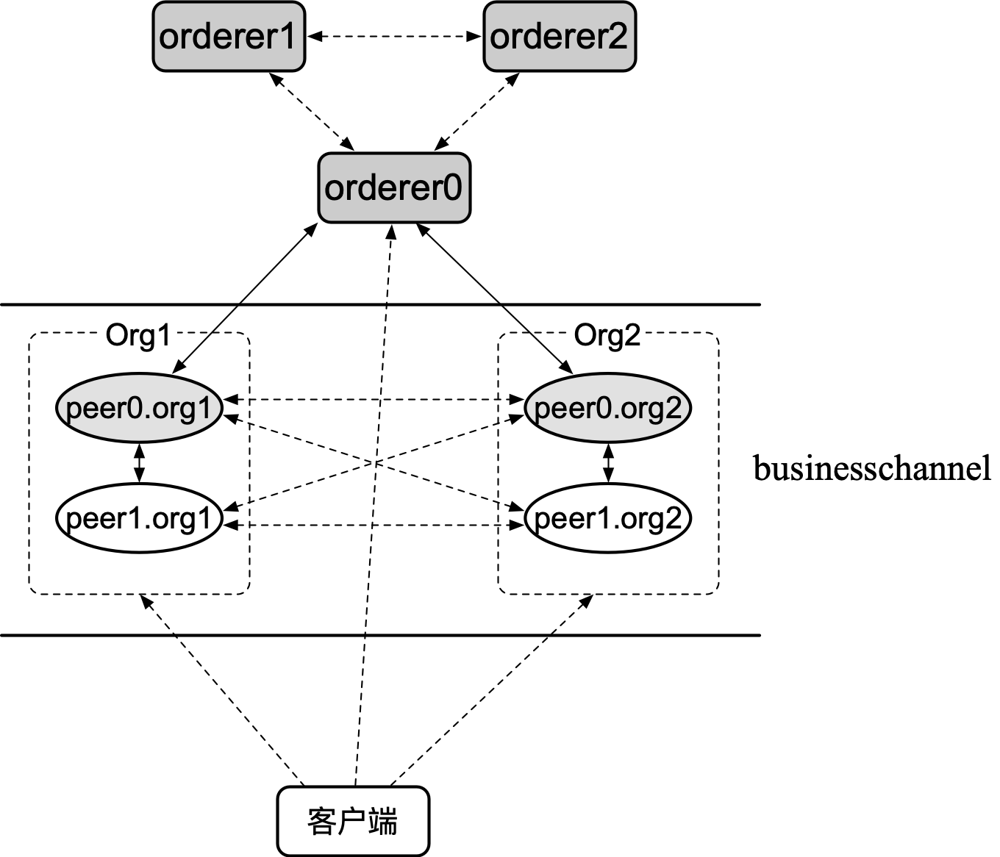

## 本地启动 Fabric 网络

启动一个 Fabric 网络主要包括如下步骤：

* **规划初始网络拓扑**：根据联盟的需求规划拓扑信息，包括联盟成员、排序服务集群、应用通道的初始成员等；
* **准备网络配置**：包括网络中组织结构和对应的身份证书（可使用 cryptogen 工具或 fabric-ca 完成），系统通道的初始配置区块文件、新建应用通道的配置更新交易文件以及可能需要的锚节点配置更新交易文件（可使用 configtxgen 工具完成）；
* **启动 Orderer 节点**：使用系统通道的初始区块文件启动排序服务，排序服务启动后自动按照指定配置创建系统通道；
* **启动 Peer 节点**：不同的组织按照预置角色分别启动 Peer 节点；
* **创建通道**：客户端使用新建应用通道的配置更新交易文件，向系统通道发送交易，创建新的应用通道；
* **加入通道**：Peer 节点利用初始区块加入到所创建的应用通道。

<!--
* **使用链码**：用户通过客户端向网络中部署链码，链码容器启动后用户可对链码进行调用，并发送交易到通道中。
-->

主要步骤如下图所示，下面进行具体讲解。



### 规划初始网络拓扑

示例网络拓扑如下图所示，包括 3 个 Orderer 节点和 4 个 Peer 节点，以及 1 个客户端操作节点（负责生成相关启动文件，在网络启动后作为客户端执行命令）。



其中，排序服务采用 Raft 模式，所有节点都加入到新建的 businesschannel 中。4 个 Peer 节点分属两个组织：Org1 和 Org2，也都是应用通道成员。每个组织中的 peer0 节点作为锚节点（Anchor Peer）负责与其它组织节点分享信息。

### 准备启动配置文件

Fabric 网络在启动之前，需要提前生成一些用于启动的配置文件，主要包括 MSP 相关身份文件（`msp/*`）、TLS 相关身份文件（`tlsca/*`）、系统通道初始区块（`orderer.genesis.block`）、新建应用通道交易文件（`businesschannel.tx`）、锚节点配置更新交易文件（ `Org1MSPanchors.tx` 和 `Org2MSPanchors.tx`）等。

各个文件的功能如下表所示。

启动配置 | 使用者 | 依赖文件 | 主要功能 
-- | -- | -- | --
MSP 相关文件 `msp/*` | Peer、Orderer、客户端 | crypto-config.yaml | 包括证书文件、签名私钥等，代表实体身份相关信息
TLS 相关文件 `tls/*` | Peer、Orderer、客户端 | crypto-config.yaml | 启用 TLS 时用于验证
系统通道初始区块文件 `orderer.genesis.block` | Orderer | configtx.yaml | 用于创建系统通道，配置网络中策略
新建应用通道交易文件 `businesschannel.tx` | 客户端 | configtx.yaml | 用于新建应用通道，其中指定通道成员、访问策略等
锚节点配置更新交易文件 `Org1MSPanchors.tx` 和 `Org2MSPanchors.tx` | 客户端 | configtx.yaml | 用于更新通道中各组织的锚节点信息

下面主要描述这些配置文件的生成过程，后续相关章节将具体介绍其功能。

#### 生成组织关系和身份证书

Fabric 网络作为联盟链，需要多个成员组织共同维护。成员之间通过身份来进行鉴权，网络通过身份来实现资源访问的权限管理。因此各成员组织都需要提前准备对应的身份文件，并部署到其所拥有的节点和客户端上。

用户可通过标准 PKI 服务（如使用 Fabric CA 实现）或 OpenSSL 工具来手动生成各个实体的证书和私钥。Fabric 项目还提供了 cryptogen 工具（基于 Golang crypto 标准库）在本地生成，需要提前准备 crypto-config.yaml 配置文件。

crypto-config.yaml 配置文件的结构十分简单，支持定义两种类型（OrdererOrgs 和 PeerOrgs）的若干组织。每个组织中又可以定义多个节点（Spec）和用户（User）。

一个示例的 crypto-config.yaml 配置文件内容如下，其中定义了一个 OrdererOrgs 类型的组织 example.com，包括 3 个节点；两个 PeerOrgs 类型的组织 org1.example.com 和 org2.example.com，分别包括 2 个节点和 1 个普通用户身份：

```yaml
OrdererOrgs:
  - Name: Orderer
    Domain: example.com
    CA:
        Country: US
        Province: California
        Locality: San Francisco
    Specs:
      - Hostname: orderer0
      - Hostname: orderer1
      - Hostname: orderer2
PeerOrgs:
  - Name: Org1
    Domain: org1.example.com
    EnableNodeOUs: true
    CA:
        Country: US
        Province: California
        Locality: San Francisco
    Template:
      Count: 2
    Users:
      Count: 1
  - Name: Org2
    Domain: org2.example.com
    EnableNodeOUs: true
    CA:
        Country: US
        Province: California
        Locality: San Francisco
    Template:
      Count: 2
    Users:
      Count: 1
```

使用该配置文件，通过如下命令可生成指定组织结构的身份文件，并存放到 crypto-config 目录下：

```bash
$ cryptogen generate \
    --config=./crypto-config.yaml \
    --output ./crypto-config
```

用户修改配置后，还可以通过 extend 子命令来更新 crypto-config 目录：

```bash
$ cryptogen extend \
    --config=./crypto-config.yaml \
    --input ./crypto-config
```

查看刚生成的 crypto-config 目录，结构如下所示：

```bash
$ tree -L 4 crypto-config
crypto-config
|-- ordererOrganizations
|   `-- example.com
|       |-- ca
|       |   |-- 293def0fc6d07aab625308a3499cd97f8ffccbf9e9769bf4107d6781f5e8072b_sk
|       |   `-- ca.example.com-cert.pem
|       |-- msp
|       |   |-- admincerts/
|       |   |-- cacerts/
|       |   `-- tlscacerts/
|       |-- orderers
|       |   `-- orderer0.example.com/
|       |   `-- orderer1.example.com/
|       |   `-- orderer2.example.com/
|       |-- tlsca
|       |   |-- 2be5353baec06ca695f7c3b04ca0932912601a4411939bfcfd44af18274d5a65_sk
|       |   `-- tlsca.example.com-cert.pem
|       `-- users
|           `-- Admin@example.com/
`-- peerOrganizations
    |-- org1.example.com
    |   |-- ca
    |   |   |-- 501c5f828f58dfa3f7ee844ea4cdd26318256c9b66369727afe8437c08370aee_sk
    |   |   `-- ca.org1.example.com-cert.pem
    |   |-- msp
    |   |   |-- admincerts/
    |   |   |-- cacerts/
    |   |   `-- tlscacerts/
    |   |-- peers
    |   |   |-- peer0.org1.example.com/
    |   |   `-- peer1.org1.example.com/
    |   |-- tlsca
    |   |   |-- 592a08f84c99d6f083b3c5b9898b2ca4eb5fbb9d1e255f67df1fa14c123e4368_sk
    |   |   `-- tlsca.org1.example.com-cert.pem
    |   `-- users
    |       |-- Admin@org1.example.com/
    |       `-- User1@org1.example.com/
    `-- org2.example.com
        |-- ca
        |   |-- 86d97f9eb601868611eab5dc7df88b1f6e91e129160651e683162b958a728162_sk
        |   `-- ca.org2.example.com-cert.pem
        |-- msp
        |   |-- admincerts/
        |   |-- cacerts/
        |   `-- tlscacerts/
        |-- peers
        |   |-- peer0.org2.example.com/
        |   `-- peer1.org2.example.com/
        |-- tlsca
        |   |-- 4b87c416978970948dffadd0639a64a2b03bc89f910cb6d087583f210fb2929d_sk
        |   `-- tlsca.org2.example.com-cert.pem
        `-- users
            |-- Admin@org2.example.com/
            `-- User1@org2.example.com/
```

按照 crypto-config.yaml 中定义，crypto-config 目录下包括多级目录结构。其中 ordererOrganizations 下包括构成 Orderer 组织（包括 3 个 Orderer 节点）的身份信息；peerOrganizations 下为所有的 Peer 节点组织（包括2 个组织，4 个节点）的相关身份信息。各个实体都含有 msp 和 tls 目录，分别包括对应的认证身份文件和 TLS 身份文件（公钥证书、私钥等）。

对于 Orderer 节点来说，需要将 `ordererOrganizations/example.com/orderers/ordererX.example.com` 目录下内容（包括 msp 和 tls 两个子目录）复制到对应 Orderer 节点的配置路径（默认为 `/etc/hyperledger/fabric`）下。

对于 Peer 节点来说，则需要复制 peerOrganizations 下对应的身份证书文件。以 org1 的 peer0 为例，将 `peerOrganizations/org1.example.com/peers/peer0.org1.example.com` 目录下内容（包括 msp 和 tls）复制到 Peer0 节点的配置路径（默认为 `/etc/hyperledger/fabric`）下。

对于客户端节点来说，需要复制对应身份的用户目录，例如 Org1 的管理员身份为 peerOrganizations/org1.example.com/users/Admin@org1.example.com/。

#### 生成系统通道初始区块

系统通道是网络启动后的首个通道，负责管理网络整体配置。排序节点在启动后，可以使用初始区块文件来创建一个新的网络。

初始区块中包括了排序服务的相关配置信息（如排序节点信息、块大小、最大通道数、默认策略等）和示例联盟配置。可以使用 configtxgen 工具生成。生成过程依赖 `configtx.yaml` 文件。

configtx.yaml 配置文件定义了整个网络中的相关配置和拓扑结构信息，用户可参考 `sampleconfig/configtx.yaml` 示例文件进行编写。这里采用如下内容，各个字段含义可参考后续配置说明章节：

```yaml
Profiles:
    TwoOrgsOrdererGenesis:
        <<: *ChannelDefaults
        Capabilities:
            <<: *ChannelCapabilities
        Orderer:
            <<: *OrdererDefaults
            Organizations:
                - *OrdererOrg
            Capabilities:
                <<: *OrdererCapabilities
        Consortiums:
            SampleConsortium:
                Organizations:
                    - *Org1
                    - *Org2
    TwoOrgsChannel:
        Consortium: SampleConsortium
        <<: *ChannelDefaults
        Capabilities:
            <<: *ChannelCapabilities
        Application:
            <<: *ApplicationDefaults
            Organizations:
                - *Org1
                - *Org2
            Capabilities:
                <<: *ApplicationCapabilities
Organizations:
    - &OrdererOrg
        Name: OrdererOrg
        SkipAsForeign: false
        ID: OrdererMSP
        MSPDir: msp
        Policies:
            Readers:
                Type: Signature
                Rule: "OR('OrdererMSP.member')"
            Writers:
                Type: Signature
                Rule: "OR('OrdererMSP.member')"
            Admins:
                Type: Signature
                Rule: "OR('OrdererMSP.admin')"
        OrdererEndpoints:
            - "orderer0.example.com:7050"
            - "orderer1.example.com:7050"
            - "orderer2.example.com:7050"

    - &Org1
        Name: Org1MSP
        SkipAsForeign: false
        ID: Org1MSP
        MSPDir: msp
        Policies:
            Readers:
                Type: Signature
                Rule: "OR('Org1MSP.admin', 'Org1MSP.peer', 'Org1MSP.client')"
            Writers:
                Type: Signature
                Rule: "OR('Org1MSP.admin', 'Org1MSP.client')"
            Admins:
                Type: Signature
                Rule: "OR('Org1MSP.admin')"
            Endorsement:
                Type: Signature
                Rule: "OR('Org1MSP.member')"
        AnchorPeers:
            - Host: peer0.org1.example.com
              Port: 7051
    - &Org2
        Name: Org2MSP
        SkipAsForeign: false
        ID: Org2MSP
        MSPDir: msp
        Policies:
            Readers:
                Type: Signature
                Rule: "OR('Org2MSP.admin', 'Org2MSP.peer', 'Org2MSP.client')"
            Writers:
                Type: Signature
                Rule: "OR('Org2MSP.admin', 'Org2MSP.client')"
            Admins:
                Type: Signature
                Rule: "OR('Org2MSP.admin')"
            Endorsement:
                Type: Signature
                Rule: "OR('Org2MSP.member')"
        AnchorPeers:
            - Host: peer0.org2.example.com
              Port: 7051
Capabilities:
    Channel: &ChannelCapabilities
        V2_0: true
    Orderer: &OrdererCapabilities
        V2_0: true
    Application: &ApplicationCapabilities
        V2_0: true
Application: &ApplicationDefaults
    ACLs: &ACLsDefault
        _lifecycle/CommitChaincodeDefinition: /Channel/Application/Writers
        _lifecycle/QueryChaincodeDefinition: /Channel/Application/Readers
        _lifecycle/QueryNamespaceDefinitions: /Channel/Application/Readers
        lscc/ChaincodeExists: /Channel/Application/Readers
        lscc/GetDeploymentSpec: /Channel/Application/Readers
        lscc/GetChaincodeData: /Channel/Application/Readers
        lscc/GetInstantiatedChaincodes: /Channel/Application/Readers
        qscc/GetChainInfo: /Channel/Application/Readers
        qscc/GetBlockByNumber: /Channel/Application/Readers
        qscc/GetBlockByHash: /Channel/Application/Readers
        qscc/GetTransactionByID: /Channel/Application/Readers
        qscc/GetBlockByTxID: /Channel/Application/Readers
        cscc/GetConfigBlock: /Channel/Application/Readers        
        peer/Propose: /Channel/Application/Writers
        peer/ChaincodeToChaincode: /Channel/Application/Readers
        event/Block: /Channel/Application/Readers
        event/FilteredBlock: /Channel/Application/Readers
    Organizations:
    Policies:
        LifecycleEndorsement:
            Type: ImplicitMeta
            Rule: "MAJORITY Endorsement"
        Endorsement:
            Type: ImplicitMeta
            Rule: "MAJORITY Endorsement"
        Readers:
            Type: ImplicitMeta
            Rule: "ANY Readers"
        Writers:
            Type: ImplicitMeta
            Rule: "ANY Writers"
        Admins:
            Type: ImplicitMeta
            Rule: "MAJORITY Admins"
    Capabilities:
        <<: *ApplicationCapabilities
Orderer: &OrdererDefaults
    OrdererType: etcdraft
    Addresses:
        - orderer0.example.com:7050
        - orderer1.example.com:7050
        - orderer2.example.com:7050
    BatchTimeout: 2s
    BatchSize:
        MaxMessageCount: 500
        AbsoluteMaxBytes: 10 MB
        PreferredMaxBytes: 2 MB
    MaxChannels: 0
    EtcdRaft:
        Consenters:
            - Host: orderer0.example.com
              Port: 7050
              ClientTLSCert: crypto-config/ordererOrganizations/example.com/orderers/orderer0.example.com/tls/server.crt
              ServerTLSCert: crypto-config/ordererOrganizations/example.com/orderers/orderer0.example.com/tls/server.crt
            - Host: orderer1.example.com
              Port: 7050
              ClientTLSCert: crypto-config/ordererOrganizations/example.com/orderers/orderer1.example.com/tls/server.crt
              ServerTLSCert: crypto-config/ordererOrganizations/example.com/orderers/orderer1.example.com/tls/server.crt
            - Host: orderer2.example.com
              Port: 7050
              ClientTLSCert: crypto-config/ordererOrganizations/example.com/orderers/orderer2.example.com/tls/server.crt
              ServerTLSCert: crypto-config/ordererOrganizations/example.com/orderers/orderer2.example.com/tls/server.crt
        Options:
            TickInterval: 500ms
            ElectionTick: 10
            HeartbeatTick: 1
            MaxInflightBlocks: 5
            SnapshotIntervalSize: 16 MB
    Organizations:
    Policies:
        Readers:
            Type: ImplicitMeta
            Rule: "ANY Readers"
        Writers:
            Type: ImplicitMeta
            Rule: "ANY Writers"
        Admins:
            Type: ImplicitMeta
            Rule: "MAJORITY Admins"
        BlockValidation:
            Type: ImplicitMeta
            Rule: "ANY Writers"
    Capabilities:
        <<: *OrdererCapabilities
Channel: &ChannelDefaults
    Policies:
        Readers:
            Type: ImplicitMeta
            Rule: "ANY Readers"
        Writers:
            Type: ImplicitMeta
            Rule: "ANY Writers"
        Admins:
            Type: ImplicitMeta
            Rule: "MAJORITY Admins"
    Capabilities:
        <<: *ChannelCapabilities
```

该配置文件中定义了两个模板：TwoOrgsOrdererGenesis 和 TwoOrgsChannel，其中前者定义了系统通道配置，可以用来创建系统通道所需初始区块文件；后者定义了应用通道配置，可以用来新建应用通道。排序服务的共识类型采用了 Raft 模式。

可通过如下命令指定使用 configtx.yaml 文件中定义的 TwoOrgsOrdererGenesis 模板，来生成系统通道的初始区块文件：

```bash
$ export SYS_CHANNEL=testchainid
$ export ORDERER_GENESIS_PROFILE=TwoOrgsOrdererGenesis
$ export ORDERER_GENESIS=orderer.genesis.block
$ configtxgen \
    -configPath ./ \
    -channelID ${SYS_CHANNEL} \
    -profile ${ORDERER_GENESIS_PROFILE} \
    -outputBlock ${ORDERER_GENESIS}
```

将所生成的初始区块文件复制到排序节点上 ORDERER_GENERAL_BOOTSTRAPFILE 指定路径（默认为 /etc/hyperledger/fabric）下，供启动排序节点使用。

#### 生成新建应用通道配置交易

新建应用通道需要先生成配置交易文件，其中包括了属于该通道的组织结构信息，这些信息会写入到该应用通道的初始区块中。

同样使用 configtx.yaml 配置文件和 configtxgen 工具，注意这里使用 TwoOrgsChannel 模板。

采用如下命令来生成配置交易文件，通道中包括两个初始成员：Org1 和 Org2：

```bash
$ export APP_CHANNEL=businesschannel
$ export APP_CHANNEL_PROFILE=TwoOrgsChannel
$ configtxgen \
    -configPath ./ \
    -channelID ${APP_CHANNEL} \
    -profile ${APP_CHANNEL_PROFILE} \
    -outputCreateChannelTx ${APP_CHANNEL}.tx
```

所生成的配置交易文件在后续步骤被客户端所使用，需要复制到客户端节点上。

*注：状态数据库如果选择 CouchDB 类型，应用通道名称只能包括小写的 ASCII 字符、点或中划线，并且首字符必须为字母，总长度不超过 249 个字符。该限制详情可参考 FAB-2487。*

#### 生成锚节点配置更新文件

锚节点用来辅助通道内多个组织之间的节点发现，修改锚节点需要发送更新通道配置交易。

同样，基于 configtx.yaml 配置文件，为每个组织都生成配置交易文件，注意需要需要使用对应的组织身份：

```bash
$ export UPDATE_ANCHOR_ORG1_TX=Org1MSPanchors.tx 
$ export UPDATE_ANCHOR_ORG2_TX=Org2MSPanchors.tx 
$ configtxgen \
    -configPath ./ \
    -channelID ${APP_CHANNEL} \
    -profile ${APP_CHANNEL_PROFILE} \
    -asOrg Org1MSP \
    -outputAnchorPeersUpdate ${UPDATE_ANCHOR_ORG1_TX}
$ configtxgen \
    -configPath ./ \
    -channelID ${APP_CHANNEL} \
    -profile ${APP_CHANNEL_PROFILE} \
    -asOrg Org2MSP \
    -outputAnchorPeersUpdate ${UPDATE_ANCHOR_ORG1_TX}
```

所生成的锚节点配置更新文件会在后续步骤被客户端所使用，因此需要复制到客户端节点上。

所有配置文件都准备完毕后，即可启动网络。首先要启动 Orderer 节点，然后启动 Peer 节点。

### 启动 Orderer 节点

首先，检查配置路径（ 默认为 `/etc/hyperledger/fabric` ）下相关文件是否就绪：

* 配置文件 orderer.yaml（可参考 sampleconfig/orderer.yaml），指定了节点相关配置；
* 生成的 msp 文件目录、tls 文件目录，存放身份信息；
* 系统通道的初始区块文件文件，用来启动系统通道。

排序节点自身配置可通过配置文件或环境变量方式指定，部分常见配置如下表所示。

配置（以环境变量为例） | 功能 | 说明
-- | -- | --
FABRIC_LOGGING_SPEC="info:orderer.common.blockcutter,orderer.operations=warning:orderer.common.cluster=debug"  | 输出日志的级别 | 建议至少为 INFO。可按模块指定，用冒号分割
ORDERER_GENERAL_LISTENADDRESS=0.0.0.0 | 服务监听的地址 | 建议指定网络地址
ORDERER_GENERAL_LISTENPORT=7050 | 服务监听的端口 | 默认为 7050
ORDERER_GENERAL_BOOTSTRAPMETHOD=file | 初始区块的提供方式 | 推荐采用文件方式提供
ORDERER_GENERAL_BOOTSTRAPFILE=/etc/hyperledger/fabric/orderer.genesis.block | 启动区块文件路径 | 提前使用 configtxgen 生成
ORDERER_GENERAL_LOCALMSPID=OrdererMSP | MSP 的 ID | 建议根据实际情况更新
ORDERER_GENERAL_LOCALMSPDIR=/etc/hyperledger/fabric/msp | MSP 文件路径 | cryptogen 提前生成，需要跟实际路径一致
ORDERER_GENERAL_LEDGERTYPE=file | 账本类型 | 建议使用 file 支持持久化
ORDERER_GENERAL_TLS_ENABLED=true | 是否启用 TLS | 建议开启，提高安全
ORDERER_GENERAL_TLS_PRIVATEKEY=/etc/hyperledger/fabric/tls/server.key | TLS 开启时指定签名私钥位置 | cryptogen 提前生成，需要跟实际路径一致
ORDERER_GENERAL_TLS_CERTIFICATE=/etc/hyperledger/fabric/tls/server.crt| TLS 开启时指定身份证书位置 | cryptogen 提前生成，需要跟实际路径一致
ORDERER_GENERAL_TLS_ROOTCAS=[/etc/hyperledger/fabric/tls/ca.crt] | TLS 开启时指定信任的根 CA 证书位置 | cryptogen 提前生成，需要跟实际路径一致
ORDERER_GENERAL_CLUSTER_CLIENTPRIVATEKEY=/var/hyperledger/orderer/tls/server.key |与其它排序节点进行双向 TLS 认证时的客户端私钥| 仅在 Raft 模式下使用
ORDERER_GENERAL_CLUSTER_CLIENTCERTIFICATE=/var/hyperledger/orderer/tls/server.crt |与其它排序节点进行双向 TLS 认证时的客户端证书| 仅在 Raft 模式下使用
ORDERER_GENERAL_CLUSTER_ROOTCAS=[/var/hyperledger/orderer/tls/ca.crt] |与其它排序节点进行双向 TLS 认证时的信任的服务端的根证书| 仅在 Raft 模式下使用
CORE_OPERATIONS_LISTENADDRESS=0.0.0.0:8443 | 运营管理 REST 服务的监听地址 | 推荐开启，方便监控
CORE_METRICS_PROVIDER=prometheus | 开启统计功能后，指定的采集器机制 | statsd、prometheus 或 disabled

之后，用户可以采用如下命令来启动 Orderer 节点。启动成功后可以看到本地输出的开始提供服务的消息，此时 Orderer 采用指定的初始区块文件成功创建了系统通道：

```bash
$ orderer start
[orderer/common/server] prettyPrintStruct -> INFO 002 Orderer config values:
    General.LedgerType = "file"
    General.ListenAddress = "0.0.0.0"
    General.ListenPort = 7050
    General.TLS.Enabled = true
...
[orderer/common/server] Start -> INFO 007 Beginning to serve requests
...
```

### 启动 Peer 节点

首先，检查配置路径（ 默认为 `/etc/hyperledger/fabric` ）下相关文件是否就绪：

* 配置文件 core.yaml（可以参考 sampleconfig/core.yaml），指定了节点相关配置；
* 生成的 msp 文件目录、tls 文件目录，存放身份信息。

Peer 节点的配置可通过配置文件或环境变量方式进行指定，场景设置如下表所示。

配置（以环境变量为例） | 功能 | 说明
-- | -- | --
FABRIC_LOGGING_SPEC="info:msp,gossip=warning:chaincode=debug" | 输出日志的级别 | 建议至少为 INFO。可按模块指定，用冒号分割
CORE_PEER_ID=peer0.org1.example.com | Peer 的 ID | 不同节点分别指定唯一的 ID
CORE_PEER_LISTENADDRESS=0.0.0.0:7051 | 本地监听服务地址 | 可指定只从某网络地址监听
CORE_PEER_GOSSIP_EXTERNALENDPOINT=peer0.org1.example.com:7051 | 对组织外节点发布的地址 | 不同节点分别指定，不指定则组织外节点无法连接到该节点
CORE_PEER_GOSSIP_USELEADERELECTION=true | 是否自动选举代表节点 | 建议开启
CORE_PEER_GOSSIP_ORGLEADER= false | 是否作为组织代表节点从排序服务拉取区块 | 建议关闭，进行自动选举
CORE_PEER_LOCALMSPID=Org1MSP | 所属组织 MSP 的 ID | 不同节点分别指定，根据实际情况更新
CORE_PEER_MSPCONFIGPATH=msp | msp 文件所在的相对路径 | cryptogen 提前生成，需要跟实际路径一致
CORE_VM_ENDPOINT=unix:///var/run/docker.sock | Docker 服务地址 | 根据实际情况配置
CORE_VM_DOCKER_HOSTCONFIG_NETWORKMODE=host | 链码容器使用的网络方式 | 如果进行配置，需要跟 Peer 在同一个网络上，以进行通信
CORE_PEER_TLS_ENABLED=true | 是否启用服务端的 TLS | 建议开启，提高安全
CORE_PEER_TLS_CERT_FILE=/etc/hyperledger/fabric/tls/server.crt | TLS 开启时指定服务端身份证书位置 | cryptogen 提前生成，需要跟实际路径一致
CORE_PEER_TLS_KEY_FILE=/etc/hyperledger/fabric/tls/server.key | TLS 开启时指定服务端签名私钥位置 | cryptogen 提前生成，需要跟实际路径一致
CORE_PEER_TLS_ROOTCERT_FILE=/etc/hyperledger/fabric/tls/ca.crt | TLS 开启时指定信任的服务端根 CA 证书位置 | cryptogen 提前生成，需要跟实际路径一致
CORE_OPERATIONS_LISTENADDRESS=0.0.0.0:9443 | 运营管理 REST 服务的监听地址 | 推荐开启，方便监控
CORE_METRICS_PROVIDER=prometheus | 开启统计功能后，指定的采集器机制 | statsd、prometheus 或 disabled

配置完成后，用户可以采用如下命令在多个服务器上分别启动 Peer 服务，启动成功后可以看到本地输出的日志消息：

```bash
$ peer node start
UTC [ledgermgmt] initialize -> INFO 002 Starting peer:
 Version: 2.0.0
 Commit SHA: development build
 Go version: go1.13.4
 OS/Arch: linux/amd64
 Chaincode:
  Base Docker Namespace: hyperledger
  Base Docker Label: org.hyperledger.fabric
  Docker Namespace: hyperledger"
...
UTC [nodeCmd] serve -> INFO 01e Started peer with ID=[name:"peer0.org1.example.com" ], network ID=[dev], address=[peer0.org1.example.com:7051]
...
```

此时，Peer 节点已经启动起来，会尝试通过 gossip 发现邻居节点。

### 创建通道

Peer 节点启动后，由于尚未跟 Orderer 建立连接，暂时还未加入网络中的应用通道。

下面在客户端发送请求给 Orderer 创建应用通道，并让 Peer 节点加入到通道中。

默认情况下，只有联盟中成员组织的管理员身份才可以创建应用通道。例如使用 Org1 的管理员身份来创建新的应用通道，需要指定 msp 的 ID、msp 文件所在路径、排序服务地址、应用通道名称和新建通道交易文件，如果启用了 TLS，还需要指定排序服务的 TLSCA 的证书位置：

```bash
$ APP_CHANNEL=businesschannel
$ TIMEOUT=30
$ CORE_PEER_LOCALMSPID="Org1MSP" \
    CORE_PEER_MSPCONFIGPATH=/etc/hyperledger/fabric/crypto-config/peerOrganizations/org1.example.com/users/Admin@org1.example.com/msp \
    peer channel create \
    -o orderer.example.com:7050 \
    -c ${APP_CHANNEL} \
    -f ./$APP_CHANNEL.tx \
    --timeout "${TIMEOUT}s" \
    --tls \
    --cafile /etc/hyperledger/fabric/crypto-config/ordererOrganizations/example.com/orderers/orderer.example.com/msp/tlscacerts/tlsca.example.com-cert.pem
```

通道创建成功后，会在本地生成其初始区块文件（businesschannel.block），其中带有通道的初始配置信息和排序服务信息等。只有拥有该文件的 Peer 节点才可能加入到对应的通道中。

### 加入通道

应用通道的成员组织的 Peer 都可以加入到通道中。

在客户端使用管理员身份依次让组织 Org1 和 Org2 中所有节点都加入新的应用通道。操作需要指定所操作的 Peer 的地址，以及通道的初始区块。

以 Org1 中的 peer0 节点为例，可以执行如下操作：

```bash
$ CORE_PEER_LOCALMSPID="Org1MSP" \
    CORE_PEER_MSPCONFIGPATH=/etc/hyperledger/fabric/crypto-config/peerOrganizations/org1.example.com/users/Admin@org1.example.com/msp \
    CORE_PEER_ADDRESS=peer0.org1.example.com:7051 \
    peer channel join \
    -b ${APP_CHANNEL}.block

Peer joined the channel!
```

此时，所操作的 Peer（如果成为组织的 Gossip Leader）会自动连接到应用通道指定的排序服务，开始接收区块。

### 更新锚节点配置

锚节点（作为组织内成员代表）负责跟其它组织节点进行信息交换。通道配置内会记录各组织的锚节点列表信息，Peer 通过访问其他组织的锚节点来获取其他组织内的 Peer 信息。

使用锚节点配置更新文件，组织管理员可以更新通道中相关配置。

例如，在客户端使用 Org1 的管理员身份来更新锚节点，如下所示：

```bash
$ CORE_PEER_LOCALMSPID="Org1MSP" \
    CORE_PEER_MSPCONFIGPATH=/etc/hyperledger/fabric/crypto-config/peerOrganizations/org1.example.com/users/Admin@org1.example.com/msp \
    peer channel update \
    -o orderer.example.com:7050 \
    -c ${APP_CHANNEL} \
    -f ${UPDATE_ANCHOR_ORG1_TX} \
    --tls \
    --cafile /etc/hyperledger/fabric/crypto-config/ordererOrganizations/example.com/orderers/orderer.example.com/msp/tlscacerts/tlsca.example.com-cert.pem
```

锚节点配置更新后，同一通道内不同组织之间的 Peer 也可以进行 Gossip 通信，共同维护通道账本。后续，用户可以在通道内通过智能合约更新账本记录。
