## 管理链上代码

链上代码（Chaincode），简称链码，一般指的是用户编写的用来实现智能合约的应用代码。

链码被部署在 Peer 节点上，运行在独立的沙盒（目前为 Docker 容器）中，并通过 gRPC 协议来与相应的 Peer 节点进行交互。链码被调用时，会按照预定逻辑根据当前账本状态来计算对账本的更新（读写集合）。

启动 Fabric 网络后，可以通过命令行或 SDK 进行链码调用。

*注：用户链码有别于系统链码（System Chaincode）。系统链码指的是 Fabric Peer 中负责系统配置、背书、验证等平台功能的代码逻辑，运行在 Peer 进程内，将在后续章节予以介绍。*

### 客户端链码操作命令

用户可以通过命令行方式来管理链码，支持的链码子命令包括 install、instantiate、invoke、query、upgrade、list、package、signpackage 等。大部分命令（除了 package、signpackage 外）的处理过程都是类似的，创建签名提案消息，发给 Peer 进行背书，获取 ProposalResponse 消息。

特别地，instantiate、invoke、upgrade 等子命令还需要根据 ProposalResponse 消息创建交易，发送给 Orderer 进行排序后被全网接受。package、signpackage 子命令作为本地操作，无需跟 Peer 或 Orderer 打交道。

各个命令的功能总结如下表所示：

命令 | 发往组件 | 功能
-- | -- | --
install | Peer 节点 | 将链码信息打包并安装到 Peer
query  | Peer 节点 | 查询链码
list | Peer 节点 | 列出链码信息，包括某个 Peer 上安装过的链码或通道内实例化过的链码
instantiate | Peer 节点和排序服务 | 在通道中实例化链码
invoke | Peer 节点和排序服务 | 调用链码
upgrade | Peer 节点和排序服务 | 升级链码
package | 本地操作 | 打包本地链码为部署 Spec 包
signpackage | 本地操作 | 为给定链码包添加签名

可以通过 `peer chaincode <subcommand> --help` 来查看具体的命令使用说明。

这些操作管理了链码的整个生命周期，如下图所示。

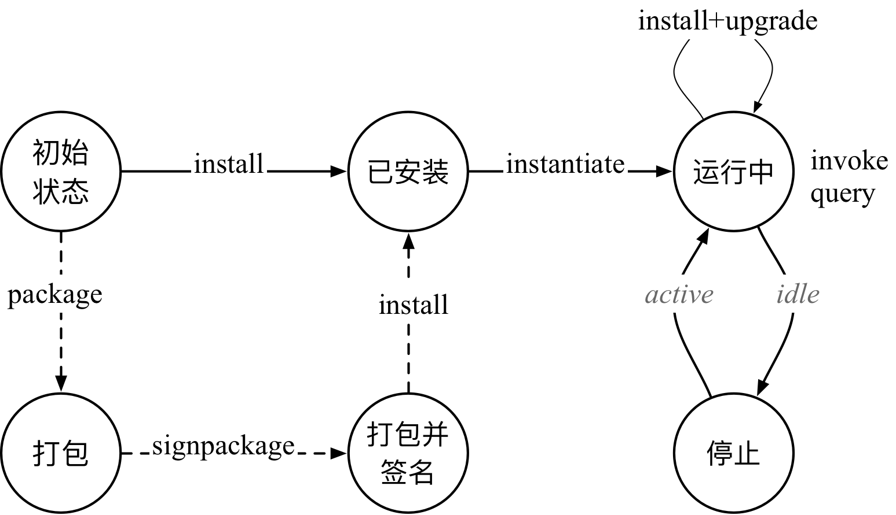

首先，用户需要将链码安装到 Peer 节点，之后可以在 Peer 所属的某个通道内实例化链码容器。此时链码处于运行状态，应用可以通过 invoke 或 query 来调用链码。链码在一定时间（环境变量 CRC_MAX_IDLE_TIME 指定）内不被调用会处于空闲状态，自动被停止删除；如果被调用则重新实例化。此外，用户还可以升级链码到新的版本。

后面将以 Fabric 项目中自带的 Go 语言 example02 链码（路径在 examples/chaincode/go/chaincode_example02）为例进行相关命令讲解。

### 命令选项

链码操作支持如下全局命令选项，对应的功能如下表所示。

全局选项 | 类型 | 含义
--- | --- | ---
--connTimeout | int | 客户端连接超时，默认为 3 秒
--keyfile | string | 与排序服务双向 TLS 认证时使用的私钥文件
-o, --orderer | string | Orderer 服务地址
--transient | string | JSON 格式的临时数据，仅供 Peer 在背书环节使用
--tls | bool | 连接到 Orderer 服务时是否启用 TLS
--cafile | string | 信任的排序服务的 TLSCA 证书，PEM 编码格式
--certfile | string | 与排序服务双向 TLS 认证时使用的证书文件
--clientauth | bool | 与排序服务通信时是否启用双向 TLS 认证
--ordererTLSHostnameOverride | string | 验证 Orderer TLS 时候覆盖所校验的主机名

此外，不同子命令还可能支持一些子选项，如下表所示。

子命令选项 | 类型 | 含义
--- | --- | ---
--connectionProfile | string | 指定连接配置（Connection Profile）文件
-C, --chainID | string | 所面向的通道，默认为 "testchainid"
-c, --ctor  | string | 指定链码命令的参数信息，Json 格式，默认为 "{}"
-E, --escc  | string | 指定所用背书系统链码的名称，默认为 "escc"
-l, --lang  | string | 链码实现语言，默认为 "golang"
-n, --name  | string | 链码名称
--peerAddresses | string list | Peer 节点地址，可以指定多个
-o, --orderer | string | 排序服务地址
--tlsRootCertFiles | string list | 采用 TLS 时，信任的 Peer 的根证书列表，需要跟 Peer 节点地址列表给出的顺序一致
-p, --path  | string | 所操作链码的本地路径，如果是 Go 语言为包路径（相对于 $GOPAH/src），如果是其它语言则为绝对路径
-P, --policy | string  | 链码所关联的背书策略，例如 -P "OR ('Org1MSP.member','Org2MSP.member')"
-t, --tid  | string |  ChaincodeInvocationSpec 中的 ID 生成算法和编码，目前支持默认的 sha256+base64
-v, --version | string | install/instantiate/upgrade 等命令中指定的版本信息
-V, --vscc  | string | 指定所使用验证系统链码的名称，默认为 "vscc"

注意，不同子命令具体支持不同的参数，总结如下表所示。

命令 |-C 通道| -c cc 参数| -E escc | -l 语言 | -n 名称 | -o Orderer | -p 路径 | -P policy | -v 版本 | -V vscc |
-- | -- | -- | -- | -- | -- | -- | -- | -- | -- | -- |
install    |不支持| 支持 |不支持 | 支持 |必需|不支持|必需|不支持| 必需 | 不支持 |
instantiate|必需| 必需 |支持 | 支持 |必需|支持|不支持|支持|必需 | 支持 |
invoke     |支持| 必需 |不支持 | 支持 |必需|支持|不支持|不支持|不支持|不支持 |
query      |支持| 必需 |不支持 | 支持 |必需|不支持|不支持|不支持|不支持|不支持 |
upgrade    |必需| 必需 |支持 | 支持 |必需|支持|不支持|支持| 必需| 支持 |
list      |支持| 不支持 |不支持 | 不支持 |不支持|不支持|不支持|不支持|不支持|不支持 |
package    |不支持| 支持 |不支持 | 支持 |必需|不支持|必需|不支持|必需 | 不支持|
signpackage |不支持| 支持 |不支持 | 支持 |必需|不支持|必需|不支持|必需 | 不支持|

其中，必需、支持和不支持三种情况的含义为：

* 必需：该参数必需被指定，包括通过命令行、环境变量、配置等。
* 支持：该参数可以被使用。某些时候如果不指定，可能采取默认值或自动获取。
* 不支持：该参数不应该使用。

### 安装链码

install 命令将链码的源码和环境等内容封装为一个链码安装打包文件（Chaincode Install Package，CIP），并传输到指定的 Peer 节点。

此过程只需要跟 Peer 节点打交道，无需修改账本状态，并不产生交易。只有安装过链码的节点才能进行链码实例化和进行背书处理。默认情况下，执行者需要为该 Peer 节点的管理员角色。

例如，采用如下命令可以部署 test_cc.1.0 的链码打包文件到指定的 Peer 节点。

```bash
$ CORE_PEER_ADDRESS=peer.your_domain.com:7051 # 设置默认的 Peer 地址
$ peer chaincode install \
	-n test_cc \
	-v 1.0 \
	-p github.com/hyperledger/fabric/examples/chaincode/go/chaincode_example02
```

Peer 节点收到请求，检查和解析后将 CIP 文件保存在 `${CORE_PEER_FILESYSTEMPATH}/chaincodes/` 目录下（一般以 cc_name.version 格式命名，如 /var/hyperledger/production/chaincodes/testcc.1.0），供后续操作（如重新创建和启动链码容器）使用。

CIP 文件中主要包括如下数据。

* `ChaincodeDeploymentSpec`：链码的源码和一些关联环境，如名称和版本。
* 链码实例化策略，默认是任意通道上的 MSP 管理员身份均可。
* 拥有这个链码的实体的证书和签名。
* 安装时，添加本地 MSP 管理员的签名。

其中，ChaincodeDeploymentSpec（CDS）结构最为核心，主要包括 ChaincodeSpec（CS）数据结构（链码部署信息）和 CodePackage（链码源代码相关数据）。CDS 和 CS 结构同时也大量在其他链码命令（如实例化命令和升级命令）中使用。

链码安装的整体实现流程如下图所示。

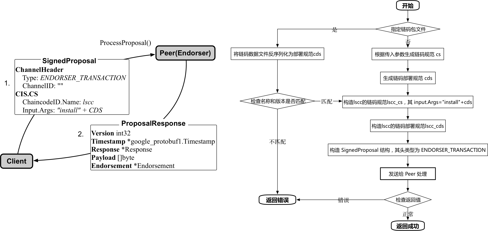

主要步骤包括：

* 首先是构造带签名的提案结构（SignedProposal）。
	* 调用 `InitCmdFactory(isEndorserRequired, isOrdererRequired bool) (*ChaincodeCmdFactory, error)` 方法，初始化 EndoserClient（跟 Peer 通信）、BroadcastClient（跟 Orderer 通信）、Signer（签名操作）等辅助结构体。所有链码子命令都会执行该过程，会根据需求具体初始化不同的结构。
	* 然后根据命令行参数进行解析，判断是根据传入的打包文件来直接读取 ChaincodeDeploymentSpec（CDS）结构，还是根据传入参数从本地链码源代码文件来构造生成。
	* 以本地重新构造情况为例，首先根据命令行中传入的路径、名称等信息，构造生成 ChaincodeSpec（CS）结构。
	* 利用 ChaincodeSpec 结构，结合链码包数据生成一个 ChaincodeDeploymentSpec 结构（chainID 为空），调用本地的 `install(msg proto.Message, cf *ChaincodeCmdFactory) error` 方法。
	* install 方法基于传入的 ChaincodeDeploymentSpec 结构，构造一个对生命周期管理系统链码（LSCC）调用的 ChaincodeSpec 结构，其中，Type 为 ChaincodeSpec_GOLANG，ChaincodeId.Name 为“lscc”，Input 为 “install”+ChaincodeDeploymentSpec。进一步地，构造了一个 LSCC 的 ChaincodeInvocationSpec（CIS）结构，对 ChaincodeSpec 结构进行封装。
	* 基于 LSCC 的 ChaincodeInvocationSpec 结构，添加头部结构，生成一个提案（Proposal）结构。其中，通道头部中类型为 ENDORSER_TRANSACTION，TxID 为对随机数+签名实体，进行 Hash。
	* 对 Proposal 进行签名，转化为一个签名后的提案消息结构 SignedProposal。
* 将带签名的提案结构通过 EndorserClient 经由 gRPC 通道发送给 Peer 的 `ProcessProposal(ctx context.Context, in *SignedProposal, opts ...grpc.CallOption) (*ProposalResponse, error)` 接口。
* Peer 模拟运行生命周期链码的调用交易进行处理，检查格式、签名和权限等，通过则保存到本地文件系统。

下图给出了链码安装过程中最为重要的 SignedProposal 数据结构，该结构对于大部分链码操作命令都是类似的，其中最重要的是 ChannelHeader 结构和 ChaincodeSpec 结构中参数的差异。

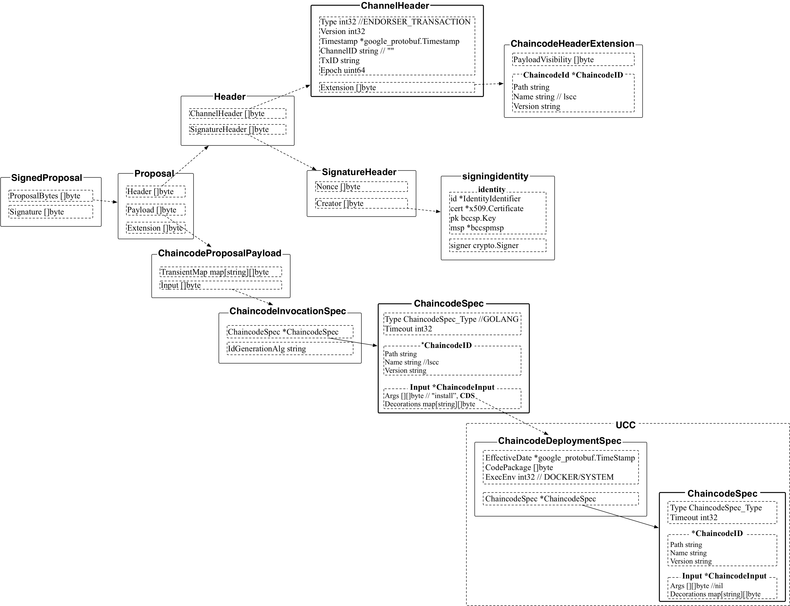

### 实例化链码

instantiate 命令通过构造生命周期管理系统链码（Lifecycle System Chaincode，LSCC）的交易，将安装过的链码在指定通道上进行实例化部署调用，在节点上创建容器启动，并执行初始化操作。实例化链码需要同时跟 Peer 和 Orderer 打交道。

执行 instantiate 命令的用户身份必须满足实例化的策略（默认为通道内 MSP 管理员角色），并且在所指定的通道上拥有写（Write）权限。在 instantiate 命令中可以通过 `-P` 参数指定链码调用的背书策略（Endorsement Policy），在 Commit 阶段会进行策略检查。

例如，如下命令会启动 test_cc.1.0 链码，会将参数 `'{"Args":["init","a","100","b","200"]}'` 传入链码中的 `Init()` 方法执行。命令会生成一笔交易，因此需指定排序节点地址。

```bash
$ APP_CHANNEL="businesschannel" # 设置默认的通道名称
$ peer chaincode instantiate \
	-o orderer0:7050 \
	-C ${APP_CHANNEL} \
	-n test_cc \
	-v 1.0 \
	-c '{"Args":["init","a","100","b","200"]}' \
	-P "OR ('Org1MSP.member','Org2MSP.member')" \
	--collections-config collection.json \
	--tls \
	--cafile ${ORDERER_TLS_CA}
```

其中，collection.json 为私密账本（sideDB）特性中使用（Fabric v1.1.0 开始支持），可以实现在同一通道内实现私密数据局部共享。如果不指定该参数则默认不启用该特性，意味着通道内所有成员都可以看到链码调用结果。

collection.json 的一个示例如下所示。

```json
[
 {
	 "name": "public", // 集合名称
	 "policy": "OR('Org1MSP.member', 'Org2MSP.member')", // 集合成员
	 "requiredPeerCount": 1, // 至少扩散私密数据到几个节点
	 "maxPeerCount": 3, // 最大扩散节点个数
	 "blockToLive":99999, //私密数据存货时长
	 "memberOnlyRead": true // 是否只允许集合的成员访问私密数据
},
 {
	 "name": "private",
	 "policy": "OR('Org1MSP.member')",
	 "requiredPeerCount": 1,
	 "maxPeerCount": 3,
	 "blockToLive":3,
	 "memberOnlyRead": false
 }
]
```

其中定义了 public 和 private 两个集合，分别包括两个组织和单个组织。当在链码逻辑中指定某个键值属于特定集合时，只有集合内成员能看到明文的读写集合，非集合成员即便在同一通道内也无法获取隐私数据。对应 policy 只支持 OR 语法，指定哪些组织可以看到隐私数据集合。

链码实例化实现的整体流程如下图所示。


主要步骤包括：

* 首先，类似链码安装命令，需要创建一个 SignedProposal 消息。注意 instantiate 和 upgrade 支持 policy、escc、vscc 等参数。LSCC 的 ChaincodeSpec 结构中，Input 中包括类型（“deploy”）、通道 ID、ChaincodeDeploymentSpec 结构、背书策略、escc 和 vscc 等。
* 调用 EndorserClient，发送 gRPC 消息，将签名后的 Proposal 发给指定的 Peer 节点（Endorser），调用 `ProcessProposal(ctx context.Context, in *SignedProposal, opts ...grpc.CallOption) (*ProposalResponse, error)` 方法，进行背书处理。节点会模拟运行 LSCC 的调用交易，启动链码容器。实例化成功后会返回 ProposalResponse 消息（其中包括背书签名）。
* 根据 Peer 返回的 ProposalResponse 消息，创建一个 SignedTX（Envelop 结构的交易，带有签名）。
* 使用 BroadcastClient 将交易消息通过 gRPC 通道发给 Orderer，Orderer 会进行全网排序，并广播给 Peer 进行确认提交。

其中，SignedProposal 结构如下图所示。

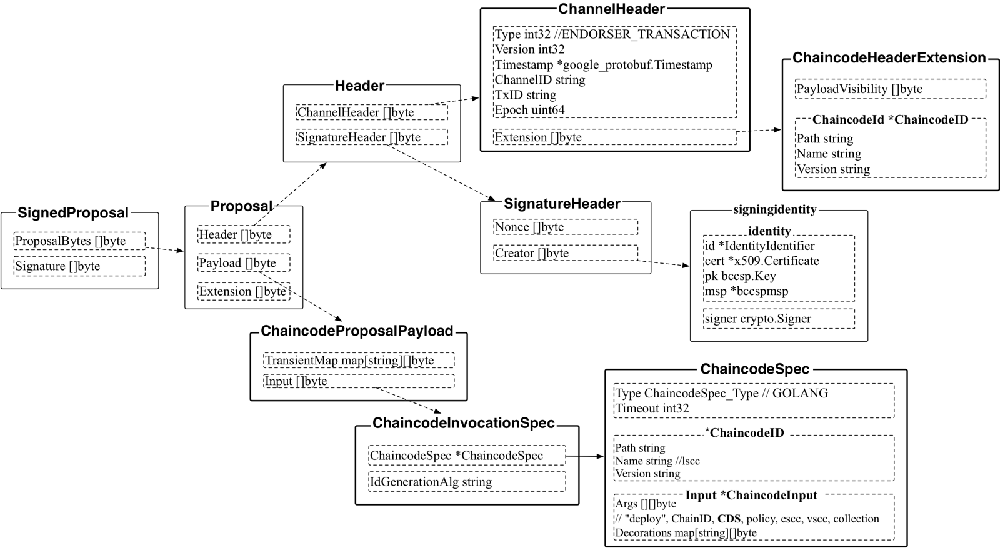

交易 Envelope 结构如下图所示。

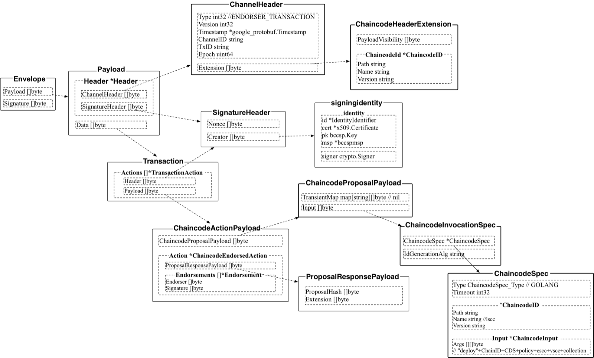

Peer 返回的 ProposalResponse 消息定义如下。

```go
type ProposalResponse struct {
	// 消息协议版本
	Version int32 `protobuf:"varint,1,opt,name=version" json:"version,omitempty"`
	// 消息创建时的时间戳
	Timestamp *google_protobuf1.Timestamp `protobuf:"bytes,2,opt,name=timestamp" json:"timestamp,omitempty"`
	// 返回消息，包括状态、消息、元数据载荷等
	Response *Response `protobuf:"bytes,4,opt,name=response" json:"response,omitempty"`
	// 数据载荷，包括提案的 Hash 值，和扩展的行动等
	Payload []byte `protobuf:"bytes,5,opt,name=payload,proto3" json:"payload,omitempty"`
	// 背书信息列表，包括背书者的证书，以及其对“载荷+背书者证书”的签名
	Endorsement *Endorsement `protobuf:"bytes,6,opt,name=endorsement" json:"endorsement,omitempty"`
}
```

*注：目前命令行下的 instantiate 命令还不支持指定实例化策略，Peer 会采用默认的实例化策略（组织管理员身份）。*

### 调用链码

通过 invoke 命令可以调用运行中的链码的方法。`-c` 参数指定的函数名和参数会被传入到链码的 Invoke() 方法进行处理。调用链码操作需要同时跟 Peer 和 Orderer 打交道。

例如，对部署成功的链码执行调用操作，由 `a` 向 `b` 转账 10 元。

在 peer0 容器中执行如下操作，注意验证最终结果状态正常 `response:<status:200 message:"OK" >`。

```bash
$ peer chaincode invoke \
	-o orderer0:7050 \
	-n test_cc \
	-C ${APP_CHANNEL} \
	-c '{"Args":["invoke","a","b","10"]}' \
	--tls \
	--cafile ${ORDERER_TLS_CA}
```
 
这一命令会调用最新版本的 test_cc 链码，将参数 `'{"Args":["invoke","a","b","10"]}'` 传入链码中的 `Invoke()` 方法执行。命令会生成一笔交易，需指定排序者地址。

需要注意，invoke 命令不支持指定链码版本，默认调用最新版本的链码。

实现上，基本过程如下图所示。

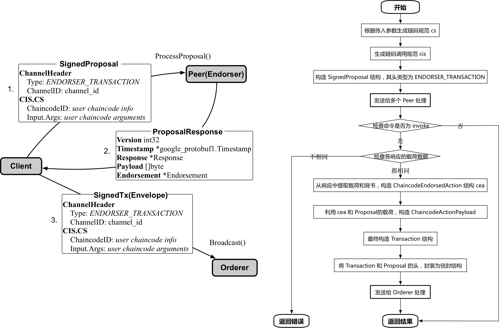

实现上，基本过程如下：

* 首先，也是要创建一个 SignedProposal 消息。根据传入的各种参数，生成 ChaincodeSpec 结构（其中，Input 为传入的调用参数）。然后，根据 ChaincodeSpec、chainID、签名实体等，生成 ChaincodeInvocationSpec 结构。进而封装生成 Proposal 结构（通道头部中类型为 ENDORSER_TRANSACTION），并进行签名。
* 调用 EndorserClient，发送 gRPC 消息，将签名后的 Proposal 发给指定的 Peer 节点（Endorser），调用 `ProcessProposal(ctx context.Context, in *SignedProposal, opts ...grpc.CallOption) (*ProposalResponse, error)` 方法，进行背书处理。节点会模拟运行链码调用交易，成功后会返回 ProposalResponse 消息（带有背书签名）。
* 根据 Peer 返回的 ProposalResponse 消息，创建一个 SignedTX（Envelop 结构的交易，带有签名）。
* 调用 BroadcastClient 将交易消息通过 gRPC 通道发给 Orderer 进行全网排序并广播给 Peer 进行确认提交。

在此过程中，发给 Peer 节点的交易提案数据结构如下图所示。

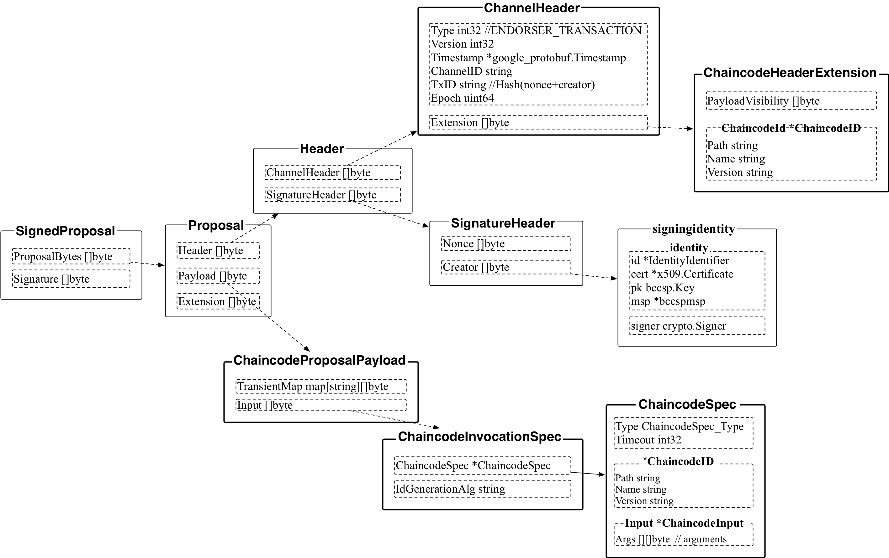

发给排序服务的交易数据结构如下图所示。

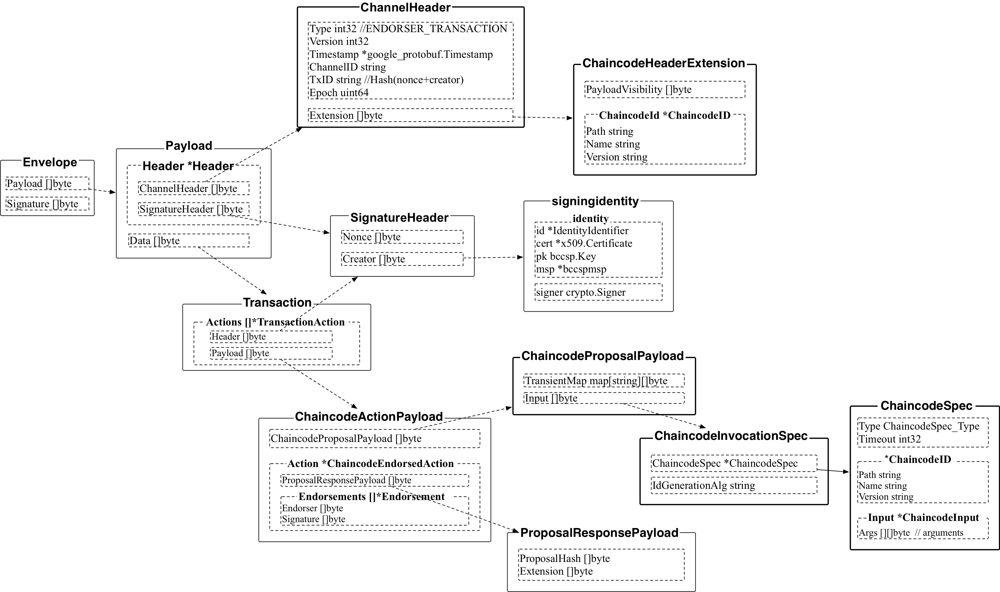

注意 invoke 是异步操作，invoke 成功只能保证交易已经进入 Orderer 进行排序，但无法保证最终写到账本中（例如交易未通过 Committer 验证而被拒绝）。需要通过 eventHub 或查询方式来进行确认交易是否最终写入到账本上。

### 查询链码

查询链码可以通过 query 子命令。

该子命令实际上是 invoke 操作与 Peer 打交道的部分，即将签名后的 Proposal 发给指定的 Peer 节点的 ProcessProposal() gRPC 接口。最终将 `-c` 指定的命令参数发送给了链码中的 `Invoke()` 方法执行。

与 invoke 操作的区别在于，query 操作用来查询 Peer 上账本状态（需要链码支持查询逻辑），不生成交易，也不需要与 Orderer 打交道。

例如，执行如下命令会向 Peer 查询状态 `a` 的值，并返回查询结果。

```bash
$ peer chaincode query \
	-n test_cc \
	-C ${APP_CHANNEL} \
	-c '{"Args":["query","a"]}'
```

在实例化链码容器后，可以在 peer0 容器中执行如下命令，注意输出无错误信息，最后的结果为初始值 `Query Result: 100`。

```bash
$ peer chaincode query \
	-n test_cc \
	-C ${APP_CHANNEL} \
	-c '{"Args":["query","a"]}'
Query Result: 100
[main] main -> INFO 001 Exiting.....
```

类似的，查询 `b` 的余额，注意最终返回结果为初始值 `Query Result: 200`。

```bash
$ peer chaincode query \
	-n test_cc \
	-C ${APP_CHANNEL} \
	-c '{"Args":["query","b"]}'
Query Result: 200
[main] main -> INFO 001 Exiting.....
```

在执行完 a 向 b 转账 10 的交易后，再次查询 `a` 和 `b` 的余额，发现发生变化。

`a` 的新余额为 90。

```bash
$ peer chaincode query \
	-n test_cc \
	-C ${APP_CHANNEL} \
	-c '{"Args":["query","a"]}'
Query Result: 90
[main] main -> INFO 001 Exiting.....
```

`b` 的新余额为 210。

```bash
$ peer chaincode query \
	-n test_cc \
	-C ${APP_CHANNEL} \
	-c '{"Args":["query","b"]}'
Query Result: 210
[main] main -> INFO 001 Exiting.....
```

query 的主要实现过程如下所示。

* 根据传入的各种参数，最终构造签名提案，通过 endorserClient 发送给指定的 Peer。
* 成功的话，获取到 ProposalResponse，打印出 proposalResp.Response.Payload 内容。

注意 invoke 和 query 的区别，query 子命令会返回从 Peer 的查询结果，但不创建 SignedTx 发送到 Orderer。

### 升级链码

当需要修复链码漏洞或进行功能拓展时，可以对链码进行升级，部署新版本的链码。Fabric 支持在保留现有状态的前提下对链码进行升级。

假设某通道上正在运行中的链码为 test_cc，版本为 1.0，可以通过如下步骤进行升级操作。

首先，安装新版本的链码，打包到 Peer 节点。

```bash
$ peer chaincode install \
	-n test_cc \
	-v 1.1 \
	-p github.com/hyperledger/fabric/examples/chaincode/go/chaincode_example02_new
```

运行以下 upgrade 命令升级指定通道上的链码，需要指定相同的链码名称 test_cc。

```bash
$ peer chaincode upgrade \
 	-o orderer0:7050 \
	-n test_cc \
	-C ${APP_CHANNEL} \
	-v 1.1 \
	-c '{"Args":["re-init","c","60"]}' \
	-P "${policy}" \
	--collections-config "${collection_config}" \
	--tls \
	--cafile ${ORDERER_TLS_CA}
```

这一命令会在通道 test_cc 上实例化新版本链码 test_cc.1.1 并启动一个新容器。运行在其他通道上的旧版本的链码将不受影响。升级操作跟实例化操作十分类似，唯一区别在于不改变实例化的策略。这就保证了只有拥有实例化权限的用户才能进行升级操作。

升级过程会将给定的参数（如例子中的 `'{"Args":["re-init","c","60"]}'`）传入新链码的 `Init()` 方法中执行。只要 `Init()` 方法中对应的逻辑不改写状态，则升级前后链码的所有状态值可以保持不变。因此，如果链码将来要考虑在保留状态情况下升级，需要在编写 `Init()` 方法时妥善处理升级时的逻辑。

链码实例化实现的整体流程如下图所示，十分类似实例化过程。

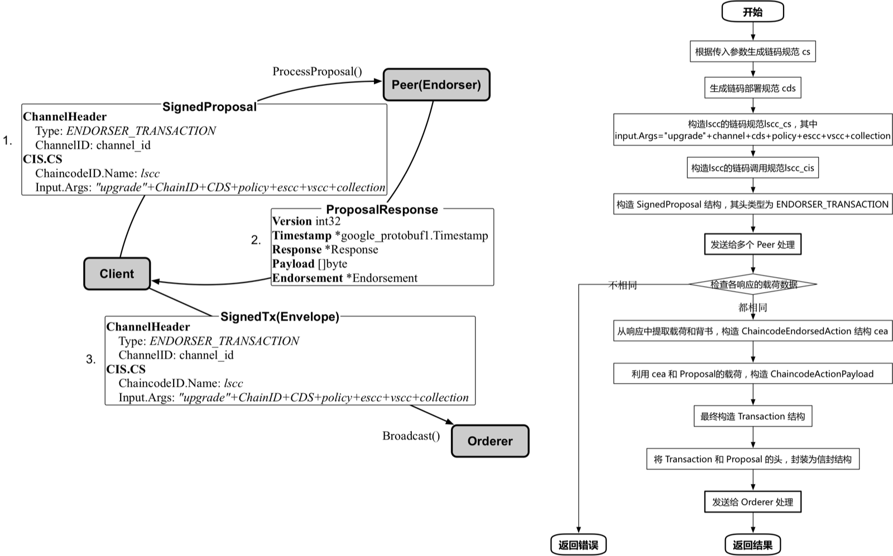

* 首先，需要创建一个封装了 LSCC 调用交易的 SignedProposal 消息。注意 instantiate 和 upgrade 支持指定 policy、escc、vscc 等参数。LSCC 的 ChaincodeSpec 结构中，Input 中包括类型（“upgrade”）、通道 ID、ChaincodeDeploymentSpec 结构、背书策略、escc 和 vscc 等。
* 调用 EndorserClient，发送 gRPC 消息，将签名后的 Proposal 发给指定的 Peer 节点（Endorser），调用 `ProcessProposal(ctx context.Context, in *SignedProposal, opts ...grpc.CallOption) (*ProposalResponse, error)` 方法，进行背书处理。节点会模拟运行 LSCC 的调用交易，启动链码容器。实例化成功后会返回 ProposalResponse 消息（其中包括背书签名）。
* 根据 Peer 返回的 ProposalResponse 消息，创建一个 SignedTX（Envelop 结构的交易，带有签名）。
* 使用 BroadcastClient 将交易消息通过 gRPC 通道发给 Orderer，Orderer 会进行全网排序，并广播给 Peer 进行确认提交。

### 查询链码安装和实例化信息

list 子命令支持查询某个节点上已经安装的链码信息（--installed）或某个通道内已经实例化的链码信息（--instantiated）。请求发送到 Peer 节点，调用 LSCC 系统链码提供的接口进行查询。

例如，如下命令查询默认 Peer 上安装的链码情况，返回结果显示已安装链码 exp02 的 v1.0 版本。

```bash
$ peer chaincode list \
		--installed \

Get installed chaincodes on peer:
Name: exp02, Version: 1.0, Path: examples/chaincode/go/chaincode_example02, Id: 08ca675c39a8bae2631847a521fc92e12969fe122bd4a9df0a707cf1059e8730
```

例如，如下命令查询通道 ${APP_CHANNEL} 内实例化的链码情况，返回结果显示已实例化链码 exp02 的 v1.0 版本。

```bash
$ peer chaincode list \
		--instantiated \
		-C ${APP_CHANNEL}

Get instantiated chaincodes on channel businesschannel:
Name: exp02, Version: 1.0, Path: examples/chaincode/go/chaincode_example02, Escc: escc, Vscc: vscc
```

链码列出安装和实例化过程的实现流程如下图所示。

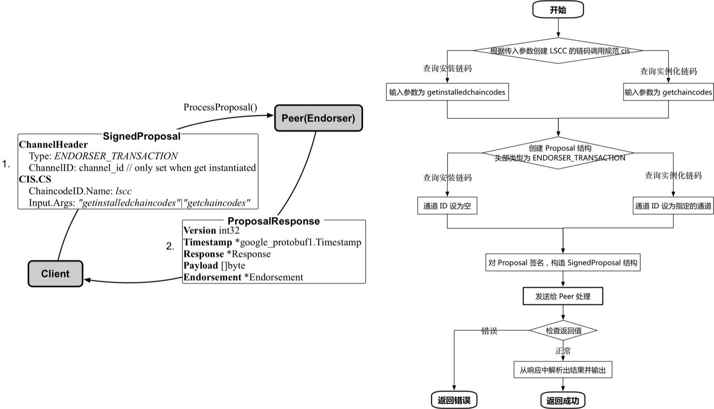

* 首先，根据输入参数创建一个 LSCC 的链码调用规范。LSCC 的 ChaincodeSpec 结构中，Input 参数根据查询类型设置为 getinstalledchaincodes 或 getchaincodes。
* 根据 LSCC 的链码调用规范封装为一个 Proposal 结构，头部类型为 ENDORSER_TRANSACTION，通道 ID 设置为空（查询安装信息）或给定的通道（查询实例化信息）。
* 调用 EndorserClient，发送 gRPC 消息，将签名后的 Proposal 发给指定的 Peer 节点（Endorser），调用 `ProcessProposal(ctx context.Context, in *SignedProposal, opts ...grpc.CallOption) (*ProposalResponse, error)` 方法，进行背书处理。节点会运行 LSCC 的相应逻辑，成功后会返回 ProposalResponse 消息。
* 客户端解析 Peer 返回的 ProposalResponse 消息，如果成功则打印查询结果。

### 打包链码和签名

通过将链码相关的数据进行封装，可以实现对其进行打包和签名操作。

打包命令支持三个特定参数：

* -s, --cc-package：表示创建完整打包格式，而不是仅打包 ChaincodeDeploymentSpec 结构。
* -S, --sign：对打包的文件使用本地的 MSP（core.yaml 中的 localMspid 指定）进行签名。
* -i --instantiate-policy string：指定实例化策略。可选参数。

例如，通过如下命令创建一个本地的打包文件 ccpack.out。

```bash
$ peer chaincode package \
	-n test_cc -p github.com/hyperledger/fabric/examples/chaincode/go/chaincode_example02 \
	-v 1.0 \
	-s \
	-S \
	-i "AND('Org1.admin')" \
	ccpack.out
```

打包后的文件，也可以直接用于 install 操作，如

```bash
$ peer chaincode install ccpack.out
```

签名命令则对一个打包文件进行签名操作（添加当前 MSP 签名到签名列表中）。

```bash
$ peer chaincode signpackage ccpack.out signedccpack.out
```

其中，打包文件结构主要包括三部分的信息：

* ChaincodeDeploymentSpec 结构；
* 实例化策略信息；
* 拥有者的签名列表。

实现的整体流程如下：

* 首先会调用 `InitCmdFactory(isEndorserRequired, isOrdererRequired bool) (*ChaincodeCmdFactory, error)` 方法初始化 Signer 等结构。对于打包命令来说纯属本地操作，不需要 Endorser 和 Orderer 的连接。
* 调用 getChaincodeSpec() 方法，解析命令行参数，根据所指定的数据生成 ChaincodeSpec 结构。
* 根据 ChaincodeSpec 结构，结合链码相关数据构造 ChaincodeDeploymentSpec 结构，并传入 getChaincodeInstallPackage 方法。
* getChaincodeInstallPackage 方法基于传入的 ChaincodeDeploymentSpec 结构，添加实例化策略和签名信息等，生成一个 SignedChaincodeDeploymentSpec，并进一步作为 Data 生成一个 Envelope 结构，其中 ChannelHeader 指定为 CHAINCODE_PACKAGE。
* 将 Envelope 结构序列化，写到指定的本地文件。

其中，Envelope 结构如下图所示。

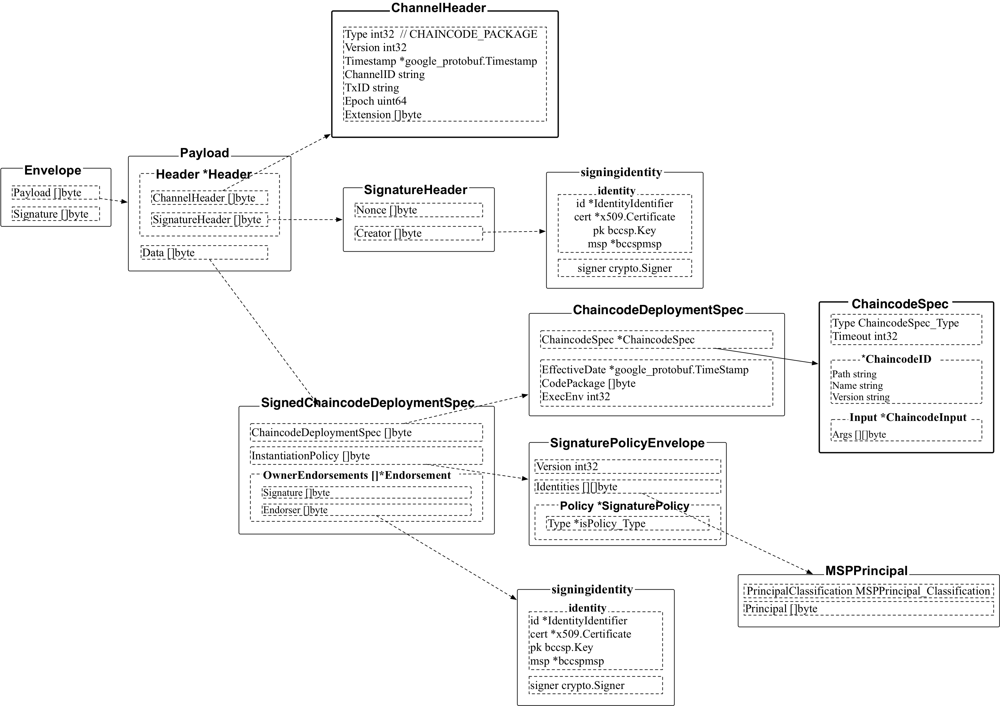
