## 使用多通道

### 通道操作命令

命令行下 `peer channel` 命令支持包括 create、fetch、join、list、update、getinfo、signconfigtx 等子命令。其中，create、fetch、update 命令主要与排序服务打交道；join、list、getinfo 与 Peer 节点打交道，signconfigtx 为本地处理。

各个命令的功能如下表所示：

命令 | 发往组件 | 功能
-- | -- | --
create | 排序服务 | 创建一个新的应用通道。
fetch | 排序服务 | 从排序服务获取指定区块。
update | 排序服务 | 更新通道的配置信息，如组织、锚节点配置等。
join  | Peer 节点 | 将 Peer 节点加入到某个应用通道中。
list | Peer 节点 | 列出 Peer 已经加入的所有的应用通道。
getinfo | Peer 节点 | 获取通道的基本信息，包括高度、当前 Hash、前导区块 Hash。
signconfigtx | 本地操作 | 为本地的通道配置更新添加签名。

可以通过 `peer channel <subcommand> --help` 来查看具体的命令使用说明。

### 命令选项

`peer channel` 命令支持的全局选项如下。

全局选项 | 类型 | 含义
--- | --- | ---
--connTimeout | int | 客户端连接超时，默认为 3 秒
--keyfile | string | 与排序服务双向 TLS 认证时使用的私钥文件
-o, --orderer | string | Orderer 服务地址
--tls | bool | 连接到 Orderer 服务时是否启用 TLS
--cafile | string | 信任的排序服务的 TLSCA 证书，PEM 编码格式
--certfile | string | 与排序服务双向 TLS 认证时使用的证书文件
--clientauth | bool | 与排序服务通信时是否启用双向 TLS 认证
--ordererTLSHostnameOverride | string | 验证 Orderer TLS 时候覆盖所校验的主机名

默认情况下，客户端会从环境变量中读取操作的 Peer 地址和客户端身份信息，因此需要提前指定。

例如，下面命令指定了对 org1 的 peer1 节点执行相关操作命令，身份为组织的管理员 Admin@org1。

```bash
$ CORE_PEER_ADDRESS=peer1:7051 \
  CORE_PEER_LOCALMSPID="org1" \
  CORE_PEER_MSPCONFIGPATH=/etc/hyperledger/fabric/crypto/org1/users/Admin@org1/msp \
  CORE_PEER_TLS_ROOTCERT_FILE=/etc/hyperledger/fabric/crypto/org1/peers/peer1/tls/ca.cert \
  peer channel <subcommand>
```

### 创建通道

create 子命令由拥有创建通道权限的组织的管理员身份来调用，在指定的排序服务上创建新的应用通道，需要提供排序服务地址。

该子命令支持选项包括：

* -c, --channelID string：所创建通道的名称；
* -f, --file string：指定创建通道所用的交易文件；
* --outputBlock string：创建通道成功后，将初始区块写到本地指定文件，默认为 ./<channelID>.block；
* -t, --timeout duration：创建超时，默认为 5 秒。

一般情况下，通过提前创建的通道配置交易文件来指定配置信息。如果不指定通道配置文件，则默认采用 SampleConsortium 配置和本地的 MSP 组织来构造配置交易结构。

例如，下面命令利用事先创建的配置交易文件 channel.tx 来创建新的应用通道 businesschannel。

```bash
$ APP_CHANNEL="businesschannel"
$ peer channel create \
  -o orderer:7050 \
  -c ${APP_CHANNEL} \
  -f ./channel.tx \
  --timeout 30
```

加入成功后，本地会产生该应用通道的初始区块文件 businesschannel.block。Ordering 服务端也会输出类似 `orderer | UTC [orderer/multichain] newChain -> INFO 004 Created and starting new chain newchannel` 的成功消息。

创建应用通道的主要过程如下图所示。

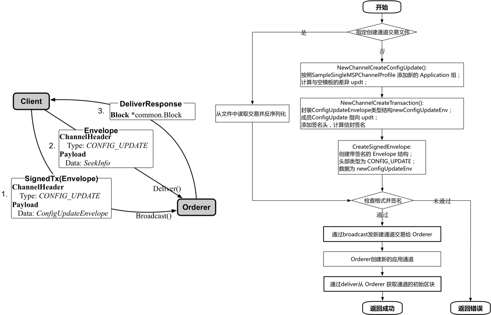

主要步骤包括：

* 客户端调用 sendCreateChainTransaction()，检查指定的配置交易文件，或者利用默认配置，构造一个创建应用通道的配置交易结构，封装为 Envelope，指定 channel 头部类型为 CONFIG_UPDATE。
* 客户端发送配置交易到排序服务。
* Orderer 收到 CONFIG_UPDATE 消息后，检查指定的通道还不存在，则开始创建通道，并构造该应用通道的初始区块。
    * Orderer 首先检查通道应用（Application）配置中的组织都在创建的联盟（Consortium）配置组织中。
    * 之后从系统通道中获取 Orderer 相关的配置，并创建应用通道配置，对应 mod_policy 为系统通道配置中的联盟指定信息。
    * 接下来根据 CONFIG_UPDATE 消息的内容更新获取到的配置信息。所有配置发生变更后版本号都要更新。
    * 创建签名 Proposal 消息（头部类型为 ORDERER_TRANSACTION），发送到后端队列（如 Kafka），指定目标为系统通道；
    * Orderer 从后端队列收到对应消息，初始化本地账本结构，完成应用通道的创建过程。
* 客户端从 Orderer Deliver gRPC 服务获取应用通道的初始区块（具体过程类似 fetch 命令），请求类型为 CONFIG_UPDATE，负载为 SeekInfo。
* 客户端将收到的区块写入到本地的 chainID + ".block" 文件。这个文件后续会被需要加入到通道的节点使用。

其中，最关键的数据结构是配置交易相关的 Envelope 结构，如下图所示。

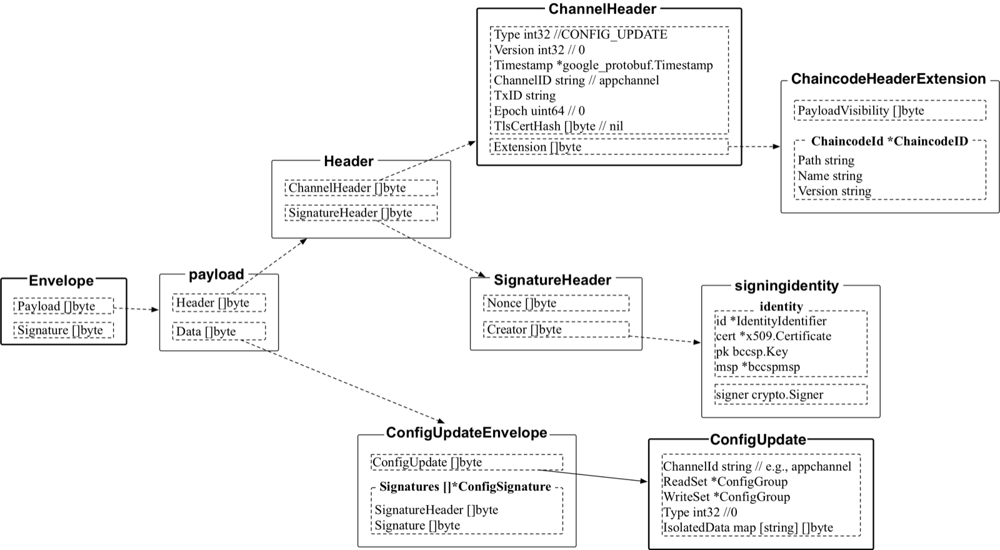

### 加入通道

join 子命令会让指定的 Peer 节点加入到指定的应用通道。需要提前拥有所加入应用通道的初始区块文件，并且只有属于通道的某个组织的管理员身份可以成功执行该操作。加入通道命令主要通过调用 Peer 的配置系统链码进行处理。

例如，通过如下命令将本地 Peer 加入到应用通道 businesschannel 中。

该子命令支持选项包括：

* -b, --blockpath string：指定初始区块文件的路径

```bash
$ peer channel join \
  -b ${APP_CHANNEL}.block

Peer joined the channel!
```

加入应用通道的主要过程如下图所示。

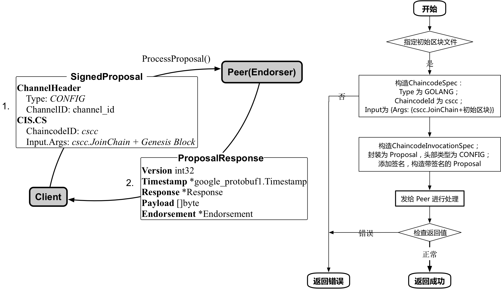

主要步骤包括：

* 客户端首先创建一个 ChaincodeSpec 结构，其 input 中的 Args 第一个参数是 CSCC.JoinChain（指定调用配置链码的操作），第二个参数为所加入通道的配置区块。
* 利用 ChaincodeSpec 构造一个 ChaincodeInvocationSpec 结构。
* 利用 ChaincodeInvocationSpec，创建 Proposal 结构并进行签名，channel 头部类型为 CONFIG。
* 客户端通过 gRPC 将 Proposal 签名后发给 Endorser（所操作的 Peer），调用 `ProcessProposal(ctx context.Context, in *SignedProposal, opts ...grpc.CallOption) (*ProposalResponse, error)` 方法进行处理，主要通过配置系统链码从配置区块中读取通道内已有成员的 TLS CA 根证书，加入到本地的根证书信任结构中，并进行本地链结构的初始化工作。
* 初始化完成后，即可收到来自通道内的 Gossip 消息等。

其中，比较重要的数据结构包括 ChaincodeSpec、ChaincodeInvocationSpec、Proposal 等，它们的具体结构如下图所示。

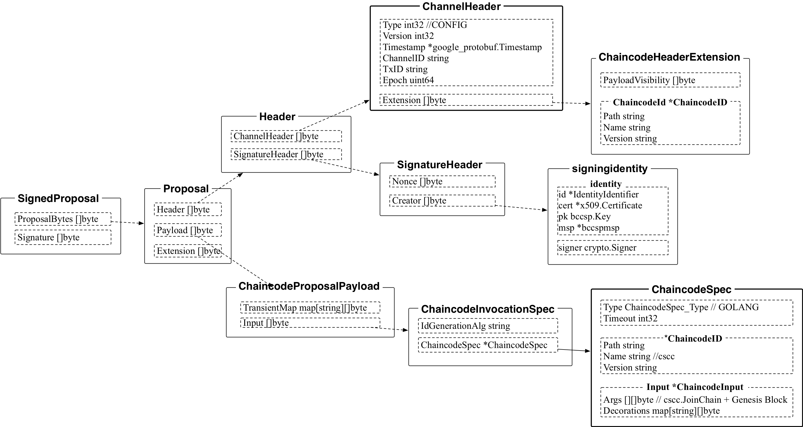

*注：权限不足情况下，执行加入通道命令可能不会报错，但实际上并没有加入到通道，也不会获取到通道内的数据。*

### 列出所加入的通道

list 子命令会列出指定的 Peer 节点已经加入的所有应用通道的列表。加入通道命令也是主要通过调用 Peer 的配置系统链码进行处理。

例如通过如下命令，可以列出本地 Peer 已经加入的所有应用通道。

```bash
$ peer channel list
Channels peers has joined to:
   businesschannel
   businesschannel2
```

列出所加入应用通道的主要过程如下图所示。

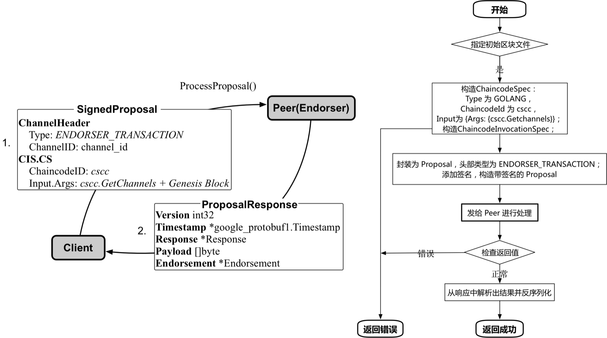

主要步骤包括：

* 客户端首先创建一个 ChaincodeSpec 结构，其 input 中的 Args 第一个参数是 CSCC.GetChannels（指定调用配置链码的操作）。
* 利用 ChaincodeSpec 构造一个 ChaincodeInvocationSpec 结构。
* 利用 ChaincodeInvocationSpec，创建 Proposal 结构并进行签名，channel 头部类型为 ENDORSER_TRANSACTION。
* 客户端通过 gRPC 将 Proposal 发给 Endorser（所操作的 Peer），调用 `ProcessProposal(ctx context.Context, in *SignedProposal, opts ...grpc.CallOption) (*ProposalResponse, error)` 方法进行处理，主要是通过配置系统链码查询本地链信息并返回。
* 命令执行成功后，客户端会受到来自 Peer 端的回复消息，从其中提取出应用通道列表信息并输出。

其中，比较重要的数据结构同样也包括 ChaincodeSpec、ChaincodeInvocationSpec、Proposal 等，注意 channel 头部类型和 ChaincodeSpec 结构中数据与加入通道的消息中略有差异。

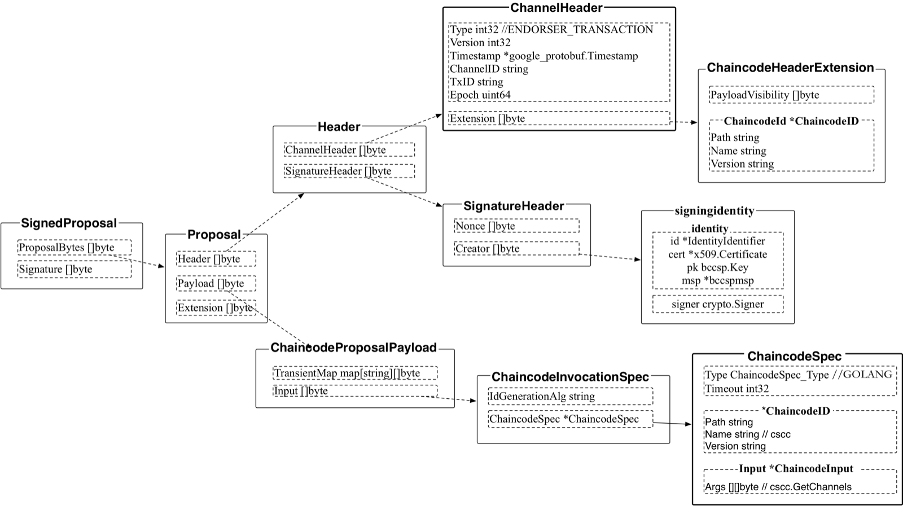

### 获取某区块

fetch 子命令会向排序服务进行查询，获取到指定通道的指定区块。并将收到的区块写入到本地的文件（默认为 chainID_序号.block）。

命令格式为 `peer channel fetch <newest|oldest|config|(number)> [outputfile] [flags]`。

该子命令支持选项包括：

* -c, --channelID string：所获取的通道的名称；

例如通过如下命令，可以获取到已存在的 businesschannel 应用通道的初始区块，并保存到本地的 businesschannel.block 文件。

```bash
$ peer channel fetch oldest businesschannel_0.block \
  -c businesschannel \
  -o orderer:7050

$ peer channel fetch 1 businesschannel_1.block \
  -c businesschannel \
  -o orderer:7050
```

获取区块的主要过程如下图所示。

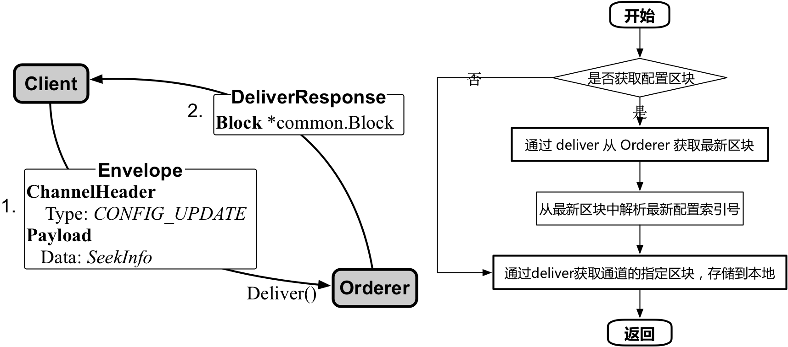

主要步骤包括：

* 客户端构造 SeekInfo 结构，该结构可以指定要获取的区块范围。这里 Start、Stop 指定为目标区块；
* 客户端利用 SeekInfo 结构，构造 Envelope 并进行签名，通过deliverClient经 gRPC 通道发给排序服务接口；
* 从 Orderer 获取指定通道的区块后，写到本地文件中。

其中，比较重要的数据结构包括 SeekInfo、Envelope 结构等，它们的具体结构如下图所示。

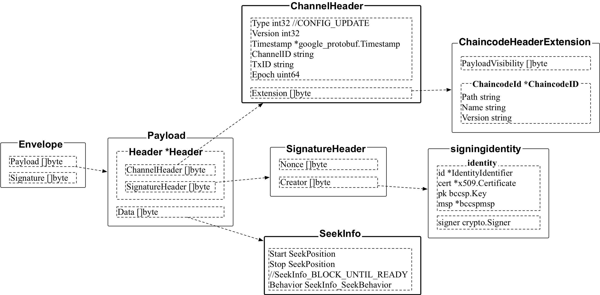

### 更新通道配置

update 子命令的执行过程与 create 命令类似，会向排序服务发起更新配置交易请求。

该命令执行也需要提前创建的通道更新配置交易文件来指定配置信息。

该子命令支持选项包括：

* -c, --channelID string：所更新通道的名称；
* -f, --file string：指定更新通道所用的交易文件。

例如，通过如下操作来更新通道中的锚节点配置，首先利用 configtxgen 来创建锚节点配置更新文件，之后使用该更新文件对通道进行配置更新操作。

```bash
$ configtxgen \
    -profile APP_CHANNEL_PROFILE \
    -outputAnchorPeersUpdate ./update_anchors.tx \
    -channelID businesschannel \
    -asOrg Org1MSP
$ peer channel update \
    -c businesschannel \
    -o orderer:7050 \
    -f ./update_anchors.tx
```

更新应用通道的主要过程如下图所示。

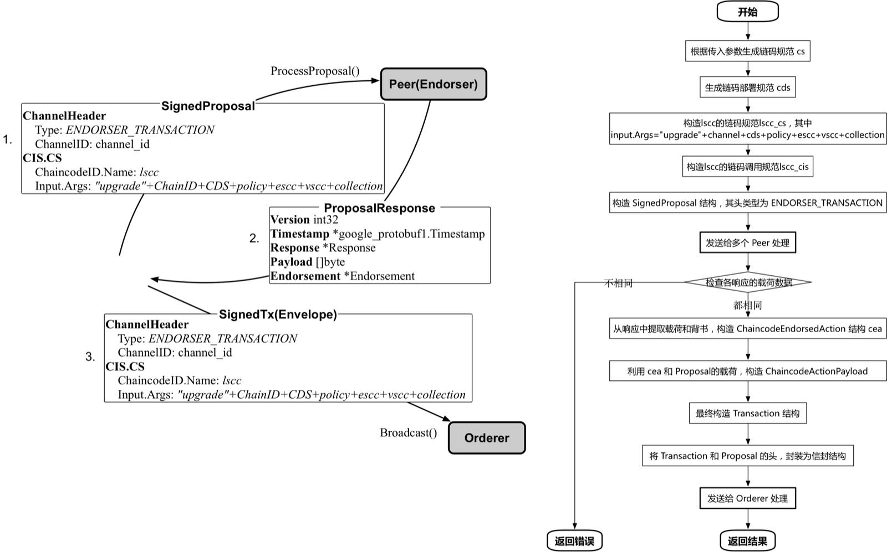

主要步骤包括：

* 客户端读取指定的配置交易文件，构造一个更新应用通道的配置交易信封结构，确认通道头部类型为 CONFIG_UPDATE，通道 ID 存在且与命令行参数一致。
* 客户端对更新信封结构进行签名，最终构造签名信封结构，通道头部类型为 CONFIG_UPDATE。
* 客户端通过 gRPC 发送配置交易到排序服务的 Broadcast 接口。
* Orderer 收到 CONFIG_UPDATE 消息后，判断是配置消息，则进行配置相关处理：
    * 调用 ProcessConfigUpdateMsg() 尝试接受配置，计算新配置结构（封装为 CONFIG 类型的信封结构）和对应的序号；
    * Orderer 将新的配置信封结构发送给后端队列（如 Kafka）进行排序，并响应客户端答复；
    * 排序完成后，Orderer 将新的配置交易存放到账本结构中等待 Peer 节点获取。
* 客户端在发出请求后会接收到响应，但实际请求仍在 Orderer 端异步进行。

其中，最关键的数据结构是配置交易相关的 Envelope 结构，如下图所示。

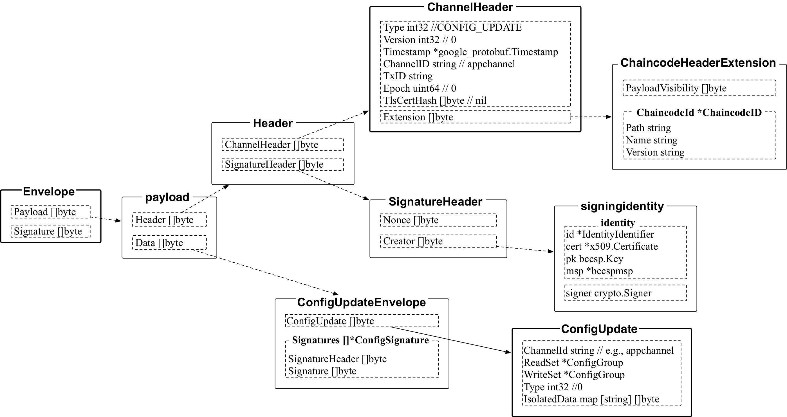

### 获取通道基本信息

getinfo 可以向指定的 Peer 节点获取某个通道的基本信息，包括高度、当前 Hash、前导区块 Hash 等。

该子命令支持选项包括：

* -c, --channelID string：所获取信息的通道的名称。

例如，查询默认 Peer 节点上 businesschannel 通道的信息：

```bash
$ peer channel getinfo -c businesschannel
Blockchain info: {"height":7,"currentBlockHash":"bHlVT/swOzeJ8JaTXyhStu40QL4JBxZBD695FISJf2o=","previousBlockHash":"ViDfGewz/GRg3wDz68dtg4s9NNojtq3ciBB4VcpGBuk="}
```

获取通道基本信息的主要过程如下图所示。

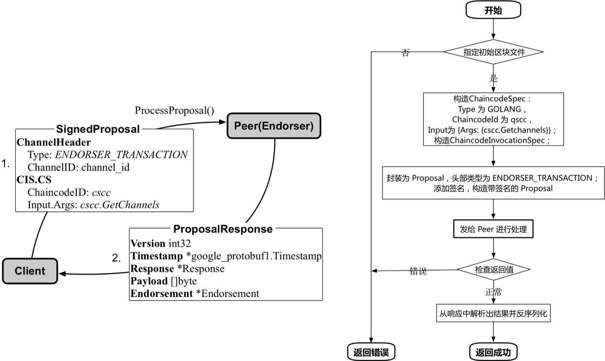

主要步骤包括：

* 客户端首先创建一个 ChaincodeSpec 结构，其 input 中的 Args 第一个参数是 CSCC.Getchannels（指定调用配置链码的操作），第二个参数为所加入通道的配置区块；
* 利用 ChaincodeSpec 构造一个 ChaincodeInvocationSpec 结构；
* 利用 ChaincodeInvocationSpec，创建 Proposal 结构并进行签名，channel 头部类型为 CONFIG。
* 客户端通过 gRPC 将 Proposal 签名后发给 Endorser（所操作的 Peer），调用 `ProcessProposal(ctx context.Context, in *SignedProposal, opts ...grpc.CallOption) (*ProposalResponse, error)` 方法进行处理，主要通过配置系统链码获取对应账本的基本信息并返回客户端。

其中，比较重要的数据结构包括 ChaincodeSpec、ChaincodeInvocationSpec、Proposal 等，它们的具体结构如下图所示。


### 对通道配置更新添加签名

signconfigtx 可以为本地的通道更新交易进行签名，属于客户端本地操作，不跟 Peer 或 Orderer 打交道。

该子命令支持选项包括：

* -f, --file string：指定所签名的通道配置更新交易文件。

例如，对本地的通道配置更新添加签名。

```bash
$ peer channel signconfigtx -f config_delta_env.pb
```
