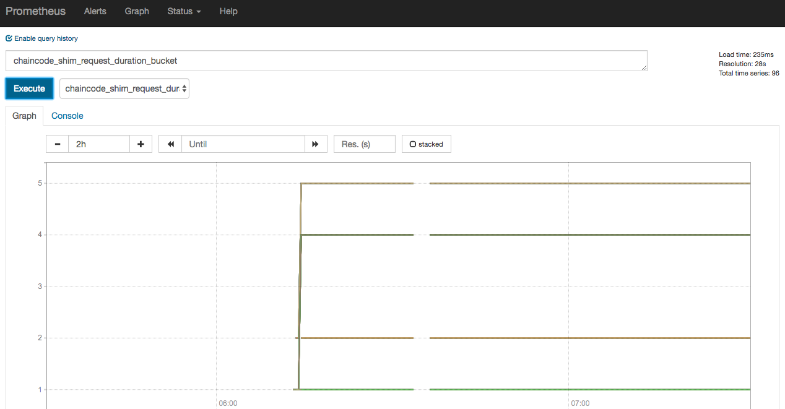

## 使用运维服务

Fabric 自 v1.4.0 版本开始，加强了对运维操作的支持，在 Peer 和 Orderer 上提供了一系列的 RESTful API 来协助监控服务状态。

这些 API 主要分为三大类：

* 获取和配置日志级别，资源为 /logspec；
* 监控系统组件的健康状态，资源为 /healthz；
* 获取系统统计信息，支持外部 Prometheus 拉取，或推送给 StatsD。

它们可以通过 Peer 和 Orderer 配置文件中的 operations 字段进行开启和配置。Peer 默认监听端口为 9443，Orderer 默认监听端口为 8443。

下面分别进行讲解。

### 获取和配置日志级别

日志资源为 /logspec。

获取日志级别可以发送 GET 请求，返回 JSON 格式对象。例如获取当前日志级别，可以使用如下命令。

```bash
$ curl http://orderer:8443/logspec
{"spec":"info"}
$ curl http://peer:9443/logspec
{"spec":"info"}
```

修改日志级别可以发送 PUT 请求，消息内容为字典结构：{"spec": "[<logger>[,<logger>...]=]<level>[:[<logger>[,<logger>...]=]<level>...]"}，例如修改 Gossip 模块日志级别为 DEBUG，全局默认级别仍为 INFO。

```bash
$ curl -XPUT \
	-d '{"spec":"gossip=debug:info"}' \
	http://peer:9443/logspec
```

### 监控系统组件的健康状态

资源为 /healthz。

可以发送 GET 请求，返回带有健康信息的 JSON 格式对象。例如获取健康状况，可以使用如下命令。

```bash
$ curl http://orderer:8443/healthz
{"status":"OK","time":"XXXX-YY-ZZT01:02:03.567890Z"}
$ curl http://peer:9443/healthz
{"status":"OK","time":"XXXX-YY-ZZT01:02:03.567890Z"}
```

目前健康状况支持检测链码容器运行的 Docker 服务的状态，未来会扩展支持更多组件健康状态。

### 获取系统统计信息

资源为 /metrics。

可以发送 GET 请求，返回各个指标的统计信息。例如获取当前统计信息，可以使用如下命令。

```bash
$ curl http://orderer:8443/metrics
# HELP blockcutter_block_fill_duration The time from first transaction enqueuing to the block being cut in seconds.
# TYPE blockcutter_block_fill_duration histogram
blockcutter_block_fill_duration_bucket{channel="businesschannel",le="0.005"} 0
blockcutter_block_fill_duration_bucket{channel="businesschannel",le="0.01"} 0
blockcutter_block_fill_duration_bucket{channel="businesschannel",le="0.025"} 0
...
process_virtual_memory_bytes 3.37268736e+08
# HELP process_virtual_memory_max_bytes Maximum amount of virtual memory available in bytes.
# TYPE process_virtual_memory_max_bytes gauge
process_virtual_memory_max_bytes -1

$ curl http://peer:9443/metrics
# HELP chaincode_launch_duration The time to launch a chaincode.
# TYPE chaincode_launch_duration histogram
chaincode_launch_duration_bucket{chaincode="+lifecycle:1.4.0",success="true",le="0.005"} 1
chaincode_launch_duration_bucket{chaincode="+lifecycle:1.4.0",success="true",le="0.01"} 1
chaincode_launch_duration_bucket{chaincode="+lifecycle:1.4.0",success="true",le="0.025"} 1
...
process_virtual_memory_bytes 4.21298176e+08
# HELP process_virtual_memory_max_bytes Maximum amount of virtual memory available in bytes.
# TYPE process_virtual_memory_max_bytes gauge
process_virtual_memory_max_bytes -1
```

Orderer 的统计信息包括切块时间、广播队列、校验时间、发送块数量、Go 进程信息、gRPC 请求、系统资源等，可以用来详细了解 Orderer 资源使用和工作情况。

Peer 的统计信息包括链码执行情况、Go 进程信息、gRPC 请求、区块处理、账本提交、数据库更新、系统资源等多个指标，可以实时了解 Peer 资源使用和工作情况。

当然，直接阅读这些统计指标并不高效，更方便的是通过外部监控工具。如果使用 StatsD 来分析数据，需要在 Peer 和 Orderer 配置文件中指定 StatsD 服务器地址（StatsD 是推送方式）；如果使用 Prometheus，直接在其配置中指定 Peer 和 Orderer 的服务地址即可（Prometheus 是推送方式）。

以 Prometheus 为例，配置中指定 Peer 和 Orderer 地址后，Prometheus 会主动从 /metrics API 获取统计信息。此时通过 Prometheus 的图形界面（默认监听在 9090 端口）可以查看到这些指标的数据和统计图。

下图展示了链码 shim 层请求的执行延迟统计。



用户也可以集成使用更多第三方系统来监控和分析 Fabric 系统的监控数据，实现自动化的运维管理。
