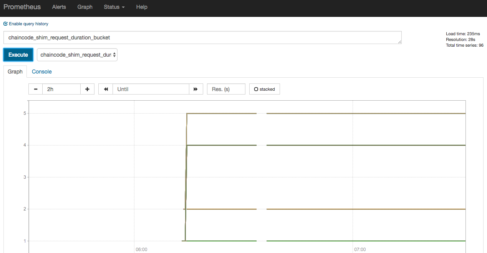

## 使用运维服务

Fabric Peer 和 Orderer 都内置了运维服务（Operations Service）。它是独立于 Fabric 交易、背书和排序服务之外的 HTTP REST API，面向运维人员使用，不通过通道 MSP 做访问控制。

运维服务主要提供以下资源：

* `/logspec`：获取和修改运行时日志级别；
* `/healthz`：检查组件健康状态；
* `/metrics`：在启用 Prometheus provider 时暴露指标；
* `/version`：查看组件版本和构建信息。

Peer 的示例监听地址通常为 `127.0.0.1:9443`，Orderer 的示例监听地址通常为 `127.0.0.1:8443`。端口号本身不代表 HTTPS：如果 operations TLS 未启用，使用普通 `http://`；如果启用了 operations TLS，则使用 `https://` 并按配置提供客户端证书。

### 配置运维服务

Peer 在 `core.yaml` 的 `operations` 和 `metrics` 段配置：

```yaml
operations:
  listenAddress: 127.0.0.1:9443
  tls:
    enabled: false
    cert:
      file:
    key:
      file:
    clientAuthRequired: false
    clientRootCAs:
      files: []

metrics:
  provider: prometheus
```

对应的常用环境变量前缀为 `CORE_`：

```bash
CORE_OPERATIONS_LISTENADDRESS=0.0.0.0:9443
CORE_OPERATIONS_TLS_ENABLED=false
CORE_METRICS_PROVIDER=prometheus
CORE_METRICS_STATSD_ADDRESS=127.0.0.1:8125
```

Orderer 在 `orderer.yaml` 的 `Operations` 和 `Metrics` 段配置：

```yaml
Operations:
  ListenAddress: 127.0.0.1:8443
  TLS:
    Enabled: false
    Certificate:
    PrivateKey:
    ClientAuthRequired: false
    ClientRootCAs: []

Metrics:
  Provider: prometheus
```

对应的常用环境变量前缀为 `ORDERER_`：

```bash
ORDERER_OPERATIONS_LISTENADDRESS=0.0.0.0:8443
ORDERER_OPERATIONS_TLS_ENABLED=false
ORDERER_METRICS_PROVIDER=prometheus
ORDERER_METRICS_STATSD_ADDRESS=127.0.0.1:8125
```

注意不要把 Peer 的 `CORE_*` 和 Orderer 的 `ORDERER_*` 混用。StatsD 的配置键也区分大小写和组件前缀，例如 Peer 使用 `CORE_METRICS_STATSD_WRITEINTERVAL`，Orderer 使用 `ORDERER_METRICS_STATSD_WRITEINTERVAL`。

### 获取和配置日志级别

日志资源为 `/logspec`。

获取日志级别可以发送 GET 请求，返回 JSON 格式对象。例如在未启用 operations TLS 时：

```bash
$ curl http://orderer:8443/logspec
{"spec":"info"}
$ curl http://peer:9443/logspec
{"spec":"info"}
```

修改日志级别可以发送 PUT 请求，消息内容为 `{"spec":"[<logger>[,<logger>...]=]<level>[:[<logger>[,<logger>...]=]<level>...]"}`。例如修改 Gossip 模块日志级别为 DEBUG，全局默认级别仍为 INFO：

```bash
$ curl -X PUT \
  -H 'Content-Type: application/json' \
  -d '{"spec":"gossip=debug:info"}' \
  http://peer:9443/logspec
```

启用 operations TLS 时，日志和指标接口需要有效客户端证书；如果 `clientAuthRequired` 为 `true`，所有接口都要求客户端证书。

### 监控系统组件的健康状态

健康检查资源为 `/healthz`。

可以发送 GET 请求，返回带有健康信息的 JSON 格式对象：

```bash
$ curl http://orderer:8443/healthz
{"status":"OK","time":"XXXX-YY-ZZT01:02:03.567890Z"}
$ curl http://peer:9443/healthz
{"status":"OK","time":"XXXX-YY-ZZT01:02:03.567890Z"}
```

Peer 健康检查会覆盖已配置的依赖，例如 Docker 链码运行环境和 CouchDB 状态数据库。Orderer 和 Peer 都会根据已注册的健康检查返回 `200 OK` 或 `503 Service Unavailable`。

### 获取系统统计信息

指标资源为 `/metrics`。只有当 `metrics.provider` / `Metrics.Provider` 设置为 `prometheus` 时，Fabric 才会在运维服务上暴露 Prometheus 指标。

```bash
$ curl http://orderer:8443/metrics

# HELP blockcutter_block_fill_duration The time from first transaction enqueuing to the block being cut in seconds.
# TYPE blockcutter_block_fill_duration histogram
blockcutter_block_fill_duration_bucket{channel="businesschannel",le="0.005"} 0
...

$ curl http://peer:9443/metrics

# HELP chaincode_launch_duration The time to launch a chaincode.
# TYPE chaincode_launch_duration histogram
chaincode_launch_duration_bucket{chaincode="basic",success="true",le="0.005"} 1
...
```

Orderer 的统计信息包括切块时间、广播队列、校验时间、发送块数量、Go 进程信息、gRPC 请求、系统资源等。Peer 的统计信息包括链码执行、Go 进程信息、gRPC 请求、区块处理、账本提交、状态数据库更新、系统资源等。

Fabric 支持两类指标模式：Prometheus 是拉取方式，由 Prometheus 主动访问 `/metrics`；StatsD 是推送方式，由 Peer 或 Orderer 将指标推送到 StatsD 服务。生产环境中应只暴露给受控监控网络，并优先启用 operations TLS 和专用运维 CA 证书。

下图展示了链码 shim 层请求的执行延迟统计。


