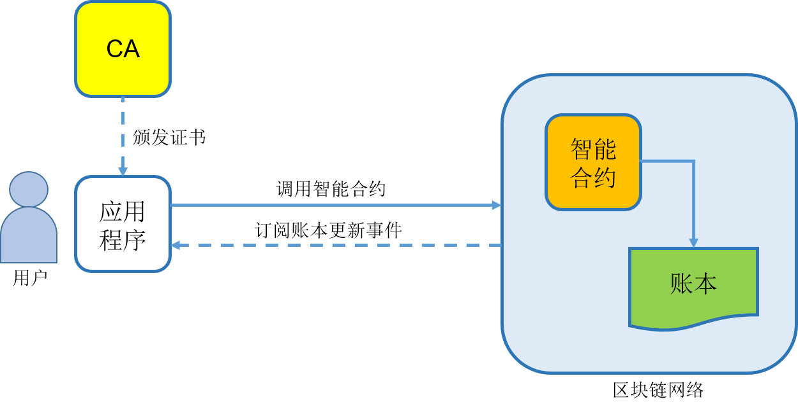

## 简介

区块链应用，一般由若干部署在区块链网络中的智能合约，以及调用这些智能合约的用户应用程序组成。典型结构如下图所示。

其中，用户访问与业务本身相关的上层应用程序，应用程序调用智能合约，智能合约与账本直接交互。

开发者除了需要开发传统的上层业务应用，还需要编写区块链智能合约代码。

典型的智能合约是无状态的、事件驱动的代码，被调用时自动执行合约内逻辑。智能合约可以创建和操作账本状态，这些链上状态记录业务相关的重要数据（如资产信息和所有权）。区块链网络中可以部署多个智能合约，应用程序通过名称、版本号等来指定调用特定智能合约。

在支持访问控制的场景下，应用程序还需提前从 CA 处申请证书，得到访问许可。

### 智能合约开发

智能合约直接与账本结构打交道，同时支持上层业务逻辑，作用十分关键。设计得当的智能合约可以简化应用开发；反之则可能导致各种问题。

为了合理设计智能合约，开发者需要了解区块链平台的智能合约结构、语言特性、状态存储方式等。例如，比特币网络不支持高级语言，所支持的处理逻辑存在限制；超级账本 Fabric 项目支持多种高级语言，支持图灵完备的处理逻辑，可以开发复杂的逻辑。

此外，开发者还需要考虑智能合约的生命周期管理，包括代码的编写、版本管理、提交验证、升级等，都需要遵循标准规范。

本章后续内容会以超级账本 Fabric 为例，讲解其智能合约的开发过程。

### 应用程序开发

应用程序通常以 Web、移动端 App 等形式呈现，通过调用智能合约提供的方法接口来实现业务逻辑。应用程序既可以运行在区块链网络的节点上，也可以运行在外部服务器上，但必须可以访问到区块链网络服务。

为方便进行身份管理、网络监听、调用智能合约等，应用程序开发通常需要集成区块链 SDK。以超级账本 Fabric 为例，社区提供的 SDK 封装了一系列与区块链网络打交道的基本方法，包括发送交易、监听网络事件、查询区块和交易信息等，能够提高对智能合约进行使用的效率。

例如，利用 SDK 可以自动化对智能合约的调用和确认过程：

* 客户端从 CA 获取合法的身份证书；
* 构造合法的交易提案发送给 Endorser 节点进行背书；
* 收集到足够多背书支持后，构造合法的交易请求，发给排序节点进行排序；
* 监听网络事件，确保交易已经写入账本。

Fabric 目前提供了 Node.Js、Python、Java、Go 等语言的 SDK，开发者可以根据需求自行选择。
