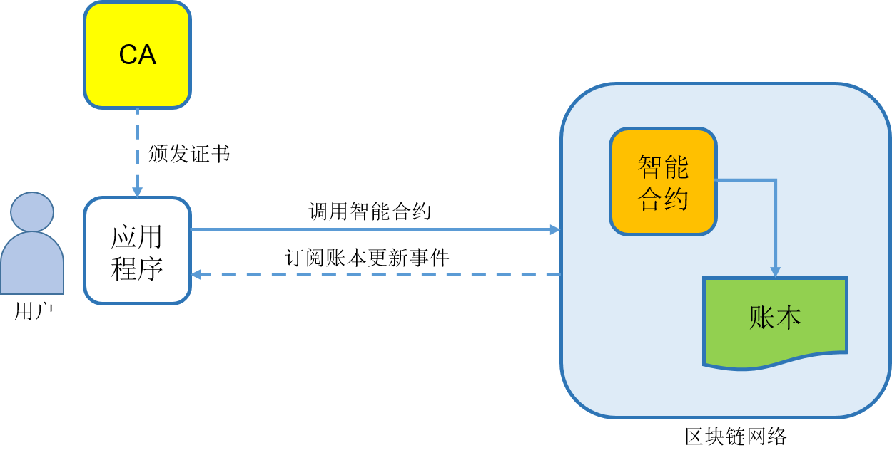

## 简介

区块链应用一般由两部分组成：部署在区块链网络中的智能合约，以及调用这些智能合约的用户应用程序。典型结构如下图所示。

用户访问与业务相关的上层应用程序，应用程序调用智能合约，智能合约再与账本直接交互。

开发者除了需要开发传统的上层业务应用，还需要编写链上智能合约代码。智能合约通常是无状态、事件驱动的代码，被调用时执行合约逻辑，并创建、读取或更新账本状态。这些链上状态记录业务相关的重要数据，如资产信息、所有权、交易记录等。

在支持访问控制的场景下，应用程序还需要提前从 CA 获取身份证书，并使用该身份连接区块链网络。

### 智能合约开发

智能合约直接操作账本状态，同时承载核心业务规则，设计质量会直接影响应用的安全性、可维护性和扩展性。

以超级账本 Fabric 为例，链码可以使用 Go、JavaScript/TypeScript、Java 等语言开发。Go 链码新项目优先使用 Contract API；只有需要更底层控制时，才直接使用 shim API。

本章后续内容以 Fabric 为例，讲解链码结构、开发方式和典型应用案例。

### 应用程序开发

应用程序通常以 Web、移动端 App、后端服务等形式呈现，通过调用智能合约交易函数来实现业务逻辑。应用程序既可以运行在区块链网络节点附近，也可以运行在外部服务器上，但必须能够访问 Fabric Gateway 所暴露的服务端点。

从 Fabric v2.4 起，客户端应用应优先使用官方 **Fabric Gateway API**。Gateway 负责协调背书、提交交易、等待提交状态、事件监听等流程，使应用代码集中在业务逻辑上。官方 Gateway 客户端 API 覆盖：

* Go；
* Node.js（TypeScript/JavaScript）；
* Java。

Python 相关 SDK 如果被提及，应视为社区方案或历史兼容方案，不应作为 Fabric v2.4+ 新项目的首选官方客户端 API。

应用程序通常需要完成以下步骤：

* 从 CA 或钱包中加载合法身份；
* 连接 Gateway；
* 获取 network 和 contract；
* 使用 evaluate 类调用读取账本状态；
* 使用 submit 类调用提交会更新账本的交易；
* 根据需要监听提交状态、链码事件或区块事件。
