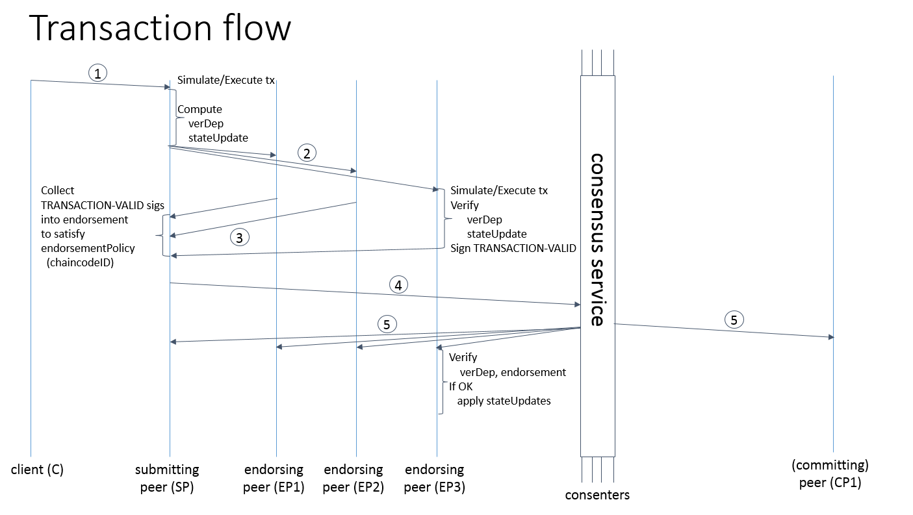

## 架构设计

*注：本章架构设计主要基于 Fabric 1.x 及后续版本。随着版本的演进，架构在模块化和性能上不断优化，但核心的交易模型和节点角色设计保持了一致性。关于 2.x/3.0 引入的智能合约（链码）生命周期管理等新特性，详见后续《管理链上代码》章节。*

传统的区块链平台（如比特币、早期以太坊）通常采用 **排序-执行（Order-Execute）** 的架构。在这种架构中，网络中的所有节点必须按照一致的顺序，依序执行每一笔交易。这种设计虽然结构简单，但容易遇到明显的性能瓶颈，并且由于所有节点必须执行所有智能合约逻辑，对智能合约的确定性（如不能包含随机数、时间戳）提出了极高的要求。

为了突破这些限制，满足企业级高并发、高隐私保护的业务需求，Hyperledger Fabric 创新性地提出了 **执行-排序-验证（Execute-Order-Validate）** 的解耦架构。

Fabric 的整体重构围绕着以下核心组件展开：**Peer节点（包含背书节点和提交节点）**、**排序服务节点（Orderer）**、**客户端（Client/SDK）** 以及 **成员身份管理服务（CA）**。

### 核心组件与角色分工

在现代 Fabric 架构中，节点的功能被清晰地解耦，不同的物理节点可以承担不同的网络角色：

#### 1. 客户端节点（Client）

客户端代表最终用户（应用程序），是发起交易的源头。客户端使用 Fabric 提供的 SDK（支持 Go, Java, Node.js 等）或 CLI 工具与区块链网络交互。它的主要职责包括：
* 构造交易提案（Proposal）并发送给预定义的背书节点。
* 收集背书节点的签名结果，并判断是否满足了智能合约规定的背书策略。
* 将收集完整的交易请求（包含了提案内容、读写集和多方签名）打包，发送给排序节点。
* （可选）订阅 Peer 节点的事件服务，监听交易被最终提交的状态。

#### 2. Peer 节点（Peer）

Peer 节点是 Fabric 网络的主体，负责维护账本数据（区块链和世界状态）以及执行智能合约（链码）。根据参与交易流程的不同阶段，Peer 节点在逻辑上可以细分为两类角色（同一个物理 Peer 节点可以同时扮演这两种角色）：

* **背书节点（Endorser）：**
  背书节点负责对来自客户端的**交易提案进行模拟执行**。当收到提案后，Endorser 会在一个隔离的沙盒环境（通常是 Docker 容器）中运行对应的智能合约，对交易合法性和 ACL 权限进行校验，并生成模拟执行的结果，即**读写集（ReadWriteSet）**。此时交易并没有真正改变账本状态。Endorser 会对读写集进行密码学签名并返回给客户端。
* **提交节点（Committer）：**
  提交节点负责维护最终的账本状态。**所有加入通道的 Peer 节点都是提交节点**。当 Committer 收到从排序服务广播过来的包含了一批交易的区块后，会对每个交易的背书签名是否满足策略，以及交易读写集是否存在版本冲突（如双花问题）进行最终的**验证（Validate）**。验证通过的合法交易会被标记为有效，并更新到本地账本的历史区块和世界数据库中。

#### 3. 排序节点（Orderer）

Orderer 节点组成了排序服务（Ordering Service），它们**不关心交易的具体内容，也不维护世界状态**，并且不执行智能合约逻辑。
排序服务的唯一核心职责是**达成共识并全局排序**：接收全网客户端发送来的已背书交易，确定交易发生的全局顺序，将它们打包成区块，最后将区块安全地广播分发给通道内的所有 Peer 节点。
Fabric 中的排序服务是可插拔的，现代版本默认且推荐使用的是基于 Raft 协议（Crash Fault Tolerant，CFT）的排序服务，以提供企业级的高可用性和一致性。自 **Fabric v3.0**（2024 年 9 月发布）起，正式引入了 **BFT（Byzantine Fault Tolerant）排序服务**，能够容忍最多 f 个恶意排序节点（需要至少 3f+1 个节点），适用于跨组织信任边界的排序集群场景。

#### 4. 成员权限管理（Fabric CA）

企业级账本是带许可的（Permissioned），网络中的每一个实体（Peer, Orderer, Client）都必须拥有明确的数字身份（X.509 证书）。
Fabric CA 负责网络内的身份管理，提供注册（Registration）和登记（Enrollment）服务，为实体签发**注册证书（ECert）**和用于加密通信的 **TLS 证书**。通过 MSP（Member Service Provider）组件，Fabric 网络在处理交易时强制校验身份的合法性，拦截任何未经授权的操作。

### 交易流程剖析

有了明确的角色分工后，我们可以清晰地梳理出 Fabric 中一笔交易从发起到最终确认的生命周期，也就是其引以为傲的 **“执行-排序-验证”** 流程。

交易的完整生命周期可分为三个主要阶段：

#### 阶段一：提案与执行（Execute / Endorsement）

1. **发起提案**：客户端（Client）构造一个交易提案（Proposal），指定要调用的链码名称和函数参数，并使用自己的身份私钥进行签名。客户端根据该链码的**背书策略（Endorsement Policy）**（例如：需要组织A和组织B共同签名才能生效），将提案发送给指定的背书节点（Endorser）。
2. **模拟执行**：背书节点收到提案后，首先验证客户端的签名及权限。然后，在当前的账本状态下，背书节点**模拟执行（Execute）**指定的链码逻辑。
3. **生成读写集**：模拟执行不会立刻更新账本。链码执行过程中对状态数据库的所有读取（Read）和最终的写回意图（Write）会被记录下来，生成一个**读写集（ReadWriteSet）**。
4. **背书响应**：背书节点使用自身的私钥对这个包含了读写集的响应进行签名（这被称作“背书”），然后返回给客户端。

#### 阶段二：打包与排序（Order）

5. **收集确认**：客户端持续收集来自不同背书节点的响应。当收集到的有效背书签名满足了背书策略的要求后，客户端将原始提案内容加上背书节点的签名结果、读写集，打包成一笔完整的交易请求（Transaction）。
6. **提交排序**：客户端将这笔完整的交易发送给排序服务（Orderer）。
7. **全局共识与打包**：Orderer 不看交易内容，只是将并发到达的大量交易按照先后顺序排列好，打包生成新的区块。这样保证了全网上所有的 Peer 节点未来看到的交易顺序是绝对一致的。

#### 阶段三：验证与提交（Validate / Commit）

8. **区块广播**：Orderer 将打包好的新区块通过网络分发广播给通道内的各个提交节点（Committer）。在实际实现中，通常使用 Gossip 协议加速区块在组织内部节点间的传递。
9. **并发验证**：Committer 收到区块后，会对区块中的**每一笔**交易进行两道关键的**验证（Validate）**：
   - 验证这笔交易的背书签名是否真的满足了链码配置的背书策略（防止客户端伪造或背书数量不足）。
   - 验证交易的读写集版本号。即，从模拟执行（阶段一）到此时准备写入账本（阶段三）的时间差内，这笔交易读取过的状态有没有被其它并发的交易篡改过（多版本并发控制冲突检查）。
10. **最终提交与状态更新**：如果上述验证通过，该交易被标记为合法（Valid）；如果发生冲突，则标记为非法（Invalid）。最后，无论合法还是非法，该区块都会被追加到区块链的末尾（保证不可篡改的历史），但是**只有合法的交易对应的写集，才会被更新到 Peer 的世界状态数据库中**。
11. **事件通知**：Peer 节点产生事件通知，告知客户端交易已成功写入或者验证失败。

### 世界状态与账本存储

在上述流程中，Peer 节点维护的账本（Ledger）深刻体现了这种设计的合理性。每个 Peer 节点的账本在物理上实际上包含了两个不同的部分：

1. **底层区块链（Blockchain Log）：**
   这是一个只能追加（Append-Only）的数据结构，通常存储在文件系统中。它记录了所有区块的串联历史，包含了所有发生过的交易记录，无论这笔交易在最后的验证环节是成功还是失败。这保证了极强的**审计性（Auditability）**，任何人都可以回放区块日志完全重构出当前的状态。

2. **世界状态数据库（World State）：**
   这是一个键值对（Key-Value）数据库，只保存账本在当前时刻的最新状态（即所有合法交易执行后的最终结果集）。链码的执行和查询通常直接在世界状态数据库上进行以提升效率。目前 Fabric 支持 LevelDB（默认）和 CouchDB（支持更复杂的富查询如 JSON 选择器）两种状态数据库引擎。

通过将不可篡改的历史日志和最新的查询状态解耦，Fabric 兼顾了区块链的加密安全性和企业级应用查询性能的需求。
