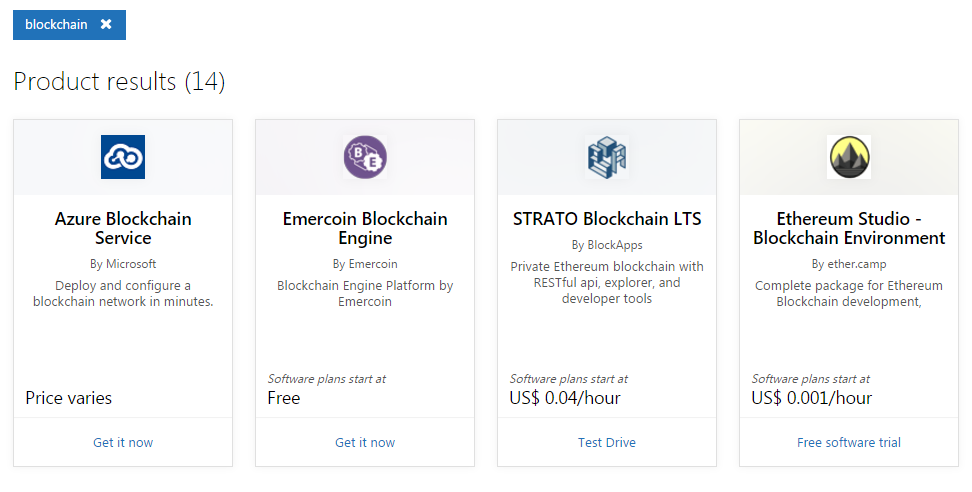

## 微软 Azure 区块链方案

Azure 是微软推出的云计算平台，向用户提供开放的 IaaS 和 PaaS 服务。

微软曾提供 Azure Blockchain Service，但该服务已于 2021 年 9 月 10 日正式停止支持和停用（Retired）。后续的 Quorum Blockchain Service（QBS）也已结束历史阶段，不应再视为当前可选的主流托管路径。本文档中的 Azure Blockchain Service 相关内容仅供历史参考；对今天的用户来说，更现实的方案是直接在 Azure 的虚拟机、AKS 或其他通用基础设施上自行部署区块链网络。

用户可以在 Azure 应用市场（https://azuremarketplace.microsoft.com/en-us/marketplace/apps）中搜索 “blockchain” 关键字查看最新的区块链相关镜像、模板或合作伙伴方案。需要注意：市场条目不等同于 Azure 官方托管区块链服务，部署前应核对发布方、维护状态和安全更新策略。

### 替代方案：在 AKS 上自建 Hyperledger Fabric

对于希望在 Azure 上运行 Hyperledger Fabric 的用户，更稳妥的路径是在 Azure Kubernetes Service (AKS) 或虚拟机上按 Fabric 官方文档自建网络，或审慎采用仍在维护的第三方模板。

该方案具有以下特点：
*   **完全控制**：用户对网络拥有完全的控制权；
*   **云原生**：利用 Kubernetes 的编排能力管理 Fabric 容器；
*   **集成**：可与 Azure Active Directory (AAD)、Azure Monitor 等服务集成。

用户可以通过 Azure CLI、Bicep/ARM、Helm 或 Kubernetes 清单部署 Orderer 组织和 Peer 组织。部署完成后，用户可以通过标准的 Fabric CLI、Gateway SDK 和运维监控工具与网络进行交互。

*注：由于云厂商服务策略调整频繁，建议在选择 BaaS 服务前查阅最新的官方文档。*
