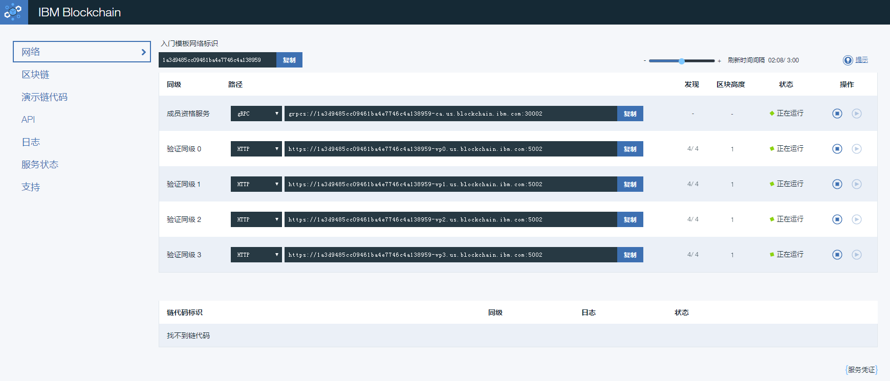

## IBM Blockchain Platform

IBM Blockchain Platform 是 IBM 曾推出的企业级区块链管理平台，基于 Hyperledger Fabric 技术构建。它并非简单的云服务，而是一套完整的区块链网络管理工具；但该产品现已进入历史阶段，本节内容应主要作为演进背景参考。

### 服务介绍

IBM Blockchain Platform 曾允许用户在任何计算环境（IBM Cloud、AWS、Azure、本地数据中心等）中部署、操作和扩展区块链网络。它基于 Kubernetes 容器化技术，提供了较高的灵活性和可移植性。

该平台的核心优势包括：

*   **多云部署**：支持在任何 Kubernetes 集群（v1.14+）上运行；
*   **先进的运维工具**：提供可视化的控制台（Console）来管理节点、通道、智能合约和身份；
*   **开发支持**：集成了 VS Code 扩展（IBM Blockchain Platform Extension），方便开发者编写、测试和调试智能合约；
*   **企业级安全**：支持硬件安全模块（HSM）集成等高级安全特性。

需要注意，IBM 已宣布该软件在 2023 年 4 月 30 日结束支持；今天更合适的理解方式是：它代表了一代企业级 Fabric 运维产品思路，而不是当前仍在持续演进的主流服务。

### 使用服务

通过 IBM Blockchain Platform console，用户曾可以直观地管理网络。

用户可以通过界面轻松完成以下操作：
1.  **创建 CA 和节点**：快速部署 Peer、Orderer 和 CA 节点；
2.  **管理组织和身份**：注册用户，颁发证书；
3.  **创建通道**：定义通道成员和策略；
4.  **安装和实例化链码**：将智能合约部署到通道中。

平台曾提供丰富的 API 和 SDK 支持，方便应用与区块链网络进行交互。

*注：早期的 IBM Bluemix 品牌已于 2017 年完全整合入 IBM Cloud。原有的简单 Fabric 试用服务后来演进为 IBM Blockchain Platform，但该产品也已结束支持。阅读本节时，应把它理解为企业级 Fabric 管理平台的历史案例，而不是当前的最新采购建议。*
