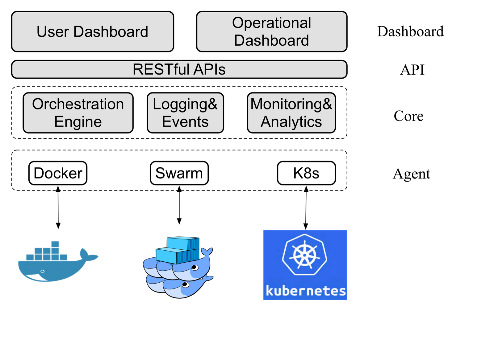
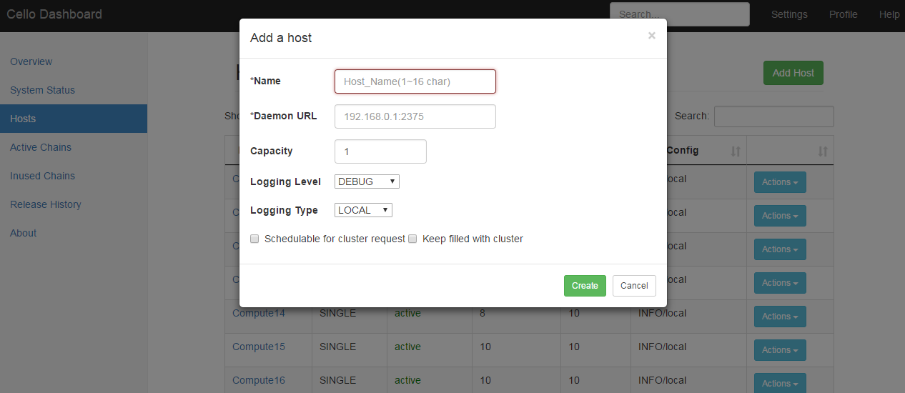
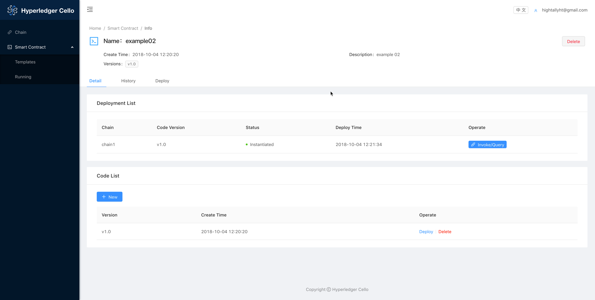

## 使用超级账本 Cello 搭建区块链服务

从前面的讲解中可以看到，区块链服务平台能够有效加速对区块链技术的应用，解决企业和开发者进行手动运营管理的负担。但是这些方案都是商业用途，并且只能在线使用。


超级账本的 Cello 项目为本地搭建区块链服务管理平台提供了开源的解决方案，可以实现在多种类型的物理资源上实现区块链网络的生命周期管理。

正如 Cello 的名字所蕴意，它就像一把精巧的大提琴，以区块链为琴弦，可以奏出更加动人的乐章。

### 基本架构和特性

Cello 项目由笔者领导的 IBM 技术团队于 2017 年 1 月贡献到超级账本社区，主要基于 Python 和 Javascript 语言编写。该项目的定位为区块链管理平台，支持部署、运行时管理和数据分析等功能，可以实现一套完整的 BaaS 系统的快速搭建。其基本架构如下图所示。



在实现区块链环境快速部署的同时，Cello 也提供了不少对区块链平台进行运行时管理的特性，这些特性总结如下。

* 管理区块链的全生命周期，包括创建、配置、使用、健康检查、删除等。
* 支持多种基础架构作为底层资源池，包括裸机、虚拟机、容器云（Docker、Swarm、Kubernetes）等。
* 支持多种区块链平台及自定义配置（目前以支持超级账本 Fabric 为主）。
* 支持监控和分析功能，实现对区块链网络和智能合约的运行状况分析。
* 提供可插拔的框架设计，包括区块链平台、资源调度、监控、驱动代理等都很容易引入第三方实现。

下面具体介绍如何以 Docker 主机为资源池，用 Cello 快速搭建一个区块链服务平台。

### 环境准备

Cello 采用了典型的主从（Master-Worker）架构。用户可以自行准备一个 Master 物理节点和若干个 Worker 节点。

其中，Master 节点负责管理（例如，创建和删除）Worker 节点中的区块链集群，其通过 8080 端口对外提供网页 Dashboard，通过 80 端口对外提供 RESTful API。Worker 节点负责提供区块链集群的物理资源，例如基于 Docker 主机或 Swarm 的方式启动多个集群，作为提供给用户可选的多个区块链网络环境。

下图中展示了一个典型的 Master-Worker 部署拓扑。每个节点默认为 Linux（如 Ubuntu 16.04）服务器或虚拟机。


为了支持区块链网络，Worker 和 Master 节点需要配备足够的物理资源。例如，如果希望在一个 Worker 节点上能够启动至少 10 个区块链集群，则建议节点配置至少为 8 CPU、16G 内存、100G 硬盘容量。

### 下载 Cello 源码

Cello 代码的官方仓库在社区的 gerrit 上，并实时同步到 Github 仓库中，读者可以从任一仓库中获取代码。例如通过如下命令从官方仓库下载 Cello 源码。

```sh
$ git clone http://gerrit.hyperledger.org/r/cello && cd cello
```


### 配置 Worker 节点

#### 安装和配置 Docker 服务

首先安装 Docker，推荐使用 1.12 或者更新的版本。可通过如下命令快速安装 Docker。

```sh
$ curl -fsSL https://get.docker.com/ | sh
```
安装成功后，修改 Docker 服务配置。对于 Ubuntu 16.04，更新 `/lib/systemd/system/docker.service` 文件如下。

```sh
[Service]
DOCKER_OPTS="$DOCKER_OPTS -H tcp://0.0.0.0:2375 -H unix:///var/run/docker.sock --api-cors-header='*' --default-ulimit=nofile=8192:16384 --default-ulimit=nproc=8192:16384"
EnvironmentFile=-/etc/default/docker
ExecStart=
ExecStart=/usr/bin/dockerd -H fd:// $DOCKER_OPTS
```

修改后，需要通过如下命令重启 Docker 服务。

```sh
$ sudo systemctl daemon-reload
$ sudo systemctl restart docker.service
```


#### 下载 Docker 镜像

对于超级账本 Fabric v1.0 集群所需的镜像，可以使用如下命令进行自动下载。

```sh
$ cd scripts/worker_node_setup && bash download_images.sh
```

#### 防火墙配置

为了确保 Worker 上的容器可以正常访问，通过如下命令确保主机开启 IP 转发。

```sh
$ sysctl -w net.ipv4.ip_forward=1
```

同时检查主机的 iptables 设置，确保必要的端口被打开（如 2375、7050~10000 等）。

### 配置 Master 节点

#### 下载 Docker 镜像

使用如下命令下载运行服务所必要的 Docker 镜像。

其中，python:3.5 镜像是运行 Cello 核心组件的基础镜像；mongo:3.2 提供了数据库服务；yeasy/nginx:latest 提供了 Nginx 转发功能；mongo-express:0.30 镜像是为了调试数据库，可以选择性安装。

```sh
$ docker pull python:3.5 \
	&& docker pull mongo:3.2 \
	&& docker pull yeasy/nginx:latest \
	&& docker pull mongo-express:0.30
```

#### 安装 Cello 服务

首次运行时，可以通过如下命令对 Master 节点进行快速配置，包括安装 Docker 环境、创建本地数据库目录、安装依赖软件包等。

```sh
$ make setup
```

如果安装过程没有提示出现问题，则说明当前环境满足了运行条件。如果出现问题，可通过查看日志信息进行定位。

#### 管理 Cello 服务

可以通过运行如下命令来快速启动 Cello 相关的组件服务（包括 dashboard、restserver、watchdog、mongo、nginx 等）。

```sh
$ make start
```

类似地，运行 `make stop` 或 `make restart` 可以停止或重启全部服务。

若希望重新部署某个特定服务（如 dashboard），可运行如下命令。

```sh
$ make redeploy service=dashboard
```

运行如下命令可以实时查看所有服务的日志信息。

```sh
$ make logs
```

若希望查看某个特定服务的日志，可运行如下命令进行过滤，如只查看 watchdog 组件的日志。

```sh
$ make log service=watchdog
```

### 使用 Cello 管理区块链

Cello 服务启动后，管理员可以通过 Cello 的 Dashboard 页面管理区块链。

默认情况下，可通过 Master 节点的 8080 端口访问 Dashboard。默认的登录用户名和密码为 `admin:pass`。


如图，Dashboard 有多个页面，各页面的功能如下。

| 页面 |  功能 |
| --- |  --- |
| Overview |  展示系统整体状态 |
| System Status |  展示一些统计信息 |
| Hosts |  管理所有主机（Worker 节点） |
| Active Chains |  管理资源池中的所有链 |
| Inused Chains |  管理正在被用户占用的链 |
| Released History  | 查看链的释放历史 |

#### Hosts 页面

在 Hosts 页面，管理员可以管理所有资源池中已存在的主机，或添加新主机。表格中会显示主机的类型、状态、正在运行的区块链数量、区块链数量上限等。所有设定为 non-schedulable (不会自动分配给用户）的主机会用灰色背景标识，如下图所示。


点击一个主机的 Action 下拉菜单，有如下选项可供操作该主机。

* Fillup：将主机运行的区块链数添加至上限。
* Clean：清理主机中所有未被用户占用的链。
* Config：更改主机配置，如名称和链数量上限。
* Reset：重置该主机，只有当该主机没有用户占用的链时可以使用。
* Delete：从资源池中删除该主机。

点击 Hosts 页面的 Add Host 按钮，可以向资源池中添加主机。需要设定该主机的名称、Daemon URL 地址（例如，Worker 节点的 docker daemon 监听地址和端口）、链数量上限、日志配置、是否启动区块链至数量上限、是否可向用户自动分配，如下图所示。



#### Active Chains 页面

Active Chains 页面会显示所有正在运行的链，包括链的名称、类型、状态、健康状况、规模、所属主机等信息。正在被用户占用的链会用灰色背景标识，如下图所示。


点击一条链的 Actions 下拉菜单，有如下选项可供操作该链。

* Start：如果这条链处于停止状态，则启动。
* Stop：停止运行中的链。
* Restart：重新启动这条链。
* Delete：删除这条链。
* Release：将占用的链释放，随后会被删除。

点击 Active Chains 页面的 Add Chain 按钮，可以向资源池中添加更多链（如果还有未被占满的主机），如下图所示。


### 用户控制台，申请使用Chain

用户可以登录User Dashboard来申请和使用Chain


#### Chain列表页面

Chain列表页面显示所有用户已经申请的链。


#### Chain详情页面

Chain详情页面可以查看链的基本信息（链高度，channel数，链码安装/实例化个数，最近的block/transaction），操作历史记录。


#### 智能合约模板列表页面

这个页面列取用户自己上传的智能合约代码模板，支持多个版本管理。


#### 智能合约模板详情页面

在合约模板详情页面可以查看智能合约模板的详情，包括合约多版本列表，部署列表，部署合约。



#### 智能合约操作页面

在这个页面可以invoke/query已经部署好的智能合约。


#### 智能合约运行列表页面

这个页面可以查看所有已经部署，包括成功和失败的智能合约的列表。


### 基于 Cello 进行功能扩展

Cello 已经提供了完整的区块链管理功能，并提供了图形界面和 API。

用户可以通过向 Cello 的 Master 节点（默认为 80 端口）发送 RESTful API 来申请、释放区块链，或查看区块链相关信息，如其对外开放的接口，可供用户进行远程交互。RESTful API 的说明可在 Cello 的文档中查阅。

对于区块链服务提供者，可以利用这些 API 为用户呈现友好的区块链申请和操作界面，在 Cello 的基础之上构建和实现更多功能。
