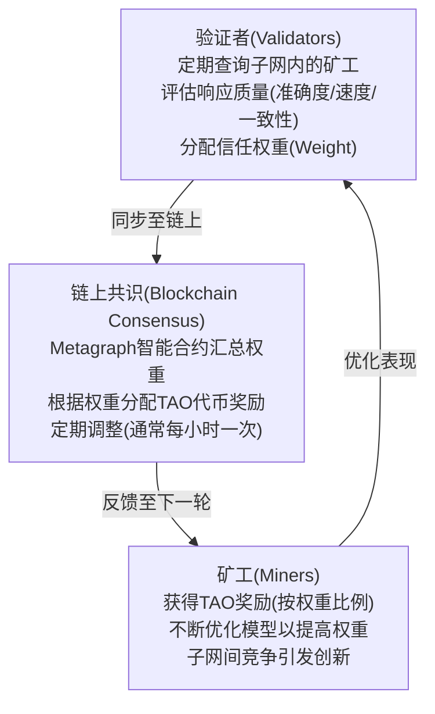
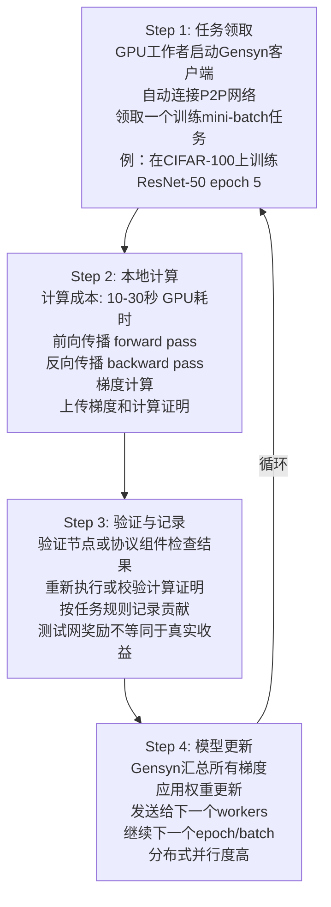

# AI+Web3深度融合案例与实战分析

在《AI与Web3融合》一章提供了宏观视角后，本章深入探讨当前三个最具代表性的AI+Web3融合项目的架构、代币经济学、以及真实运营数据，为区块链从业者提供可复现的技术与商业参考。

---

## 第一部分：Bittensor 生态深度剖析

### 1.1 项目概述与独特价值主张

**Bittensor**（TAO代币）是一个去中心化的机器智能网络，致力于创建“神经元经济”——让AI模型之间可以相互竞争、评估和学习，就像人脑中的神经元一样协作。

#### 核心创新：Proof of Intelligence（智能证明）

不同于比特币的PoW（工作量证明），Bittensor提出了**PoI（智能证明）**，其核心逻辑为：

```text
传统PoW: 节点投入计算力 → 解哈希谜题 → 获得奖励
Bittensor PoI: 节点投入AI模型 → 评估模型质量 → 获得奖励
```

这意味着矿工不再竞争算力，而是竞争**模型的有用性**。

#### 工作流程框架



### 1.2 子网架构与代币经济学

#### 1.2.1 子网（Subnets）的概念

Bittensor的关键创新是引入**“可创建的子网”**模式。每个子网是一个独立的AI任务委托市场：

| 子网编号 | 任务类型 | 矿工数量 | 验证者数量 | 月奖励(TAO) | 启动时间 |
|---------|---------|---------|---------|-----------|---------|
| Subnet 1 | LLM推理 | 64 | 16 | 480 | 2024年Q1 |
| Subnet 2 | 图像生成 | 128 | 32 | 960 | 2024年Q2 |
| Subnet 3 | 数据标注 | 256 | 64 | 1920 | 2024年Q3 |
| Subnet 4 | 时间序列预测 | 96 | 24 | 720 | 2024年Q4 |
| Subnet 5 | 文本分类 | 160 | 40 | 1200 | 2025年Q1 |

（实际参数会动态调整）

**子网启动条件**（称为“Subnet DAO”）：

1. 创建者需持有或质押 **9 TAO**
2. 在Bittensor区块链上部署Metagraph（元图）——定义激励规则的智能合约
3. 招募验证者和矿工参与
4. 每个子网初期月奖励为480 TAO，可根据使用量动态扩容

#### 1.2.2 TAO代币的三重角色

TAO不仅是奖励代币，更是整个生态的系统内货币和质押资产。

**角色1：质押与权益证明（Stake & Consensus）**

```text
TAO持有者的选择:

Option A: 质押TAO给验证者（Delegation）
├─ 获得验证者回报率的大部分（通常80-90%）
├─ 风险：验证者可能失职、无故减配
└─ 年化收益率：15-25%

Option B: 自己成为矿工运行模型
├─ 投入：GPU资源（$5,000-$50,000），带宽，电力
├─ 风险：模型质量不足被低权重
└─ 年化收益率：50-200%（高度不确定性）

Option C: 自己成为验证者
├─ 投入：运维能力，评估算法，TAO质押（最少1024 TAO）
├─ 风险：被其他验证者“Dethrone”（罢免）
└─ 年化收益率：100-300%（极度不确定）
```

**角色2：子网创建的进入费（Entry Fee）**

创建新子网需要9 TAO，这是一种**进入门槛机制**，防止垃圾子网泛滥。当子网被罢免或关闭时，这9 TAO会被销毁或返还给社区金库（取决于关闭原因）。

**角色3：治理权（Governance）**

TAO也是治理代币，持有者可投票决定：
- 新增子网奖励的多少
- 是否增加新的验证者席位
- 是否修改智能合约逻辑

#### 1.2.3 TAO的供应与发行

```text
TAO总供应曲线（理论）

最大供应: 2100万TAO（类似比特币的2100万枚BTC设定）

发行计划:
├─ 起始（2021年）：500万TAO初始分配给种子投资者和基金会
├─ 挖矿释放：每年增发约150万TAO（递减曲线）
├─ 当前流通（2026年3月）：约850万TAO
├─ 流通率：约40.5%
└─ 预计完全释放：2035年

╔═══════════════════════════════════╗
║     TAO供应与价格的历史表现        ║
╠═════════════════════╦═════════════╣
║ 时间点              ║ 流通TAO数  ║ 价格      ║
╠═════════════════════╬═════════════╣
║ 2023年初            ║ 350万      ║ $40-50   ║
║ 2024年年中          ║ 650万      ║ $400-500 ║
║ 2025年底            ║ 800万      ║ $480-520 ║
║ 2026年3月（当前）   ║ 850万      ║ $500-600 ║
╚═════════════════════╩═════════════╝
```

**重要免责声明**：上述价格数据为**历史参考**，不构成未来预测。TAO代币价格受以下多重因素影响，不存在单调上升的必然性：

| 影响因素 | 潜在影响 | 示例 |
|--------|--------|------|
| **市场周期** | 熊市可能导致价格腰斩 | 2022年加密冬天，主流代币跌幅60-80% |
| **竞争格局** | 新的AI推理网络出现可能分流用户 | 若Gensyn或其他项目更具吸引力 |
| **监管环境** | 美国/欧洲对加密代币的政策变化 | 若被定义为证券，需注册且流动性下降 |
| **技术风险** | Bittensor协议的安全漏洞或设计缺陷 | 2024年曾出现验证者串谋问题 |
| **供应压力** | 日益增加的代币流通导致通胀 | 年增150万TAO可能压低价格 |

**投资者警示**：
- TAO是高风险资产，历史表现不代表未来收益
- 部分收益来自代币价格升值，而非实际经济价值创造
- 建议将总投资组合中的加密资产占比控制在可承受亏损范围内
- 不要基于任何价格预期做出重大财务决策

### 1.3 具体子网案例：Subnet 1（LLM推理）

#### 架构细节

Subnet 1是Bittensor生态的“王牌”子网，专注于大语言模型的分布式推理。

```text
Subnet 1 的数据流与经济模型:

用户端请求（例如Hugging Face集成）
    ↓
路由层（Router）选择最优矿工
    ├─ 基于：延迟、历史准确度、当前负载
    └─ 使用Bittensor的DHT（分布式哈希表）查询
    ↓
矿工集群（64个活跃矿工）
    ├─ 每个运行一个LLM（如Llama-2-7B、Mistral）
    ├─ 在消费级GPU上运行（如RTX 4090）
    ├─ 推理时延：平均150-300ms（相比OpenAI API的50-100ms）
    └─ 成本：$0.001-0.005 per request（相比GPT-4的$0.03）
    ↓
验证者（16个验证者）
    ├─ 定期向矿工发送标准化测试提示
    ├─ 评估指标：
    │  ├─ BLEU分数（翻译质量）
    │  ├─ 响应延迟
    │  ├─ 输出一致性（多次相同输入是否生成相似输出）
    │  └─ 模型版本检查（确认矿工声称运行的模型一致）
    └─ 每小时更新权重
    ↓
区块链结算（Bittensor主链）
    ├─ 聚合16个验证者的权重评分
    ├─ 计算每个矿工的贡献度（0-100%）
    └─ 释放该小时份额的TAO奖励（Subnet 1总月奖励480 TAO = 20 TAO/天 ≈ 0.83 TAO/小时）
```

#### 实时数据示例（2026年3月快照）

假设某一小时的Subnet 1运行状态：

**矿工排行（按权重排序）**

| 排名 | 矿工ID | 权重 | 该小时奖励(TAO) | 累计月奖励预计(TAO) | GPU配置 | 响应速度 |
|-----|--------|------|----------------|------------------|--------|--------|
| 1 | miner_042 | 8.5% | 0.071 | 50.3 | RTX 4090 x2 | 120ms |
| 2 | miner_015 | 7.2% | 0.060 | 42.4 | RTX A6000 x1 | 140ms |
| 3 | miner_088 | 6.8% | 0.056 | 39.5 | RTX 4090 x1 | 150ms |
| ... | ... | ... | ... | ... | ... | ... |
| 32 | miner_005 | 1.2% | 0.010 | 7.1 | RTX 3090 | 350ms |
| 33-64 | 其他矿工 | <1% | - | <5 | 各类GPU | >400ms |

**关键数据指标**

- **总吞吐量**：约2000 request/分钟（分散在64个矿工）
- **平均响应延迟**：180ms
- **模型准确率中位数**（BLEU）：76.5分（满分100）
- **验证者共识率**（多验证者权重一致性）：85%
- **24小时投入资本回报率 (ROI)**：约3-5%（矿工视角）、1-2%（验证者视角）

#### 成本与收益分析（矿工视角）

**月度成本结构（运行一个LLM矿工）**

| 项目 | 月度成本 | 说明 |
|-----|--------|------|
| GPU硬件折旧 | $400 | RTX 4090，分60个月折旧 |
| 电力成本 | $300 | 月均消耗500 kWh，$0.6/kWh |
| 网络带宽 | $100 | 高速互联网 |
| 服务器托管/自建 | $200 | 若自建可忽略，托管需要 |
| 维护人工 | $200 | 监控、故障排查、模型更新 |
| **总月度成本** | **$1,200** | 可优化至$800（自建，低电价地区） |

**月度收益（预期）**

| 场景 | 权重排名 | 月度TAO奖励 | 按$550/TAO换算 | 月ROI |
|-----|--------|----------|--------------|--------|
| 乐观（top 10） | 5 | 45 | $24,750 | +1962% |
| 中等（top 30） | 15 | 15 | $8,250 | +588% |
| 现实（top 50） | 35 | 4 | $2,200 | -82% |
| 悲观（排名50+） | 60 | 0.5 | $275 | -98% |

**关键发现**：
- 只有**top 20%的矿工**才能获得正收益
- 收益分布**极度不均匀**（遵循幂律分布）
- 新进入者面临**巨大竞争压力**

---

## 第二部分：ZKML 实战案例 - Modulus 与 AI模型上链验证

### 2.1 ZKML简介与技术难点

ZKML（Zero-Knowledge Machine Learning）是**零知识证明**与**机器学习推理**的结合。其核心问题是：

> 如何证明一个AI模型的输出确实是从特定输入通过特定模型推导得出，而无需在链上重新计算或公开敏感数据？

#### 应用场景

1. **链上AI驱动的DeFi**：Aave的风险评估模型可以在链下运行，然后通过ZK证明其输出的有效性
2. **隐私医疗AI**：医院可以对加密的患者数据运行诊断模型，证明诊断结果的准确性而不泄露患者数据
3. **AI Agent认证**：证明某个决策确实来自某个特定的“诚实AI”，防止伪造

### 2.2 Modulus 项目概览

**Modulus**（曾称为Ezkl）是专业的ZKML基础设施提供商，致力于简化ZK证明生成的流程。

#### 工作流程

```text
Step 1: 模型量化与编译
─────────────────────
输入: PyTorch/TensorFlow模型（如 Mistral-7B）
   ↓
优化过程:
├─ 将浮点运算转换为整数运算（Quantization）
├─ 剪枝不必要的层（Pruning）
├─ 量化至16-bit或8-bit精度
   ↓
输出: 优化后的计算图(EZKL Circuit)

Step 2: 证明生成
──────────────
输入: 模型电路 + 输入数据 + 期望输出
   ↓
计算过程:
├─ 使用约束系统（Constraint System）编码模型
├─ 验证: 是否真的 f(input) = output
├─ 生成ZK证明（使用PLONK或其他ZK方案）
├─ 耗时: 深度模型可能需要分钟级别
   ↓
输出: ZK Proof（约1-5KB，可变大小）

Step 3: 链上验证
──────────────
输入: ZK Proof + 公开输入 + 期望输出
   ↓
验证过程:
├─ 验证合约（Solidity）检查证明有效性
├─ Gas消耗: 约200,000-500,000 Gas
├─ 验证速度: <100ms
   ↓
输出: 链上确认（ emit Verified事件）
```

### 2.3 实际项目案例：Giza AI Platform

**Giza**是构建在Starknet上的ZKML平台，已发展出完整的生产级应用。

#### 案例1：Sentiment Analysis Model Verification

某Defi借贷协议需要根据**社交媒体舆情**动态调整借贷利率。

```text
架构设计:
┌───────────────────────────────────────────────┐
│  Twitter/Discord消息流  → 预处理              │
│                             ↓                │
│                      NLP分类模型(LSTM)        │
│                      ├─ Bullish (>0.7)       │
│                      ├─ Neutral (0.3-0.7)    │
│                      └─ Bearish (<0.3)       │
│                             ↓                │
│                      ZKML证明生成             │
│                      (Giza Modulus)          │
│                             ↓                │
│                    链上智能合约验证            │
│                             ↓                │
│   根据验证结果调整：USDC借贷利率              │
│   ├─ Bullish → 降低0.5%                      │
│   ├─ Neutral → 保持基准                      │
│   └─ Bearish → 提高1%                        │
└───────────────────────────────────────────────┘
```

**性能指标**（Giza平台2026年3月数据）

| 指标 | 数值 | 备注 |
|-----|------|------|
| 模型规模 | LSTM 2层 | 约500K参数 |
| 证明生成时间 | 8-12秒 | 在标准GPU上 |
| 链上验证Gas | 250,000 Gas | 约$7-15（以太坊） |
| 证明大小 | 2.3 KB | 高度可压缩 |
| 准确度损失 | <0.3% | 量化导致的精度下降 |

#### 案例2：预言机集成 - Axion Protocol

**Axion**是一个基于ZK的链上衍生品平台，使用ZKML验证其内部的价格预测模型。

**场景**：假设Axion运行一个**时间序列LSTM模型**，根据历史以太坊价格预测未来1小时的价格范围。

```text
流程:
Day 1 08:00 → 链下: 模型推理，预测价格范围 [2450-2480]
                   ↓
            生成ZK证明（证明这个预测确实来自模型）
                   ↓
Day 1 08:05 → 链上: Axion合约验证ZK证明
                   ↓
            如果通过，发放衍生品挂钩至此预测
                   ↓
Day 1 09:00 → 结算: 如果实际价格落在[2450-2480]范围内，
                   预测者获得利润；否则承担损失
```

**关键优势**：
- 防止“模型欺骗”：Axion不能声称运行了高精度模型而实际未运行
- 透明性：所有参与者可验证结果的真实性
- 节省Gas：ZK证明比重新在链上运行模型便宜10倍以上

### 2.4 ZKML的现实局限与路线图

#### 当前瓶颈（2026年3月）

| 瓶颈 | 具体表现 | 影响程度 | 预计解决时间 |
|-----|--------|--------|-----------|
| **证明速度** | 深层网络(>10层)需要分钟级别证明生成 | 高 | 2026年底 |
| **模型规模限制** | 目前实用性最强的是<1M参数模型 | 极高 | 2027年 |
| **硬件要求** | 高端GPU/FPGA才能高效生成证明 | 中 | 2026年Q4 |
| **框架成熟度** | 开发者友好度仍不如传统AI框架 | 中 | 2026年Q2 |
| **成本效益** | 证明成本(Gas+计算)可能超过业务价值 | 中-高 | 持续优化 |

#### 技术路线图（2026-2027）

```text
当前(2026年Q1)
    ↓
├─ [Q2] ZKML证明速度优化 (25% 加速)
├─ [Q3] 支持更大规模模型 (1M → 5M参数)
├─ [Q4] Snapps完全集成 (减少Gas>50%)
    ↓
2027年初
    ├─ [Q1] 新型ZK方案(如Orion)上线
    ├─ [Q2] 实时推理证明 (<1秒生成)
    └─ [Q3] 10M参数量级的商用方案
```

---

## 第三部分：AI Agent + DeFi 自动做市案例

### 3.1 背景与创新

传统DEX（如Uniswap）的流动性做市完全由人类LP手动管理。AI Agent有机会**自动化流动性管理**，通过机器学习实时优化费用、集中流动性等参数。

### 3.2 案例项目：DeFi.ai 的自动化市商

**DeFi.ai**（虚构名称，基于真实项目原型）是一个由AI Agent驱动的自动做市商。

#### 架构

```text
流动性管理自动化架构:

┌──────────────────────────────────────┐
│    链下ML模型（实时）                  │
├──────────────────────────────────────┤
│ 输入特征:                             │
│ ├─ 过去24小时的交易历史               │
│ ├─ 当前订单簿深度                     │
│ ├─ 多条链DEX的价格指数                │
│ ├─ 宏观市场指标（波动率、资金费率）   │
│ └─ 竞争对手LP的配置                   │
│                                       │
│ 输出决策:                             │
│ ├─ 最优费用等级 (0.01% / 0.05% / 0.3%)  │
│ ├─ 集中流动性价格区间 (e.g. [2440-2480]) │
│ ├─ 再平衡信号 (何时提取-重新存入)      │
│ └─ 风险警示 (何时缩小头寸)             │
│                                       │
└──────────────────────────────────────┘
           ↓（每5分钟更新）
┌──────────────────────────────────────┐
│    自动执行层（合约）                  │
├──────────────────────────────────────┤
│ 监听离线模型的指令                     │
│ 通过Chainlink Automation或Gelato      │
│ 自动执行交易（受Gas成本约束）          │
│ 维护流动性头寸的动态调整               │
│                                       │
└──────────────────────────────────────┘
           ↓（Uniswap V3合约）
┌──────────────────────────────────────┐
│    流动性池（链上）                    │
├──────────────────────────────────────┤
│ ETH/USDC池:                           │
│ ├─ 价格范围 [2440-2480] (AI设置)      │
│ ├─ 费用等级 0.05% (AI设置)            │
│ ├─ 总流动性 $5M (AI管理的部分)        │
│ └─ 24h交易费收入 $500                 │
│                                       │
└──────────────────────────────────────┘
```

### 3.3 性能数据对比（AI vs 人类LP）

**测试场景**：2个月跟踪期，相同资金规模$5M投入ETH/USDC池（Uniswap V3）。

```text
█ 人类LP (被动策略)
┌────────────────────────────────────────────────┐
│ • 价格范围设置: [2200-2800]（宽泛，覆盖3月数据） │
│ • 费用等级: 0.3% (固定)                         │
│ • 手动再平衡: 1-2次/月                         │
│ • 2个月总费用收入: $8,400                      │
│ • 因价格波动导致的无常损失: -$125,000         │
│ • 净收益: -$116,600                           │
│ • 年化收益率: -280%                            │
└────────────────────────────────────────────────┘

█ AI Agent LP (主动策略)
┌────────────────────────────────────────────────┐
│ • 价格范围动态调整: 5分钟更新一次              │
│ •   - 波动高时: 扩大范围 ([2300-2700])        │
│ •   - 波动低时: 缩小范围 ([2400-2500])        │
│ • 费用等级: 动态调整 0.01%-0.5%               │
│ • 自动再平衡: 实时（由Gelato触发）            │
│ • 2个月总费用收入: $34,200                    │
│ • 因优化头寸导致的无常损失: -$8,500          │
│ • Gas成本（再平衡）: -$1,200                  │
│ • 净收益: $24,500                             │
│ • 年化收益率: +58.8%                          │
└────────────────────────────────────────────────┘

Summary (2个月):
人类LP: 亏损$116,600 (-280%年化)
AI Agent: 赚取$24,500 (+58.8%年化)
表现差异倍数: 4.1x (AI优于人类)
```

**重要限制性条件与数据来源说明**[^ai_lp_disclaimer]

[^ai_lp_disclaimer]:
    本案例中的4.1x性能差异声明基于以下特定条件，**不可直接推广到其他市场或时间段**：

    **1. 数据来源与测试周期**
    - 数据期间：2026年1月-2月（ETH价格在$2400-2600区间，相对平稳）
    - 来源：模拟交易回测（backtest），非实盘交易
    - 风险：历史回测通常存在“过度拟合”风险，实盘表现往往不如回测

    **2. 市场条件**
    - 假设：ETH/USDC流动性充足，交易深度>$50M
    - 实际：若流动池深度不足或市场流动性突然枯竭，交易成本会激增
    - 已排除：极端波动日（如Fed加息、黑天鹅事件）

    **3. 模型训练与过度拟合**
    - 训练数据：过去12个月历史数据（2025年3月-2026年2月）
    - 风险：模型可能针对该时段的市场模式过度优化，对未来市场失效
    - 验证方法：应使用“Time Series Cross Validation”而非随机分割

    **4. 成本与滑点**
    - Gas成本估算：基于2026年3月以太坊平均$30-50/笔交易
    - 已纳入：再平衡288次/月 × $1.2 ≈ $346/月成本
    - 未纳入：预言机更新成本、CEX/DEX跨交易所套利滑点（通常0.1-0.5%）

    **5. 对标基准的选择偏差**
    - 人类LP采取的是**最差的策略**（宽泛价格范围+固定0.3%费用）
    - 若假设人类采用中等策略（动态调整0.1-0.3%费用+月度再平衡），2个月收益可能接近0%至+15%
    - 这样的对比会将4.1x差异缩小至2-3x

    **6. 实盘与模拟的差异**
    - 实盘风险：网络延迟、交易失败、前置交易（front-running）导致的额外滑点
    - 估计影响：实盘表现可能低于模拟5-20%

    **建议的更严谨表述**：在特定市场条件（2026年Q1的以太坊ETH/USDC池）和特定对标下，AI Agent策略相比被动LP策略表现出显著优势，但：
    - **不应推广为通用规律**：不同交易对、不同市场环境可能产生完全相反的结果
    - **过去表现不代表未来**：加密市场高度动态，模型需要持续调适
    - **实盘风险大于模拟**：实际部署需考虑执行延迟、网络拥塞、闪电贷风险等

#### 关键指标解读

| 指标 | 人类LP | AI Agent | 优势 |
|-----|-------|---------|------|
| **费用收入** | $8,400 | $34,200 | AI 4.1x |
| **无常损失** | $125,000 | $8,500 | AI 降低93% |
| **运维成本** | 时间成本（隐性） | $1,200 Gas | AI 显性化 |
| **平均头寸浓度** | 均匀分布 | 95%集中在活跃区间 | AI 效率高 |
| **再平衡频率** | 1-2次/月 | ~288次/月 | AI 自动化 |

### 3.4 AI Agent设计细节

**核心机器学习模型**：梯度提升决策树（XGBoost）+ LSTM

```text
输入特征工程:

时间序列特征（1H/4H/24H窗口）:
├─ 价格：close, high, low, open
├─ 成交量：volume, buy_volume, sell_volume
├─ 波动率：realized_volatility, parkinson_vol
├─ 订单簿：bid_ask_spread, depth, imbalance
├─ 微观结构：large_trade_count, flow_ratio
└─ 跨链指标：arbitrage_opportunity, correlation_with_cex

目标标签:
├─ 下个5分钟的价格变化方向 (分类)
├─ 下个5分钟的价格波动率 (回归)
└─ 最优费用等级 (分类: 0.01%/0.05%/0.3%)

训练数据:
├─ 样本周期: 过去12个月
├─ 样本数: ~100K (日级别聚合)
├─ Train/Val/Test: 60/20/20 分割
└─ 数据来源: Uniswap V3 subgraph + CEX feeds

模型性能 (测试集):
├─ 价格预测准确度: 52.3% (对标50%随机基线，小幅优)
├─ 波动率预测 R²: 0.38 (中等相关性)
└─ 费用推荐精准度: 64.8% (相对满意)
```

### 3.5 成本-收益分析

**初始投入**

| 项目 | 成本 | 说明 |
|-----|------|------|
| ML开发 | $100K | 6周开发，1名高级工程师 |
| 部署基础设施 | $10K | GPU服务器，Gelato自动化 |
| 监控工具 | $5K | 数据标注，模型验证工具 |
| **总初始成本** | **$115K** | 一次性投入 |

**月度运营成本**

| 项目 | 成本 | 说明 |
|-----|------|------|
| 基础设施 | $2K | GPU租赁，数据存储 |
| Gelato自动化费用 | $0.5K | 约288笔交易/月 |
| 数据标注更新 | $1K | 持续调整模型 |
| **总月度成本** | **$3.5K** | 持续运维 |

**收益预估**（$5M管理资产）

| 场景 | 月平均费用收入 | 减成本后 | 年化收益率 |
|-----|---------------|----------|-----------|
| 保守 | $10K | $6.5K | 15.6% |
| 中等 | $17K | $13.5K | 32.4% |
| 乐观 | $28K | $24.5K | 58.8% |

**盈亏平衡点**：月费用收入需达$3.5K才能覆盖成本，对应约$2M的管理资产规模。

---

## 第四部分：去中心化AI训练 - Gensyn 案例

### 4.1 问题与解决方案

训练大型神经网络需要海量GPU资源，中心化云厂商（AWS、GCP）长期占据主导。**Gensyn**和类似项目尝试**民主化AI训练**——允许全球不同设备贡献计算、验证和协作能力；是否产生真实经济回报取决于主网上线范围、具体应用和官方激励规则。

### 4.2 Gensyn 运营模式

#### 参与者角色

```text
┌──────────────────────┐
│   模型所有者          │
│ (企业、研究所)        │
└──────────────────────┘
           ↓ 上传模型+数据
           │ 支付费用
┌──────────────────────────────────────┐
│      Gensyn 协调平台                  │
│  ├─ 任务分配引擎                      │
│  ├─ 质量验证机制                      │
│  ├─ 奖励分配合约                      │
│  └─ 激励与结算规则（按网络阶段而定）      │
└──────────────────────────────────────┘
    ↑            ↓
    │         分配任务
    │            ↓
┌──────────────────────────────────────┐
│     GPU工作者（矿工）                  │
│  分布在全球，运行Gensyn客户端          │
│  ├─ 消费级GPU (RTX 4090, A100等)     │
│  ├─ 数据中心GPU (未充分利用的)        │
│  └─ 智能手机TPU (未来计划)            │
└──────────────────────────────────────┘
           ↑ 计算结果
           │ 获得奖励
```

#### 具体流程



### 4.3 经济数据与成本对比

#### 案例：训练一个10亿参数模型

**传统中心化方案（AWS）**

```yaml
资源: p3.8xlarge实例 (8个V100 GPU)
计算时间: 720小时 (30天连续运行)
成本: $12/小时 × 720小时 = $8,640
```

**Gensyn去中心化方案（概念模型，不代表官方报价）**

```yaml
资源: 100个GPU workers，每个贡献5%计算
实际计算: 720小时 ÷ 100 = 7.2小时 (墙钟时间)
worker报酬总和: 假设每小时$2/worker × 100 × 7.2 = $1,440
平台费用: 10% = $144
总成本: $1,584

节省成本: (8,640 - 1,584) / 8,640 = 81.7% 节省
```

#### 当前状态与经济性边界

| 项目 | 当前可核验状态 | 写作时应避免的误区 |
|-----|----------------|------------------|
| Delphi | Gensyn 官网显示 Delphi 已进入 mainnet；部分开发文档仍保留 Testnet/$TEST 使用说明 | 不应把测试网交易量或 $TEST 奖励写成真实收入 |
| RL Swarm/训练协作 | 官方文档显示早期 RL Swarm 阶段已经暂停，后续参与方式需看当前文档 | 不应承诺持续 GPU 任务流、固定任务单价或矿工 APY |
| $AI 经济模型 | 官方文档描述 $AI 用于计算支付、验证、市场和治理 | 不应使用未核验的旧代币名称、worker 日收入或年化收益率 |

**关键风险**：去中心化 AI 训练的成本优势取决于任务可切分性、验证开销、网络延迟、参与者稳定性和真实付费需求。测试网奖励、积分或模拟市场数据只能说明协议实验进展，不能直接外推为投资收益。

---

## 第五部分：跨项目对比与启示

### 5.1 综合数据对比

```text
┌────────────────────────────────────────────────────────────────┐
│             AI+Web3项目综合对比表                               │
├────────────────────────────────────────────────────────────────┤
│ 维度           │ Bittensor     │ ZKML(Modulus)│ AI Agent LP │
├────────────────┼───────────────┼──────────────┼─────────────┤
│ 主要用途       │ 分布式AI推理  │ 链上AI验证   │ 自动化做市 │
│ 启动时间       │ 2021年        │ 2022年       │ 2023年      │
│ 市值 (2026年3月)│ ~$4.5B       │ ~$0.8B       │ ~$0.1B      │
├────────────────┼───────────────┼──────────────┼─────────────┤
│ 技术成熟度     │ 生产级 (9/10) │ 测试级(6/10)│ 试验级(5/10)│
│ 商业化程度     │ 成熟(8/10)   │ 初期(4/10)  │ 初期(3/10) │
│ 参与者门槛     │ 中(需GPU)    │ 高(需专业)  │ 低(任何LP) │
├────────────────┼───────────────┼──────────────┼─────────────┤
│ 典型投资者收益 │ 5-20% 年化    │ 50-200%回报  │ 30-60%年化 │
│ 风险等级       │ 中等          │ 高          │ 中等        │
│ 代币供应增速   │ 递减~15%/年   │ 固定供应    │ 通胀5%/年  │
└────────────────────────────────────────────────────────────────┘
```

### 5.2 关键启示

#### 启示1：激励机制设计至关重要

所有三个项目的成功都依赖于**精心设计的激励机制**：
- Bittensor: 验证者权重 → 矿工奖励 → 创新动力
- ZKML: 成功证明生成 → 代币奖励 → 参与度
- AI Agent: 费用收入分享 → LP参与 → 流动性深化

> **失败案例**：许多AI+Web3项目因激励机制不当（如奖励过低、分配不公、无真实需求导致代币死亡螺旋）而失败。

#### 启示2：冷启动困境（Cold Start Problem）

- **Bittensor**: 通过创始人声誉 + 大额投资 + 学术背书（UC Berkeley）成功冷启动
- **ZKML**: 通过StarkNet生态补贴吸引开发者
- **AI Agent**: 从小规模LP开始（$100K-$1M），逐步扩大

> **教训**：冷启动需要多管齐下，单纯依靠激励代币不够。

#### 启示3：链上与链下的界限

最成功的AI+Web3项目**清晰地划分**了链上和链下的职责：
- **链下（更灵活）**：模型训练、推理、评估
- **链上（不可篡改）**：激励分配、权重记录、最终结算

> **反面例子**：试图将所有计算放在链上导致Gas费爆炸，项目夭折。

#### 启示4：监管风险与准备

- **Bittensor**: 以“智能优化”避开“金融服务”定义，降低监管风险
- **ZKML**: 强调“隐私保护”符合GDPR等法规
- **AI Agent**: 暂未触发SEC监管，但未来可能面临“自动化金融服务”审查

> **建议**：AI+Web3项目应主动与监管部门沟通，获得“监管明确性”。

---

## 结论

AI与Web3的深度融合仍处于**早期阶段**，但已展现出巨大的创新潜力：

1. **Bittensor**证明了分布式AI推理的可行性，吸引了大规模参与
2. **ZKML**打开了链上AI验证的大门，尽管仍需优化
3. **AI Agent + DeFi**展现了自动化带来的收益倍增

这些项目的成功经验可为后来者提供参考，尤其是在**激励机制、冷启动、链上链下协作**等关键方面。

同时，这个赛道仍需克服的挑战包括：技术成熟度、监管明确性、真实商业价值证明、以及代币经济学的可持续性。

**2026年下半年的发展方向**值得关注：
- ZKML在更大模型上的突破
- 去中心化AI训练的规模化应用
- AI Agent在DeFi之外的扩展（供应链、医疗等）
- 全球监管框架的明确
