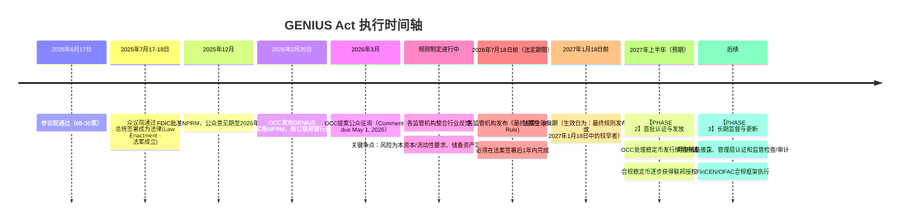
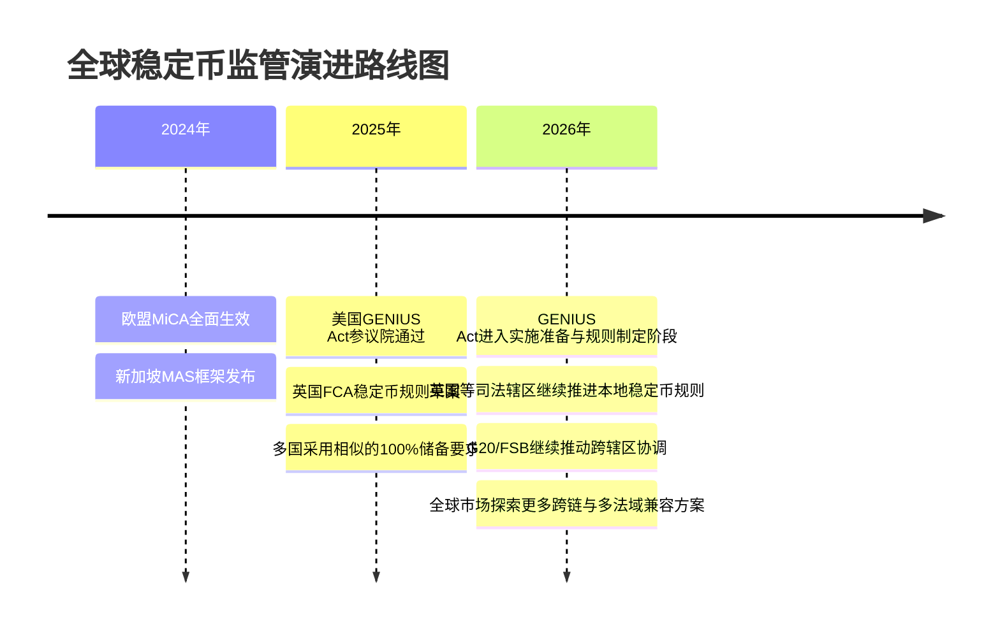

# GENIUS Act：美国联邦稳定币框架

## 概述与背景

GENIUS Act（Guiding and Establishing National Innovation for US Stablecoins）是一部建立美国联邦稳定币监管框架的突破性法案。该法案于2025年6月17日在美国参议院以68-30票通过，2025年7月17日经众议院通过，并于2025年7月18日由特朗普总统签署成为法律。按法案文本，生效时间取决于“签署后18个月”和“最终实施细则发布后120天”二者中的更早者，因此不能简单把 2027 年 1 月 18 日写成唯一固定生效日。

### 历史背景与必要性

在GENIUS Act出台之前，美国对稳定币的监管处于“各州自行其是”的碎片化状态。这导致了以下问题：

- **监管套利风险**：发行人可选择监管宽松的州注册，逃避严格的联邦监督
- **消费者保护缺口**：无统一的储备要求和审计标准，导致Terra/Luna等崩盘事件对投资者造成巨额损失
- **金融稳定隐患**：USDT、USDC等大规模稳定币锁仓超过1000亿美元，但缺乏一致的透明度要求
- **国际竞争压力**：欧盟MiCA和其他主要经济体已先行建立明确框架，美国面临监管真空

GENIUS Act的出现正是为了在“创新友好”与“风险防范”之间寻求平衡。

### 立法与执行时间表

GENIUS Act的执行涉及多个阶段，其中包含了重要的OCC（货币监管机构）和美联储的规则制定过程：

#### 已完成阶段

- **2025年6月17日**：美国参议院以68-30票通过GENIUS Act
- **2025年7月17日**：众议院通过
- **2025年7月18日**：特朗普总统签署成为法律

#### 正在进行/即将进行阶段

**第一步：监管规则制定（进行中）**
- 2025年12月，FDIC董事会批准了《拟议规则通知》（NPRM），公众意见期至2026年2月17日
- 2026年2月25日，OCC发布了GENIUS Act实施NPRM，修订12 CFR第3、6、8、19部分，建立第15部分新规则
- **公众意见期**：OCC NPRM评论期至2026年5月1日
- 关键争点：
  - 合格储备资产的集中度、托管和利率风险标准
  - 风险为本资本、流动性和运营风险要求如何量化
  - 链上实时报告的技术标准与频率

**第二步：最终规则发布与评论整合（进行中，预计2026年7月）**
- 各监管机构须在2026年7月18日前（法案签署后1年）发布《最终规则》（Final Rule）
- 包含：修订的条例条文、解释说明和合规指导
- 法案生效日期为以下两者中的较早者：
  - (1) 最终规则发布后120天
  - (2) 法案签署后18个月（2027年1月18日）

**第三步：执行启动（规则制定完成后）**
- 监管机构在最终规则生效后正式开始受理稳定币发行人的牌照申请
- OCC 已于 2026 年 2 月 25 日发布综合 NPRM，修订联邦银行条例 12 CFR 第 3、6、8、19 部分，并建立新的 12 CFR 第 15 部分
- 首批审批时间取决于最终规则发布日期、申请数量和监管资源

#### 具体时间轴图示



#### OCC规则制定流程的关键参与者与利益博弈

**支持严格监管的阵营**
- 传统银行（J.P. Morgan、Bank of America）：担心稳定币威胁存款基础
- 美联储：维护货币政策传导机制
- 消费者保护组织：防止又一次Terra/Luna事件

**倾向灵活监管的阵营**
- 加密交易所（Coinbase、Kraken）：希望降低合规成本
- FinTech公司（Circle、Paxos）：争夺市场份额
- 国际竞争考量：欧盟 MiCA 等框架已先行提供明确规则，美国需要降低本土监管不确定性

**已确立约束与待规则化焦点**

| 议题 | 法案已经明确 | 仍需监管细则明确 |
|-----|------------------|------------------|
| 资本、流动性与风险管理 | 监管机构可按发行人业务模式和风险状况设定资本缓冲、流动性和运营风险要求 | 资本缓冲口径、申请材料和持续监管指标 |
| 储备资产范围 | 储备应以现金、受保存款、短期美国国债、合格回购/逆回购、政府货币市场基金、央行准备金等高流动性资产为主 | 集中度、利率风险和托管安排的细化标准 |
| 披露与认证 | 月度储备披露、管理层认证和法定检查/审计要求 | 是否引入更高频链上披露，以及披露模板 |
| 新项目进入门槛 | 允许受保存款机构子公司、合格非银行发行人、合格州路径和注册外国发行人等不同路径 | 各路径的审批流程、过渡安排和互认条件 |

### 立法的政治经济学

该法案在华尔街传统金融与硅谷科技阵营之间引发了激烈辩论：

- **支持方**：加密资产行业、FinTech企业、新兴支付平台（希望规范化稳定币地位）
- **反对方**：银行业游说团（担心稳定币威胁存款基础）、部分央行官员（担忧货币政策传导机制被削弱）

最终的妥协产物就是GENIUS Act——在严格监管的框架下，为合规稳定币创造了清晰的“合法身份”。

---

## 核心条款解读

### 1. 储备要求（Reserve Requirements）

GENIUS Act对稳定币发行人施加了严格的储备管理规则，这是整个框架的基石。

#### 1.1 100%全额储备要求

**核心规定**：任何稳定币发行人必须维持与流通稳定币等值的储备资产。公式为：

```text
储备资产总价值 ≥ 流通稳定币总量
```

这意味着，如果市场上流通1亿枚USDC稳定币（每枚价值$1），发行人必须持有至少1亿美元的储备资产。

#### 1.2 合格储备资产清单（Eligible Reserve Assets）

GENIUS Act 允许的合格储备资产范围，比“现金 + 一年内国债”更具体。更稳妥的概括是：

- **现金与美联储余额**
- **活期存款 / demand deposits**
- **期限不超过 93 天的美国国债**
- **特定隔夜回购 / 逆回购头寸**
- **政府货币市场基金**
- **某些经认可的代币化形式**

**重要限制**：
- 长久期风险资产不在核心允许范围内
- 不接受以加密资产充当合格储备
- 也不能简单把高杠杆和复杂衍生品当作储备
- 具体比例和流动性要求仍要结合最终监管细则理解，不能把“50% 现金下限”写成法条硬要求

#### 1.3 储备配置实例

以 USDC 为例，更稳妥的理解方式是：其储备结构需要围绕“短久期、高流动性、可审计”来设计，而不是套用固定比例模板。

| 资产类别 | 典型角色 | 说明 |
|---------|---------|------|
| 现金 / 美联储余额 | 日常赎回缓冲 | 保持最高流动性 |
| 短期美国国债 | 核心储备资产 | 期限需满足法律要求 |
| 活期存款 / 货币市场工具 | 辅助流动性 | 需满足监管认可范围 |
| 其他被允许的高流动性形式 | 补充配置 | 以最终规则为准 |

### 2. 审计与报告标准（Audit & Reporting Standards）

GENIUS Act 对稳定币发行人施加了严格的披露、检查与审计要求，但不宜把它概括成一个固定的“三层审计”模板。

#### 2.1 月度储备披露与检查

- **频率**：按月披露储备构成
- **检查要求**：按月接受注册会计师事务所检查
- **核心目标**：证明储备资产与流通稳定币余额相匹配
- **公开度**：要求形成可供市场与监管核验的公开披露

#### 2.2 储备构成报告（Reserve Composition Reports）

- **频率**：每月
- **内容**：披露储备资产的构成、规模与合规性
- **重点**：让市场和监管方可以持续验证储备是否真实、充足、流动性达标

#### 2.3 链上报告（On-Chain Reporting）

GENIUS Act 的实施细则**可能**引入更高频的链上披露或由预言机承载的储备证明，但是否达到“每天至少一次”的频率，仍要以最终规则和监管解释为准：

- **可能的更新形式**：通过预言机（Oracle）或官方智能合约发布储备证明
- **可能的数据项**：
  - 储备资产总价值
  - 流通稳定币总量
  - 储备充足率（Reserve Ratio）= 储备资产 / 流通币量
  - 组成明细

更稳妥的表述是：链上报告是一个很可能出现的合规实现方向，但细节仍取决于最终监管文本。

### 3. 发行资质与牌照制度（Licensing and Authorization）

GENIUS Act 并不是“联邦稳定币银行牌照 + 代理发行人”这种简单两层结构，更准确地说，它覆盖了几类不同的合格发行主体。

#### 3.1 几类合格发行主体

- **受保存款机构的子公司**
- **联邦合格的非银行支付稳定币发行人**
- **州级合格发行人**

这些主体都要接受相应监管框架约束，但法律并没有直接写死一个统一的“联邦稳定币银行牌照 + 5亿美元资本金门槛”。

#### 3.2 资本与流动性要求

- 资本、流动性和风险管理要求会由监管机构后续细化
- 具体标准应与发行人规模和风险特征挂钩
- 因此，不宜把某个固定最低资本金数字写成已经落地的统一法定门槛

#### 3.3 关键拒绝条款（Disqualification Criteria）

法案的拒绝和限制重点并不是“所有非美国实体一律禁止”，而是围绕发行人、董事、高管和关键控制人的守法记录、制裁合规、运营能力和监管可监督性展开：

- 被制裁或无法遵守美国合法命令的主体难以进入美国受监管渠道
- 董事、高管或关键控制人存在严重金融犯罪、欺诈、洗钱等记录时，会触发不适格或更严格审查
- 外国发行人可走注册和可比监管路径，但需要满足美国市场的反洗钱、制裁、储备、赎回和监管协作要求

### 4. 稳定币的法律地位与属性（Legal Status）

GENIUS Act首次明确定义了稳定币在美国法律框架中的地位，这对整个生态具有划时代意义。

#### 4.1 稳定币 ≠ 存款 ≠ 证券 ≠ 商品

在法律上，稳定币被定义为**“特殊用途支付工具”（Special Purpose Payment Instrument）**，具有独特的法律地位：

| 属性 | 传统存款 | 证券 | 支付型稳定币 |
|-----|---------|-----|-------|
| 受FDIC/NCUA保险或美国政府担保 | 合格存款通常受保险限额保护 | 否 | 否。GENIUS Act 要求明确披露支付型稳定币不受美国政府、FDIC 或 NCUA 保险或担保 |
| 发行人破产时优先级 | 按存款与破产规则处理 | 按证券和破产规则处理 | 储备资产应优先用于满足持有人赎回请求，但不等同于政府兜底 |
| 监管机构 | 联邦/州银行监管 | SEC 等证券监管机构 | 视发行人类型由联邦或州支付稳定币监管机构监管 |
| 主要风险 | 银行信用和存款保险限额风险 | 市场价格风险 | 储备、托管、赎回、运营和监管执行风险 |

#### 4.2 对持有人的权利保护（Holder Rights）

GENIUS Act赋予稳定币持有人明确的权利：

- **赎回权**：在任何营业日内，持有人有权以面值向发行人赎回稳定币
- **优先权**：发行人破产/清算时，稳定币持有人对储备资产享有最高优先级，优先于普通债权人和股东
- **知情权**：接收月度储备披露、管理层认证以及监管要求的检查或审计信息
- **诉讼权**：可针对虚假报告向发行人提起民事诉讼

#### 4.3 跨境流动规则（Cross-Border Provisions）

- 美国境内发行或面向美国市场流通的支付型稳定币，需要由合格发行人发行并满足储备、赎回、披露、反洗钱和制裁合规要求
- 外国支付型稳定币不是自动被禁止；进入美国数字资产服务商渠道通常需要注册、满足可比监管/监督要求，并具备遵守美国合法命令的能力
- 与 SWIFT 或其他国际支付系统的互操作仍属于市场和监管协作问题，不能视为法案已经确定的技术标准

---

## 对主要稳定币的影响分析

### 1. USDT（Tether）的挑战与调整

USDT曾因储备透明度和发行主体辖区问题而备受争议，GENIUS Act对其进入美国受监管渠道构成了重大挑战。

#### 现状问题：

- 储备结构和托管安排仍需接受更严格的外部验证；Tether 已公开表示其商业票据持仓在 2022 年降为零，因此不应再把“逐步减少商业票据”写成 2026 年后的待完成动作
- 透明度不足：虽有月度报告，但审计报告发布频率较低
- 跨链风险：在多条区块链上发行，难以统一管理

#### 可能的应对路径：

- 通过美国合格发行主体或注册外国发行人路径满足美国市场准入要求
- 强化储备披露、托管隔离、赎回流程和合法命令执行能力
- 继续提高储备报告频率和外部验证强度，但具体形式取决于最终规则

### 2. USDC（Circle）的顺畅过渡

USDC是最早响应监管呼声的稳定币，GENIUS Act框架对其几乎没有冲击。

#### 优势：

- 储备结构清晰：100%美国国债+银行存款
- 透明度较强：已发布较详细的储备披露和第三方认证报告
- 现有合规体系较完整：与多家银行、托管和支付合作方建立合规流程

#### 预期举措：

- 按 GENIUS Act 的合格发行人路径完善申请、注册或监管对接
- 扩大储备报告和披露的覆盖范围
- 上线GENIUS Act合规认证徽章（便于用户识别）

### 3. 新兴稳定币的机遇与门槛

对于想要进入美国市场的新稳定币项目（如Ethena的USDe、Paxos的BUSD等）：

#### 机遇：

- GENIUS Act框架明确了“合法身份”，降低监管不确定性
- 与传统金融的互操作更加便利（许多银行现在可自信接纳合规稳定币）
- 市场格局澄清，投资者信心增强

#### 门槛：

- 资本、流动性、托管、赎回和合规要求会显著抬高进入门槛
- 披露、认证、审计和法律合规成本会持续化，具体金额取决于最终规则和发行规模
- 申报过程长，时间成本高

---

## GENIUS Act vs 欧盟MiCA对比分析

美国和欧盟采取了不同的监管哲学，这对全球稳定币市场具有重要影响。

### 核心差异比较

| 维度 | GENIUS Act（美国） | MiCA（欧盟） |
|-----|-------------------|-----------|
| **主监管机构** | 视发行人类型由 OCC、Fed、FDIC、州监管机构等负责 | 成员国主管机关为主，EBA 对重大 ART/EMT 具有监督角色 |
| **储备要求** | 高流动性合格资产、赎回和托管要求更偏美元支付安全 | ART/EMT 分类管理，储备、赎回和治理要求由 MiCA 细化 |
| **发行人类型** | 受保存款机构子公司、合格非银行发行人、合格州发行人、注册外国发行人等 | 资产参考代币发行人、电子货币代币发行人及相关 CASP |
| **披露频率** | 月度储备披露、管理层认证和监管检查/审计 | 白皮书、持续披露、储备和治理要求，具体义务取决于代币类型 |
| **跨国通行** | 外国发行人进入美国渠道需要注册和满足可比监管要求 | 欧盟 27 个成员国范围内按授权和 passporting 机制运行 |
| **费用成本** | 高，尤其体现在储备、托管、赎回、合规和监管报告 | 中高，取决于 ART/EMT 分类和是否被认定为重大代币 |
| **创新自由度** | 受限于支付型稳定币和合格储备资产边界 | 原则性框架较完整，但对 EMT/ART 的发行和服务提供有明确门槛 |
| **生效时间** | 2025 年 7 月 18 日签署；具体适用取决于最终规则和法定“较早者”条款 | ART/EMT 规则自 2024 年 6 月 30 日起适用，CASP 框架自 2024 年 12 月 30 日起适用并有成员国过渡安排 |

### 实际影响对比案例

**USDC国际策略调整**：

- 在欧盟，主流发行人需要按 EMT/ART 路径取得相应授权或通过持牌实体发行
- 在美国，发行人需要根据 GENIUS Act 的合格发行人路径、申请程序和最终细则安排业务
- 结果：USDC在欧盟可便利流通，在美国监管地位更清晰，但需维持两套完全独立的后台和储备管理系统

这种“多牌照”模式预计会成为全球主流稳定币的新常态。

---

## 全球稳定币监管格局

### 地域分布与特点

#### 1. 美洲（Americas）

**美国**：GENIUS Act框架（上文详述）

**加拿大**：已于2024年发布稳定币监管指导，要求：
- 联邦银行业监管
- 100%储备
- 但相对GENIUS Act更为灵活

**巴西、墨西哥**：正在制定国家级稳定币政策，参考美国和欧盟经验

#### 2. 欧洲

**欧盟MiCA**：如上所述，已成为全球监管标杆，特别在透明度和消费者保护方面

**英国**：脱欧后独立制定框架，发布时间和最终制度细节仍取决于本地监管节奏

**瑞士**：以“加密资产友好”著称，允许多家稳定币和数字资产公司运营，但要求遵守FINMA（瑞士金融市场监督局）规则

#### 3. 亚太地区（Asia-Pacific）

**新加坡**：MAS（新加坡金融管理局）于2024年发布稳定币框架：
- 联系准入模式（持证金融机构才能发行）
- 储备要求与MiCA类似
- 力求成为亚洲金融中心的稳定币枢纽

**香港**：Stablecoins Ordinance 已于 2025 年 8 月 1 日生效，由香港金管局实施法币参考稳定币发行人发牌制度

**日本、韩国**：目前主要通过既有金融监管框架（银行业、支付业）约束稳定币，暂未出台专项法案

**中国大陆**：禁止境内稳定币发行和交易，但数字人民币（e-CNY）推进中

### 全球监管趋势（示意性展望）



---

## DeFi生态的影响预测

如果 GENIUS Act 的实施细则按较严格路径落地，DeFi 生态可能面临一系列重要变化。

### 1. 稳定币市场集中度提高

**现状**：市场上存在数十种稳定币，品质参差不齐。Tether（USDT）市值仍占40%+，形成事实垄断。

**变化**：
- 监管压力较大的稳定币可能被边缘化，尤其是：
  - 算法稳定币（无法满足100%储备要求）
  - 部分抵押稳定币（如MakerDAO的DAI因部分抵押而面临困境）
- 市场集中度可能进一步上升
- 这可能降低选择权，但也可能提升整体透明度和可审计性

### 2. DeFi借贷协议的调整

Aave、Compound等主流借贷协议在美国运营时将面临“稳定币供应链”风险。

**可能出现的调整**：
- 借贷利率与稳定币的“稳定性评级”挂钩：USDC（最安全）的借贷利率最低，非美国发行的稳定币风险溢价更高
- 一些借贷协议可能重新评估对非合规稳定币的支持
- 自动清算机制（Liquidation Engine）需要调整，考虑稳定币储备充足率变化作为触发信号

**示例场景**：

假设用户在Aave上抵押ETH，借出100万美元的稳定币。如果USDT突然被认定为不合规，Aave可能会：
- 立即标记USDT头寸为“高风险”
- 提高该用户的清算阈值（给予调整时间）
- 或强制部分赎回USDT换成USDC

### 3. DEX（去中心化交易所）的交易对重组

当前，几乎每个热门代币都有多个交易对：如ETH/USDT、ETH/USDC、ETH/DAI等。

**变化**：
- USDC交易对会成为主流（因其最高的监管合规性）
- USDT交易对可能被边缘化，流动性逐步迁移
- 跨稳定币套利交易大幅减少（因稳定币品类减少）
- 一些面向美国用户的前端，可能在交易 UI 上更明确地区分合规状态

### 4. 链上稳定币生态的分化

```text
DeFi生态稳定币应用分化图（示意）

Layer 1（以太坊主网）
├─ 合规性更强的稳定币权重可能上升
├─ 现有主流稳定币之间的份额可能重新分配
└─ 去中心化稳定币将面临新的流动性与合规压力

Layer 2（Arbitrum、Optimism等）
├─ Wrapped USDC 等桥接流动性可能继续重要
├─ 原生 Layer 2 稳定币探索仍会继续
└─ 跨链桥接稳定币的风险管理需求会增加

Solana、Cosmos等平行链
├─ 美国本土规则的直接影响可能较弱
├─ 但全球用户仍会要求更强的兼容性
└─ 可能继续探索与美国监管框架解耦的生态稳定币
```

### 5. 去中心化稳定币（Decentralized & Algorithmic Stablecoins）的监管地位

MakerDAO的DAI（部分抵押稳定币）和其他算法稳定币需要明确理解GENIUS Act的适用范围：

#### 5.1 DAI与GENIUS Act的关系：超出主要监管范围

- **关键区别**：GENIUS Act主要针对“**支付型稳定币（Payment Stablecoins）**”——由储备资产直接背书、用于支付结算的稳定币。DAI虽然功能上可用于支付，但其架构属于“**链上去中心化发行的超额抵押稳定币**”，不属于GENIUS Act的直接管制对象。

- **DAI的架构特征**：
  - 通过MakerDAO智能合约发行，非传统金融机构
  - 储备基础：ETH、Wrapped BTC等加密资产的超额抵押（通常170%+）
  - 没有传统“储备管理机构”，由DAO治理代币MKR持有者决策
  - GENIUS Act明确排除加密资产作为储备，因此DAI**不符合GENIUS Act定义的“合格储备资产”**

#### 5.2 间接影响与适应方向

即使DAI不在GENIUS Act的直接管制范围内，仍会面临间接影响：

- **流动性风险**：如果USDC、USDT等主流稳定币因GENIUS Act而收缩在美国的流动性（例如，部分小型交易所被要求下架非合规稳定币），DAI在美国市场的应用场景可能受限

- **隐含的监管压力**：美国监管部门可能在GENIUS Act框架确立后，对DAI等链上稳定币进行补充监管，要求：
  - 披露更多治理信息（DAI治理参数变更的透明度）
  - 对MakerDAO协议的安全审计和风险报告
  - 但不会强制DAI改为100%法币储备

- **市场适应策略**（DAI的可能调整）：
  - **建立美元储备池**：MakerDAO可增加美国国债（Treasury Bills）在抵押品中的比例，提高与GENIUS Act框架的兼容性，尽管不被强制
  - **跨链优化**：在美国之外的市场（如欧盟、亚洲）强化DAI的采纳，以分散监管风险
  - **混合策略**：探索与USDC等合规稳定币的交叉担保，形成“多层级稳定币生态”

### 6. 新机遇：Wrapped稳定币与风险转移

GENIUS Act的严格框架可能推动多链发行、桥接和托管结构重新定价：

- **合规发行与桥接资产分层**：同一美元稳定币在原生发行链、授权桥接链和第三方包装资产之间，可能因赎回路径、托管主体和桥接风险不同而出现流动性折价
- **稳定币保险产品**：如果用户担忧即使是合规稳定币也可能因“不可抗力”（如政府冻结账户）而蒙受损失，可能出现“稳定币保险合约”（如Nexus Mutual推出的稳定币保险产品）

### 7. 监管套利与全球稳定币生态割裂风险

**潜在危险**：

虽然GENIUS Act建立了美国框架，但全球稳定币市场仍然割裂：
- 欧盟MiCA有欧盟特色
- 新加坡有新加坡特色
- 中国禁止稳定币，但有e-CNY

结果可能是：
- **美国稳定币市场相对孤立**：虽然USDC全球流通，但GENIUS Act的合规成本可能导致美国稳定币相对昂贵，而欧盟稳定币反而更便宜更便利
- **跨链稳定币通行标准缺失**：没有全球统一的“稳定币互操作协议”，导致流动性分散

---

## 监管风险与行业应对

### 1. 关键风险评估

| 风险类别 | 具体风险 | 影响范围 | 缓解措施 |
|---------|---------|---------|---------|
| **政治变动** | 新政府可能改变政策 | 高 | 跨党派支持（两党都支持稳定币监管） |
| **解释分歧** | OCC和联邦储备对规则的解释可能不同 | 中 | 定期指导意见、行业协会倡议 |
| **国际协调缺失** | 美国框架与欧盟/亚洲不兼容 | 中 | G20金融稳定委员会推进统一标准 |
| **银行挤兑** | 大量储户用稳定币取代银行存款 | 中-高 | 限制金融机构向稳定币转换额度 |
| **链上数据真实性** | 预言机提供虚假储备数据 | 中 | 多源预言机、链上数据验证机制 |

### 2. 合规成本与中小项目出局

GENIUS Act框架对小型稳定币发行人极为不友好：

- **审计、法律与申报成本**：可能显著高于普通加密项目
- **合规团队配置**：中小发行人将面临持续的人力与流程压力
- **系统建设成本**：储备披露、审计接口和风控系统都会抬高门槛

更稳妥的结论是：GENIUS Act 一旦严格落地，**合规门槛将显著提高，中小发行人的生存空间会被明显压缩**，但具体成本要看最终规则和发行规模，不能简单写成固定美元区间。

---

## 结论与展望

GENIUS Act代表了美国对稳定币的“从宽容到规制”的转变。其出台标志着：

1. **稳定币正式成为金融基础设施**：不再是“灰色地带”，而是受联邦监管的支付工具
2. **消费者保护标准大幅提升**：100%储备、透明审计、优先赎回权等机制前所未有
3. **市场整合加速**：小型、不合规稳定币加速出局，市场向寡头集中
4. **国际监管竞争**：美国与欧盟、新加坡等地在稳定币监管上展开“标准竞争”

对 DeFi 从业者而言，GENIUS Act 的最终实施将是一个重要分水岭：
- **合规方向**：积极参与GENIUS Act框架，建立银行级基础设施
- **非合规方向**：可能转向海外（如新加坡、瑞士）或纯DeFi生态

未来全球稳定币市场的形态可能是：**少数几个政府认可的法定稳定币（如USDC、USDT改良版）+ 多个地域性稳定币（欧元稳定币、人民币稳定币等）+ 专业生态稳定币（仅在DeFi内流通）**。

---

## 参考资源

- [GENIUS Act 法案文本](https://www.congress.gov/bill/119th-congress/senate-bill/1582/text)
- [美国 OCC](https://www.occ.gov/)
- [欧盟 MiCA 法规文本](https://eur-lex.europa.eu/eli/reg/2023/1114/oj)
- [香港金管局稳定币发行人监管制度](https://www.hkma.gov.hk/eng/news-and-media/press-releases/2025/07/20250729-4/)
- [DeFiLlama 稳定币数据面板](https://defillama.com/)
- [Chainalysis 2025年加密资产监管报告](https://www.chainalysis.com/)
