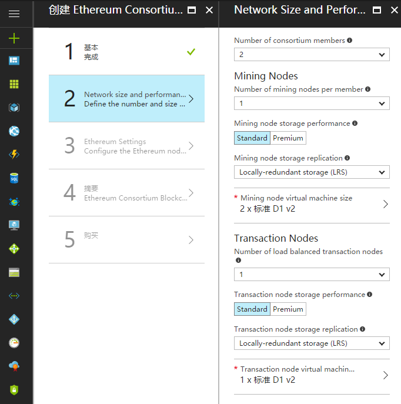
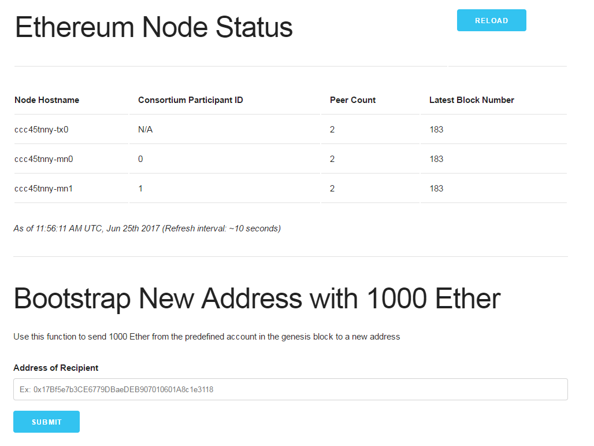

## 微软 Azure 云区块链服务

Azure 是微软推出的云计算平台，向用户提供开放的 IaaS 和 PaaS 服务。

Azure 陆续在其应用市场中提供了若干个与区块链相关的服务，分别面向多种不同的区块链底层平台，其中包括以太坊和超级账本 Fabric。

可以在应用市场（https://azuremarketplace.microsoft.com/en-us/marketplace/apps）中搜索 “blockchain” 关键字查看这些服务，如下图所示。

下面具体介绍其中的 Azure Blockchain Service。

### 使用服务

使用 Azure 服务，用户可以在几分钟之内在云中部署一个区块链网络。云平台会将一些耗时的配置流程自动化，使用户专注在上层应用方案。

Azure 区块链服务目前支持部署以太坊或超级账本 Fabric 网络。

下面以以太坊为例，在 Azure 的仪表盘中，选择创建 Ethereum Consortium Blockchain 后，输入一些配置选项，则可以开始部署该模拟网络，如下图所示。

部署过程需要几分钟时间。完成后，可进入资源组查看部署结果，如下图所示，成功部署了一个以太坊网络。

点击 microsoft-azure-blockchain 开头的链接，可以查看网络的一些关键接口，包括管理网址、RPC 接口地址等。

复制管理网址 ADMIN-SITE 的链接，用浏览器打开，可以进入区块链管理界面。界面中可查看网络各节点信息，也可以新建一个账户，并从 admin 账户向其发送 1000 个以太币。结果如下图所示。

Azure 云平台提供了相对简单的操作界面，更多的是希望用户通过 RPC 接口地址来访问所部署的区块链示例。用户可以自行通过 RPC 接口与以太坊模拟网络交互，部署和测试智能合约，此处不再赘述。