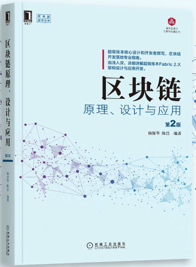

# 区块链技术指南
v1.5.0

区块链是金融科技（Fintech）领域的一项基础性的创新。

作为新一代分布式记账（Distributed Ledger Technology，DLT）系统的核心技术，区块链被认为在金融、物联网、商业贸易、征信、资产管理等众多领域都拥有广泛的应用前景。

目前，区块链技术尚处于快速发展的阶段，涉及分布式系统、密码学、博弈论、网络协议等诸多学科知识，为学习和实践都带来了不小的挑战。

本书希望能客观探索区块链概念的来龙去脉，剖析关键技术和原理，同时以全球最大的开源分布式账本项目——超级账本为例讲解具体应用。在开发超级账本项目，以及为企业设计方案过程中，笔者积累了一些实践经验，也通过本书分享出来，希望能有助于分布式账本科技的发展和应用。

## 阅读使用
本书适用于对区块链技术感兴趣，且具备一定金融科技基础的读者；无技术背景的读者也可以从中了解到区块链技术的现状。

* [GitBook 在线阅读](https://yeasy.gitbook.io/blockchain_guide/)；
* [GitHub 在线阅读](https://github.com/yeasy/blockchain_guide/blob/master/SUMMARY.md)

## 进阶学习

《[区块链原理、设计与应用 第 2 版](https://item.jd.com/12159265.html)》 围绕超级账本 Fabric 2.x 最新版，详细介绍了区块链和分布式账本领域的核心技术，以及企业分布式账本方案的设计、架构和应用，欢迎大家阅读并反馈建议。

* [China-Pub](http://product.china-pub.com/8071482)
* [京东图书](https://item.jd.com/12935394.html)
* [当当图书](http://product.dangdang.com/28996031.html)

如果发现疏漏，欢迎提交到 [勘误表](https://github.com/yeasy/blockchain_guide/wiki/%E3%80%8A%E5%8C%BA%E5%9D%97%E9%93%BE%E5%8E%9F%E7%90%86%E3%80%81%E8%AE%BE%E8%AE%A1%E4%B8%8E%E5%BA%94%E7%94%A8%E3%80%8B2%E7%89%88%E5%8B%98%E8%AF%AF%E8%A1%A8)。

## 参与贡献
欢迎 [参与维护项目](contribute.md)。

* [修订记录](revision.md)
* [贡献者名单](https://github.com/yeasy/blockchain_guide/graphs/contributors)

## 支持鼓励

欢迎鼓励一杯 coffee~

## 在线交流

欢迎大家加入区块链技术讨论群：

* QQ 群  IV：364824846（可加）
* QQ 群 III：414919574（已满）
* QQ 群  II：523889325（已满）
* QQ 群   I：335626996（已满）
