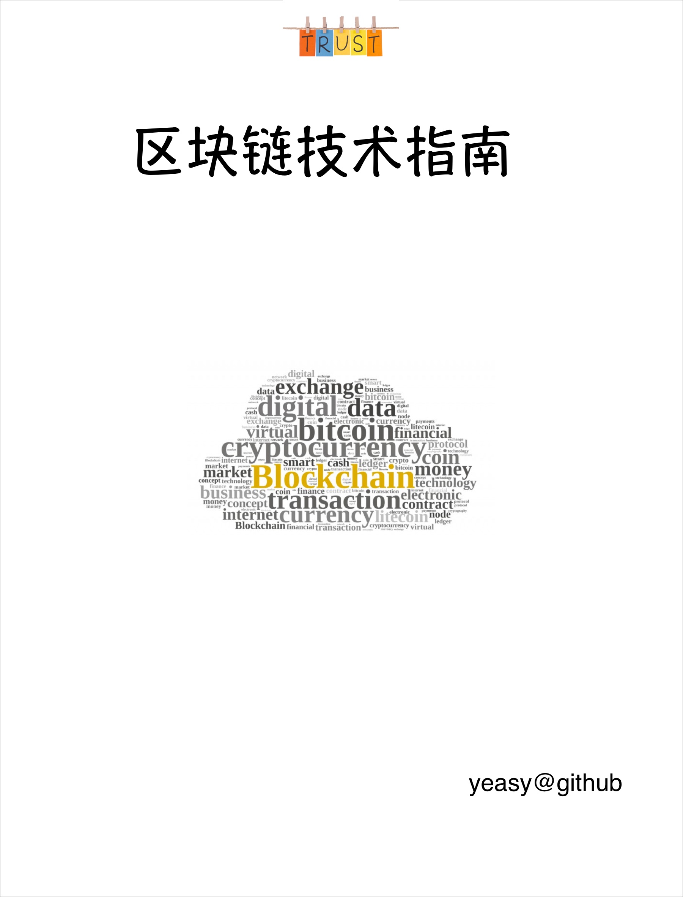
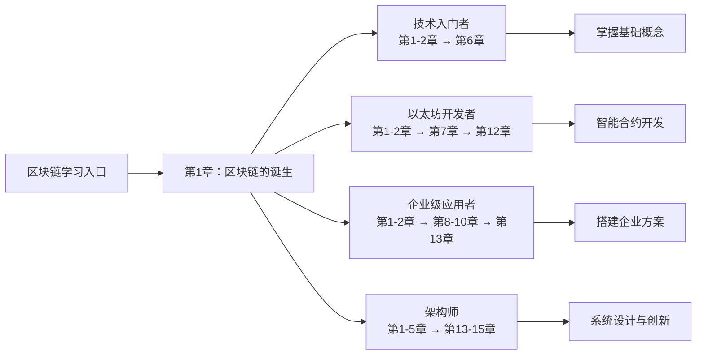
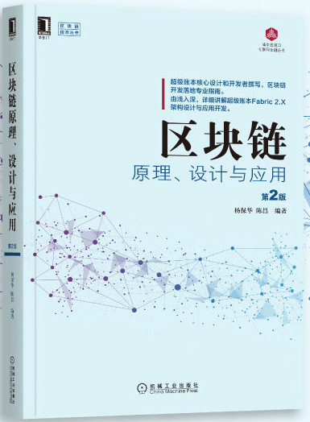

<div align="center">

# 区块链技术指南

[](https://creativecommons.org/licenses/by-nc-sa/4.0/)
[](https://github.com/yeasy/blockchain_guide)
[](https://github.com/yeasy/blockchain_guide/releases)
[](https://yeasy.gitbook.io/blockchain_guide)
[](https://github.com/yeasy/blockchain_guide/releases/latest)

> 从原理到实践，系统掌握区块链核心技术与企业级应用



</div>

---

## 关于本书

区块链是金融科技（Fintech）领域的一项基础性的创新。作为新一代分布式记账（Distributed Ledger Technology，DLT）系统的核心技术，区块链被认为在金融、物联网、商业贸易、征信、资产管理等众多领域都拥有广泛的应用前景。

区块链技术涉及分布式系统、密码学、博弈论、网络协议等诸多学科知识，为学习和实践都带来了不小的挑战。

本书希望能客观探索区块链概念的来龙去脉，剖析关键技术和原理，同时以 Linux 基金会生态中的重要开源分布式账本项目——超级账本为例讲解具体应用。在开发超级账本项目，以及为企业设计方案过程中，笔者积累了一些实践经验，也通过本书分享出来，希望能有助于分布式账本科技的发展和应用。

## 目标读者

- **区块链入门者**：对区块链技术充满好奇，希望系统了解其原理和应用
- **以太坊开发者**：希望掌握智能合约开发与 DeFi 生态
- **企业级应用者**：需要设计和部署超级账本解决方案的技术人员
- **架构师**：需要设计高可用、高性能区块链系统的资深工程师

## 五分钟快速上手

“5分钟理解区块链”——跟随以下步骤快速掌握核心概念：

1. **区块链基础**（第1-2章）：理解区块链的起源、定义、演化与关键挑战
2. **比特币与以太坊**（第6-7章）：掌握主流公链的工作原理、设计与智能合约能力
3. **核心机制深化**（第4-6章）：探索一致性、共识算法、密码学安全与比特币机制
4. **企业级应用**（第8-10章）：了解超级账本 Fabric 的权限、通道、背书机制等企业特性
5. **架构与前沿**（第13-15章）：学习 Fabric 架构设计、区块链服务平台与前沿趋势

## 学习路线图


```mermaid
graph LR
    Start[区块链学习入口] --> Ch1[第1章：区块链的诞生]

    Ch1 --> Role1["技术入门者<br/>第1-2章 → 第6章"]
    Ch1 --> Role2["以太坊开发者<br/>第1-2章 → 第7章 → 第12章"]
    Ch1 --> Role3["企业级应用者<br/>第1-2章 → 第8-10章 → 第13章"]
    Ch1 --> Role4["架构师<br/>第1-5章 → 第13-15章"]

    Role1 --> End1["掌握基础概念"]
    Role2 --> End2["智能合约开发"]
    Role3 --> End3["搭建企业方案"]
    Role4 --> End4["系统设计与创新"]
```

| 读者角色 | 学习重点 | 核心成果 |
|---------|---------|---------|
| **技术入门** | 第1-2章 → 第6章 | 理解区块链基础概念与比特币实现 |
| **以太坊开发者** | 第1-2章 → 第7章 → 第12章 | 掌握智能合约开发与 DeFi 生态 |
| **企业级应用** | 第1-2章 → 第8-10章 → 第13章 | 设计与部署超级账本解决方案 |
| **架构师** | 第1-5章 → 第13-15章 | 设计高可用、高性能的区块链系统 |

## 阅读使用

本书适用于对区块链技术感兴趣，且具备一定金融科技基础的读者；无技术背景的读者也可以从中了解到区块链技术的现状。

**在线阅读**：https://yeasy.gitbook.io/blockchain_guide/

**本地阅读**（先安装 [mdPress](https://github.com/yeasy/mdpress)）：

```bash
brew tap yeasy/tap && brew install mdpress
mdpress serve
```

## 下载离线版本

本书提供 PDF 版本供离线阅读，可前往 [GitHub Releases](https://github.com/yeasy/blockchain_guide/releases/latest) 页面下载最新版本。

如需获取默认分支自动更新的预览版，可直接下载 [blockchain_guide.pdf](https://github.com/yeasy/blockchain_guide/releases/download/preview-pdf/blockchain_guide.pdf)。该文件会随主线更新覆盖，不代表正式发布版本。

## 进阶学习

<p align="center">
  
</p>

《[区块链原理、设计与应用 第 2 版](https://item.jd.com/12159265.html)》 成书时围绕超级账本 Fabric 2.x 展开，详细介绍了区块链和分布式账本领域的核心技术，以及企业分布式账本方案的设计、架构和应用。截至 2026 年，Fabric 社区同时维护 2.5 LTS 和 3.x 发布线，读者实践时应结合官方文档确认当前版本。欢迎大家阅读并反馈建议。本书已被译为多国语言发行，有意欢迎与作者联系。

* [China-Pub](https://product.china-pub.com/8071482)
* [京东图书](https://item.jd.com/12935394.html)
* [当当图书](https://product.dangdang.com/28996031.html)

如果发现疏漏，欢迎提交到 [勘误表](https://github.com/yeasy/blockchain_guide/wiki/%E3%80%8A%E5%8C%BA%E5%9D%97%E9%93%BE%E5%8E%9F%E7%90%86%E3%80%81%E8%AE%BE%E8%AE%A1%E4%B8%8E%E5%BA%94%E7%94%A8%E3%80%8B2%E7%89%88%E5%8B%98%E8%AF%AF%E8%A1%A8)。

## 推荐阅读

本书是技术丛书的一部分。以下书籍与本书形成互补：

| 书名 | 与本书的关系 |
|------|------------|
| [《Docker 从入门到实践》](https://yeasy.gitbook.io/docker_practice) | 区块链节点的容器化部署与运维实践 |
| [《大模型安全权威指南》](https://yeasy.gitbook.io/ai_security_guide) | 密码学、安全攻防与区块链安全共通 |
| [《智能体 AI 权威指南》](https://yeasy.gitbook.io/agentic_ai_guide) | AI 智能体与区块链结合的前沿探索 |
| [《零基础学 AI》](https://yeasy.gitbook.io/ai_beginner_guide) | AI 基础入门，理解 AI + Web3 融合趋势 |

## 参与贡献

欢迎 [参与维护项目](contribute.md)。

* [修订记录](revision.md)
* [贡献者名单](https://github.com/yeasy/blockchain_guide/graphs/contributors)

## 支持鼓励

欢迎鼓励一杯 coffee~

<p align="center">
  
</p>

## 在线交流

欢迎大家加入区块链技术讨论群：

* QQ 群  IV：364824846（可加）
* QQ 群 III：414919574（已满）
* QQ 群  II：523889325（已满）
* QQ 群   I：335626996（已满）

## 许可证

本书采用 [CC BY-NC-SA 4.0](https://creativecommons.org/licenses/by-nc-sa/4.0/) 许可证。

您可以自由分享和演绎，但需署名、非商业使用、相同方式共享。

## Star History

<p align="center">
  <a href="https://star-history.com/#yeasy/blockchain_guide&Date">
    
  </a>
</p>
