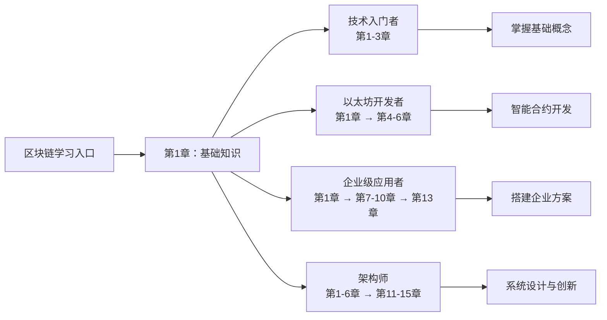

# 区块链技术指南

v2.2.5

区块链是金融科技（Fintech）领域的一项基础性的创新。

作为新一代分布式记账（Distributed Ledger Technology，DLT）系统的核心技术，区块链被认为在金融、物联网、商业贸易、征信、资产管理等众多领域都拥有广泛的应用前景。

区块链技术涉及分布式系统、密码学、博弈论、网络协议等诸多学科知识，为学习和实践都带来了不小的挑战。

本书希望能客观探索区块链概念的来龙去脉，剖析关键技术和原理，同时以全球最大的开源分布式账本项目——超级账本为例讲解具体应用。在开发超级账本项目，以及为企业设计方案过程中，笔者积累了一些实践经验，也通过本书分享出来，希望能有助于分布式账本科技的发展和应用。

## 五分钟快速上手

"5分钟理解区块链"——跟随以下步骤快速掌握核心概念：

1. **区块链基础**（第1-2章）：理解什么是区块链、哈希、公钥密码学、以及比特币的基本工作原理
2. **比特币与以太坊**（第3-4章）：掌握比特币交易、区块结构，进而理解以太坊智能合约的革新之处
3. **核心机制深化**（第4-6章）：探索以太坊虚拟机、Gas 机制和 DeFi 的技术基础
4. **企业级应用**（第7-10章）：了解超级账本 Fabric 的权限、通道、背书机制等企业特性
5. **架构与前沿**（第11-15章）：学习共识算法、扩展性方案和区块链在生产环境的最佳实践

## 学习路线图


```mermaid
graph LR
    Start[区块链学习入口] --> Ch1[第1章：基础知识]

    Ch1 --> Role1["技术入门者<br/>第1-3章"]
    Ch1 --> Role2["以太坊开发者<br/>第1章 → 第4-6章"]
    Ch1 --> Role3["企业级应用者<br/>第1章 → 第7-10章 → 第13章"]
    Ch1 --> Role4["架构师<br/>第1-6章 → 第11-15章"]

    Role1 --> End1["掌握基础概念"]
    Role2 --> End2["智能合约开发"]
    Role3 --> End3["搭建企业方案"]
    Role4 --> End4["系统设计与创新"]
```

| 读者角色 | 学习重点 | 核心成果 |
|---------|---------|---------|
| **技术入门** | 第1-3章 | 理解区块链核心原理与比特币实现 |
| **以太坊开发者** | 第1章 → 第4-6章 | 掌握智能合约开发与 DeFi 生态 |
| **企业级应用** | 第1章 → 第7-10章 → 第13章 | 设计与部署超级账本解决方案 |
| **架构师** | 第1-6章 → 第11-15章 | 设计高可用、高性能的区块链系统 |

## 阅读使用

本书适用于对区块链技术感兴趣，且具备一定金融科技基础的读者；无技术背景的读者也可以从中了解到区块链技术的现状。

**在线阅读**：https://yeasy.gitbook.io/blockchain_guide/

**本地阅读**（使用 HonKit 构建）：

```bash
npm install        # 安装依赖
npx honkit serve   # 启动本地服务器后，访问 http://localhost:4000
```

## 进阶学习


《[区块链原理、设计与应用 第 2 版](https://item.jd.com/12159265.html)》 围绕超级账本 Fabric 2.x 最新版，详细介绍了区块链和分布式账本领域的核心技术，以及企业分布式账本方案的设计、架构和应用，欢迎大家阅读并反馈建议。本书已被译为多国语言发行，有意欢迎与作者联系。

* [China-Pub](https://product.china-pub.com/8071482)
* [京东图书](https://item.jd.com/12935394.html)
* [当当图书](http://product.dangdang.com/28996031.html)

如果发现疏漏，欢迎提交到 [勘误表](https://github.com/yeasy/blockchain_guide/wiki/%E3%80%8A%E5%8C%BA%E5%9D%97%E9%93%BE%E5%8E%9F%E7%90%86%E3%80%81%E8%AE%BE%E8%AE%A1%E4%B8%8E%E5%BA%94%E7%94%A8%E3%80%8B2%E7%89%88%E5%8B%98%E8%AF%AF%E8%A1%A8)。

## 推荐阅读

本书是技术丛书的一部分。以下书籍与本书形成互补：

| 书名 | 与本书的关系 |
|------|------------|
| [《大模型安全权威指南》](https://github.com/yeasy/ai_security_guide) | 区块链与 AI 安全的交叉领域 |
| [《Docker — 从入门到实践》](https://github.com/yeasy/docker_practice) | 区块链节点的容器化部署基础 |

## 参与贡献

欢迎 [参与维护项目](contribute.md)。

* [修订记录](revision.md)
* [贡献者名单](https://github.com/yeasy/blockchain_guide/graphs/contributors)

## 支持鼓励

欢迎鼓励一杯 coffee~


## 在线交流

欢迎大家加入区块链技术讨论群：

* QQ 群  IV：364824846（可加）
* QQ 群 III：414919574（已满）
* QQ 群  II：523889325（已满）
* QQ 群   I：335626996（已满）

## Star History

[](https://star-history.com/#yeasy/blockchain_guide&Date)
