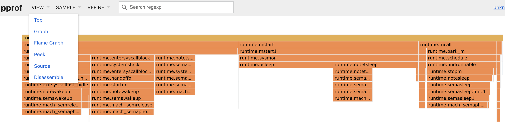

### 高效开发工具

Go 语言自带了不少高效的工具和命令，使用好这些工具和命令，可以很方便地进行程序的维护、编译和调试。

#### go doc 和 godoc

go doc 可以快速显示指定软件包的帮助文档。

godoc 是一个类似的命令，功能更强大，它以 web 服务的形式提供文档，即允许用户通过浏览器查看软件包的文档。

可以通过如下命令进行快速安装。

```bash
$ go get golang.org/x/tools/cmd/godoc
```

godoc 命令使用格式如下。

```bash
$ godoc package [name ...]
``` 

比较有用的命令行参数包括：

* `-http=:PORT`：指定监听的地址，默认是 `:6060`。
* `-index`：支持关键词索引。
* `-play`：支持 Go 语言的 playground，用户可以在浏览器里面对 Go 语言进行测试。

例如，下面的命令将在本地快速启动一个类似 [https://golang.org/](https://golang.org/) 的网站，包括本地软件包的文档和 playground 等。

```bash
$ godoc -http=:6060 -index -play
```


#### go build
编译软件包，例如编辑当前软件包内容。

```sh
$ go build .
```

支持如下参数：

* `-x` 参数：可以打印出执行过程的详细信息，辅助调试。
* `-gcflags`：指定编译器参数。
* `-ldflags`：指定链接器参数，常见的可以通过 -X 来动态指定包变量值。

#### go clean
清理项目，删除编译生成的二进制文件和临时文件。使用格式如下

```sh
$ go clean
```

支持如下参数：

* `-i` 参数：删除 go install 安装的文件。
* `-n` 参数：打印删除命令，而不执行，方便进行测试检查。
* `-r` 参数：递归清除，对依赖包也执行清理工作。
* `-x` 参数：执行清除过程同时打印执行的删除命令，方便进行测试检查。


#### go env

打印与 go 相关的环境变量，命令使用格式如下。

```bash
$ go env [var ...]
```

例如，通过如下命令查看所有跟 go 相关的环境变量。

```bash
$ go env

GOARCH="amd64"
GOBIN=""
GOEXE=""
GOHOSTARCH="amd64"
GOHOSTOS="darwin"
GOOS="darwin"
GOPATH="/opt/Go"
GORACE=""
GOROOT="/usr/local/go/1.8.3/libexec"
GOTOOLDIR="/usr/local/go/1.8.3/libexec/pkg/tool/darwin_amd64"
GCCGO="gccgo"
CC="clang"
GOGCCFLAGS="-fPIC -m64 -pthread -fno-caret-diagnostics -Qunused-arguments -fmessage-length=0 -fdebug-prefix-map=/var/folders/d8/3h28zg552853gpp7ymrxl2r80000gn/T/go-build128111214=/tmp/go-build -gno-record-gcc-switches -fno-common"
CXX="clang++"
CGO_ENABLED="1"
PKG_CONFIG="pkg-config"
CGO_CFLAGS="-g -O2"
CGO_CPPFLAGS=""
CGO_CXXFLAGS="-g -O2"
CGO_FFLAGS="-g -O2"
CGO_LDFLAGS="-g -O2"
```

#### go fmt 和 gofmt

两者都是对代码进行格式化检查和修正。

go fmt 命令实际上是对 gofmt 工具进行了封装，默认调用 `gofmt -l -w` 命令。

gofmt 命令的使用格式如下。

```sh
$ gofmt [flags] [path ...]
```

支持如下参数：

* `-d` 参数：仅显示不符合格式规定的地方，不进行修正。
* `-e` 参数：打印完整错误内容，默认是只打印 10 行。
* `-l` 参数：列出不符合格式规定的文件路径。
* `-r` 参数：重写的规则。
* `-s` 参数：对代码尝试进行简化。
* `-w` 参数：对不符合默认风格的代码进行修正。

#### go get
快速获取某个软件包并执行编译和安装，例如

```sh
$ go get github.com/hyperledger/fabric
```

支持如下参数：

* `-u` 参数：可以强制更新到最新版。
* `-d` 参数：仅获取软件包，不执行编译安装。

#### go install
对本地软件包执行编译，并将编译好的二进制文件安装到 $GOPATH/bin。

等价于先执行 `go build` 命令，之后执行复制命令。

#### go list

列出本地包中的所有的导入依赖。

命令格式为

```sh
$ go list [-e] [-f format] [-json] [build flags] [packages]
```

其中，-e 可以指定忽略出错的包。

#### go run
编译并直接运行某个主程序包。

需要注意，该可以执行 `go run` 的程序包必须是主包，意味着包内必须有入口的主函数：main。

#### go test
执行软件包内带的测试用例（`*_test.go` 文件），例如递归执行当前包内所有的测试案例。

```sh
$ go test ./...
```

支持如下参数：

* `-v` 参数：可以参数来打开详细测试日志，辅助调试。

#### golint

对代码进行格式风格检查，打印出不符合 Go 语言推荐风格的代码。

安装该工具十分简单，通过如下命令即可快速安装。

```bash
$ go get -u github.com/golang/lint/golint
```

使用时，指定软件包路径即可，如对超级账本 Fabric 项目所有代码进行风格检查。

```bash
$ golint $GOPATH/src/github.com/hyperledger/fabric/...
```

注意后面的 `...` 代表递归检查所有子目录下内容。

#### goimports

也是代码风格检查工具，重点在于对 imports 相关格式进行检查，比较强大的是能自动修正。

安装该工具十分简单，通过如下命令即可快速安装。

```bash
$ go get golang.org/x/tools/cmd/goimports
```

使用时，也是指定软件包路径即可。

另外，goimports 支持几个很有用的参数。

`-d`：仅显示修订，不实际写入文件。
`-e`：显示所有的错误。
`-l`：列出含有错误的文件路径。
`-w`：将修订直接写入文件，不显示出来。
`-srcdir`：指定对软件包进行查找的相对路径。

#### go vet

go vet 对代码的准确性进行基本检查，如函数调用参数缺失、不可达代码，或调用格式不匹配等。使用也十分简单，指定要检查的软件包路径作为参数即可。

#### go tool 

`go tool` 命令中包括许多有用的工具子命令，包括 addr2line、api、asm、cgo、compile、cover、dist、doc、fix、link、nm、objdump、pack、pprof、trace。

其中，比较常用的包括 fix、trace 等。

fix 命令可以对自动对旧版本的代码进行升级修复，替换为使用新版本的特性。

trace 命令可以通过分析 trace 文件来追踪程序运行过程中的事件（包括 goroutine 的创建、使用和结束，以及系统调用和网络 IO 等底层事件），并提供图形化界面展示。例如如下命令会打开网页提供图形界面，展示程序执行情况。

```bash
$ go test -bench=. -trace trace.out
$ go tool trace trace.out
```

可以通过 `go tool cmd -h` 命令查看子目录具体支持的相关参数，在此不再赘述。

#### pprof 工具包

Go 语言自带了方便的性能分析工具，可以查看程序的 CPU、内存等在运行时的使用情况。

目前支持两种性能分析工具包。如果希望在程序执行过程中通过 Web 网页试试查看运行信息（go routine、堆栈等），可以导入 `net/http/pprof` 工具包，并在代码中启动 Web 服务，如下所示：

```go
import (
	"http"
	_ "net/http/pprof"
)

func main() {
	// 提供 profiling web 界面 localhost:6060/debug/pprof
	go func() {
		http.ListenAndServe("localhost:6060", nil)
	}()

	// 应用程序代码
}
```

程序运行后，可以通过访问 localhost:6060/debug/pprof 路径来查看 go routine、thread、堆栈使用等实时信息。

如果是希望执行完毕后统一进行分析，可以使用 `runtime/pprof` 包，并在代码中启动性能分析功能。

例如，编写 main.go 文件，通过 go routine 来启动若干计时器，但并没有进行释放。

```go
package main

import (
    "flag"
    "fmt"
    "log"
    "os"
    "runtime"
    "runtime/pprof"
    "time"
    "github.com/pkg/errors"
)

func testTimeout() error{
    incChan := make(chan int, 1)
    errChan := make(chan error, 1)
    timeout := 10 * time.Millisecond

    go func() {
        incChan <- 1
    }()

    select {
    case <-time.NewTicker(timeout).C:
        fmt.Println("Ticker")
        return errors.Errorf("Timed out waiting for connection message")
    case m := <-incChan:
        fmt.Printf("incChan: %d\n", m)
        return nil
    case err := <-errChan:
        fmt.Println("errChan")
        return errors.WithStack(err)
    }
}

var cpuprofile = flag.String("cpuprofile", "cpu.prof", "write cpu profile to `file`")
var memprofile = flag.String("memprofile", "mem.prof", "write memory profile to `file`")

func main() {
    // 启用 CPU profiling
    flag.Parse()
    if *cpuprofile != "" {
        f, err := os.Create(*cpuprofile)
        if err != nil {
            log.Fatal("could not create CPU profile: ", err)
        }
        if err := pprof.StartCPUProfile(f); err != nil {
            log.Fatal("could not start CPU profile: ", err)
        }
        defer pprof.StopCPUProfile()
    }

    // 应用代码
    i := 1
    for i = 1; i <= 100; i++ {
        fmt.Println(i)
        go testTimeout()
        time.Sleep(time.Duration(1) * time.Second)
    }

    // 导出内存统计
    if *memprofile != "" {
        f, err := os.Create(*memprofile)
        if err != nil {
            log.Fatal("could not create memory profile: ", err)
        }
        runtime.GC() // get up-to-date statistics
        if err := pprof.WriteHeapProfile(f); err != nil {
            log.Fatal("could not write memory profile: ", err)
        }
        f.Close()
    }
}
```

执行 `go run main.go` 编译和运行程序，观察到 CPU 使用率会逐步上升。

程序运行完成后，同一路径下会生成 cpu.prof 和 mem.prof 文件。其中记录了运行过程中的调用信息，之后可以通过 pprof 工具或较新版本的 `go tool pprof` 对其进行分析。这里以分析 CPU 使用为例。

*说明：如果没有安装 pprof 工具，可以通过 `go get -u github.com/google/pprof` 快速安装。*

pprof 工具最常见的功能是提供一个 Web 交互界面，供用户查看调用图、火焰图、CPU 消耗，可以通过如下命令打开 Web 操作界面。

```bash
$ pprof -http=localhost:6060 main cpu.prof
```

用户可以根据需要从不同角度查看运行信息，并分析程序消耗资源较多的环节。如下图所示。



另外，runtime 包中也提供了如 `runtime/trace` 等工具包，可以生成 trace 文件供进行事件追踪分析，使用方法与 `runtime/pprof` 包类似，在此不再赘述。
