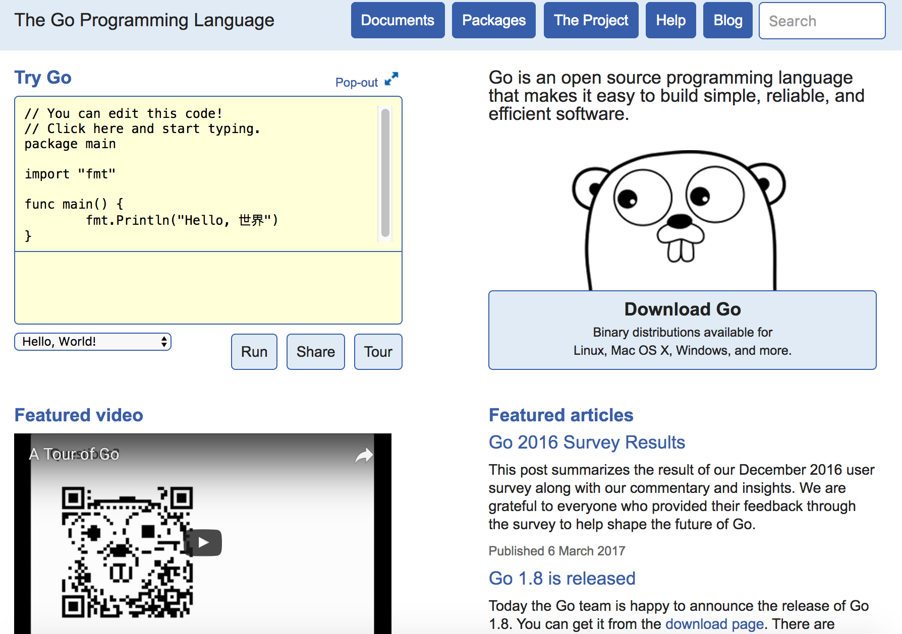

### 高效开发工具

Go 语言自带了不少高效的工具和命令，使用好这些工具和命令，可以很方便地进行程序的维护、编译和调试。

#### go doc 和 godoc

go doc 可以快速显示指定软件包的帮助文档。

godoc 是一个类似的命令，功能更强大，它以 web 服务的形式提供文档，即允许用户通过浏览器查看软件包的文档。

可以通过如下命令进行快速安装。

```bash
$ go get golang.org/x/tools/cmd/godoc
```

godoc 命令使用格式如下。

```bash
$ godoc package [name ...]
``` 

比较有用的命令行参数包括：

* `-http=:PORT`：指定监听的地址，默认是 `:6060`。
* `-index`：支持关键词索引。
* `-play`：支持 Go 语言的 playground，用户可以在浏览器里面对 Go 语言进行测试。

例如，下面的命令将在本地快速启动一个类似 [https://golang.org/](https://golang.org/) 的网站，包括本地软件包的文档和 playground 等。

```bash
$ godoc -http=:6060 -index -play
```



#### go build
编译软件包，例如编辑当前软件包内容。

```sh
$ go build .
```

支持如下参数：

* `-x` 参数：可以打印出执行过程的详细信息，辅助调试。
* `-gcflags`：指定编译器参数。
* `-ldflags`：指定链接器参数，常见的可以通过 -X 来动态指定包变量值。

#### go clean
清理项目，删除编译生成的二进制文件和临时文件。使用格式如下

```sh
$ go clean
```

支持如下参数：

* `-i` 参数：删除 go install 安装的文件。
* `-n` 参数：打印删除命令，而不执行，方便进行测试检查。
* `-r` 参数：递归清除，对依赖包也执行清理工作。
* `-x` 参数：执行清除过程同时打印执行的删除命令，方便进行测试检查。


#### go env

打印与 go 相关的环境变量，命令使用格式如下。

```bash
$ go env [var ...]
```

例如，通过如下命令查看所有跟 go 相关的环境变量。

```bash
$ go env

GOARCH="amd64"
GOBIN=""
GOEXE=""
GOHOSTARCH="amd64"
GOHOSTOS="darwin"
GOOS="darwin"
GOPATH="/opt/Go"
GORACE=""
GOROOT="/usr/local/go/1.8.3/libexec"
GOTOOLDIR="/usr/local/go/1.8.3/libexec/pkg/tool/darwin_amd64"
GCCGO="gccgo"
CC="clang"
GOGCCFLAGS="-fPIC -m64 -pthread -fno-caret-diagnostics -Qunused-arguments -fmessage-length=0 -fdebug-prefix-map=/var/folders/d8/3h28zg552853gpp7ymrxl2r80000gn/T/go-build128111214=/tmp/go-build -gno-record-gcc-switches -fno-common"
CXX="clang++"
CGO_ENABLED="1"
PKG_CONFIG="pkg-config"
CGO_CFLAGS="-g -O2"
CGO_CPPFLAGS=""
CGO_CXXFLAGS="-g -O2"
CGO_FFLAGS="-g -O2"
CGO_LDFLAGS="-g -O2"
```

#### go fmt 和 gofmt

两者都是对代码进行格式化检查和修正。

go fmt 命令实际上是对 gofmt 工具进行了封装，默认调用 `gofmt -l -w` 命令。

gofmt 命令的使用格式如下。

```sh
$ gofmt [flags] [path ...]
```

支持如下参数：

* `-d` 参数：仅显示不符合格式规定的地方，不进行修正。
* `-e` 参数：打印完整错误内容，默认是只打印 10 行。
* `-l` 参数：列出不符合格式规定的文件路径。
* `-r` 参数：重写的规则。
* `-s` 参数：对代码尝试进行简化。
* `-w` 参数：对不符合默认风格的代码进行修正。

#### go get
快速获取某个软件包并执行编译和安装，例如

```sh
$ go get github.com/hyperledger/fabric
```

支持如下参数：

* `-u` 参数：可以强制更新到最新版。
* `-d` 参数：仅获取软件包，不执行编译安装。

#### go install
对本地软件包执行编译，并将编译好的二进制文件安装到 $GOPATH/bin。

等价于先执行 `go build` 命令，之后执行复制命令。


#### go list

列出本地包中的所有的导入依赖。

命令格式为

```sh
$ go list [-e] [-f format] [-json] [build flags] [packages]
```

其中，-e 可以指定忽略出错的包。

#### go run
编译并直接运行某个主程序包。

需要注意，该可以执行 `go run` 的程序包必须是主包，意味着包内必须有入口的主函数：main。

#### go test
执行软件包内带的测试用例（`*_test.go` 文件），例如递归执行当前包内所有的测试案例。

```sh
$ go test ./...
```

支持如下参数：

* `-v` 参数：可以参数来打开详细测试日志，辅助调试。


#### golint

对代码进行格式风格检查，打印出不符合 Go 语言推荐风格的代码。

安装该工具十分简单，通过如下命令即可快速安装。

```bash
$ go get -u github.com/golang/lint/golint
```

使用时，指定软件包路径即可，如对超级账本 Fabric 项目所有代码进行风格检查。

```bash
$ golint $GOPATH/src/github.com/hyperledger/fabric/...
```

注意后面的 `...` 代表递归检查所有子目录下内容。

#### goimports

也是代码风格检查工具，重点在于对 imports 相关格式进行检查，比较强大的是能自动修正。

安装该工具十分简单，通过如下命令即可快速安装。

```bash
$ go get golang.org/x/tools/cmd/goimports
```

使用时，也是指定软件包路径即可。

另外，goimports 支持几个很有用的参数。

`-d`：仅显示修订，不实际写入文件。
`-e`：显示所有的错误。
`-l`：列出含有错误的文件路径。
`-w`：将修订直接写入文件，不显示出来。
`-srcdir`：指定对软件包进行查找的相对路径。

#### go tool 

`go tool` 命令中包括许多有用的工具子命令，包括 addr2line、api、asm、cgo、compile、cover、dist、doc、fix、link、nm、objdump、pack、pprof、trace、vet。

其中，比较常用的包括 vet 和 fix。

vet 对代码的准确性进行基本检查，如函数调用参数缺失、不可达代码，或调用格式不匹配等。

使用也十分简单，指定要检查的软件包路径即可。

fix 则可以对自动对旧版本的代码进行升级修复，替换为使用新版本的特性。

可以通过 `go tool cmd -h` 命令查看子目录具体支持的相关参数，在此不再赘述。


#### govendor 工具

长期以来，Golang 对外部依赖都没有很好的管理方式，只能从 `$GOPATH` 下查找依赖。这就造成不同用户在安装同一个项目时可能从外部获取到不同的依赖库版本，同时当无法联网时，无法编译依赖缺失的项目。

Golang 自 1.5 版本开始重视第三方依赖的管理，将项目依赖的外部包统一放到 vendor 目录下（类比 Nodejs 的 node_modules 目录），并通过 vendor.json 文件来记录依赖包的版本，方便用户使用相对稳定的依赖。

Daniel Theophanes 等人开发了 govendor 工具，方便对第三方依赖进行管理。

govendor 的安装十分简单，可以通过 go get 命令：

```bash
$ go get -u -v github.com/kardianos/govendor
```

对于 govendor 来说，主要存在三种位置的包：项目自身的包组织为本地（local）包；传统的存放在 $GOPATH 下的依赖包为外部（external）依赖包；被 govendor 管理的放在 vendor 目录下的依赖包则为 vendor 包。

具体来看，这些包可能的类型如下：

状态 | 缩写状态 | 含义
--- | ------- | ---
+local | l | 本地包，即项目自身的包组织
+external | e | 外部包，即被 $GOPATH 管理，但不在 vendor 目录下
+vendor | v | 已被 govendor 管理，即在 vendor 目录下
+std | s | 标准库中的包
+unused | u | 未使用的包，即包在 vendor 目录下，但项目并没有用到
+missing | m | 代码引用了依赖包，但该包并没有找到
+program | p | 主程序包，意味着可以编译为执行文件
+outside | | 外部包和缺失的包
+all     | | 所有的包

常见的命令如下，格式为 `govendor COMMAND`。

通过指定包类型，可以过滤仅对指定包进行操作。

命令 | 功能
-- | ---
`init` | 初始化 vendor 目录
`list` | 列出所有的依赖包
`add` | 添加包到 vendor 目录，如 govendor add +external 添加所有外部包
`add PKG_PATH` | 添加指定的依赖包到 vendor 目录
`update` | 从 $GOPATH 更新依赖包到 vendor 目录
`remove` | 从 vendor 管理中删除依赖
`status` | 列出所有缺失、过期和修改过的包
`fetch` | 添加或更新包到本地 vendor 目录
`sync` | 本地存在 vendor.json 时候拉去依赖包，匹配所记录的版本
`get` | 类似 `go get` 目录，拉取依赖包到 vendor 目录


#### dep 工具

为了方便管理依赖，Golang 团队 2016 年 4 月开始开发了 dep 工具，试图进一步简化在 Golang 项目中对第三方依赖的管理。该工具目前已经被试验性支持，相信很快会成为官方支持的工具。

dep 目前需要 Golang 1.7+ 版本，兼容其他依赖管理工具如 glide、godep、vndr、govend、gb、gvt、govendor、glock 等。

类似于 govendor 工具，dep 将依赖都放在本地的 vendor 目录下，通过 Gopkg.toml 和 Gopkg.lock 文件来追踪依赖的状态。

* Gopkg.toml 文件：手动编写或通过 dep init 命令生成。描述了项目对第三库的依赖规则，例如允许的版本范围等。用户可以通过编辑该文件表达预期的依赖控制目标。
* Gopkg.lock 文件：通过 dep init 或 dep ensure 命令自动生成。根据项目代码和 Gopkg.toml 文件，计算出一个符合要求的具体的依赖关系并锁定，其中包括每个第三方库的具体版本。vendor 目录下的依赖库需要匹配这些版本。

安装可以通过 go get 命令：

```bash
$ go get -v -u github.com/golang/dep/cmd/dep
```

dep 使用保持简洁的原则，包括四个子命令。

* init：对一个新的 Go 项目，初始化依赖管理，生成配置文件和 vendor 目录等；
* status：查看当前项目依赖的状态，包括依赖包名称、限制范围、指定版本等。可以通过 -old 参数来只显示过期的依赖；
* ensure：更新依赖，确保满足指定的版本条件。如果本地缺乏某个依赖，会自动安装；
* version：显示 dep 工具的版本信息。

其中，ensure 命令最为常用，支持的子命令参数主要包括：

* -add：添加新的依赖，如 dep ensure -add github.com/pkg/foo@^1.0.0；
* -dry-run：模拟执行，打印参考改动但不实施；
* -no-vendor：根据计算结果更新 Gopkg.lock 文件，但不更新 vendor 中依赖包；
* -update：更新 Gopkg.lock 中的依赖到 Gopkg.toml 中允许的最新版本，默认同时更新 vendor 包中内容；
* -v：输出调试信息方面了解执行过程；
* -vendor-only：按照 Gopkg.lock 中条件更新 vendor 包中内容。