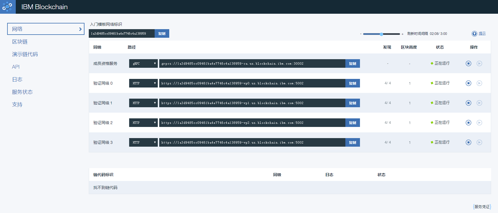

## IBM Bluemix 云区块链服务

Bluemix 是 IBM 推出的开放的 PaaS 云平台，包含大量平台和软件服务，旨在帮助开发者实现一站式地应用开发与部署管理。

2016 年，Bluemix 面向开发者推出了基于超级账本 Fabric 的区块链服务，供全球的区块链爱好者使用。用户可以通过访问 https://console.ng.bluemix.net/catalog/services/blockchain 使用该服务。

### 服务介绍

Bluemix 为用户提供了在云上灵活管理超级账本 Fabric 区块链网络的能力，让开发者专注于快速创建、操作和监控区块链网络，而无需过多考虑底层硬件资源。同时，Bluemix 云平台本身也提供了安全、隐私性方面的保障，并对相关资源进行了性能优化。

Bluemix 目前提供了几种不同类型的区块链网络部署方案，包括免费的基础套餐到收费的高性能方案等。不同方案针对开发者的不同需求，在运行环境、占用资源、配置方式上都有所区别。

对于超级账本 Fabric 网络试用者，可选择免费的基础套餐，获得一个包含各类型 Peer 节点和 CA 的完整区块链试用网络，用户可以自行尝试部署链码并实时观察账本状态的变化。

### 使用服务

Bluemix 云平台提供的仪表盘（Dashboard）提供了十分直观的管理方式，用户可以通过 Web 界面来获取和访问区块链资源。

如下图所示，用户创建网络后，可以进入 Dashboard 看到属于自己的区块链网络，同时观察各节点的状态，以及与身份认证相关的服务凭证。

对于已经申请到的区块链网络，用户可以通过 Dashboard 对其部署并调用链码，并实时查看响应结果。例如，下图中展示了部署自带的 example02 链码。

对链码的操作会发送交易，进而生成新的区块。可通过 Dashboard 观察与区块链状态、区块内容相关的信息。例如，下图中区块链生成了 4 个区块，并执行了 1 次部署和 2 次调用。

平台同时会收集各节点的日志信息，监控和记录服务的运行状态。用户同样可以在 Dashboard 中实时查看。如下图所示，显示了服务和网络的正常运行时间等。

同时，Bluemix 云平台会将与区块链网络交互所需的 gRPC 或 HTTP 接口地址开放给用户，供用户通过 SDK 等进行远程操作，实现更多跟区块链、链码和应用相关的丰富功能。