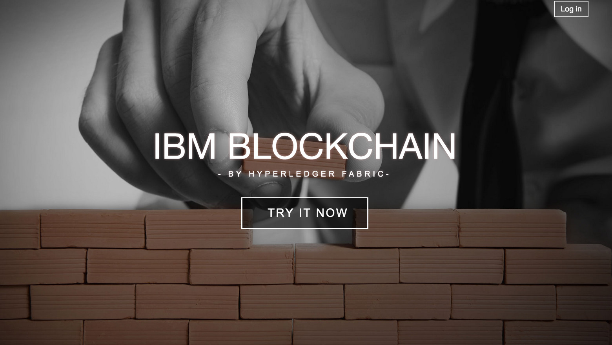
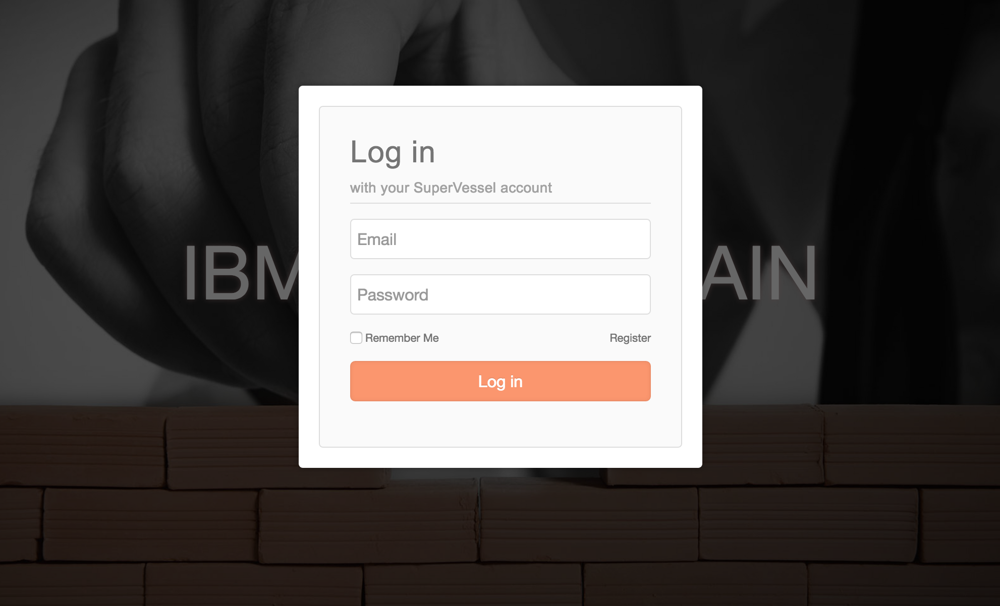
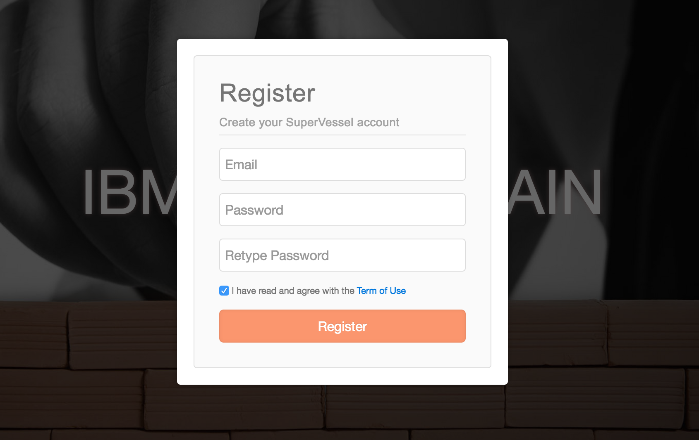
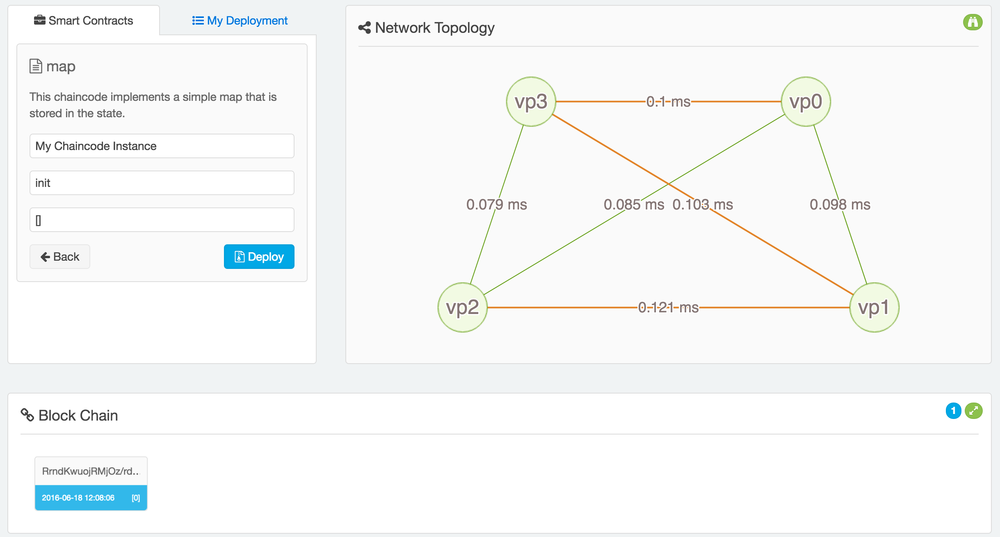
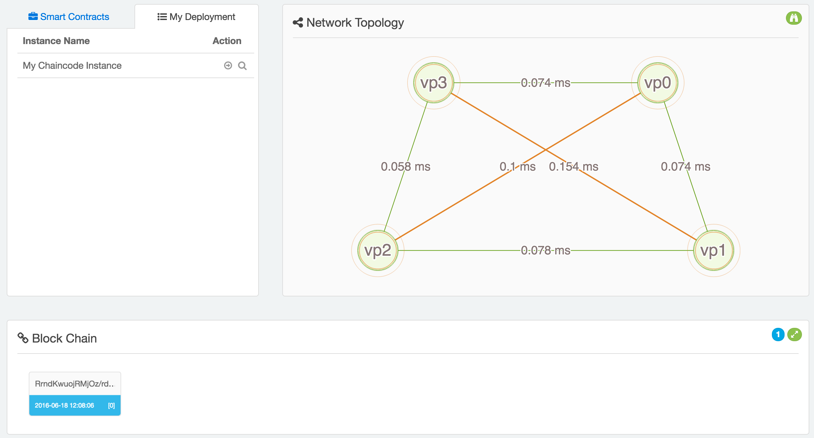
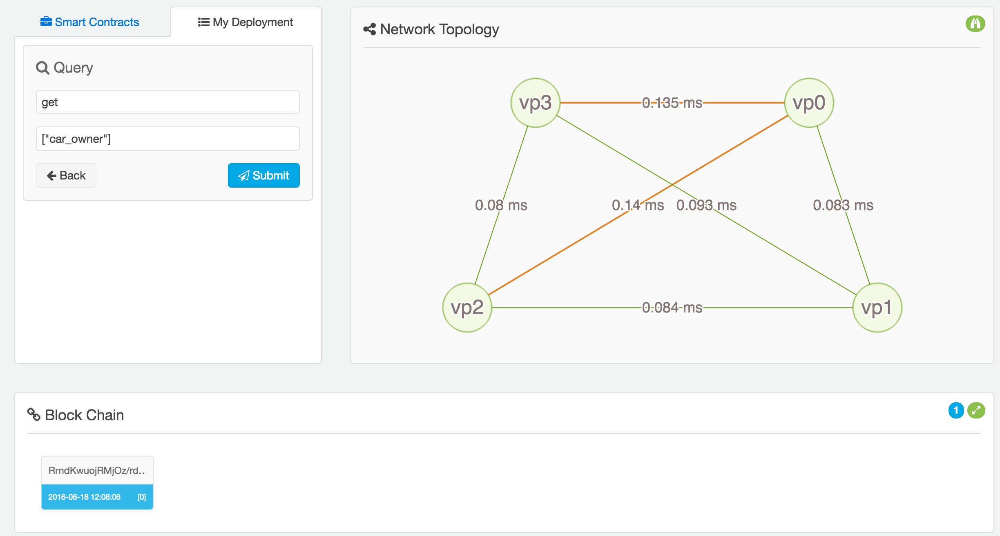
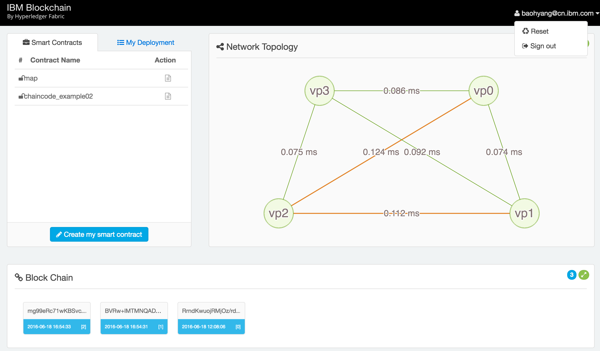

## 超能 Baas

面向区块链爱好者、开发者的 Devops 平台，托管在超能云平台。

下面介绍其使用步骤。

### 登录

未登录用户，请登录。

未注册用户，可以点击 Register 链接进行注册。

### Dashboard
登录成功后，点击 Try it Now 按钮进入面板。

可以看到，最左面是操作面板，包括对智能合约的管理和部署，右侧是申请到的区块链集群的网络情况，包括拓扑、节点之间的延迟信息等一目了然。最下面是目前区块链的整体情况，初始状态下只有一个区块。

### 智能合约管理

#### 部署

查看部署的智能合约。

调用智能合约。

查看合约执行结果。

上传个人的智能合约。

查看区块链情况。

### 查看区块链日志

### 重置和退出

