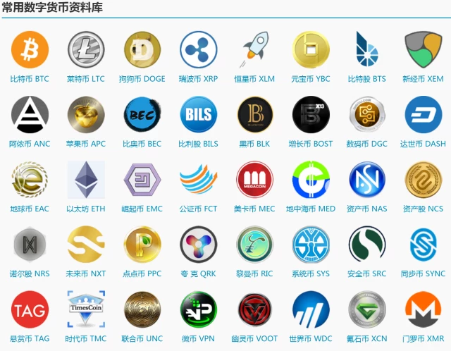

## 简介

### 历史

2009 年 1 月 3 日，中本聪在位于芬兰赫尔辛基的一个小型服务器上挖出了第一批 50 个比特币。

2010 年 5 月 21 日，第一次比特币交易：佛罗里达程序员 Laszlo Hanyecz 用 1 万 BTC 购买了价值 25 美元的披萨优惠券。这是比特币的首个兑换汇率：1: 0.0025 美金。

2010 年 7 月 17 日，第一个比特币平台成立。 

2011 年，开始出现基于显卡的挖矿设备。2011 年底，汇率约为 2 美元。

2012 年 9 月 27 日，比特币基金创立，此时比特币价格为 12.46 美元。

2013 年 3 月，1/3 的专业矿工已经采用专用 ASIC 矿机进行挖矿。

2013年 4 月 10 日，BTC 创下历史最高价，266 美元。

2013 年 6 月 27日，德国会议作出决定：持有比特币一年以上将予以免税，被业内认为此举变相认可了比特币的法律地位，此时比特币价格为 102.24 美元。

2013 年 10 月，世界第一台可以兑换比特币的 ATM 在加拿大上线。

2013 年 11 月 29 日，比特币的交易价格创下 1242 美元的历史新高，而同时黄金价格为一盎司 1241.98 美元，比特币价格首度超过黄金。 

2014 年初，全球最大比特币交易平台 Mt.Gox 宣告破产并关闭，造成大量投资者的损失。

2014 年 3 月，中国第一台可以兑换比特币的 ATM 在香港上线。

时至今日，比特币汇率约为 600 美元，总市值在 70 亿 美金。比特币区块链目前生成了 40 多万个区块，完整存储需要 60 GB 的空间。
  
比特币的“成功”，刺激了相关的生态和社区发展，大量类似数字货币（超过 600 种）纷纷出现，被称为“山寨币”。

