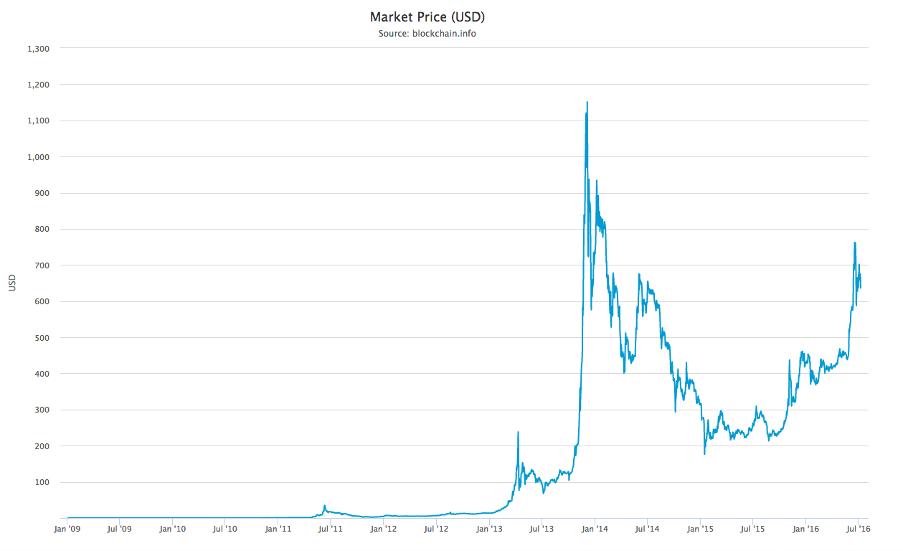

## 简介
比特币是基于密码学和经济博弈的一种数字货币，也是历史上首个经过大规模长时间运作检验的数字货币系统。

从 [blockchain.info 网站](https://blockchain.info/charts/market-price?timespan=all) 可以从查询到比特币的汇率（以美元为单位）变化历史。

### 历史

2008 年 10 月 31 日，中本聪发布比特币唯一的白皮书：《Bitcoin：A Peer-to-Peer Electronic Cash System/比特币：一种点对点的电子现金系统》。

2009 年 1 月 3 日，中本聪在位于芬兰赫尔辛基的一个小型服务器上挖出了第一批 50 个比特币，并记录下当天泰晤士报的头版标题：“ The Times 03/Jan/2009 Chancellor on brink of second bailout for banks ”。

2010 年 5 月 21 日，第一次比特币交易：佛罗里达程序员 Laszlo Hanyecz 用 1 万 BTC 购买了价值 25 美元的披萨优惠券。这是比特币的首个兑换汇率：1: 0.0025 美金。这些比特币在今日价值约 700 万美金。

2010 年 7 月 17 日，第一个比特币平台成立。 

2011 年，开始出现基于显卡的挖矿设备。2011 年底，汇率约为 2 美元。

2012 年 9 月 27 日，比特币基金创立，此时比特币价格为 12.46 美元。

2012 年 11 月 28 日，比特币产量第一次减半。

2013 年 3 月，1/3 的专业矿工已经采用专用 ASIC 矿机进行挖矿。

2013年 4 月 10 日，BTC 创下历史最高价，266 美元。

2013 年 6 月 27日，德国会议作出决定：持有比特币一年以上将予以免税，被业内认为此举变相认可了比特币的法律地位，此时比特币价格为 102.24 美元。

2013 年 10 月，世界第一台可以兑换比特币的 ATM 在加拿大上线。

2013 年 11 月 29 日，比特币的交易价格创下 1242 美元的历史新高，而同时黄金价格为一盎司 1241.98 美元，比特币价格首度超过黄金。 

2014 年 2 月，全球最大比特币交易平台 Mt.Gox 宣告因 85 万个比特币被盗而破产并关闭，造成大量投资者的损失，比特币价格一度暴跌。

2014 年 3 月，中国第一台可以兑换比特币的 ATM 在香港上线。

2014 年 6 月，美国加州通过 AB-129 法案，允许比特币等数字货币在加州进行流通。

2015 年 6 月，纽约成为美国第一个正式进行数字货币监管的州。

2015 年 10 月，欧盟法院裁定比特币交易免征增值税。

2016 年 1 月，中国人民银行在京召开了数字货币研讨会，会后发布公告宣称或推出数字货币。

2016 年 7 月 9 日，比特币产量第二次减半。

时至今日，比特币汇率约为 600 美元，总市值在 100 亿 美金。八成的交易量在中国。

比特币区块链目前生成了约 42 万个区块，完整存储需要约 75 GB 的空间。主流的交易所包括 Bitstamp、BTC-e、Bitfinex 等。多家投资机构（包括红杉、IDG、软银、红点等）都有布局。

*注：通过 [blockchain.info](https://blockchain.info) 可以实时查询到更多详细数据。*
  
### 山寨币
比特币的“成功”，刺激了相关的生态和社区发展，大量类似数字货币（超过 700 种）纷纷出现，被称为“山寨币”，比较出名的包括以太币和瑞波（Ripple）币。

这些山寨币，要么建立在独立的区块链上，要么复用已有的区块链（例如比特币）。
