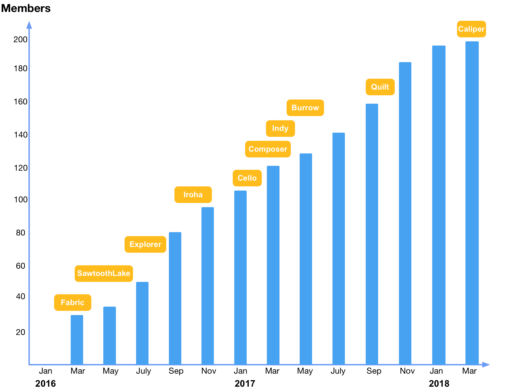

## 超级账本项目简介

2015 年 12 月，开源世界的旗舰组织 —— [Linux 基金会](http://www.linuxfoundation.org) 牵头，联合 30 家初始企业成员（包括 IBM、Accenture、Intel、J.P.Morgan、R3、DAH、DTCC、FUJITSU、HITACHI、SWIFT、Cisco 等），共同 [宣布](https://www.hyperledger.org/news/announcement/2016/02/hyperledger-project-announces-30-founding-members) 了 [Hyperledger](https://www.hyperledger.org) 联合项目的成立。超级账本项目为透明、公开、去中心化的企业级分布式账本技术提供开源参考实现，并推动区块链和分布式账本相关协议、规范和标准的发展。项目官方网站为 [hyperledger.org](https://www.hyperledger.org)。

成立之初，就收到了众多的开源技术贡献。IBM 贡献了 4 万多行已有的 [Open Blockchain](https://github.com/openblockchain) 代码，Digital Asset 则贡献了企业和开发者相关资源，R3 贡献了新的金融交易架构，Intel 也贡献了分布式账本相关的代码。  

作为一个联合项目（Collaborative Project），超级账本由面向不同目的和场景的子项目构成。目前包括 Fabric、SawToothLake、Iroha、Blockchain Explorer、Cello、Indy、Composer、Burrow、Quilt、Caliper 等 10 大顶级项目，所有项目都遵守 Apache v2 许可，并约定共同遵守如下的 [基本原则](https://github.com/hyperledger/hyperledger)：

* 重视模块化设计：包括交易、合同、一致性、身份、存储等技术场景；
* 重视代码可读性：保障新功能和模块都可以很容易添加和扩展；
* 可持续的演化路线：随着需求的深入和更多的应用场景，不断增加和演化新的项目。

超级账本项目的企业会员和技术项目发展都十分迅速，如下图所示。

Hyperledger 社区目前拥有超过 200 家全球知名企业和机构（大部分均为各自行业的领导者）会员，其中包括 40 多家来自中国本土的企业，包括艾亿数融科技公司（[2016.05.19 加入](https://www.hyperledger.org/news/announcement/2016/05/hyperledger-project-announces-addition-eight-new-members)）、Onchain（[2016.06.22 加入](https://www.hyperledger.org/news/announcement/2016/06/hyperledger-projects-maintains-strong-momentum-new-members)）、比邻共赢（Belink）信息技术有限公司（2016.06.22 加入）、BitSE（2016.06.22 加入）、布比（[2016.07.27 加入](https://www.hyperledger.org/news/announcement/2016/07/hyperledger-project-has-welcomed-more-60-members-february)）、三一重工（[2016.08.30 加入](https://www.hyperledger.org/news/announcement/2016/08/hyperledger-project-grows-170-percent-six-months)）、万达科技（[2016.09.08 加入](https://www.hyperledger.org/announcements/2016/09/08/hyperledger-welcomes-wanda-as-premier-member)）、华为（[2016.10.24 加入](https://www.hyperledger.org/announcements/2016/10/24/hyperledger-reaches-95-members-ahead-of-money2020)）、百度、腾讯等。

如果说以比特币为代表的数字货币提供了区块链技术应用的原型，以太坊为代表的智能合约平台延伸了区块链技术的功能，那么进一步引入权限控制和安全保障的超级账本项目则开拓了区块链技术的全新领域。超级账本首次将区块链技术引入到了分布式联盟账本的应用场景，这就为未来基于区块链技术打造高效率的商业网络打下了坚实的基础。

超级账本项目的出现，实际上宣布区块链技术已经不仅局限在单一应用场景中，也不仅局限在完全开放的公有链模式下，区块链技术已经正式被主流企业市场认可并在实践中采用。同时，超级账本项目中提出和实现了许多创新的设计和理念，包括完备的权限和审查管理、细粒度隐私保护，以及可拔插、可扩展的实现框架，对于区块链相关技术和产业的发展都将产生深远的影响。

*注：Apache v2 许可协议是商业友好的知名开源协议，鼓励代码共享，尊重原作者的著作权，允许对代码进行修改和再发布（作为开源或商业软件）。*

