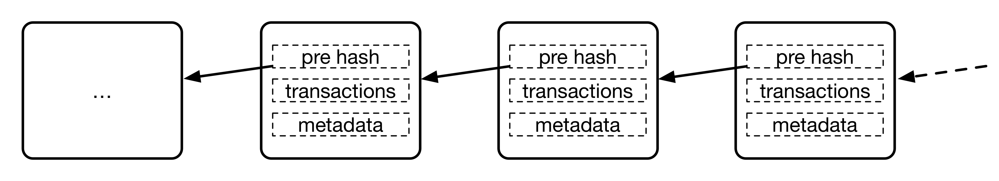

## 定义与原理

### 定义

区块链技术自身仍然在飞速发展中，目前相关规范和标准还在进一步成熟中。

公认的最早关于区块链的描述性文献是中本聪所撰写的 [《比特币：一种点对点的电子现金系统》](https://bitcoin.org/bitcoin.pdf)，但该文献重点在于讨论比特币系统，实际上并没有明确提出区块链的术语。在其中，区块和链被描述为用于记录比特币交易账目历史的数据结构。

另外，[Wikipedia](https://en.wikipedia.org/wiki/Blockchain) 上给出的定义中，将区块链类比为一种分布式数据库技术，通过维护数据块的链式结构，可以维持持续增长的、不可篡改的数据记录。

笔者认为，讨论区块链可以从狭义和广义两个层面来看待。

狭义上，区块链是一种以区块为基本单位的链式数据结构，区块中利用数字摘要对之前的交易历史进行校验，适合分布式记账场景下防篡改和可扩展性的需求。

广义上，区块链还指代基于区块链结构实现的分布式记账技术，还包括分布式共识、隐私与安全保护、点对点通信技术、网络协议、智能合约等。

区块链技术最早的应用出现在比特币项目中。作为比特币背后的分布式记账平台，在无集中式管理的情况下，比特币网络稳定运行了9年时间，支持了海量的交易记录，并且从未出现严重的漏洞，这些都与区块链结构的巧妙是分不开的。

### 基本原理

区块链的基本原理理解起来并不复杂。

首先包括三个基本概念：

* 交易（Transaction）：一次对账本的操作，导致账本状态的一次改变，如添加一条转账记录；
* 区块（Block）：记录一段时间内发生的所有交易和状态结果，是对当前账本状态的一次共识；
* 链（Chain）：由区块按照发生顺序串联而成，是整个账本状态变化的日志记录。

如果把区块链作为一个状态机，则每次交易就是试图改变一次状态，而每次共识生成的区块，就是参与者对于区块中交易导致状态改变的结果进行确认。

在实现上，首先假设存在一个分布式的数据记录账本，这个账本只允许添加、不允许删除。账本底层的基本结构是一个线性的链表，这也是其名字“区块链”的来源。链表由一个个“区块”串联组成（如下图所示），后继区块记录前导区块的哈希（Hash）值。新的数据要加入，必须放到一个新的区块中。而这个块（以及块里的交易）是否合法，可以通过计算哈希值的方式快速检验出来。任意维护节点都可以提议一个新的合法区块，然而必须经过一定的共识机制来对最终选择的区块达成一致。

### 以比特币为例理解区块链工作过程

具体以比特币网络为例，来看其中如何使用了区块链技术。

首先，比特币客户端发起一项交易，广播到比特币网络中并等待确认。网络中的节点会将一些收到的等待确认的交易记录打包在一起（此外还要包括前一个区块头部的哈希值等信息），组成一个候选区块。然后，试图找到一个 nonce 串（随机串）放到区块里，使得候选区块的哈希结果满足一定条件（比如小于某个值）。这个nonce 串的查找需要一定的时间进行计算尝试。

一旦节点算出来满足条件的 nonce 串，这个区块在格式上就被认为是“合法”了，就可以尝试在网络中将它广播出去。其它节点收到候选区块，进行验证，发现确实符合约定条件了，就承认这个区块是一个合法的新区块，并添加到自己维护的区块链上。当大部分节点都将区块添加到自己维护的区块链结构上时，该区块被网络接受，区块中所包括的交易也就得到确认。

当然，在实现上还会有很多额外的细节。这里面比较关键的步骤有两个，一个是完成对一批交易的共识（创建区块结构）；一个是新的区块添加到区块链结构上，被大家认可，确保未来无法被篡改。

比特币的这种基于算力寻找 nonce 串的共识机制被称为工作量证明（Proof of Work，PoW）。目前，要让哈希结果满足一定条件，并无已知的快速启发式算法，只能进行逐个尝试的暴力计算。尝试的次数越多（工作量越大），算出来的概率越大。

通过调节对哈希结果的限制，比特币网络控制平均约 10 分钟产生一个合法区块。算出区块的节点将得到区块中所有交易的管理费和协议固定发放的奖励费（目前是 12.5 比特币，每四年减半）。这个计算新区块的过程，即俗称的“挖矿”。

读者可能会关心，比特币网络是任何人都可以加入的，如果网络中存在恶意节点，能否进行恶意操作来对区块链中记录进行篡改，从而破坏整个比特币网络系统。比如最简单的，故意不承认收到的别人产生的合法候选区块，或者干脆拒绝来自其它节点的交易等。

实际上，因为比特币网络中存在大量（据估计数千个）的维护节点，而且大部分节点都是正常工作的，默认都只承认所看到的最长的链结构。只要网络中不存在超过一半的节点提前勾结一起采取恶意行动，则最长的链将很大概率上成为最终合法的链。而且随着时间增加，这个概率会越来越大。例如，经过 6 个区块生成后，即便有一半的节点联合起来想颠覆被确认的结果，其概率也仅为 (1/2)^6 ≈ 1.6%，即低于 1/60 的可能性。

当然，如果整个网络中大多数的节点都联合起来作恶，可以导致整个系统无法正常工作。要做到这一点，往往意味着付出很大的代价，跟通过作恶得到的收益相比，得不偿失。

*注：区块链结构，与 [Git](https://git-scm.com) 版本管理的有向无环图数据结构，在设计上有异曲同工之妙。*

